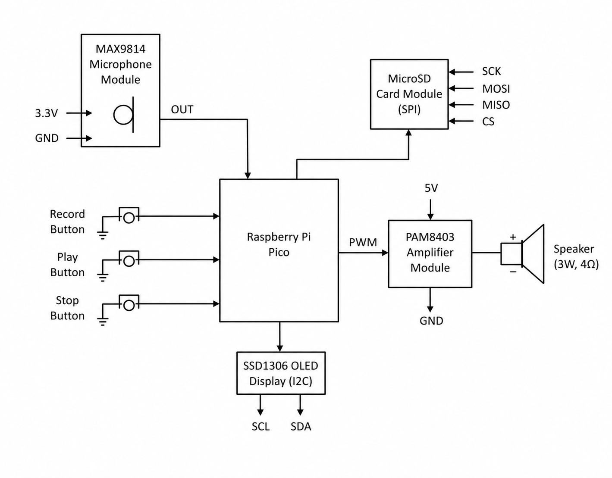

# PicoVoice Recorder
Portable voice recording and playback device using Raspberry Pi Pico.

:::info

**Author:** George Dobrescu (1221EB, FILS)  
**GitHub Project Link:** [PicoVoice Recorder](https://github.com/George6017/website)

:::

## Description

This project implements a portable voice recording and playback system using a Raspberry Pi Pico microcontroller. The device captures audio through a MAX9814 microphone module, converts it into digital data using the Pico’s ADC, and stores it as a WAV file on a microSD card. The recorded audio can then be played back through a speaker using a PAM8403 amplifier.

The system is controlled using three push buttons for recording, playback, and stopping. An SSD1306 OLED display shows the current system state, such as recording, playback, or idle mode.

The entire system is designed as a compact embedded device capable of functioning independently as a simple voice recorder.

## Motivation

The purpose of this project is to explore embedded systems beyond simple sensor-based applications by implementing real-time audio processing. Audio recording introduces challenges such as sampling, buffering, and data storage, making it a more complex and realistic system.

This project also results in a practical and usable device, similar to commercial voice recorders, while being fully implemented from scratch using low-cost components.

## Architecture

The system is organized into three functional layers:

**Input Layer**
- A MAX9814 microphone module captures analog audio signals.
- Three tactile push buttons control system operation: Record, Playback, and Stop.

**Control Layer**
- The Raspberry Pi Pico (RP2040) manages the entire system.
- The ADC samples audio input at a fixed rate.
- Data is buffered and written to a WAV file on the microSD card using SPI.
- The system runs a main control loop that switches between idle, recording, and playback states.

**Output Layer**
- A PAM8403 audio amplifier drives a 3W speaker for playback.
- An SSD1306 OLED display (I2C) shows system status and feedback.

All components share a common ground. The Pico is powered via USB, while the amplifier is powered from a stable 5V source.

## Diagram

## Log

### Week 5 - 11 May
- Defined project idea and selected components

### Week 12 - 18 May
- Implemented microphone input and ADC sampling

### Week 19 - 25 May
- Implemented SD card storage and audio playback

## Hardware

The system is built around the Raspberry Pi Pico (RP2040), which provides ADC for audio input, SPI for storage, and PWM for audio output.

Audio input is handled by the MAX9814 microphone amplifier, which outputs an analog signal suitable for the Pico’s ADC. The sampled data is stored on a microSD card using an SPI interface.

Playback is achieved using PWM output from the Pico, which feeds into a PAM8403 amplifier that drives a 3W speaker.

### Pin Connections

| Pico GPIO | Function | Connected To |
|---|---|---|
| GP26 (ADC0) | Audio input | MAX9814 OUT |
| GP2 | Button – Record | Tactile button → GND |
| GP3 | Button – Playback | Tactile button → GND |
| GP4 | Button – Stop | Tactile button → GND |
| GP10 | SPI SCK | MicroSD SCK |
| GP11 | SPI MOSI | MicroSD MOSI |
| GP12 | SPI MISO | MicroSD MISO |
| GP13 | SPI CS | MicroSD CS |
| GP14 | PWM audio output | PAM8403 input |
| GP6 | I2C SCL | SSD1306 SCL |
| GP7 | I2C SDA | SSD1306 SDA |
| 3.3V | Power | MicroSD, OLED, microphone |
| 5V (VBUS) | Power | PAM8403 amplifier |
| GND | Common ground | All components |

### Schematics

## Bill of Materials

| Device | Usage | Price |
|---|---|---|
| Raspberry Pi Pico | Main microcontroller | 25 RON |
| MAX9814 microphone module | Audio input | 20 RON |
| MicroSD card module | Storage interface | 15 RON |
| MicroSD card (16GB) | Audio storage | 25 RON |
| PAM8403 amplifier | Audio output | 10 RON |
| 3W speaker | Playback | 15 RON |
| SSD1306 OLED display | Status display | 15 RON |
| Tactile push buttons (×3) | User control | 5 RON |
| Breadboard 830 points | Prototyping | 10 RON |
| Dupont jumper wires | Connections | 10 RON |
| **TOTAL** | | **150 RON** |

## Software

| Library | Description | Usage |
|---|---|---|
| `embassy-rp` | Hardware abstraction for RP2040 | GPIO, ADC, PWM, SPI |
| `embassy-executor` | Async task executor | Runs concurrent tasks |
| `embassy-time` | Timing utilities | Controls sampling intervals |
| `embedded-hal` | Hardware abstraction traits | Standard GPIO/SPI interfaces |
| `embedded-hal-async` | Async hardware traits | Non-blocking input handling |
| `fatfs` | FAT filesystem library | Writing and reading WAV files |
| `ssd1306` | OLED display driver | Display control |
| `embedded-graphics` | Graphics library | Text rendering |
| `defmt` | Logging framework | Debugging output |
