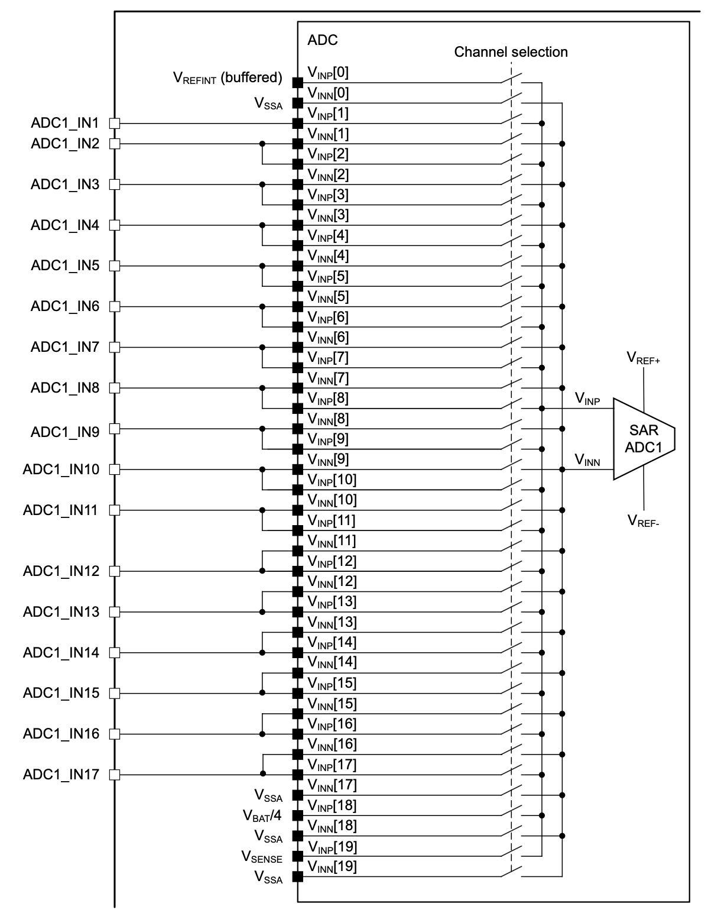

# ADC
Analog to Digital Converter

---

# Bibliography
for this section

**Raspberry Pi Ltd**, *[RP2040 Datasheet](https://datasheets.raspberrypi.com/rp2040/rp2040-datasheet.pdf)*
   - Chapter 12 - *Peripherals*
     - Section 12.4 - *ADC and Temperature Sensor*
       - Subchapter 12.4.2
       - Subchapter 12.4.3
       - Subchapter 12.4.6

---
layout: two-cols
---
# ADC
sampling an analog signal to an array of values

<style>
.two-columns {
    grid-template-columns: 3fr 5fr;
}
</style>

| | | |
|-|-|-|
| *sampling rate* | Hz | the frequency at which a new sample is read |
| *resolution* | bits | the number of bits used to store a sampled value |

:: right ::

<div align="center">

</div>

<div align="center">

Lower sample rates yield the *aliasing effect*.

</div>

---

# Nyquist–Shannon Sampling Theorem

<div grid="~ cols-2 gap-5">

<div>

$$
sampling_f > 2 \times max_{f}
$$

*The **sampling frequency** has to be at least **two times higher** than the **maximum frequency** of the signal* to avoid frequency aliasing[^aliasing].

[^aliasing]: Aliasing is the overlapping of frequency components. This overlap results in distortion or artifacts when the signal is reconstructed from samples which causes the **reconstructed signal to differ from the original** continuous signal.

</div>

<div align="center">

</div>

</div>

---
layout: two-cols
---

# Sampling
how the ADC works

<style>
.two-columns {
    grid-template-columns: 3fr 6fr;
}
</style>

- assumes bit<sub>n-1</sub> of `compare_value` is `1`
- compares the input signal with a generated analog signal from `compare_value`
  - if input is lower, bit<sub>n-1</sub> is `0`
  - if input if higher, bit<sub>n-1</sub> is `1`
- repeats for bit<sub>n-2</sub>, bit<sub>n-3</sub> ... bit<sub>0</sub>

:: right ::

<div align="center">

</div>

There are different [types of ADCs](https://www.monolithicpower.com/en/analog-to-digital-converters/introduction-to-adcs/types-of-adcs) depending on the architecture.
The most common used is SAR ([*Successive Approximation Register*](https://en.wikipedia.org/wiki/Successive-approximation_ADC)) ADC, also integrated in RP2350.

---
layout: two-cols
---

# RP2350's ADC

<style>
.two-columns {
    grid-template-columns: 4fr 5fr;
}
</style>

| | |
|-|-|
| *channels* | 4 or 8[^package] |
| *sampling rate* | 500 kHz |
| *resolution* | 12 bits |
| *V<sub>max</sub>* | 3.3 V |

- requires a 48 MHz clock signal
- channel 4 or 8[^package] is connected to the internal temperature sensor

$$

t = 27 - \frac{(V_{input\_4} - 0.706)}{0.001721} [\degree C]_{SI}

$$

:: right ::

<div align="center">

</div>

<div align="center">

</div>

[^package]: Depends on the RP2350 package

---

# ADC
in Embassy

```rust{1|3-5|7|8|10|13-14|15|15,16|17|12,13,15,17,18|all}
use embassy_rp::adc::{Adc, Channel, Config, InterruptHandler};

bind_interrupts!(struct Irqs {
    ADC_IRQ_FIFO => InterruptHandler;
});

let p = embassy_rp::init(Default::default());
let mut adc = Adc::new(p.ADC, Irqs, Config::default());

let mut p26 = Channel::new_pin(p.PIN_26, Pull::None);

loop {
    let level = adc.read(&mut p26).await.unwrap();
    info!("Pin 26 ADC: {}", level);
    let voltage = 3300 * level / 4095;
    info!("Pin 26 voltage: {}.{}V", voltage / 1000, voltage % 1000);
    Timer::after_secs(1).await;
}
```

---
layout: two-cols
---

# STM32U545RE's ADC

ADC12 and ADC4

<style>
.two-columns {
    grid-template-columns: 4fr 5fr;
}
</style>

| | ADC12 | ADC4 |
|-|-|-|
| *channels* | 20 | 23 |
| *sampling rate* | 2.5 Msps | 2.5 Msps |
| *resolution* | 14 bits | 12 bits |
| *V<sub>max</sub>* | 3.3 V | 3.3 V |

- internal channels connected to
  - temperature sensors (V<sub>SENSE</sub>)
  - V<sub>BAT</sub> monitoring channel
  - internal reference voltage (V<sub>REFERENCE</sub>)
  - V<sub>CORE</sub> and DAC 1 and 2 output channels

:: right ::

### ADC1 conectivity

<div align="center">

</div>

---
---
# ADC - blocking
in Embassy

```rust {1|3|5,6|7-9|11|13-14|all}
use embassy_stm32::adc;

let mut p = embassy_stm32::init(Default::default());

let mut adc1 = adc::Adc::new(p.ADC1);

adc1.set_resolution(adc::Resolution::BITS14);
adc1.set_averaging(adc::Averaging::Samples1024);
adc1.set_sample_time(adc::SampleTime::CYCLES160_5);

let measurement = adc1.blocking_read(&p.PA3);

let max = adc::resolution_to_max_count(adc::Resolution::BITS14);
let voltage: f32 = 3.3 * measurement as f32 / max as f32;
```

---
---
# ADC - asynchronous 
in Embassy

```rust {1|3|5,6|8-10|6,12|14|15-19|21,8|22|all}
use embassy_stm32::adc;

let mut p = embassy_stm32::init(Default::default());

let mut adc1 = adc::Adc::new(p.ADC1);
let mut adc1_pin = p.PA3;

adc1.set_resolution(adc::Resolution::BITS14);
adc1.set_averaging(adc::Averaging::Samples1024);
adc1.set_sample_time(adc::SampleTime::CYCLES160_5);

let mut degraded_channel = adc1_pin.degrade_adc();

let mut measurements = [0u16; 1];
adc1.read(
    p.GPDMA1_CH0.reborrow(),
    [(&mut degraded_channel, adc::SampleTime::CYCLES160_5)].into_iter(),
    &mut measurements,
).await;

let max = adc::resolution_to_max_count(adc::Resolution::BITS14);
let voltage: f32 = 3.3 * measurements[0] as f32 / max as f32;
```
