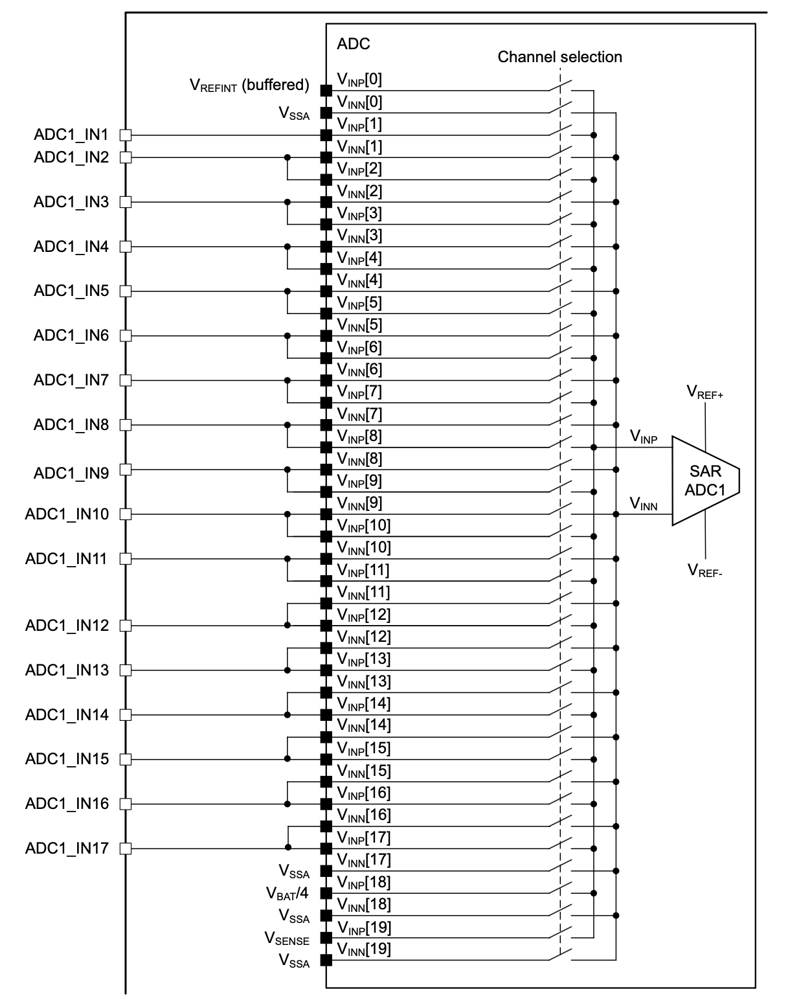

# ADC
Analog to Digital Converter

---

# Bibliography
for this section

**STMicroelectronics**, *[STM32U5 Series based on Arm®-based 32-bit MCUs](https://www.st.com/resource/en/reference_manual/rm0456-stm32u5-series-armbased-32bit-mcus-stmicroelectronics.pdf)*

- Chapter 33 - *Analog-to-digital converter (ADC12)*
  - Subchapter 3 - *ADC implementation*
  - Subchapter 4 - *ADC functional description*
- Chapter 34 - *Analog-to-digital converter (ADC4)*
  - Subchapter 3 - *ADC implementation*
  - Subchapter 4 - *ADC functional description*

---
layout: two-cols
---
# ADC
sampling an analog signal to an array of values

<style>
.two-columns {
    grid-template-columns: 3fr 5fr;
}
</style>

| | | |
|-|-|-|
| *sampling rate* | Hz | the frequency at which a new sample is read |
| *resolution* | bits | the number of bits used to store a sampled value |

:: right ::

<div align="center">

</div>

<div align="center">

Lower sample rates yield the *aliasing effect*.

</div>

---

# Nyquist–Shannon Sampling Theorem

<div grid="~ cols-2 gap-5">

<div>

$$
sampling_f > 2 \times max_{f}
$$

*The **sampling frequency** has to be at least **two times higher** than the **maximum frequency** of the signal* to avoid frequency aliasing[^aliasing].

[^aliasing]: Aliasing is the overlapping of frequency components. This overlap results in distortion or artifacts when the signal is reconstructed from samples which causes the **reconstructed signal to differ from the original** continuous signal.

</div>

<div align="center">

</div>

</div>

---
layout: two-cols
---

# Sampling
how the ADC works

<style>
.two-columns {
    grid-template-columns: 3fr 6fr;
}
</style>

- assumes bit<sub>n-1</sub> of `compare_value` is `1`
- compares the input signal with a generated analog signal from `compare_value`
  - if input is lower, bit<sub>n-1</sub> is `0`
  - if input if higher, bit<sub>n-1</sub> is `1`
- repeats for bit<sub>n-2</sub>, bit<sub>n-3</sub> ... bit<sub>0</sub>

:: right ::

<div align="center">

</div>

There are different [types of ADCs](https://www.monolithicpower.com/en/analog-to-digital-converters/introduction-to-adcs/types-of-adcs) depending on the architecture. The most common used is SAR ([*Successive Approximation Register*](https://en.wikipedia.org/wiki/Successive-approximation_ADC)) ADC, also integrated in STM32U5 cores.

---
layout: two-cols
---

# STM32U545RE's ADC 

ADC1 and ADC4

<style>
.two-columns {
    grid-template-columns: 4fr 5fr;
}
</style>

| | ADC1 | ADC4 |
|-|-|-|
| *channels* | 20 | 23 |
| *sampling rate* | 2.5 Msps | 2.5 Msps |
| *resolution* | 14 bits | 12 bits |
| *V<sub>max</sub>* | 3.3 V | 3.3 V |

- internal channels connected to
  - temperature sensors (V<sub>SENSE</sub>)
  - V<sub>BAT</sub> monitoring channel
  - internal reference voltage (V<sub>REFERENCE</sub>)
  - V<sub>CORE</sub> and DAC 1 and 2 output channels

:: right ::

### ADC1 conectivity

<div align="center">

</div>

---

# ADC
in Embassy

```rust{1|3|5,6|8-10|6,12|14|15-19|21,8|22|all}
use embassy_stm32::adc;

let mut p = embassy_stm32::init(Default::default());

let mut adc1 = adc::Adc::new(p.ADC1);
let mut adc1_pin = p.PA3;

adc1.set_resolution(adc::Resolution::BITS14);
adc1.set_averaging(adc::Averaging::Samples1024);
adc1.set_sample_time(adc::SampleTime::CYCLES160_5);

let mut degraded_channel = adc1_pin.degrade_adc();

let mut measurements = [0u16; 1];
adc1.read(
    p.GPDMA1_CH0.reborrow(),
    [(&mut degraded_channel, adc::SampleTime::CYCLES160_5)].into_iter(),
    &mut measurements,
).await;

let max = adc::resolution_to_max_count(adc::Resolution::BITS14);
let voltage: f32 = 3.3 * measurements[0] as f32 / max as f32;
```
