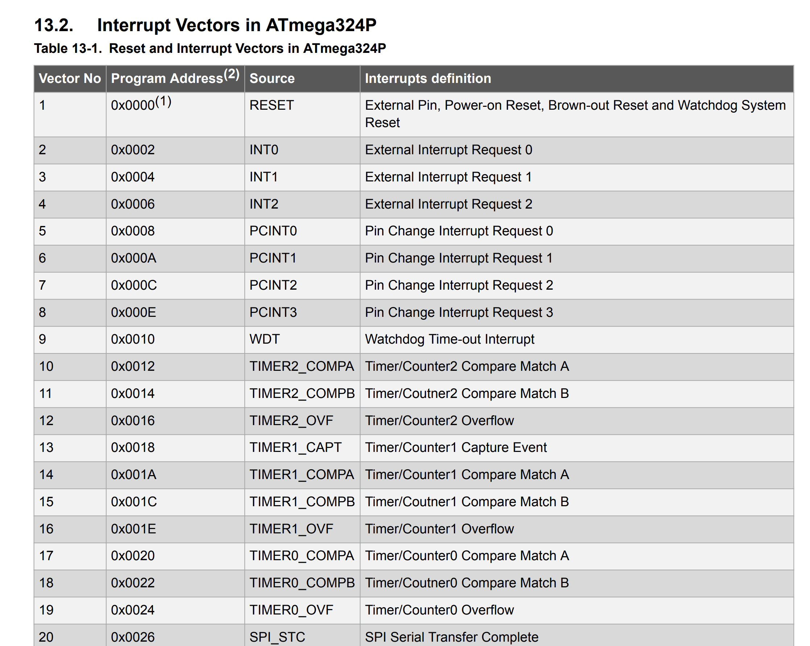

# Recap / Intro on how we get from source code to exe

---

# Recap/intro - how we get from source code to the program on the uC 

## Step 1: Front-end: parse + typecheck => IR (Intermediate Representation)
<br>

## Step 2: optimize IR
<br>

## Step3: Back-end: target-specific codegen
<br>

> In embedded, there’s a target-specific “Step 4” where the build pulls in the MCU’s device support (startup/runtime code, linker script, interrupt/exception definitions) so the linker can lay out Flash/RAM and place the vector table, reset handler, and other chip-specific glue at the exact addresses required by that microcontroller.

---

# Step 1 - Front-end (parse + typecheck => IR)

<style>
  table {
    font-size: 0.85em;
    border-collapse: collapse;
  }
  th {
    font-weight: bold;
  }
  td, th {
    padding: 4px; /* Reduce padding */
  }
</style>

| Order | C++ (GCC) — what happens | C++ (GCC) — artifacts | Rust (rustc+LLVM) — what happens | Rust — artifacts |
|---:|---|---|---|---|
| 1 | Preprocess (`cpp`): expands `#include/#define` | `.ii` (optional), dep info (`.d`) | Macro expansion (incl. proc-macros/derive), crate/module resolution | mostly internal (optional dumps) |
| 2 | Parse → **AST** (Abstract Syntax Tree) | internal (optional dumps) | Parse → AST → **HIR** (High-level IR) | internal (optional dumps) |
| 3 | Semantic analysis: name lookup, overloads, templates, diagnostics | internal | Name resolution + type inference + trait solving | internal |
| 4 | Type checking, build typed representation | internal | Borrow checking (ownership/lifetimes), safety checks | internal |
| 5 | Lower to **IR**: **GIMPLE** (GCC IR, typically SSA = Static Single Assignment) | internal (optional `-fdump-tree-*`) | Lower to **MIR** (Mid-level IR) | internal (nightly dumps) |
| opt | Emit debug metadata (DWARF), symbol info | inside `.o` later | Emit debug metadata + crate metadata | `.rmeta` / internal |

---

# Step 2 - Optimize IR (where most “-O” happens)

<style>
  table {
    font-size: 0.85em;
    border-collapse: collapse;
  }
  th {
    font-weight: bold;
  }
  td, th {
    padding: 4px; /* Reduce padding */
  }
</style>

| Order | C++ (GCC) — what happens | C++ (GCC) — artifacts | Rust (rustc+LLVM) — what happens | Rust — artifacts |
|---:|---|---|---|---|
| 1 | Mid-end passes on GIMPLE: inlining, **DCE** (Dead Code Elimination), const-prop (Constant Propagation) | internal IR (optional dumps/reports) | MIR optimizations: simplify CFG, const-prop, remove unused, cleanup | internal (optional dumps) |
| 2 | More passes: **CSE** (Common Subexpression Elimination), **LICM** (Loop-Invariant Code Motion), loop opts, vectorization | internal | **Monomorphization**: generics → concrete instances (enables stronger opts) | internal |
| 3 | Interprocedural opts: **IPA/IPO** (InterProcedural Analysis/Optimization) | internal | Lower MIR → **LLVM IR** (LLVM Intermediate Representation) | can `--emit=llvm-ir` |
| 4 (opt) | **LTO** prep/embedding when `-flto` is used | `.o` may carry LTO IR payload | **LTO/ThinLTO** prep when `-C lto` / `-C lto=thin` | `.o` may carry bitcode payload |

---

# Step 3 - Back-end (target-specific codegen)

<style>
  table {
    font-size: 0.85em;
    border-collapse: collapse;
  }
  th {
    font-weight: bold;
  }
  td, th {
    padding: 4px; /* Reduce padding */
  }
</style>

| Order | C++ (GCC) — what happens | C++ (GCC) — artifacts | Rust (rustc+LLVM) — what happens | Rust — artifacts |
|---:|---|---|---|---|
| 1 | Target-specific lowering (e.g., ARM/Cortex-M): instruction selection | internal | LLVM target lowering (ARM/Cortex-M): instruction selection | internal |
| 2 | Register allocation + stack frame + calling convention / **ABI** (Application Binary Interface) lowering | internal | Same: reg alloc + ABI lowering (AAPCS on ARM) | internal |
| 3 | Scheduling, peepholes, fixups/relaxation | internal | Scheduling, peepholes, fixups/relaxation | internal |
| 4 | Emit **object file** (machine code + relocations + symbols; optional DWARF) | `.o` | Emit **object file** (same contents model) | `.o` |
| opt | Emit assembly for inspection | `.s` | Emit LLVM IR / assembly for inspection | `--emit=llvm-ir`, `--emit=asm` |

---

# Step 4 - Link > ELF > bin/hex

<style>
  table {
    font-size: 0.8em;
    border-collapse: collapse;
  }
  th {
    font-weight: bold;
  }
  td, th {
    padding: 4px; /* Reduce padding */
  }
</style>

| Order | C++ (GCC toolchain) — what happens | C++ — artifacts | Rust (rustc+LLVM toolchain) — what happens | Rust — artifacts |
|---:|---|---|---|---|
| 1 | Collect inputs: app `.o`, static libs `.a`, startup objects (vector table + reset), linker script `.ld` | `.o`, `.a`, `startup.o`, `memory.ld` | Collect inputs: app `.o`, libs (`.rlib` + `core/alloc`), startup objects, linker script `.ld` | `.o`, `.rlib`, `startup.o`, `memory.ld` |
| 2 | Linker places sections in FLASH/RAM per script; defines key symbols (e.g., `_estack`, `_sidata`, `_sdata`, `_sbss`) | link inputs | Same placement (often via `lld`) | link inputs |
| 3 | Remove unused sections with `--gc-sections` (works best with function/data sections) | smaller `.text/.rodata` | Same (`--gc-sections` is crucial to control monomorphization bloat) | smaller `.text/.rodata` |
| 4 (opt) | If LTO enabled: link-time optimizer runs inside the link | LTO occurs at link | If LTO/ThinLTO enabled: LLVM LTO runs here | LTO occurs at link |
| 5 | Produce **ELF** + **map file** (layout report) | `firmware.elf`, `firmware.map` | Same | `firmware.elf`, `firmware.map` |
| 6 | Extract flashing image from ELF (keep loadable segments only) | `firmware.bin` / `firmware.hex` | Same | `firmware.bin` / `firmware.hex` |

---

# Step 4 - Link > ELF > bin/hex

<style>
  table {
    font-size: 0.8em;
    border-collapse: collapse;
  }
  th {
    font-weight: bold;
  }
  td, th {
    padding: 4px; /* Reduce padding */
  }
</style>

| Order | C++ (GCC toolchain) — what happens | C++ — artifacts / result | Rust (rustc+LLVM toolchain) — what happens | Rust — artifacts / result |
|---:|---|---|---|---|
| 7 | Flash over **SWD/JTAG**: erase → program → verify → reset (OpenOCD/pyOCD/ST-LINK/J-Link) | programmed MCU Flash | Same flashing path (language-agnostic) | programmed MCU Flash |
| 8 | What is physically in **Flash** after programming | vector table + `.text` + `.rodata` + init image for `.data` | Same physical Flash contents model | same |
| 9 | Reset/startup uses vector table: loads initial SP + jumps to `Reset_Handler` | startup code executes | Same | startup code executes |
| 10 | Initialize RAM: copy `.data` Flash→RAM; zero `.bss`; set up runtime | RAM now holds `.data/.bss` + stack/heap | Same | same RAM state model |
| 11 | Enter `main()` (or runtime entry) and enable interrupts/peripherals | application runs | Same | application runs |

*Note: Steps 9–11 describe the MCU’s runtime startup sequence after a reset; they are not compiler/ linker toolchain steps. Also, it actually varies depending on the target, and some targets use a bootloader that runs first and then jumps to the app.*

---
layout: section
---

# Extra recap / notions

---

# How do we run code on embedded?
Embedded execution models overview

<style>
  table {
    font-size: 0.9em;
    border-collapse: collapse;
  }
  th {
    font-weight: bold;
  }
  td, th {
    padding: 4px; /* Reduce padding */
  }
</style>

| Model | Scheduling | Strengths | Weaknesses | Typical use |
|---|---|---|---|---|
| Polling-only superloop (“Arduino tutorial style”) | One loop; no app ISRs | trivial to write/teach | terrible latency, blocking everywhere, poor power, doesn’t scale | demos, quick hacks, “it blinks” |
| Superloop + ISRs | main loop + interrupt callbacks | still small, responsive if ISRs are short | shared-state pain, priority/latency issues if misused | small products, simple control |
| Event-driven | ISRs post events; main drains queue | clean ISR separation, scalable without RTOS | needs queues/ buffers/ state machines | drivers, protocols, UI-like logic |
| Async/await (e.g., Embassy) | cooperative tasks (yield on `await`) | structured concurrency without RTOS | one CPU-hog task stalls others | many concurrent I/O flows |
| RTOS | preemptive tasks + scheduler | priorities, isolation, large systems | complexity, per-task stacks, harder debug | mixed workloads, larger firmware |

---
layout: section
---

# Intro into interupts and a look at a simple arhitecture (328P)

---

# Why interupts?


- Computer systems typically have many external peripherals—keyboard, mouse, display, memory units, scanner, printer, sound card, webcam, etc. All these devices occasionally need to interact with the processor, but we can’t know in advance when that will happen. 
> We want to keep the CPU busy (or in sleep mode) between events (no busy waiting). 

> Therefore, there must be a mechanism that allows the CPU to determine which peripheral requires attention.

<style>
table {
  width: 100%;
  border-collapse: collapse;
  table-layout: fixed;
}
td {
  width: 33.33%;
  text-align: center;
  vertical-align: middle;
  border: 1px solid #ccc;
}
.img-responsive {
  width: 100%;
  height: auto;
  max-height: 300px;
  display: block;
}
</style>


<table>
<tbody>
  <tr>
    <td>
      
    </td>
    <td>
      
    </td>
    <td>
      
    </td>
  </tr>
</tbody>
</table>

> Img copyright - https://www.adafruit.com/ & https://www.theengineer.co.uk/

---

# Other "sources"

- **External / GPIO (EXTI):** pin edge/level (buttons, sensors), wake-up events
- **Timers / counters:** periodic “tick”, compare match, overflow, input capture  
 > *Example:* timer triggers **ADC sampling** at an exact rate (no jitter vs polling)
- **ADC / analog blocks:** end-of-conversion (EOC), analog watchdog, comparators
- **Communication peripherals:** UART RX/TX, SPI/I2C events, CAN, USB (data/err conditions)
- **DMA / data movers:** half-transfer, transfer-complete, error (buffer ping-pong)
- **System / power / clock:** RTC alarm, low-power wake, clock failure, safety events
- **Software-triggered:** SVC/PendSV or “pend IRQ” to defer work from ISR context
- **Inter-core / inter-processor (if multicore):** mailbox/event-unit interrupts (“other core finished”)

<br>

>*Rule:* the source usually sets a **status flag**; the ISR must **ack/clear** it (often W1C) and then signal/defer work.

---

# What is the alternative?

## Pooling 

- The CPU periodically checks whether a peripheral needs attention. 
> Polling is like looking at your phone every second to see if someone is calling.

<br> 

## Pro: 
- It can be efficient if events occur in rapid succession.
- Simple to implement
## Con: 
- It keeps the processor busy even when no event is taking place.
- Prevents sleep (thus it is a power hungry method)

---
layout: two-cols
---

# Interrupts with an interrupt controller

!!!! DE TAIAT din VS

- Each peripheral has a dedicated line to signal it needs attention 
- The Interrupt controller receives interrupt requests, while the processor "does its thing" (either busy with computation, orsleep mode for power conservation)
- The Interrupt controller sets interrupt flags (that the processor can poll and decide when to handle)
- The Interrupt controller can handle numerous peripherals without needing dedicated lines for the processor 


:: right ::

<br> 
<br> 
<br> 
<br> 

<div align="center">


</div>

---

# Interrupts in embedded - in detail
Taxonomy

- **Exception**: any event that changes normal CPU control flow (umbrella term). On Cortex-M, *interrupts + faults + system calls* are all “exceptions”.
- **Interrupt (IRQ)**: an **asynchronous** exception caused by hardware (GPIO edge, timer, UART RX, DMA done). Usually **maskable** and handled by the NVIC/interrupt controller.
- **Fault**: a **synchronous** exception caused by executing an instruction (e.g., invalid memory access → HardFault/BusFault).
- **IRQ (Interrupt ReQuest)**: the *source/event* (a specific peripheral interrupt line or ID).
- **ISR (Interrupt Service Routine)** / **handler**: the *code function* that runs when that IRQ/exception is taken.
- **Vectored**: hardware uses a **vector table** (array of handler addresses) to jump directly to the right ISR (no “polling all flags” dispatcher).
- **Priority**: numeric ordering of which IRQ wins when multiple are pending.
- **Preemption**: a higher-priority IRQ can interrupt (preempt) currently running code / lower-priority ISR.

---

# General flow
1) A peripheral/event asserts an **IRQ request** and typically sets a **status flag** (often cleared in the ISR).  
2) The interrupt controller/NVIC marks the IRQ **pending**.  
3) If the IRQ is **enabled (unmasked)** and its **priority is higher** than the currently running context, the **processor core accepts the interrupt** (*exception entry*).  
4) On exception entry, the core completes the current instruction, saves minimal context (stacking), then **loads the handler address from the vector table** and branches to the **ISR** (*vectored dispatch*).  
5) If an even higher-priority IRQ becomes pending, it may **preempt** the current ISR; otherwise it remains pending.  
6) On ISR exit (*exception return*), execution resumes where it was interrupted (or services the next pending IRQ).

*Note1: the above is a general overview, actual varies depending on architecture*

*Note2: there are preemptable and non-preemptible interrupts + there are ways to disable /re-enable interrupts in a ISR*

---

# General interrupt set-up (generic)

1) Identify the **source**: GPIO/EXTI, timer compare, UART RX, ADC EOC, DMA TC, etc.
2) Enable the **peripheral clock** (if the MCU has clock gating).
3) Configure the **event condition**:
   - GPIO: edge/level, pull-ups, pin mux/alternate function
   - Timer: prescaler/top/compare, mode, auto-reload
   - UART: baud, frame format, FIFO thresholds
4) Clear any **pending flags** *before* enabling (peripheral status flags + controller pending).
5) Unmask at the **peripheral level** (the interrupt-enable bit inside the peripheral).
6) Unmask at the **interrupt controller level** (NVIC / external interrupt controller).
7) Enable **global interrupts** (CPU-level mask).

---

# General interrupt set-up (generic)

8) Ensure the **handler is linked and mapped**:
   - correct symbol/name
   - vector table contains its address
   - vector table located at the expected address (or relocated)
9) Set **priority** (and priority grouping if applicable); check preemption expectations.
10) Write the ISR 

>Checklist for the ISR
>   - acknowledge/clear the flag (and in the right order)
>   - minimal work; defer heavy work (queue/flag)
>   - shared data: volatile / atomics / critical sections

---

# AVR vs Cortex-M33 interrupt checklist 

<style>
  table {
    font-size: 0.85em;
    border-collapse: collapse;
  }
  th {
    font-weight: bold;
  }
  td, th {
    padding: 4px; /* Reduce padding */
  }
</style>

| Item | AVR (e.g., ATmega/AVR8) | Cortex-M33 (ARMv8-M) |
|---|---|---|
| CPU-level enable | `sei()` sets I-bit in **SREG** (global enable). `cli()` disables. | `__enable_irq()` clears **PRIMASK** (global enable). Also watch **BASEPRI/FAULTMASK** if used. |
| “Controller” enable | No NVIC; vectors are fixed; per-source enable is usually in peripheral regs. | **NVIC**: `NVIC_EnableIRQ(IRQn)` sets ISER bit; can also set/clear pending (ISPR/ICPR). |
| Peripheral enable | Set the interrupt-enable bit in the peripheral (e.g., `TIMSKx`, `EIMSK`, `UCSRnB`). | Set interrupt-enable in peripheral regs (vendor-specific) **and** clear status flags. |
| Pending flags | Clear by writing 1/0 depending on peripheral (e.g., `TIFR`, `EIFR`); easy to forget. | Clear peripheral status flag (often write-1-to-clear) **and** optionally `NVIC_ClearPendingIRQ()`. |
| Vector table | Fixed at low addresses; some AVRs can switch vectors to boot section (IVSEL). | Vector table is a memory table of handler addresses; base set by **VTOR** (or fixed mapping). Bootloader may relocate. |

---

# AVR vs Cortex-M33 interrupt checklist 

<style>
  table {
    font-size: 0.85em;
    border-collapse: collapse;
  }
  th {
    font-weight: bold;
  }
  td, th {
    padding: 4px; /* Reduce padding */
  }
</style>
| Item | AVR (e.g., ATmega/AVR8) | Cortex-M33 (ARMv8-M) |
|---|---|---|
| ISR definition | `ISR(VECT_NAME)` macro; name must match vector symbol. | Provide handler with exact name expected by startup/CMSIS (or populate vector table array). Weak defaults are common. |
| Priority/preemption | Typically no nesting unless you re-enable inside ISR (rare); simpler model. | Priorities are core feature: preemption, nesting; configure via `NVIC_SetPriority()`. |
| Common “it doesn’t fire” causes | forgot `sei()`, forgot enable bit, flag already set, wrong vector name. | enabled NVIC but not peripheral, wrong handler name/startup, pending not cleared, IRQ priority masked, VTOR wrong (bootloader/TrustZone). |
| TrustZone (M33-specific) | N/A | If TZ used: secure vs non-secure IRQ routing and vector tables can differ (extra thing to check). |

---

# Are ISRs "real-time" ?

Not set in stone :) 
- **Latency** = time from event to first ISR instruction; **Jitter** = latency variation over time.
- **CPU exception entry overhead:** context stacking/unstacking; extra cost if **FPU stacking** is triggered (or “lazy” FPU save kicks in).
- **Flash wait states / cache misses:** vector fetch + ISR code fetch slowed by Flash latency (and I-cache state).
- **Critical sections/ masking:** `cli()/sei()`, PRIMASK, long “disable IRQ” regions delay servicing.
- **Priority & nesting:** higher-priority ISRs preempt lower ones; long high-priority ISRs create jitter downstream.
- **Bus contention:** **DMA**, other peripherals, or another core/master competing for memory/bus bandwidth.
- **Peripheral-side timing:** synchronization to clock domains, edge/level filtering, pending-flag behavior, wake-from-sleep/clock ramp.

---

# Interrupts on AVR - 324P (similar to AVR - 328P)

"the simple version"



---

# Interrupt handling mechanism on the ATmega324P

1. Complete the current instruction
2. Push (PC + 2) onto the stack
3. Push the SREG (Status Register) and any other general-purpose registers used in the main loop
4. Jump to the address in the interrupt vector table corresponding to the type of interrupt that occurred
5. In the table, there must be a jump to the Interrupt Service Routine (ISR)
6. Execute the ISR instruction
7. On return from ISR, pop the used general-purpose registers and then pop the SREG
8. Finally, pop (PC + 2) and resume execution in the main() loop

---

# Example

```c
#include <avr/io.h>
#include <avr/interrupt.h>

ISR(INT0_vect)
{
    PORTC ^= (1 << PC0);  // Toggle PC0 each time INT0 interrupt is triggered
}

int main()
{
    DDRC |= (1 << PC0);   //configure PC0 (pin C0) as an output
    EIMSK |= (1 << INT0); //enable the INT0 external interrupt
//note: by default, PD2 is tied to INT0 and the default settings is for falling edge detection

    sei();

    while(1) 
{
    //do useful stuff with the MCU
}
}

```

---

# Behind the scene (1/4)

```c
//00000000 <__vectors>: 
//__vectors(): 
0: 0c 94 3e 00 jmp 0x7c  ; 0x7c <__ctors_end> //RESET 
4: 0c 94 48 00 jmp 0x94  ; 0x94 <__vector_1> //INT0 
8: 0c 94 48 00 jmp 0x90  ; 0x90 <__bad_interrupt> 
c: 0c 94 48 00 jmp 0x90  ; 0x90 <__bad_interrupt> 
10: 0c 94 48 00 jmp 0x90 ; 0x90 <__bad_interrupt> 
14: 0c 94 48 00 jmp 0x90 ; 0x90 <__bad_interrupt> 
18: 0c 94 48 00 jmp 0x90 ; 0x90 <__bad_interrupt> 
1c: 0c 94 48 00 jmp 0x90 ; 0x90 <__bad_interrupt> 
20: 0c 94 48 00 jmp 0x90 ; 0x90 <__bad_interrupt> 
24: 0c 94 48 00 jmp 0x90 ; 0x90 <__bad_interrupt> 
28: 0c 94 48 00 jmp 0x90 ; 0x90 <__bad_interrupt> 

................................................

60: 0c 94 48 00 jmp 0x90 ; 0x90 <__bad_interrupt> 
64: 0c 94 48 00 jmp 0x90 ; 0x90 <__bad_interrupt> 
68: 0c 94 48 00 jmp 0x90 ; 0x90 <__bad_interrupt> 
6c: 0c 94 48 00 jmp 0x90 ; 0x90 <__bad_interrupt> 
70: 0c 94 48 00 jmp 0x90 ; 0x90 <__bad_interrupt> 
74: 0c 94 48 00 jmp 0x90 ; 0x90 <__bad_interrupt> 
78: 0c 94 48 00 jmp 0x90 ; 0x90 <__bad_interrupt>
//0000007c <__ctors_end>:

```

---

# Behind the scene (2/4)

```c
//__trampolines_start(): 
   7c: 11 24 	eor r1, r1    //r1 = 0 //this is where the program jumps at RESET
   7e: 1f be 	out 0x3f, r1  //SREG = r1 
   80: cf ef 	ldi r28, 0xFF  
   82: d8 e0 	ldi r29, 0x08  
   84: de bf 	out 0x3e, r29 //init stack pointer
   86: cd bf 	out 0x3d, r28 //init stack pointer
   88: 0e 94 4a 00 	call 0xb8 //call main 
   8c: 0c 94 59 00 	jmp 0xc0  //0xc0 <_exit> 
//<__bad_interrupt>: __vector_22(): 
   90: 0c 94 00 00 	jmp 0 ; 0x0 <__vectors> //any undefined interrupt jumps to the RESET interrupt, essentially triggering a REST

```

---

# Behind the scene (3/4)

```c
//__vector_1(): 
  94: 1f 92 push r1       // context save
  96: 0f 92 push r0 
  98: 0f b6 in r0, 0x3f   // r0 = SREG 
  9a: 0f 92 push r0       // SREG save (on stack)
  9c: 11 24 eor r1, r1 
  9e: 8f 93 push r24 
  a0: 9f 93 push r25 
 
  a2: 88 b1 in r24, 0x08  // r24 = PORTC //ISR
  a4: 91 e0 ldi r25, 0x01                //ISR  
  a6: 89 27 eor r24, r25                 //ISR
  a8: 88 b9 out 0x08, r24 // PORTC = r24 //ISR
 
  aa: 9f 91 pop r25       // context rebuild
  ac: 8f 91 pop r24 
  ae: 0f 90 pop r0 
  b0: 0f be out 0x3f, r0  // SREG = r0
  b2: 0f 90 pop r0 
  b4: 1f 90 pop r1 
  b6: 18 95 reti          // return from interrupt


```

---

# Behind the scene (4/4)

```c

b8: 38 9a sbi 0x07, 0    //DDRC |= (1 << PC0); 
ba: e8 9a sbi 0x1d, 0    //EIMSK |= (1 << INT0);  
bc: 78 94 sei            //sei();
be: ff cf rjmp .-2       // jumps back (while(1))

c0: f8 94 cli             //Clear global interrupt flag

c2: ff cf rjmp .-2       // 0xc2 <__stop_program>

```
