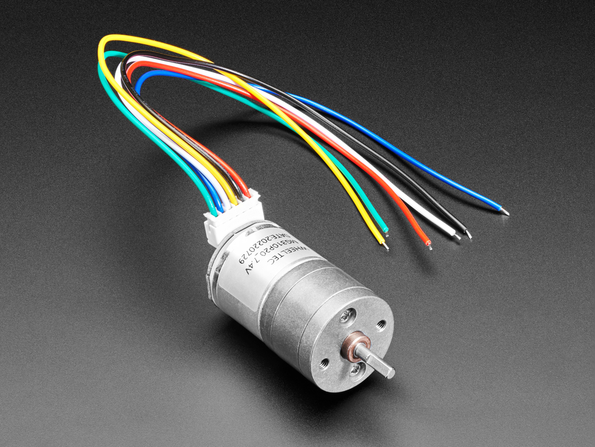

# Intro into PWM & how to on 328P

---

# Why PWM ? 


Pulse Width Modulation (PWM) is a simple & efficient technique for controlling power delivery in electronic systems. 
<br> 
It operates by switching a signal between its “on / high / 1” and “off / low / 0” states at a high frequency, where the ratio of the “on” time to total period (duty cycle) determines the effective voltage delivered to the load.

<style>
table {
  width: 100%;
  border-collapse: collapse;
  table-layout: fixed;
}
td {
  width: 33.33%;
  text-align: center;
  vertical-align: middle;
  border: 1px solid #ccc;
}
.img-responsive {
  width: 100%;
  height: auto;
  max-height: 300px;
  display: block;
}
</style>


<table>
<tbody>
  <tr>
    <td>
      
    </td>
    <td>
      
    </td>
    <td>
      
    </td>
  </tr>
</tbody>
</table>

<br> 

> Img copyright - https://www.adafruit.com/

---

# H-bridge ? 


Just as electric motors are everywhere - PWM base control is also everywhere to control them :) 

<style>
table {
  width: 100%;
  border-collapse: collapse;
  table-layout: fixed;
}
td {
  width: 33.33%;
  text-align: center;
  vertical-align: middle;
  border: 1px solid #ccc;
}
.img-responsive {
  width: 100%;
  height: auto;
  max-height: 300px;
  display: block;
}
</style>


<table>
<tbody>
  <tr>
    <td>
      
    </td>
    <td>
      
    </td>
    <td>
      
    </td>
  </tr>
</tbody>
</table>

<br> 

> Img copyright - https://ebits.dk/blogs/ebits-blogs/an-h-bridge-and-a-dc-motor-what-a-felicitous-match & https://www.ti.com/lit/ds/symlink/drv8220.pdf?ts=1742223628848

---
layout: two-cols
---

# How does this look like
> PWM allows the creation of analog-like signals using digital outputs by varying the on and off periods.

#### Duty Cycle Control via Code:
- The duty cycle is the percentage of time the signal is high (ON) in a full cycle.
- It can be controlled   from software by adjusting registers like OCRx (Output Compare Register);

#### Duty Cycle vs. Average Voltage:

- The higher the duty cycle, the higher the average voltage seen on the output.
> Eg: a 50% duty cycle at 5V results in an average voltage of 2.5V.

#### Timer as a 1-bit D/A Converter:

- It behaves like a Digital-to-Analog Converter (DAC).

> OBS: The smoothness of the analog output depends on frequency and filtering (usually with an RC filter).

:: right ::

<br> 
<br> 
<br> 
<br> 

<div align="center">


</div>


---

# AVR Software Example

``` c
#define F_CPU 12000000UL       // Define CPU frequency as 12 MHz
#include <avr/io.h>            // Include AVR I/O def
#include <util/delay.h>        // Include delay utility for _delay_ms()
void PWM_set()
{
    DDRD |= (1 << PD7);        // Set PD7 (OC2A pin) as output (for PWM signal)
    // WGM20 = 1, WGM21 = 1 => Fast PWM mode
    // COM2A1 = 1 => Non-inverting mode (OC2A high at BOTTOM, clear on compare match)
    TCCR2A = (1 << WGM20) | (1 << WGM21) | (1 << COM2A1); // Config Timer/Counter2 for Fast PWM mode, non-inverting out
    // PWM frequency = F_CPU / (Prescaler * 256) = 12MHz / (1024 * 256) ≈ 45.8Hz
    TCCR2B = (1 << CS20) | (1 << CS21) | (1 << CS22);    // Set prescaler to 1024: CS20, CS21, CS22 all set
}
int main()
{
    unsigned char duty;        // Variable for PWM duty cycle (0-255)
    PWM_set();                
    while (1)                
    {
        for (duty = 0; duty < 255; duty++)  // Fade LED brightness up: from 0% to 100% duty cycle
        {  OCR2A = duty;       _delay_ms(10);       }
        for (duty = 0; duty < 255; duty++)  // Fade LED brightness down: from 100% to 0% duty cycle
        {  OCR2A = 255 - duty;  _delay_ms(10);     }
    }
}
```
