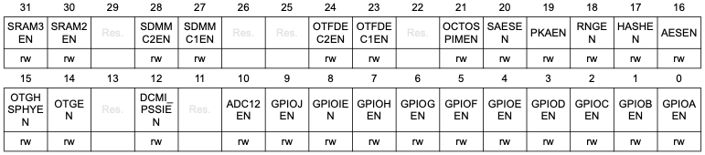
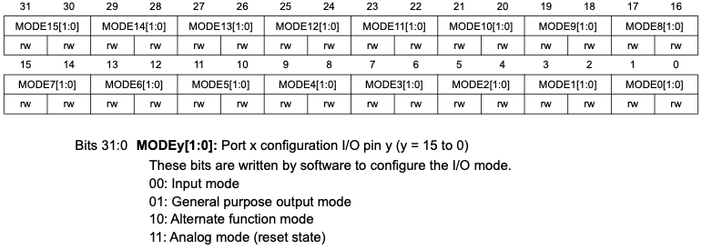
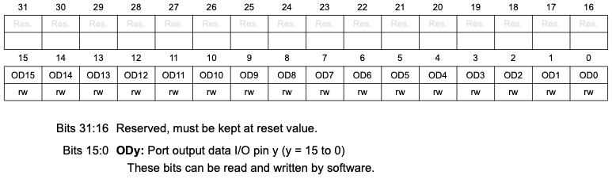
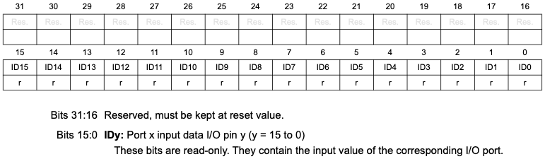
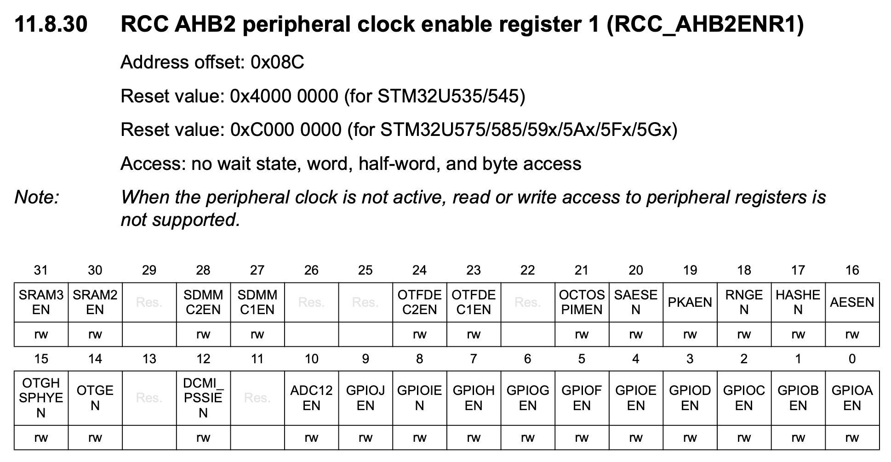
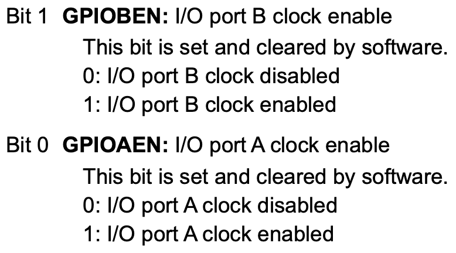
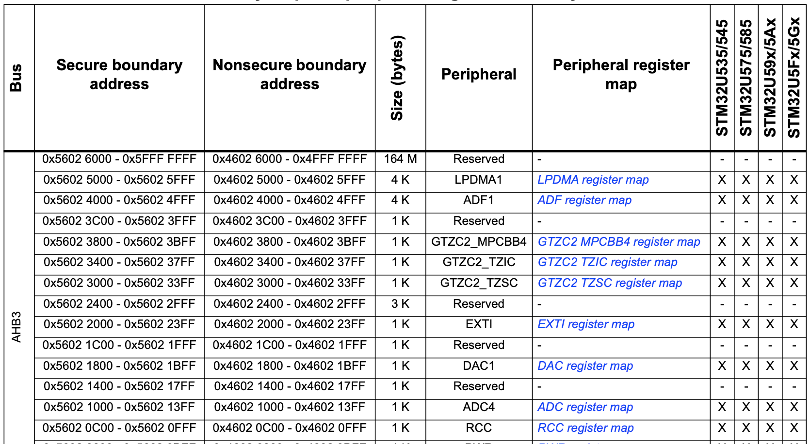
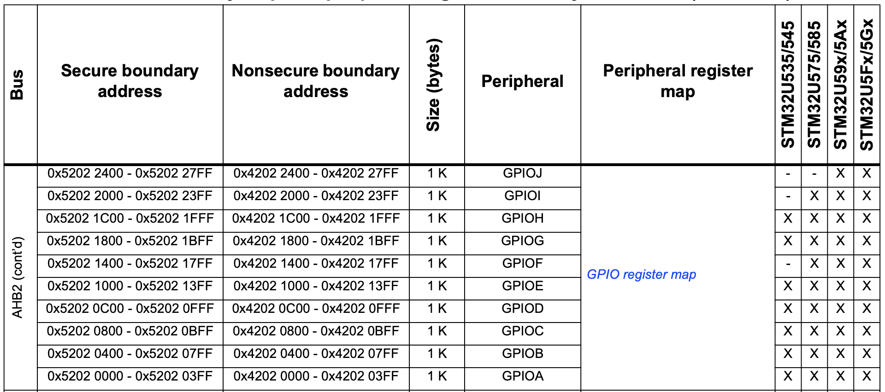
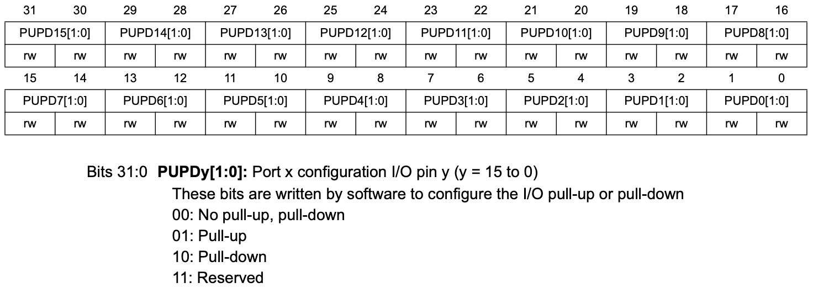
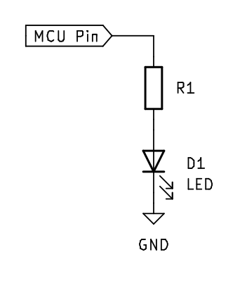

# GPIO

General Purpose Input Output for STM32U545

---
---

# Bibliography

Reference manuals

**STMicroelectronics**, *[STM32U5 Series based on Arm®-based 32-bit MCUs](https://www.st.com/resource/en/reference_manual/rm0456-stm32u5-series-armbased-32bit-mcus-stmicroelectronics.pdf)*

- Chapter 2 - *Memory and Bus architecture*
  - Section 2.3 - *Memory organization*
- Chapter 11 - *Reset and Clock Control*
  - Subsection 11.4.24 - *Peripherals clock gating and autonomous mode*
- Chapter 13 - *General-purpose I/Os (GPIO)*

---
---

# STM32U545 GPIO Pins

GPIO pins are split into smaller groups of up to 16 pins called Ports.

<div align="center">

</div>

---
layout: two-cols
---

# GPIO Registers

##### RCC AHB2 peripheral clock enable register 1



- Enable I/O Port x clock signal. (x from A to J)
  - Set the corresponding GPIOxEN bit
- Input
  - Set GPIOx_MODER bits for pin y to `0b00`
  - Read GPIOx_IDR bit y
- Output
  - Set GPIOx_MODER bits for pin y to `0b01`
  - Set GPIOx_ODR bit y

:: right ::

##### GPIOx_MODER



##### GPIOx_ODR



##### GPIOx_IDR



---
layout: two-cols
---

# GPIO Port enable

<v-click>
<Arrow x1="500" y1="293" x2="597" y2="293" width="3" color="red"/>
</v-click>

##### RCC AHB2 peripheral clock enable register 1



...



:: right ::

##### Memory map and peripheral register boundary addresses



```rust{all|4|4,5,6|4,5,6,9|4,5,6,9,10,11|all}
use core::ptr::write_volatile;
use core::ptr::read_volatile;

const RCC_BASE_ADDR: usize = 0x4602_0C00;
const RCC_AHB2ENR1: *mut u32 =
  (RCC_BASE_ADDR + 0x8C) as *mut u32;

unsafe {
  let value = read_volatile(RCC_AHB2ENR1);
  // enable `port`, where A is 0, B is 1, ... 
  write_volatile(RCC_AHB2ENR1, value | (1 << port));
}
```

---
layout: two-cols
---

# GPIO Output

##### GPIOx_MODER - address offset: 0x00


##### GPIOx_ODR - address offset: 0x14


:: right ::

<v-click>
<Arrow x1="500" y1="212" x2="592" y2="212" width="3" color="red"/>
</v-click>



```rust{all|3|3-7|4,5,10|4,5,10,11|4,5,10,11,12,13|4,5,10,11,12,13,14|6,7,15,16|all}
use core::ptr::{write_volatile, read_volatile};

const GPIOA_BASE_ADDR: usize = 0x4202_0000;
const GPIOA_MODER: *mut u32 = 
    GPIOA_BASE_ADDR as *mut u32;
const GPIOA_ODR: *mut u32 =
    (GPIOA_BASE_ADDR + 0x14) as *mut u32;

unsafe {
    let val = read_volatile(GPIOA_MODER);
    let mask = !(0b11 << (2 * pin));
    // `0b01` is General Purpose Output mode
    let val = (val & mask) | (0b01 << (2 * pin));
    write_volatile(GPIOA_MODER, val);
    // set pin high
    write_volatile(GPIOA_ODR, 1 << pin);
}
```

---
layout: two-cols
---

# GPIO Input

##### GPIOx_MODER - address offset: 0x00


##### GPIOx_PUPDR - address offset: 0x0C



##### GPIOx_IDR - address offset: 0x10


:: right ::

```rust{all|3-5,12|3-5,12,13|3-5,12-15|3,6,7,17-19|3,6,7,17-21|3,8,9,23-24|3,8,9,23-25}
use core::ptr::{write_volatile, read_volatile};

const GPIOC_BASE_ADDR: usize = 0x4202_0800;
const GPIOC_MODER: *mut u32 =
    GPIOC_BASE_ADDR as *mut u32;
const GPIOC_PUPDR: *mut u32 =
    (GPIOC_BASE_ADDR + 0x0C) as *mut u32;
const GPIOC_IDR: *mut u32 =
    (GPIOC_BASE_ADDR + 0x10) as *mut u32;

unsafe {
    let val = read_volatile(GPIOC_MODER);
    let val = val & !(0b11 << (2 * pin));
    // configure pin as input
    write_volatile(GPIOC_MODER, val);

    let val = read_volatile(GPIOC_PUPDR);
    let mask = !(0b11 << (2 * pin));
    let val = (val & mask) | (0b10 << (2 * pin));
    // configure pull down (0b10)
    write_volatile(GPIOC_PUPDR, val);

    // read pin value
    let value = read_volatile(GPIOC_IDR);
    let pin_val = (value & (1 << pin)) != 0;
}
```

---
layout: two-cols
---

# Input
read the value from pin `x` of port `y`

- enable the Port clock signal
- configure the pin as input by setting the pin's bits of the respective port's Mode Register, `GPIOy_MODER`, to `0b10`.
- read the `x` bit of the `GPIOy_IDR` register.
- *adjust the `GPIOy_PUPDR` fields to set the pull up/down resistor*

<div align="center">

</div>

:: right ::

# Output
write a value to pin `x` of port `y`

- enable the Port clock signal
- configure the pin as input by setting the pin's bits of the respective port's Mode Register, `GPIOy_MODER`, to `0b10`.
- set the `x` bit of the `GPIOy_ODR` register.
- *adjust the Port `y` registers to set the speed and configuration*

<div align="center">

</div>
