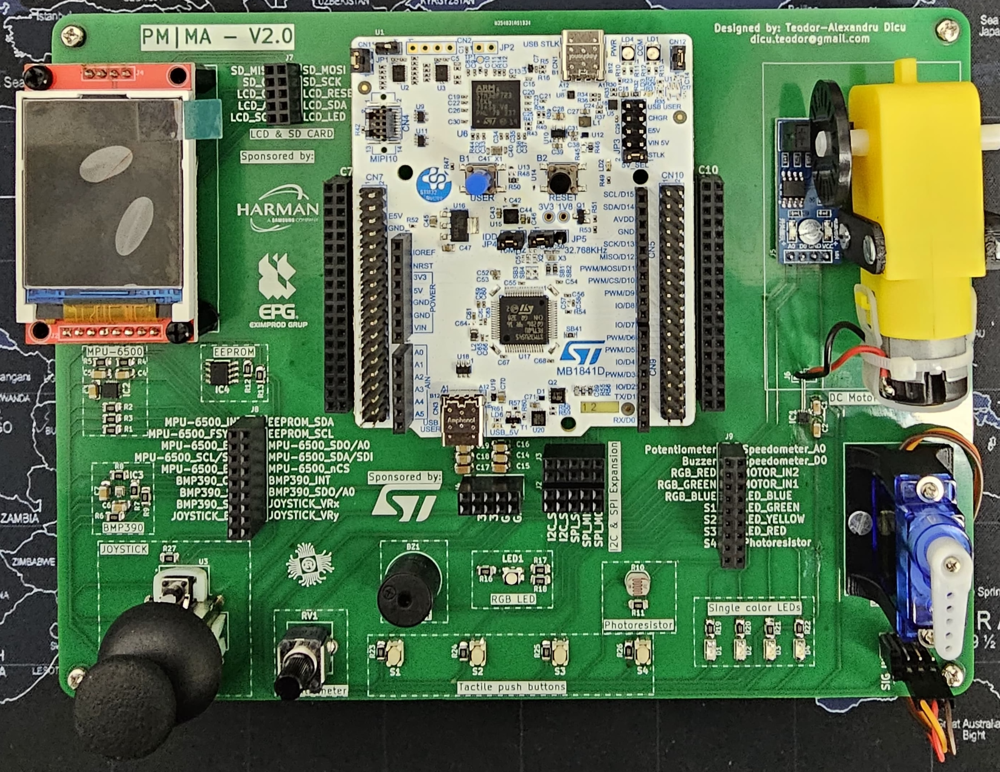

# Lab Board
<!-- [Schematics and PCB](https://gitlab.cs.pub.ro/pmrust/pm-ma-pcb) -->

<v-clicks>

- Nucleo U545RE-Q Slot / Board
- 4 buttons
- 5 LEDs
- potentiometer
- buzzer
- photoresistor
- I2C EEPROM
- MPU-6500 accelerometer & Gyro
- BMP 390 Pressure sensor
- SPI LCD Display
- SD Card Reader
- servo connectors
- stepper motor

</v-clicks>

::right::

<v-switch>

<template #1>
</template>

<template #0>
<Arrow x1="950" y1="20" x2="880" y2="140" width="3" color="red"/>
</template>

<template #-1>
<Arrow x1="890" y1="530" x2="890" y2="430" width="3" color="red"/>
</template>

<template #-2>
<Arrow x1="330" y1="140" x2="390" y2="140" width="3" color="red"/>
</template>

<template #-3>
<Arrow x1="300" y1="130" x2="450" y2="130" width="3" color="red"/>
</template>

<template #-4>
<Arrow x1="300" y1="310" x2="440" y2="310" width="3" color="red"/>
</template>

<template #-5>
<Arrow x1="300" y1="250" x2="430" y2="250" width="3" color="red"/>
</template>

<template #-6>
<Arrow x1="300" y1="240" x2="500" y2="240" width="3" color="red"/>
</template>

<template #-7>
<Arrow x1="730" y1="530" x2="730" y2="360" width="3" color="red"/>
</template>

<template #-8>
<Arrow x1="800" y1="500" x2="600" y2="360" width="3" color="red"/>
</template>

<template #-9>
<Arrow x1="700" y1="500" x2="550" y2="390" width="3" color="red"/>
</template>

<template #-10>
<Arrow x1="300" y1="355" x2="650" y2="355" width="3" color="red"/>
<Arrow x1="900" y1="470" x2="800" y2="390" width="3" color="red"/>
</template>

<template #-11>
<Arrow x1="750" y1="500" x2="680" y2="395" width="3" color="red"/>
</template>

<template #-12>
<Arrow x1="900" y1="20" x2="750" y2="150" width="3" color="red"/>
</template>

</v-switch>

---
---
# Project
suggested hardware

- the hardware should not cost more than 150 RON
- STM32 [Nucleo F446RE](https://www.st.com/en/evaluation-tools/nucleo-f446re.html) or [Nucleo U545RE-Q](https://www.st.com/en/evaluation-tools/nucleo-u545re-q.html) board (include debuggers)
- Raspberry Pi Pico with a debugger

**Raspberry Pi Pico 2W** + **Debug Probe**

**Raspberry Pi Pico 2W** + **Raspberry Pi Pico 1**

