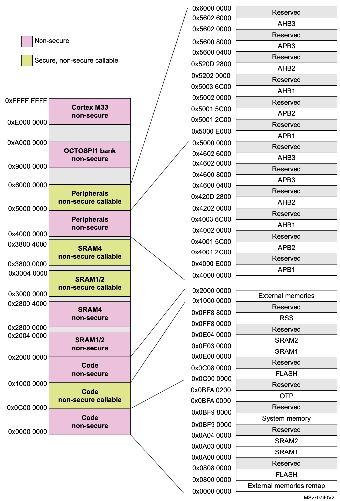
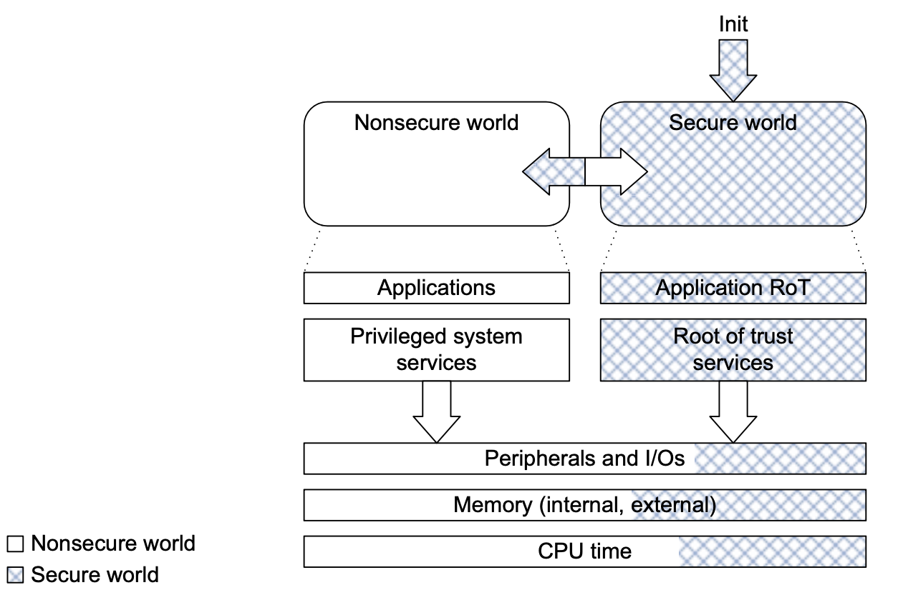
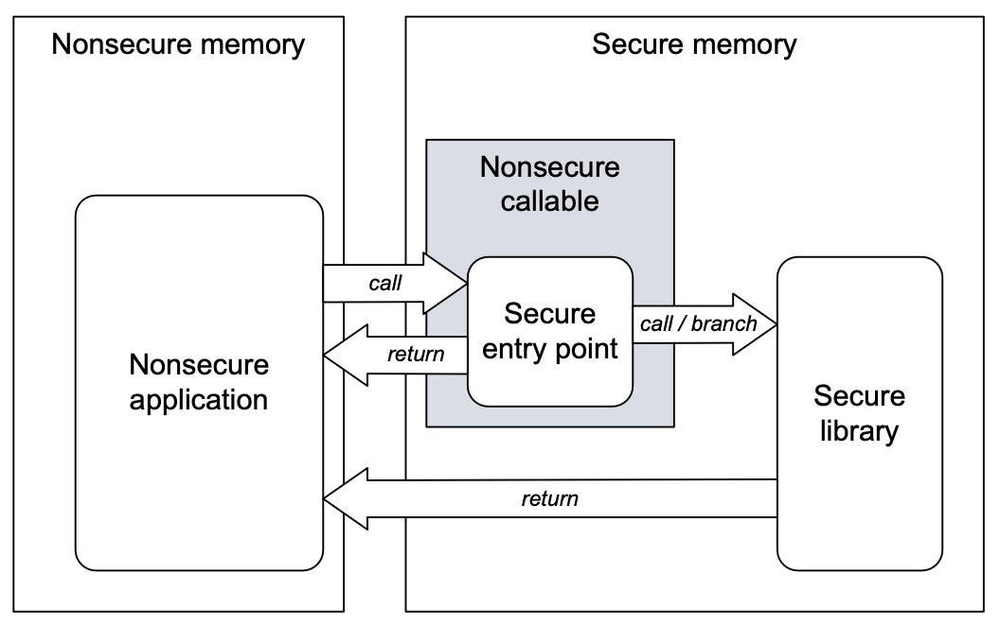
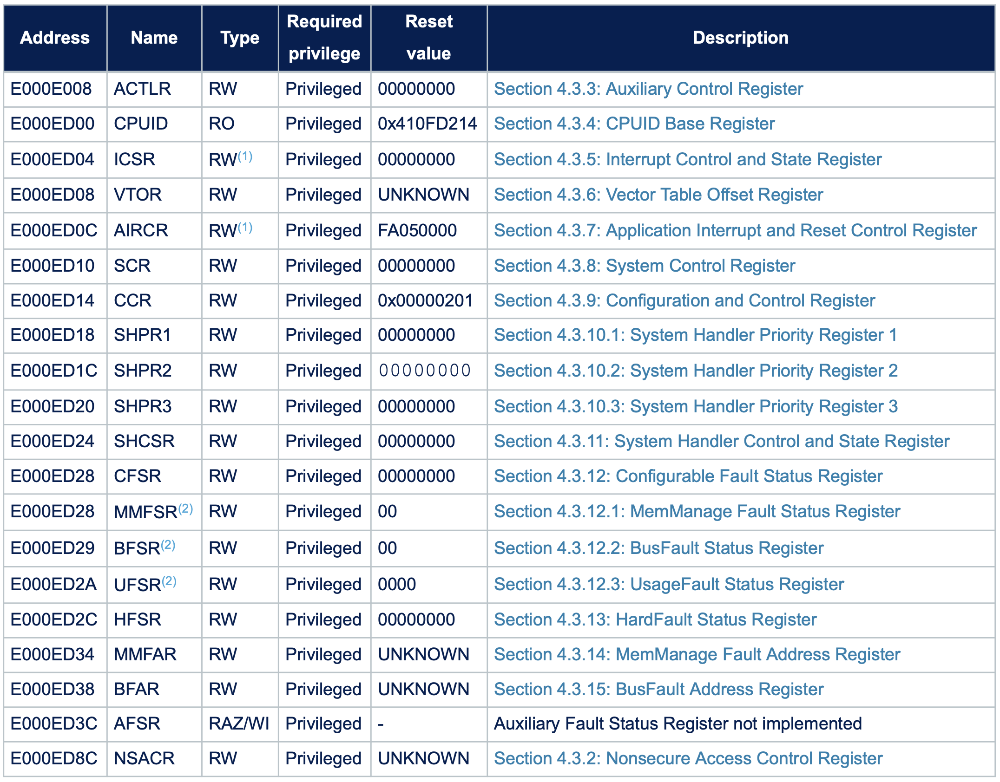
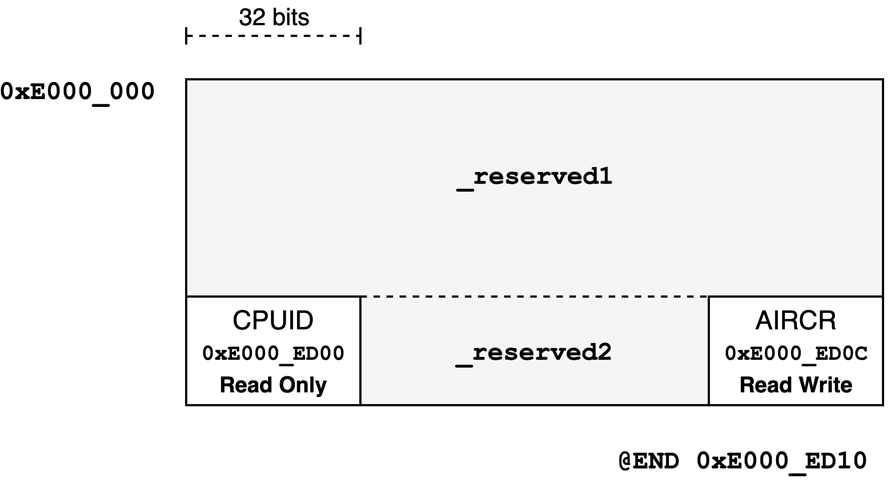

# MMIO
Memory Mapped Input Output

---
---
# 8 bit processor
a simple 8 bit processor with a text display


---
layout: two-cols
---

# The Bus
example for STM32U545RE

<!-- ToDoDanut: pt placa curenta -->

<style>
.two-columns {
    grid-template-columns: 2fr 5fr;
}
</style>

<v-clicks>

1. **Memory Controller** asks for data transfer
2. **Internal Bus Routes** the request
   - to the *External Bus* **or**
   - to the *Internal Peripherals*
3. **External Bus Routes** the request based on the *Address Mapping Table*
   1. to **RAM**
   2. to **Flash**
   3. to an **External Peripheral**

</v-clicks>

:: right ::

<v-switch>

<template #-3>

<!--  -->


</template>

<template #0>

<!--  -->


</template>

</v-switch>

---
layout: two-cols
---

<!-- # STM32L0x2
A real MCU -->
# STM32U535/545
Real MCUs

<!-- ToDoDanut: add a trustZone slide -->

<!-- ToDoDanut: de vazut daca gasim chir pt M33-ul pe care il folim acum? Anul trecut am pus acest exemplu pt ca are datesheetul mai detaliat pe partea asta de mememorie :))  -->

| | |
|-|-|
| Cortex-M33 Peripherals | MCU's *settings* and internal peripherals, available at the same address on all M33 |
| Peripherals | GPIO, USART, SPI, I2C, USB, etc |
| Flash | The storage space |
| SRAM | RAM memory |
| @0x0000_0000 | Alias for SRAM or Flash |
| Secure vs Non-secure | Resources can be partitioned between secure and non-secure domain |

::right::

<!--  -->


---
layout: two-cols
---

# ARM TrustZone
Hardware Isolation Model

- Splits code into two regions **Secure** and **Non-Secure**
- Designed for protecting keys, boot, and critical services while running normal app code
- Partition memory, peripherals and interrupts
- fixed **IDAU** map + programmable **SAU** map
- Attributes:
  - **NS** - typical application code
  - **S** - secure drivers, keys, crypto
  - **NSC** - veneer stubs that call secure functions

:: right ::

### Secure/nonsecure TrustZone partitioning

<div align="center">

</div>

### Secure world transition

<div align="center">

</div>

---
layout: two-cols
---

<!-- # System Control Registers -->
<!-- Cortex-M0+[^m33] SCR Peripheral @0xe000_0000 -->
# System Control Block
Cortex-M33 SCB Peripheral @0xe000_ed00

<!-- ToDoDanut: should we update this? -->

Compute the actual address
$$ e000\_ed00_{(16)} + register_{offset} $$

Register Examples:

- CPUID: **0xe000_ed00** (*0xe000_ed00 + 0x0000*)
- SCR: **0xe000_ed00** (*0xe000_ed00 + 0x0010*)

```rust {all|1-2|4|5|6,7}{lines:false}
const SCB_ADDR: usize = 0xe000_ed00;
const SCR_OFFSET: usize = 0x0010;

let scr_reg = (SCB_ADDR + SCR_OFFSET) as *const u32;
let scr_value = unsafe { *cpuid_reg };
// or
let scr_value = unsafe { cpuid_reg.read() };
```

<v-switch>
<template #0>
⚠️ Reading and Writing to pointers is `unsafe`.
</template>
<template #1>
⚠️ Reading and Writing to pointers is `unsafe`.

⚠️ Compilers optimize code and processors use cache!
</template>
</v-switch>

::right::


<!--  -->

<!-- [^m33]: Cortex-M33 has some additional registers -->

---

# Compiler Optimization
compilers optimize code

Write bytes to the `UART` (serial port) data register

```rust {1,2|3,4,7|5,6|all}
// we use mut as we need to write to it
const UART_TX: *mut u8 = 0x4001_3828 as *mut u8;
// b".." means ASCII string (Rust uses UTF-8 strings by default)
for character in b"Hello, World".iter() {
	// character is &char, so we use *character to get the value
	unsafe { UART_TX.write(*character); }
}
```

<v-clicks>

1. The compiler does not know that `UART_TX` is a register and uses it as a memory address.
2. Writing several values to the same memory address will result in having the last value stored at that address.
3. The compiler optimizes the code write the value

</v-clicks>

<v-after>

```rust
const UART_TX: *mut u8 = 0x4001_3828;
unsafe { UART_TX.write(b'd'); }
```

</v-after>

---
layout: two-cols
---

# No Compiler Optimization

CPUID: **0xe000_ed00** (*0xe000_ed00 + 0xed00*)

```rust {all|1|3-4|6,7|8-11}{lines: false}
use core::ptr::read_volatile;
    
const SYS_CTRL_ADDR: usize = 0xe000_ed00;
const CPUID_OFST: usize = 0x0000;

let cpuid_reg = 
    (SYS_CTRL_ADDR + CPUID_OFST) as *const u32;
unsafe {
	// avoid compiler optimization
	read_volatile(cpuid_reg) 
}
```

|  |  |
|----------|-------------|
| `read_volatile`, `write_volatile` | **no** compiler **optimization** |
| `read`, `write`, `*p` | **use** compiler **optimization**  |

::right::


<!--  -->

---

# No Compiler Optimization

Write bytes to the `UART` (serial port) data register

```rust {1|3,4|5,6,9|7,8|all}
use core::ptr::write_volatile;

// we use mut as we need to write to it
const UART_TX: *mut u8 = 0x4001_3828 as *mut u8;
// b".." means ASCII string (Rust uses UTF-8 strings by default)
for character in b"Hello, World".iter() {
	// character is &char, so we use *character to get the value
	unsafe { write_volatile(UART_TX, *character); }
}
```

<v-clicks>

The compiler **knows** that `UART_TX` **must be written** every time.

</v-clicks>

---
---
# 8 bit processor
with cache


---
---
# No Cache or Flush Cache

- Cache types:
  - *write-through* - data is written to the cache and to the main memory (bus)
  - *write-back* - data is written to the cache and later to the main memory (bus)
- few Cortex-M MCUs have cache
- the Memory Mapped I/O region is set as *nocache*
- for chips that use cache
  - *nocache* regions have to be set manually (if MCU knows)
  - or, the cache has to be flushed before a `volatile_read` and after a `volatile_write`
  - beware DMA controllers that can't see the cache contents

---
layout: two-cols
---

# Read the CPUID
About the MCU

<!-- ToDoDanut: should we update this? Are sens fiind doar de exemplu sau il lasam asa? -->

```rust {all|1|3-4|6|7-9|11,12|14,15|17,18|20,21}{lines: false}
use core::ptr::read_volatile;

const SYS_CTRL_ADDR: usize = 0xe000_0000;
const CPUID_OFST: usize = 0xed00;

let cpuid_reg = (SYS_CTRL_ADDR+CPUID_OFST) as *const u32;
let cpuid_value = unsafe {
    read_volatile(cpuid_reg)
};

// shift right 24 bits and keep only the last 8 bits
let variant = (cpuid_value >> 24) & 0b1111_1111;

// shift right 16 bits and keep only the last 4 bits
let architecture = (cpuid_value >> 16) & 0b1111;

// shift right 4 bits and keep only the last 12 bits
let part_no = (cpuid_value >> 4) & 0b1111_1111_1111;

// shift right 0 bits and keep only the last 4 bits
let revision = (cpuid_value >> 0) & 0b1111;
```

::right::

## CPUID Register
Offset: 0xed00


---
layout: two-cols
---

# AIRCR
Application Interrupt and Reset Control Register

<!-- ToDoDanut: should we update this? Are sens fiind doar de exemplu sau il lasam asa? -->

```rust {all|1,2|4,5|10-13|8,17|7,15|7,16|19-21}{lines: false}
use core::ptr::read_volatile;
use core::ptr::write_volatile;

const SYS_CTRL_ADDR: usize = 0xe000_0000;
const AIRCR_OFST: usize = 0xed0c;

const VECTKEY_POS: u32 = 16;
const SYSRESETREQ_POS: u32 = 2;

let aircr_register = (SYS_CTRL + AIRCR) as *mut u32;
let mut aircr_value = unsafe { 
    read_volatile(aircr_register) 
};

aircr_value = aircr_value & !(0xffff << VECTKEY_POS); 
aircr_value = aircr_value | (0x05fa << VECTKEY_POS);
aircr_value = aircr_value | (1 << SYSRESETREQ_POS);

unsafe {
    write_volatile(aircr_register, aircr_value);
}
```

::right::

## AIRCR Register

Offset: 0xed0c


---
layout: two-cols
---
# Read and Write
they do stuff

- Read
  - reads the value of a register
  - might ask the peripheral to do something
  
- Write
  - writes the value to a register
  - might ask the peripheral to do something
    - SYSRESETREQ

::right::

## AIRCR Register

Offset: 0xed0c


---

# SVD XML File
System View Description

```xml{all|3|4,21|4,5,21|4,6,21|4,7-9,20,21|4,7-8,12-17,20,21}
<device schemaVersion="1.1"
	xmlns:xs="http://www.w3.org/2001/XMLSchema-instance" xs:noNamespaceSchemaLocation="CMSIS-SVD.xsd">
	<name>RP2040</name>
	<peripherals>
		<name>PPB</name>
		<baseAddress>0xe0000000</baseAddress>
		<register>
			<name>CPUID</name>
			<addressOffset>0xed00</addressOffset>
			<resetValue>0x410cc601</resetValue>
			<fields>
				<field>
					<name>IMPLEMENTER</name>
					<description>Implementor code: 0x41 = ARM</description>
					<bitRange>[31:24]</bitRange>
					<access>read-only</access>
				</field>
				<!-- rest of the fields of the register -->
			</fields>
		</register>
	</peripherals>
</device>
```

---
layout: two-cols
---

# `tock-registers`
define registers format

```rust {1|2,22|3-15|16-32|all}
use tock_registers::register_bitfields;
register_bitfields! {u32,
  CPUID [
    IMPLEMENTER OFFSET(24) NUMBITS(8) [],
    VARIANT OFFSET(20) NUMBITS(4) [],
    ARCHITECTURE OFFSET(16) NUMBITS(4) [
      ARM_V6_M = 0xc,
      ARM_V8_M = 0xa
    ],
    PARTNO OFFSET(4) NUMBITS(12) [
      CORTEX_M0P = 0xc60,
      CORTEX_M33 = 0xd21
    ],
    REVISION OFFSET(0) NUMBITS(2) []
  ],
  AIRCR [
    VECTKEY OFFSET(16) NUMBITS(8) [KEY = 0x05fa],
    ENDIANESS OFFSET(15) NUMBITS(1) [],
    SYSRESETREQ OFFSET(2) NUMBITS(1) [],
    VECTCLRACTIVE OFFSET(1) NUMBITS(1) []
  ]
}
```

::right::

<v-switch>

<template #0>


</template>

<template #-1>

## AIRCR Register


</template>

<template #-2>

## CPUID Register


`ARCHITECTURE` field example:

- It is **4 bit** long -- `NUMBITS(4)`
- The filed has an offset of **16 bits** in regards to the register's start -- `OFFSET(16)`
- `ARM_V6_M` and `ARM_V8_M` are both valid variants of the `ARCHITECTURE` and can be used with methods of the `Register` structures (e.g. `modify`).

</template>

<template #-3>

## CPUID Register


</template>

</v-switch>

---
layout: two-cols
---

# `tock-registers`
define a structure for the peripheral

```rust {1|4,17|4,5,16,17|2,8,9|2,12,13|all}{lines:false}
use tock_registers::register_structs;
use tock_registers::registers::{ReadOnly, ReadWrite};

// generates a C-style SysCtrl struct
register_structs! {
SysCtrl {
	// we ingore registers up to 0xed00
	(0x0000 => _reserved1),
	// we define the CPUID register
	(0xed00 => cpuid: ReadOnly<u32, CPUID::Register>),
	// we ignore registers up to 0xed
	(0xed04 => _reserved2),
	// we define the AIRCR register
	(0xed0c => aircr: ReadWrite<u32, AIRCR::Register>),
	// we ignore the rest of the registers
	(0xed10 => @END),
}
}
```

::right::

<v-switch>

<template #-1>

<arrow x1="910" y1="450" x2="870" y2="450" color="#0060df" width="2" arrowSize="1" />

</template>

<template #-2>

<arrow x1="910" y1="387" x2="790" y2="387" color="#0060df" width="2" arrowSize="1" />

</template>


</v-switch>


---
layout: two-cols
---

# `tock-registers`
memory mapping

```rust {all}{lines:false}
const SYS_CTRL_ADDR: usize = 0xe000_0000;

// generates a C-style SysCtrl struct
register_structs! {
SysCtrl {
	// we ingore registers up to 0xed00
	(0x0000 => _reserved1),
	// we define the CPUID register
	(0xed00 => cpuid: ReadOnly<u32, CPUID::Register>),
	// we ignore registers up to 0xed
	(0xed04 => _reserved2),
	// we define the AIRCR register
	(0xed0c => aircr: ReadWrite<u32, AIRCR::Register>),
	// we ignore the rest of the registers
	(0xed10 => @END),
}
}

// C: struct SysCtrl *sys_ctrl = SYS_CTRL_ADDR;
let sys_ctrl = unsafe { 
  &*(SYS_CTRL_ADDR as *const SysCtrl)
};
```

::right::



<v-switch>

<template #0>
<arrow x1="440" y1="295" x2="580" y2="230" color="#0060df" width="2" arrowSize="1" />
<arrow x1="450" y1="367" x2="834" y2="230" color="#0060df" width="2" arrowSize="1" />

- The registers will be mapped at the defined offset from the `SysCtrl` structure beginning, with the designated access rights.
</template>

<template #1>
<arrow x1="260" y1="257" x2="700" y2="145" color="#0060df" width="2" arrowSize="1" />
<arrow x1="260" y1="329" x2="700" y2="230" color="#0060df" width="2" arrowSize="1" />

- The macro will insert padding `u8` arrays the size of the gaps between the start, the defined registers and end of the structure. (*\*if needed*)
</template>

<template #2>
<arrow x1="400" y1="507" x2="525" y2="110" color="#0060df" width="2" arrowSize="1" />

- We ensure the structure is correctly alligned with the memory mapped registers by casting the peripheral's address as found in the datasheet into a `SysCtrl` reference.
</template>

</v-switch>

---

# Reset the processor
using `tock-registers`

```rust {1|3-11|12-17|1,14,19|6,8,21,22,23|all}
const SYS_CTRL_ADDR: usize = 0xe000_0000;

register_bitfields! {u32,
    // ...
    AIRCR [
        VECTKEY OFFSET(16) NUMBITS(8) [KEY = 0x05fa], // `KEY` is a predefined variant of the `VECTKEY` field
        ENDIANESS OFFSET(15) NUMBITS(1) [],
        SYSRESETREQ OFFSET(2) NUMBITS(1) [],
        VECTCLRACTIVE OFFSET(1) NUMBITS(1) []
    ]
}
// The `SysCtrl` strcture generated will have a memory layout matching the indicated offsets of the registers
register_structs! {
SysCtrl {
  (0xed0c => aircr: ReadWrite<u32, AIRCR::Register>),
}
}

let sys_ctrl = unsafe { &*(SYS_CTRL_ADDR as *const SysCtrl) }; // C: struct SysCtrl *sys_ctrl = SYS_CTRL_ADDR;

sys_ctrl.aircr                                              // `SET` and `CLEAR` are variants generated by
    .modify(AIRCR::VECTKEY::KEY + AIRCR::SYSRESETREQ::SET); // default and correspond to setting all bits
                                                            // of the field to 1 and 0 respectively.
```

<!--
let sys_ctrl = SYS_CTRL_ADDR as *const SysCtrl;
sys_ctrl.aircr needs unsafe! (sys_ctrl is a raw pointer), rust does not allow raw pointer dereference

*sys_ctrl => dereference - requires the unsafe
&* => take a safe reference to a dereferenced value
-->

<!--
--

<!--
<!--
struct SysCtrl *sys_ctrl = SYS_CTRL_ADDR;
-->

---

# Read the CPUID
using `tock-registers`

```rust {1|2-11|1,12|14-17|7,17,19-23|all}
const SYS_CTRL_ADDR: usize = 0xe000_0000;
register_bitfields! {u32,
    CPUID [
        IMPLEMENTER OFFSET(24) NUMBITS(8) [],
        VARIANT OFFSET(20) NUMBITS(4) [],
        ARCHITECTURE OFFSET(16) NUMBITS(4) [ARMv6M = 0xc, ARMv8M0 = 0xa],
        PARTNO OFFSET(4) NUMBITS(12) [CORTEX_M0P = 0xc60, CORTEX_M33 = 0xd21],
        REVISION OFFSET(0) NUMBITS(2) []
    ],
    // ...
}
let sys_ctrl = unsafe { &*(SYS_CTRL_ADDR as *const SysCtrl) };

let variant = sys_ctrl.cpuid.read(CPUID::VARIANT);
let revision = sys_ctrl.cpuid.read(CPUID::REVISION);
let archtecture = sys_ctrl.cpuid.read(CPUID::ARCHITECTURE);
let part_no = sys_ctrl.cpuid.read(CPUID::PARTNO);

if part_no == CPUID::PARTNO::Value::CORTEX_M0P as u32 {
  // this is a Cortex-M0+
} else if part_no == CPUID::PARTNO::Value::CORTEX_M33 as u32 {
  // this is a Cortex-M33
} 

```
