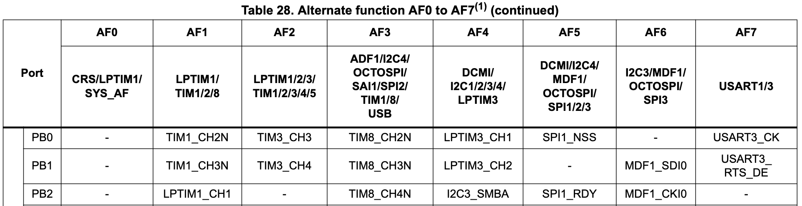
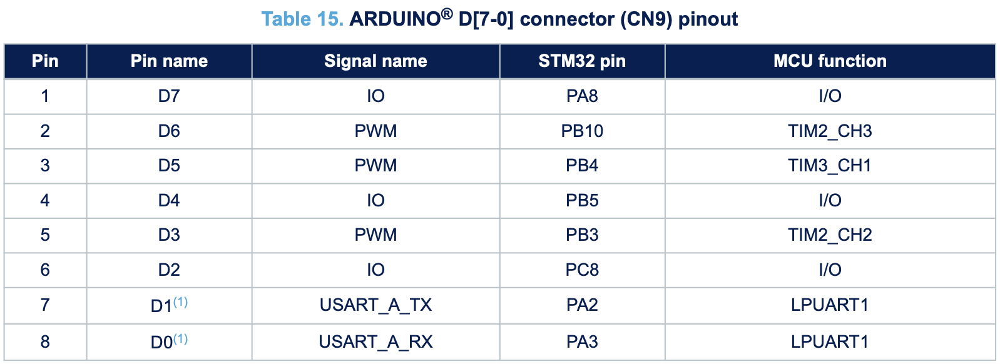
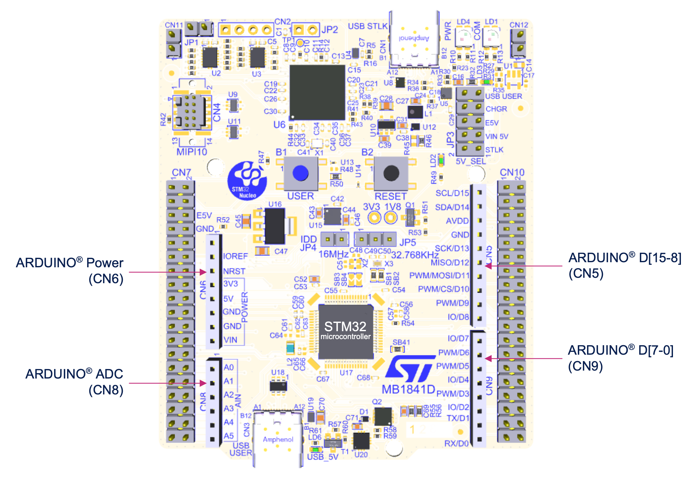

# PWM
Pulse Width Modulation

---

# Bibliography
for this section

1. **Raspberry Pi Ltd**, *[RP2350 Datasheet](https://datasheets.raspberrypi.com/rp2350/rp2350-datasheet.pdf)*
   - Chapter 12 - *Peripherals*
     - Section 12.5 - *PWM*

2. **Paul Denisowski**, *[Understanding PWM](https://www.youtube.com/watch?v=nXFoVSN3u-E)*

---
layout: two-cols
---
# PWM
simulates an *analog* signal (using integration)

- generates a square signal
- if integrated (averaged), it looks like an analog signal

|  |  |  |
|-----------|------|-------------|
| *frequency* | Hz | The number of repeats per s |
| *duty_cycle* | % | The percentage of the time when the signal is `High` |


:: right ::


$$

f = \frac{1}{period} \left[\frac{1}{s} = 1 Hz\right]_{SI}

$$

$$

duty\_cycle = \frac{time\_on}{period} \%

$$

---
layout: two-cols
---
# PWM
generic device

$$

f = \begin{cases}
    \frac{f_{clock}}{divider \times (top + 1)} && correction = 0\\
    \\
    \frac{f_{clock}}{divider \times 2 \times (top + 1)} && correction = 1\\
\end{cases}

$$

$$
pin_{a,b} = \begin{cases}
    0 && compare_{a,b} >= value\\
    1 && compare_{a,b} < value
\end{cases}
$$


<style>
.two-columns {
    grid-template-columns: 4fr 5fr;
}
</style>

:: right ::

<div align="center">

</div>

---

# Usage examples

<div grid="~ cols-2 gap-6">

<div>

- dimming an LED


</div>

<div>

- controlling motors
  - controlling the angle of a stepper motor
  - controlling the RPM of a motor


</div>

</div>

---
layout: two-cols
---

# RP2350's PWM

- generates square signals
- counts the pulse width of input signals
- 8 or 12[^package] PWM slices, each A and B channels
- each PWM channel is linked to a fixed pin
- some channels are connected to two pins
- may be used as timers (`IRQ1_INTE`)

## Registers

<style>
.two-columns {
    grid-template-columns: 4fr 5fr;
}
</style>

<div align="center">

</div>

:: right ::

<div align="center">

</div>

<div align="center">

</div>

<div align="center">


</div>

[^package]: Depends on the RP2350 package

---

# RP2350's PWM Modes

<div grid="~ cols-2 gap-5">

<div align="center">
standard mode

</div>

<div align="center">
phase-correct mode

</div>

</div>

$$

period = (TOP + 1) \times (PH\_CORRECT + 1) \times \left(DIV\_INT + \frac{DIV\_FRAC}{16}\right) [s]_{SI}

$$

$$

f = \frac{f_{sys}}{period} [Hz]_{SI}

$$

---
layout: two-cols
---

# Example
using Embassy

```rust{1|3|5|5,6|5,6,7|9-13|16|17|18,19|15,18,19,20|all}
use embassy_rp::pwm::{Config, Pwm};

let p = embassy_rp::init(Default::default());

let mut c: Config = Default::default();
c.top = 0x8000;
c.compare_b = 8;

let mut pwm = Pwm::new_output_b(
    p.PWM_SLICE4,
    p.PIN_25,
    c.clone()
);

loop {
    info!("LED duty cycle: {}/32768", c.compare_b);
    Timer::after_secs(1).await;
    c.compare_b += 10;
    pwm.set_config(&c);
}
```

:: right ::

```rust {lineNumbers: false}
pub struct Config {
    /// Inverts the PWM output signal on channel A.
    pub invert_a: bool,
    /// Inverts the PWM output signal on channel B.
    pub invert_b: bool,
    /// Enables phase-correct mode for PWM operation.
    pub phase_correct: bool,
    /// Enables the PWM slice, allowing it to generate an output.
    pub enable: bool,
    /// A fractional clock divider, represented as a fixed-point number with
    /// 8 integer bits and 4 fractional bits. It allows precise control over
    /// the PWM output frequency by gating the PWM counter increment.
    /// A higher value will result in a slower output frequency.
    pub divider: fixed::FixedU16<fixed::types::extra::U4>,
    /// The output on channel A goes high when `compare_a` is higher than the
    /// counter. A compare of 0 will produce an always low output
    pub compare_a: u16,
    /// The output on channel B goes high when `compare_b` is higher than the
    /// counter.
    pub compare_b: u16,
    /// The point at which the counter wraps, representing the maximum possible
    /// period. The counter will either wrap to 0 or reverse depending on the
    /// setting of `phase_correct`.
    pub top: u16,
}

```

---
layout: two-cols
---

# STM32U545RE's PWM
`
- generates square signals
- counts the pulse width of input signals
- each **timer** (*TIM*) has up to four channels
- each PWM channel is connected to one or more pins
- frequency is determined by the value of the TIMx_ARR register, and the duty
cycle by the value of the TIMx_CCRy register.

<br>

### Pin Alternate functions

<div align="center">

</div>

:: right ::

<div align="center">


</div>

---
layout: two-cols
---

# Example
using Embassy

```rust {none|5|1,7|2,3,8-13|1,7,10|14|16,17,18,23|16,19,20,23|16,21,22,23|all}
use embassy_stm32::timer::simple_pwm::PwmPin;
use embassy_stm32::timer::simple_pwm::SimplePwm;
use embassy_stm32::timer::low_level::CountingMode;

let p = embassy_stm32::init(Default::default());

let pin = PwmPin::new(p.PB0, OutputType::PushPull);
let mut pwm = SimplePwm::new(
    p.TIM3,                      // Timer instance
    None, None, Some(pin), None, // Pin channel map
    khz(10),                     // Frequency
    CountingMode::default()      // Counter config
);
let mut ch3 = pwm.ch3();

loop {
    ch3.set_duty_cycle_fully_off();
    Timer::after_millis(300).await;
    ch3.set_duty_cycle_fraction(1, 2);
    Timer::after_millis(300).await;
    ch3.set_duty_cycle(ch3.max_duty_cycle() - 1);
    Timer::after_millis(300).await;
}
```

:: right ::

```rust {lineNumbers: false}
#[derive(Debug, Clone, Copy, PartialEq, Eq, Default)]
pub enum CountingMode {
    #[default]
    /// The timer counts up to the reload value and then
    /// resets back to 0.
    EdgeAlignedUp,
    /// The timer counts down to 0 and then resets back to
    /// the reload value.
    EdgeAlignedDown,
    /// The timer counts up to the reload value and then
    /// counts back to 0.
    /// The output compare interrupt flags of channels
    /// configured in output are set when the counter is
    /// counting down.
    CenterAlignedDownInterrupts,
    /// The timer counts up to the reload value and then
    /// counts back to 0.
    /// The output compare interrupt flags of channels
    /// configured in output are set when the counter is
    /// counting up.
    CenterAlignedUpInterrupts,
    /// The timer counts up to the reload value and then
    /// counts back to 0.
    /// The output compare interrupt flags of channels
    /// configured in output are set when the counter is
    /// counting both up or down.
    CenterAlignedBothInterrupts,
}
```
