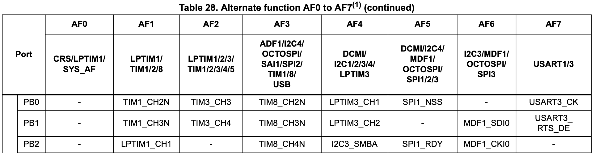
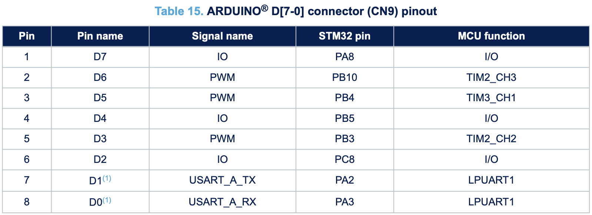
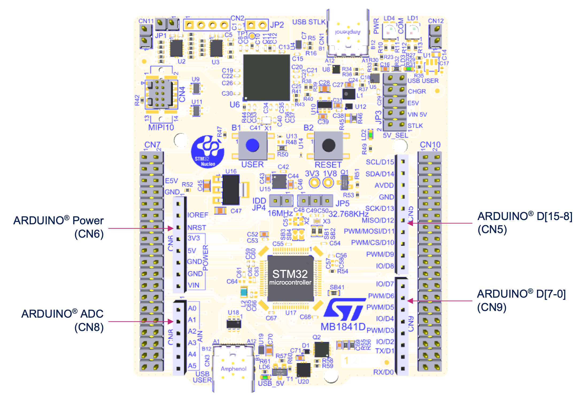

# PWM
Pulse Width Modulation

---

# Bibliography
for this section

**STMicroelectronics**, *[STM32U5 Series based on Arm®-based 32-bit MCUs](https://www.st.com/resource/en/reference_manual/rm0456-stm32u5-series-armbased-32bit-mcus-stmicroelectronics.pdf)*

- Chapter 54 - *Advanced-control timers (TIM1/TIM8)*
  - Subchapter 3 - *TIM1/TIM8 functional description*
- Chapter 55 - *General-purpose timers (TIM2/TIM3/TIM4/TIM5)*
  - Subchapter 4 - *TIM2/TIM3/TIM4/TIM5 functional description*
- Chapter 56 - *General-purpose timers (TIM15/TIM16/TIM17)*
  - Subchapter 4 - *TIM15/TIM16/TIM17 functional description*

---
layout: two-cols
---
# PWM
simulates an *analog* signal (using integration)

- generates a square signal
- if integrated (averaged), it looks like an analog signal

|  |  |  |
|-----------|------|-------------|
| *frequency* | Hz | The number of repeats per s |
| *duty_cycle* | % | The percentage of the time when the signal is `High` |


:: right ::


$$

f = \frac{1}{period} \left[\frac{1}{s} = 1 Hz\right]_{SI}

$$

$$

duty\_cycle = \frac{time\_on}{period} \%

$$

---
layout: two-cols
---
# PWM
generic device

$$

f = \begin{cases}
    \frac{f_{clock}}{divider \times (top + 1)} && correction = 0\\
    \\
    \frac{f_{clock}}{divider \times 2 \times (top + 1)} && correction = 1\\
\end{cases}

$$

$$
pin_{a,b} = \begin{cases}
    0 && compare_{a,b} >= value\\
    1 && compare_{a,b} < value
\end{cases}
$$


<style>
.two-columns {
    grid-template-columns: 4fr 5fr;
}
</style>

:: right ::

<div align="center">

</div>

---

# Usage examples

<div grid="~ cols-2 gap-6">

<div>

- dimming an LED


</div>

<div>

- controlling motors
  - controlling the angle of a stepper motor
  - controlling the RPM of a motor


</div>

</div>

---
layout: two-cols
---

# STM32U545RE's PWM

- generates square signals
- counts the pulse width of input signals
<!-- - 8 or 12[^package] PWM slices, each A and B channels -->
- each timer has up to four channels
- each PWM channel is connected to one or more pins
- frequency is determined by the value of the TIMx_ARR register, and the duty
cycle by the value of the TIMx_CCRy register.

### Pin Alternate functions

<div align="center">

</div>

:: right ::

<div align="center">


</div>

[^package]: Depends on the RP2350 package

---

# STM32U545RE PWM Modes

<div grid="~ cols-2 gap-5">

<div align="center">
standard mode

</div>

<div align="center">
phase-correct mode

</div>

</div>

$$

period = (TOP + 1) \times (PH\_CORRECT + 1) \times \left(DIV\_INT + \frac{DIV\_FRAC}{16}\right) [s]_{SI}

$$

$$

f = \frac{f_{sys}}{period} [Hz]_{SI}

$$

---
layout: two-cols
---

# Example
using Embassy

```rust
use embassy_stm32::timer::simple_pwm::PwmPin;
use embassy_stm32::timer::simple_pwm::SimplePwm;
use embassy_stm32::timer::low_level::CountingMode;

let p = embassy_stm32::init(Default::default());

let pin = PwmPin::new(p.PB0, OutputType::PushPull);
let mut pwm = SimplePwm::new(
    p.TIM3,                      // Timer instance
    None, None, Some(pin), None, // Pin channel map
    khz(10),                     // Frequency
    CountingMode::default()      // Counter config
);
let mut ch3 = pwm.ch3();

loop {
    ch3.set_duty_cycle_fully_off();
    Timer::after_millis(300).await;
    ch3.set_duty_cycle_fraction(1, 2);
    Timer::after_millis(300).await;
    ch3.set_duty_cycle(ch3.max_duty_cycle() - 1);
    Timer::after_millis(300).await;
}
```

:: right ::

```rust {lineNumbers: false}
#[derive(Debug, Clone, Copy, PartialEq, Eq, Default)]
pub enum CountingMode {
    #[default]
    /// The timer counts up to the reload value and then
    /// resets back to 0.
    EdgeAlignedUp,
    /// The timer counts down to 0 and then resets back to
    /// the reload value.
    EdgeAlignedDown,
    /// The timer counts up to the reload value and then
    /// counts back to 0.
    /// The output compare interrupt flags of channels 
    /// configured in output are set when the counter is
    /// counting down.
    CenterAlignedDownInterrupts,
    /// The timer counts up to the reload value and then
    /// counts back to 0.
    /// The output compare interrupt flags of channels
    /// configured in output are set when the counter is
    /// counting up.
    CenterAlignedUpInterrupts,
    /// The timer counts up to the reload value and then
    /// counts back to 0.
    /// The output compare interrupt flags of channels 
    /// configured in output are set when the counter is
    /// counting both up or down.
    CenterAlignedBothInterrupts,
}
```
