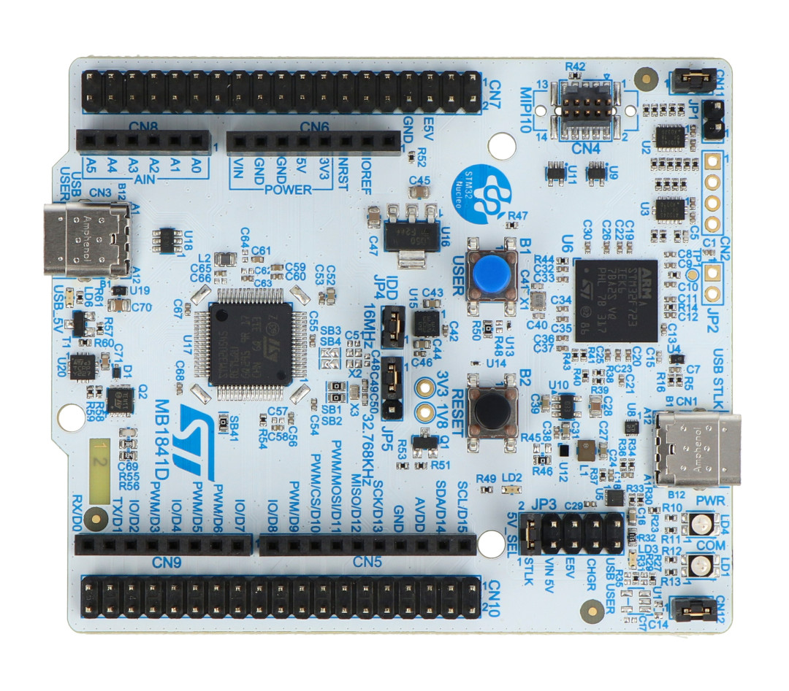
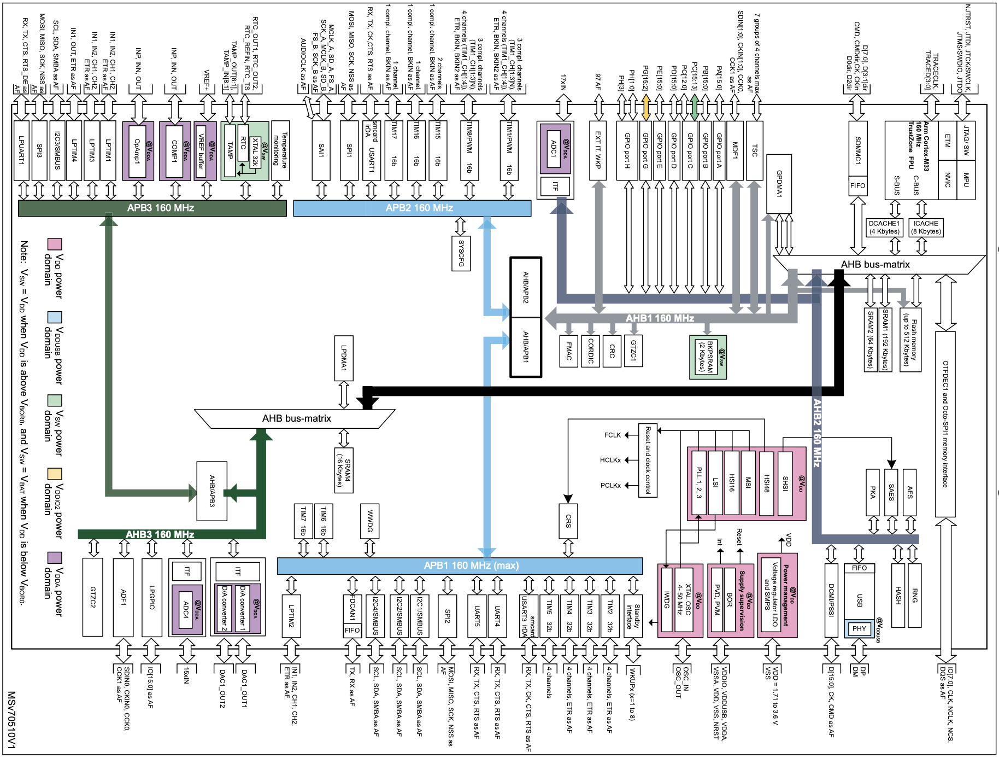
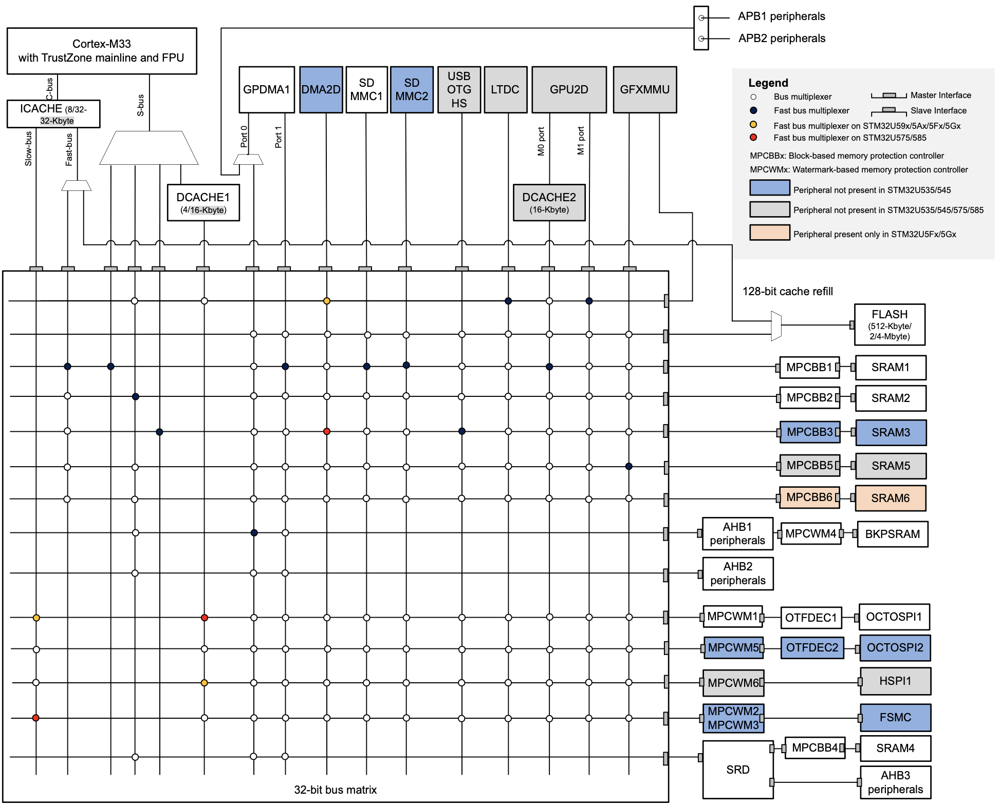
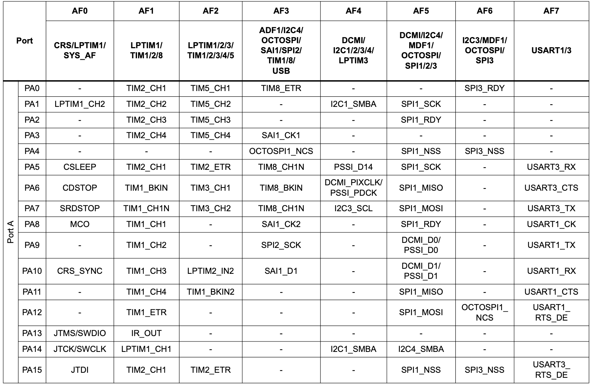
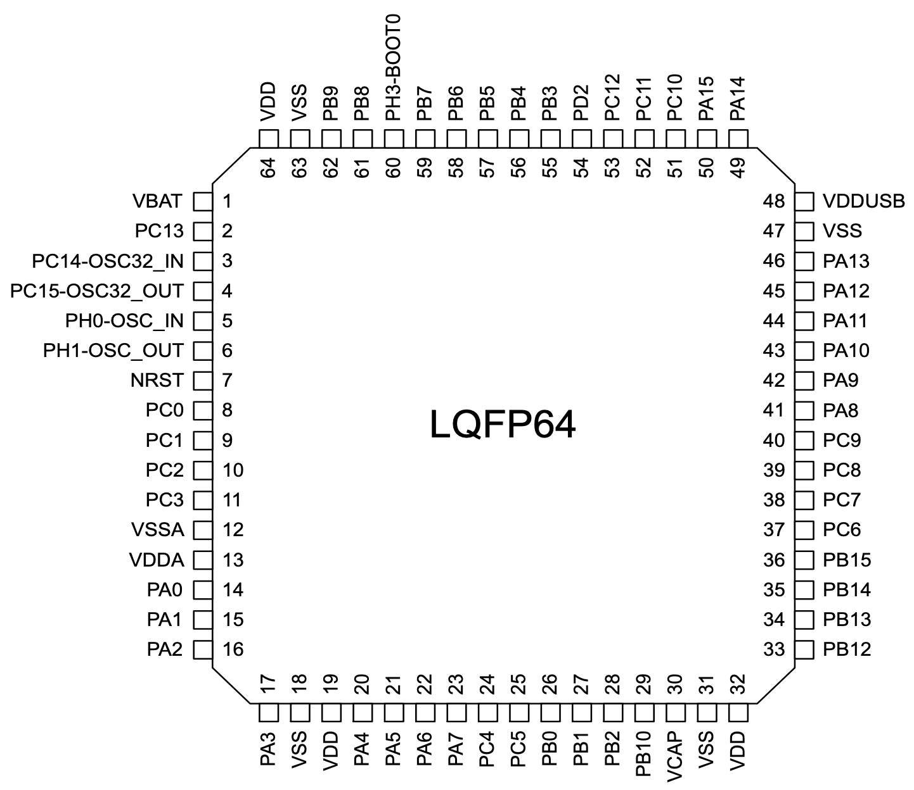

# STM32U545RETQ
ARM Cortex-M33, built by STMicroelectronics

---

# Bibliography
for this section

<!-- ToDoDanut: update pt 
https://ro.mouser.com/ProductDetail/STMicroelectronics/NUCLEO-U545RE-Q?qs=mELouGlnn3cp3Tn45zRmFA%3D%3D
with  
STM32U545RET6Q -->

**STMicroelectronics**, *[STM32U5 Series based on Arm®-based 32-bit MCUs](https://www.st.com/resource/en/reference_manual/rm0456-stm32u5-series-armbased-32bit-mcus-stmicroelectronics.pdf)*

- Chapter 2 - *Memory and bus architecture*

**STMicroelectronics**, *[Ultra-low-power Arm® Cortex®-M33 MCU+TrustZone®+FPU, 240 DMIPS, 512 KB flash memory, 274 KB SRAM, crypto](https://www.st.com/resource/en/datasheet/stm32u545re.pdf)*

- Chapter 2 - *"Description"*
- Chapter 4 - *"Pinout, pin description, and alternate function"*

---
layout: two-cols
---

# STM32U545RETQ
the MCU

| | |
|-|-|
| Vendor | STMicrocontrollers |
| Variant | ARM Cortex-M33 |
| ISA | ARMv8-M |
| Cores | 1 |
| Word | 32 bit |
| Frequency | up to 160 MHz |
| RAM | 274 KB |
| Storage | 512 KB |

::right::

# Boards
that use STM32U545RETQ

### NUCLEO-U545RE-Q

---
layout: two-cols
---

# The Chip

<!--  -->

<!-- *GPIO*: General Purpose Input/Output\
*SWD*: Debug Protocol\
*GPDMA*: General Purpose Direct Memory Access -->

<!-- [Datasheet RP2350](https://datasheets.raspberrypi.com/rp2350/rp2350-datasheet.pdf) -->

::right::

## Peripherals

|  |  |
|------|-------------|
| PWM | Pulse Width Modulation |
| ADC | Analog to Digital Converter |
| SPI | Serial Peripheral Interface |
| UART | Universal Async. Receiver/Transmitter |
| RTC | Real Time Clock |
| I2C | Inter-Integrated Circuit |
| GPIO | General Purpose Input Output |

---
layout: two-cols
---

# Pins
have multiple functions

...

::right::

---

# The Bus
that interconnects the core with the peripherals

