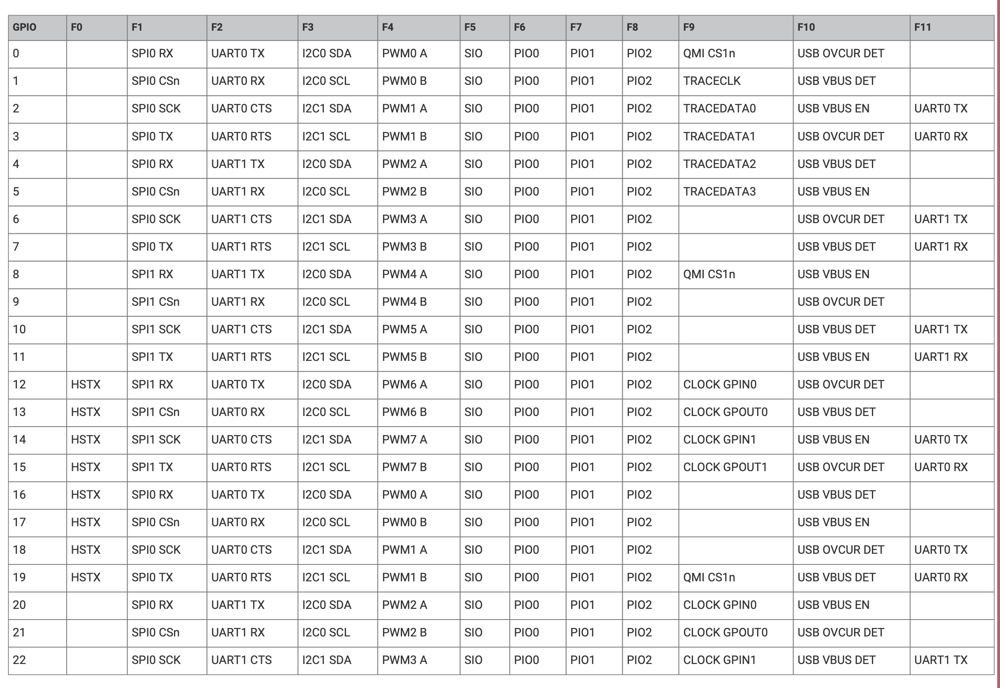

# STM32U545RE
ARM Cortex-M33, built by STMicroelectronics

---

# Bibliography
for this section

**STMicroelectronics**, *[STM32U5 Reference Manual](https://www.st.com/resource/en/reference_manual/rm0456-stm32u5-series-armbased-32bit-mcus-stmicroelectronics.pdf)*
   - Chapter 2 - *Memory and bus architecture*
     - Section 2.1 - *System architecture*

**STMicroelectronics**, *[STM32U5 Datasheet](https://www.st.com/resource/en/datasheet/stm32u545re.pdf)*
  - Chapter 2 - *"Description"*
  - Chapter 4 - *"Pinout, pin description, and alternate function"*

---
layout: two-cols
---

# STM32U545RE
the MCU

| | |
|-|-|
| Vendor | STMicroelectronics |
| Variant | ARM Cortex-M33 |
| ISA | ARMv8-M |
| Cores | 1 |
| Word | 32 bit |
| Frequency | up to 160 MHz |
| RAM | 272 KB |
| Storage | 512 KB |

::right::

# Board
that use STM32U545RE

### Nucleo U545RE-Q

 

---
layout: two-cols
---

# The Chip

::right::

## Peripherals

[Datasheet STM32U545RE](https://www.st.com/resource/en/datasheet/stm32u545re.pdf)

---
layout: two-cols
---

# Pins
have multiple functions

...

::right::

---
---

# The Bus
that interconnects the core with the peripherals

    

