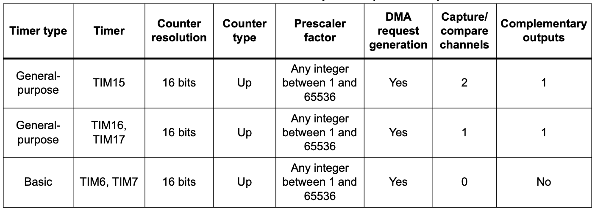

# Timers

---
---
# Bibliography
for this section

**STMicroelectronics**, *[STM32U5 Series based on Arm®-based 32-bit MCUs](https://www.st.com/resource/en/reference_manual/rm0456-stm32u5-series-armbased-32bit-mcus-stmicroelectronics.pdf)*

- Chapter 11 - *Reset and clock control (RCC)*
  - Subchapter 4 - *RCC clock functional description*
- Chapter 54 - *Advanced-control timers (TIM1/TIM8)*
- Chapter 55 - *General-purpose timers (TIM2/TIM3/TIM4/TIM5)*
- Chapter 56 - *General-purpose timers (TIM15/TIM16/TIM17)*
- Chapter 57 - *Basic timers (TIM6/TIM7)*

**STMicroelectronics**, *[Ultra-low-power Arm® Cortex®-M33 MCU+TrustZone®+FPU, 240 DMIPS, 512 KB flash memory, 274 KB SRAM, crypto](https://www.st.com/resource/en/datasheet/stm32u545re.pdf)*

- Chapter 3 - *Functional overview*
  - Subchapter 11 - *Reset and clock controller (RCC)*
  - Subchapter 39 - *Timers and watchdogs*

---
layout: two-cols
---
# Clocks

all peripherals and the MCU use a clock to execute at certain intervals

| Source | Usage |
|-|-|
| *LSE, LSE32 and HSE* | oscillators based on crystals external crystals |
| *LSI*, *HSI*, *HSI48*, *MSIS* and *MSIK* | Internal RC oscillators which can be used as main clock source or as a clock source for peripherals |

Embassy initializes the STM32U545RE with the clock source from Multi-Speed Internal oscillator (**MSIS**).

```rust
let p = embassy_rp::init(Default::default());
```

:: right ::

<div align="center">
<!--  -->

</div>

---
---
# Frequency divider
stabilizing the signal and adjusting it

1. divides down the clock signals used for the timer, giving reduced overflow rates
2. allows the timer to be clocked at a user desired rate

<div align="center">


</div>

---
layout: two-cols
---
# Counter
increments a register at every clock cycle

| Registers | Description |
|-----------|-------------|
| `value` | the current value of the counter |
| `direction` | set to count UP or DOWN |
| `reset` | UP: the value at which the counter resets to `0` DOWN: the value to which the counter resets after getting to `0`  |

<style>
.two-columns {
    grid-template-columns: 2fr 3fr;
}
</style>

:: right ::

<div align="center">

</div>

---
layout: two-cols
---
# SysTick
ARM Cortex-M time counter


<v-clicks>

- decrements the value of `SYST_CVR` every μs
- when `SYST_CVR` becomes `0`:
  - triggers the `SysTick` exception
  - next clock cycle sets the value of `SYST_CVR` to `SYST_RVR`
- `SYST_CALIB` is the value of `SYST_RVR` for a 10ms interval (might not be available)

</v-clicks>

:: right ::

### `SYST_CSR` register


<v-click>
$$
f = \frac{1}{SYST{\_}RVR} * 1,000,000 [Hz]_{SI}
$$
</v-click>

---
layout: two-cols
---

# SysTick
ARM Cortex-M peripheral


```rust{1,7,8|2,9|3,10,11|all}
const SYST_RVR: *mut u32 = 0xe000_e014 as *mut u32;
const SYST_CVR: *mut u32 = 0xe000_e018 as *mut u32;
const SYST_CSR: *mut u32 = 0xe000_e010 as *mut u32;

// fire systick every 5 seconds
let interval: u32 = 5_000_000;
unsafe {
    write_volatile(SYST_RVR, interval);
    write_volatile(SYST_CVR, 0);
    // set fields `ENABLE` and `TICKINT`
    write_volatile(SYST_CSR, 0b11);
}
```

:: right ::

### `SYST_CSR` register


### Register `SysTick`  handler

```rust
#[exception]
unsafe fn SysTick() { 
    /* systick fired */ 
}
```

---
layout: two-cols
---
# Alarm
counter that triggers interrupts after a time interval

| Registers | Description |
|-----------|-------------|
| `value` | the current value of the counter |
| `direction` | set to count UP or DOWN |
| `reset` | UP: max value before `0` DOWN: value after `0`  |
| `alarm_x` | when `value` == `alarm_x`, triggers an interrupt, `x` in `1` .. `n` |

<style>
.two-columns {
    grid-template-columns: 2fr 3fr;
}
</style>

:: right ::

<div align="center">

</div>

---

# STM32U5's Timers
11 timers, and 4 low power timers

<div grid="~ cols-2 gap-5">

<div>

- four 32-bit timers, seven 16-bit timers
- four low power 16-bit timers
- configurable counting directions
- flexible prescalers
- PWM generation

</div>

<div align="center">


</div>

</div>


---
layout: two-cols
---

# STM32U5's TIM1
read the number of elapsed ticks since start

#### Reading the time elapsed since restart

```rust {1,5|2,6|4,7,8|all}
const TIMERLR: *const u32 = 0x400b_000c;
const TIMERHR: *const u32 = 0x400b_0008;

let time: u64 = unsafe {
    let low = read_volatile(TIMERLR);
    let high = read_volatile(TIMERHR);
    high as u64 << 32 | low
}
```

<!-- The **reading order maters** as reading `TIMELR` latches the value in `TIMEHR` (stops being updated) until `TIMEHR` is read. Works only in **single core**. -->

:: right ::

<div align="center">

</div>

---
layout: two-cols
---

# Alarm
triggering an interrupt at an interval


```rust{1,2|4,11,12|5,13,14|6,15,16|7,17,18|8,19,20|all}
#[interrupt]
unsafe fn TIM1_UP() { /* alarm fired */ }

const TIM1_PSC: *const u32 = 0x40012c28;
const TIM1_ARR: *const u32 = 0x40012c2c;
const TIM1_EGR: *const u32 = 0x40012c14;
const TIM1_DIER: *const u32 = 0x40012c0c;
const TIM1_CR1: *const u32 = 0x40012c00;

unsafe {
    // 4 MHZ / (3999 + 1) = 1kHz
    write_volatile(TIM1_PSC, 3999);
    // 3000 ticks @ 1kHz -> 3s
    write_volatile(TIM1_ARR, 2999);
    // Update ARR event
    write_volatile(TIM1_EGR, 1);
    // Enable interrupt
    write_volatile(TIM1_DIER, 1);
    // Enable Timer
    write_volatile(TIM1_EGR, 1);
}
```

<!-- - the alarm can be set only for the lower 32 bits
- maximum 72 minutes (use *RTC* for longer alarms) -->

:: right ::

<div align="center">

</div>
