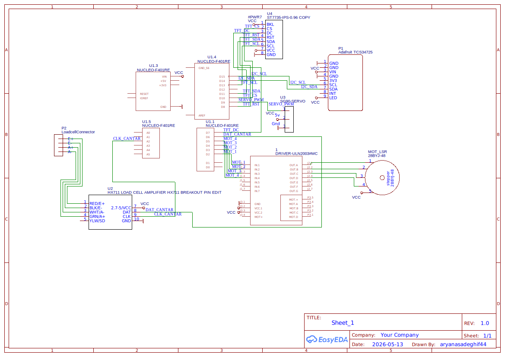

# Automated Optical Sorting System

An automated system designed to identify and sort objects based on their optical properties using an STM32 microcontroller.

## Info
* **Author:** Ariana Sadeghi
* **GitHub Project Link:** https://github.com/arianasadeghi/website

## Description
The project consists of an industrial-style sorting line that uses a photoresistor to detect the opacity/reflection of objects. Based on the sensor data, a mechanical arm (servomotor) sorts the items, while a stepper motor drives the conveyor belt.

## Motivation
I chose this project to explore the integration of analog sensors (ADC) with precise motor control (PWM and Stepper sequences) in a real-time automation scenario.

## Architecture
### Main Components
* **Sensing Module:** Photoresistor and ADC processing.
* **Control Logic:** Decision-making state machine.
* **Actuation Module:** Stepper motor driver and Servomotor control.
* **User Interface:** LCD display via SPI.

### Connection Diagram

## Log
### Week 5 - 11 May
* Project idea selection and hardware requirements gathering.
* Basic component testing (Stepper and Servo motors).

### Week 12 - 18 May
* [To be completed]

### Week 19 - 25 May
* [To be completed]

## Hardware
The system is built on an **STM32 Nucleo-U545RE-Q** board. It uses a **PMIMA V2.0 Shield** for the photoresistor and LCD. The movement is handled by a **28BYJ-48 Stepper Motor** (with ULN2003) and an **SG90 Servomotor**.

## Schematics
*[To be added upon finalization of the electronic circuit detailed design]*

## Bill of Materials
| Device | Usage | Price |
|:--- |:--- |:--- |
| **STM32 Nucleo-U545RE-Q** | Main Microcontroller | - |
| **PMIMA V2.0 Shield** | UI & Sensors | - |
| **28BYJ-48 Stepper** | Conveyor movement | - |
| **SG90 Servomotor** | Sorting Arm | - |

## Software
### High-Level Logic
The software is currently in the prototyping phase, following these stages:
1. **Movement:** Stepper motor runs at constant speed (GPIO sequences).
2. **Detection:** Continuous polling of the **ADC** value from the photoresistor.
3. **Decision:** Comparing ADC values against a preset **threshold** to identify objects.
4. **Action:** Activating the **PWM** signal to move the Servo arm based on the detection result.

### Libraries and Drivers
| Library | Description | Usage |
|:--- |:--- |:--- |
| **STM32 HAL / Rust PAC** | Hardware Abstraction | Peripheral control (ADC, PWM, SPI) |
| **Embedded-Graphics** | Graphics Library | Drawing UI elements on the LCD |

## Links
* [STM32 Documentation](https://www.st.com/)
* [Lab Materials](https://pmi.acs.pub.ro/)
