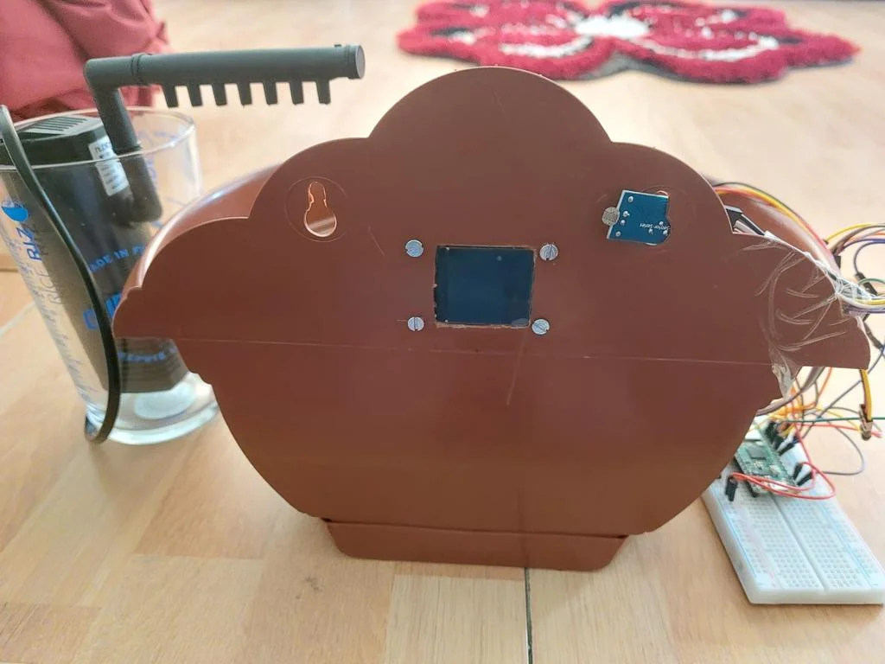
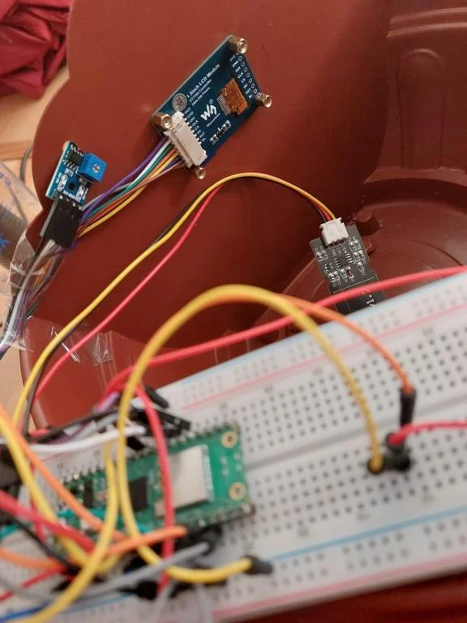
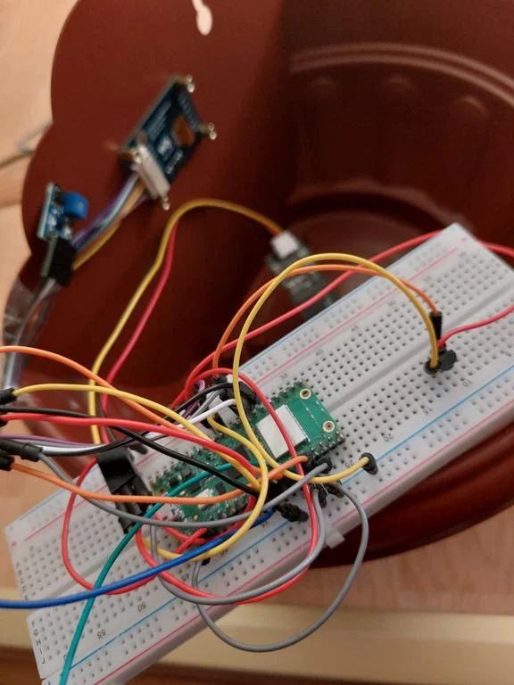
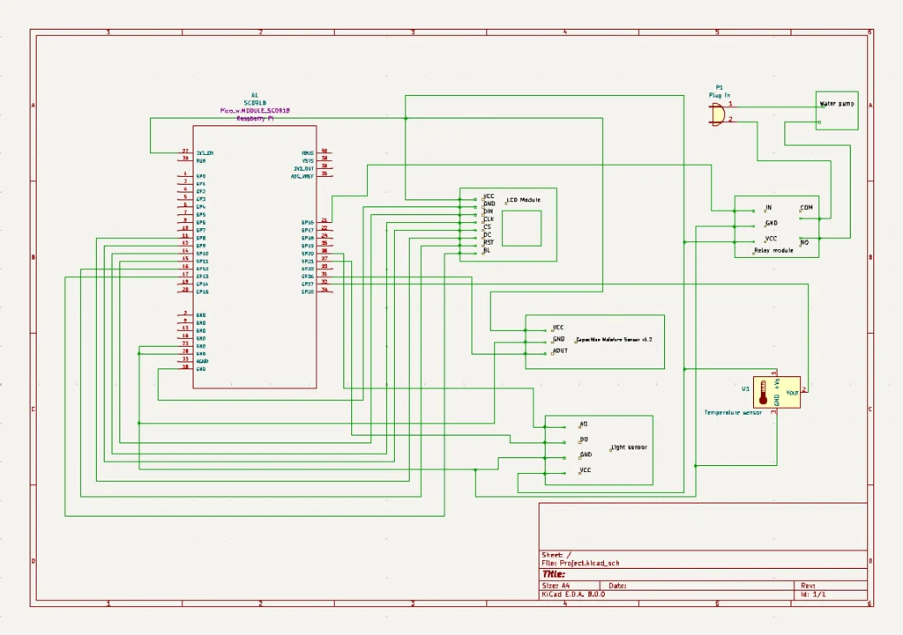

# FloraMood Smart Pot
A smart emotional pot with automated watering system
:::info 

**Author**: Ana-Maria Comeaga \
**GitHub Project Link**: https://github.com/UPB-FILS-MA/project-anamaria2004

:::

## Description

The smart flower pot that will be implemented is verifying the basic parameters of a plant, such as temperature, light or humidity, through sensors, which can evoke six distinct emotions to convey the well-being of the flower:
    -Thirsty: when the soil moisture is insufficient, signaling the need for water;
    -Hot: when the plant is experiencing high temperatures;
    -Freeze: when the temperature drops too low;
    -Sleepy: indicates low light exposure;
    -Savory: shows the satisfaction of the flower, after receiving water;
    -Happy: when al the conditions are satisfied.
The proposed design of the pot has also an automatic watering system, that helps the plant to keep its humidity under control. This system is based on lower consumption, because it is working only when the humidity level goes under the threshold and after givinig the necessary ammount of water, it stops.

## Motivation

Nowadays, growing a plant can be difficult, because most of its specific necessities are not easily observed. A smart pot provides an efficient care of plants by automating some maintenance aspects, like watering, soil moisture, and light exposure. This approach can be particularly appealing for individuals who have busy schedules or lack experience in plant care.
On the other hand, taking into consideration the growth of concerns about the environmental sustainability and conservation, a smart pot is a good way of promoting responsible plan care practices. Through the optimization of resource usage and minimization of waste, this project aligns with the goal of reducing the environmental impact and helping the nature.

## Architecture 

The FloraMood Smart Pot is powered up by a battery. Then, it collects the parameters from the sensors, like humidity, temperature, and light. Based on them and on their thresholds, a specific emoji is displyed on the LCD Module, in order to transmit the state in which the plant is on that moment. The watering system is using a simple water pump with a gear, that automatically powers up when the humidity level is under the set threshold and stops after giving the plant the necessary ammount of water, and the humidity level comes back in its normal range.


The diagram depicts the functioning of FloraMood Smart Pot. Here is a breakdown of its components:

1) FloraMood Smart Pot: The central element is the pink FloraMood Smart Pot. It is a smart plant pot designed to take care of plants using various sensors and modules.
2) Moisture Sensor: Connected to the pot, the Moisture Sensor reads the soil humidity. It helps determine whether the soil is too dry or adequately moist for the plant.
3) Temperature Sensor: Another connected component, the Temperature Sensor measures the ambient temperature. This information is crucial for understanding the plant's environment.
4) Light Sensor: The Light Sensor reads light parameters. It detects the intensity and duration of light exposure, which affects plant growth and health.
5) LCD Module: The pot features an LCD Module that displays specific emojis based on the plant's needs. These emojis likely represent different conditions (e.g., happy, sad, thirsty) to guide the user in caring for the plant.
6) Battery: The system is powered by a battery, ensuring continuous operation of the sensors and display.
7) Watering Pump with Gear: When necessary, the system activates a watering pump with gear to water the plant. This ensures that the plant receives adequate hydration.
Overall, the FloraMood Smart Pot combines technology and plant care to create an intelligent and interactive gardening experience.

<!-- 
 -->

## Log

<!-- write every week your progress here -->

### Week 6 - 12 May
In this week I searched for the remaining components and draw the schematics. The schematic contains all the necessary components for the system and the connections between them. I purchased the pot, cut for placing the display inside it and fixing on the pot's wall. 
Also, I searched what each component needs to function properly, to ensure that the connections will be fine and none of them will be distroyed when I make the actual connections. This was very useful and helped me in the understanding of their working process. 

### Week 7 - 19 May
I made the connections between the sensors and the Raspberry Pi Pico and placed all the wires properly. I created a general view of the entire system and made the ajustations to look good. I put the sensors in thier final place and tried to hide the wires as much as possible.
I discovered how the water pump should be modified in order to be controlled from the Pico and based on humidity sensor. I made a part of the necessary modification into its internal part, but still needs to be linked to a relay module. 

### Week 20 - 26 May
This week I made the necessary small changes in pins and write the entire cod for making the project functional. I connected the relay and set it for managing efficiently the water pump. I made the display to show frames and look like a gif. Made the final adjustments in all the wires and connections, set the code to work properly for all the components. So, the project is done is FloraMood is alive. 

## Hardware

The main hardware components are the Raspberry Pi Pico and the sensors. The Raspberry Pi Pico is designed for low power consumption, assuring a better approach into the efficiency of the system. It also offers flexibility and versatility for interfacing with various sensors, actuators, and peripherals. The capacitive soil moisture sensor is used for detecting the soil moisture levels, utilizing capacitive sensing. Its resistance to corrosion is due to its construction material, ensuring an extended lifespan. The temperature sensor is sensing the temperature and the LDR module is used for detecting the intensity of light. 
The aquarium pump is used for the watering system, together with the gear for it, in order to increase the voltage to 12V, and the batteries, to power up the system. 

This is the general view of the FloraMood smart pot.


Here are the connections with the sensors and the placement inside and outside the pot.







### Schematics

This is the Kicad schematic with the connection of all components.



### Bill of Materials

<!-- Fill out this table with all the hardware components that you might need.

The format is 
```
| [Device](link://to/device) | This is used ... | [price](link://to/store) |

```

-->

| Device | Usage | Price |
|--------|--------|-------|
| [Rapspberry Pi Pico W](https://www.raspberrypi.com/documentation/microcontrollers/raspberry-pi-pico.html) | The microcontroller | [35 RON](https://www.optimusdigital.ro/en/raspberry-pi-boards/12394-raspberry-pi-pico-w.html) |
| LCD Module | Display | [48.37 RON](https://www.emag.ro/ecran-lcd-waveshare-ips-1-3-240x240-albastru-1-3inchlcdmodulewaveshare15867/pd/D7RQPRMBM/?cmpid=93116&utm_source=google&utm_medium=cpc&utm_campaign=(RO:eMAG!)_3P_NO_SALES_%3e_Jucarii_hobby&utm_content=111476631565&gad_source=1&gclid=Cj0KCQjwn7mwBhCiARIsAGoxjaLPD47M7AdaIlEiCpBWKimTd5FUsanyEx8hUfow0ChDiVzU7DTjZesaAvtNEALw_wcB) |
| Moisture Sensor | Sensors | [39.68 RON](https://www.amazon.com/Gikfun-Capacitive-Corrosion-Resistant-Detection/dp/B07H3P1NRM) |
| LM35 Temperatures sensor | Sensors | [41.15 RON](https://www.amazon.com/Bridgold-Analogue-Precision-Centigrade-Temperature/dp/B07Y7FCZYB/ref=sr_1_2?crid=2TMQ4HJ1IT2Q&dib=eyJ2IjoiMSJ9.MNnMtd5SYr7z5jccMj60bAXoMYJ4sfZ6OYq_F0LszMofSemqev-w2xZMKYA0e6N0KadAHd8U8VDtITGRjD_le3dwycfczX_ynIJhOrm2oEFVzHr-KOG21LrluA2TZNU3be3rZPwAIYr4e2dTzpNR4NV7cLMC2Rbq4xsYGLae-sl5K1x8S-a3LnTtxz2Zw-4H6KxbzHg0-486MO9XSCV1NSly5CMxJH8dkgsGkzsnFoI.vGSiYy6wGiT3pKwLKKIbcDWqyvhqpsO9d9E5ymXKggY&dib_tag=se&keywords=Temperature+Sensor+LM35&qid=1712242605&sprefix=temperature+sensor+lm35%2Caps%2C169&sr=8-2) |
| LDR module | Sensors | [45.68 RON](https://www.amazon.com/DIYables-Sensor-Arduino-ESP8266-Raspberry/dp/B0CF5443Q2/ref=sr_1_3?crid=2W3K10NO0PE8V&dib=eyJ2IjoiMSJ9.MKkJMf3w8Amn_KZWbPiJmJHy5bgDdmdACneXpivQfSuJplZyBdJnAtYON9NUSEZGQumLeomjTgr0bc-qLrWYtTcgRHSYWgkVXA9rASzOV2VTNtzxMi2KcJWAr38j9rJCnh3UPnbVKveJJA1YX5ggwX5eaSHm5DCYuUQZ6ab11a-qtY7IeUltMJCVkfWVp2TuSHqoRVzvEB80CneqGPP93h3RsDtr1F0h1JAfxMKGb2o.k5zyHMysZrcbvempCk3dBsFgz4BQ-F-dVXaQrS-gFHs&dib_tag=se&keywords=LDR%2BLight%2BSensor%2BModule&qid=1712242764&sprefix=ldr%2Blight%2Bsensor%2Bmodule%2Caps%2C174&sr=8-3&th=1) |
| ADS115 ADC | Amplifier | [36.18 RON](https://www.sigmanortec.ro/modul-convertor-analogic-la-digital-adc-ads1115-16-biti?gad_source=1&gclid=Cj0KCQjwn7mwBhCiARIsAGoxjaJT37ruAGUgfiMOCpUW5X7Br_bSpmRLQyh1XFdPNQiv-0FqZjr_WeAaAtfeEALw_wcB) |
| 5V 2A adapter | Adapter | [48.72 RON](https://www.emag.ro/incarcator-pentru-nivela-laser-hilda-universal-tensiune-5v-curent-2a-5-5-x-2-5-mm-adaptor-alimentare-220v-6349/pd/DCJBSQMBM/?cmpid=101141&utm_source=google&utm_medium=cpc&utm_campaign=(RO:Whoop!)_3P-Y_%3e_Scule_electrice_and_Unelte&utm_content=82270122928&gad_source=1&gclid=Cj0KCQjwn7mwBhCiARIsAGoxjaL-zw6m7r1ImGxgFPLZ4aIl7b94yy3DjX_SSPFWABREixY9KfLn5SkaAqZXEALw_wcB) |
| Micro USB Breadboard 5V Power Supply Module | Power Supply | [1.50 RON](https://cleste.ro/modul-alimentare-5v-micro-usb.html?utm_medium=GoogleAds&utm_campaign=&utm_source=&gad_source=1&gclid=Cj0KCQjwn7mwBhCiARIsAGoxjaI92As6Cx0y3WUm-b6heH19tuHWJqejoDrJV4l1LMAQLVLf7T4gvMsaAvLPEALw_wcB ) |
| 5m 30AWG Silicone wires | Connections | [19.50 RON](https://www.emag.ro/cablu-siliconic-ultraflexibil-14awg-bifilar-paralel-rosu-negru-cp14awg/pd/D1F6NPYBM/?cmpid=101180&utm_source=google&utm_medium=cpc&utm_campaign=(RO:eMAG!)_3P_NO_SALES_%3e_Iluminat_and_electrice&utm_content=76376892625&gad_source=1&gclid=Cj0KCQjwn7mwBhCiARIsAGoxjaLcDtf57lmj_iKgRz8embK0GAJY_Yc9ChU55L_7D7wNrAMA6JexHKgaAmeeEALw_wcB) |
| Perforated board | Board | [75.42 RON](https://www.amazon.com/Double-Sided-Universal-Packs-12x18/dp/B08WJBX98F/ref=sr_1_2?crid=1389XD9ISH6EM&dib=eyJ2IjoiMSJ9.WsT-bgUR7rApIplnTIF8yABGZYgww0JAoqa8-54l1TNR355lFtbswumX6EjLYdIOuB_SDprsUzDVMyCV5Sf3ndWkgS4XmhOP8HSoGdqktLGlJqg9Kh14NEdeJAT_JswO9_-zVhuHUjgOttFwD51niWmp1Ki8zQtB2HBQBP7-cPFg__v6N7uQ8rY8OwfxeY_ksj0Y3gb3BFI9VtQ0sBsLcDSK-MZGQrwlJe_i-XfpMM4.4ACAhff_DsTRrHhx7lc8inTj4yOSTxPrQVeq5I2V4hs&dib_tag=se&keywords=12%2Bx%2B18%2Bcm%2BUniversal%2BPCB%2BPrototype%2BBoard%2BDouble-Side&qid=1712244151&sprefix=12%2Bx%2B18%2Bcm%2Buniversal%2Bpcb%2Bprototype%2Bboard%2Bdouble-side%2Caps%2C329&sr=8-2&th=1) |
| Watering Pump | Watering the system | [26.13 RON](https://www.emag.ro/pompa-de-apa-kruger-meier-sturmkraft-220jk-x1-220l-h-3-8-x-3-7-x-2-8-cm-negru-5903900042987/pd/DTFJ05MBM/?X-Search-Id=7b217b870d8e7e7ff1d5&X-Product-Id=113031364&X-Search-Page=1&X-Search-Position=32&X-Section=search&X-MB=0&X-Search-Action=view) |


## Software

| Library | Description | Usage |
|---------|-------------|-------|
| [st7789](https://github.com/almindor/st7789) | Display driver for ST7789 | Used for the display for the Pico Explorer Base |
| [embedded-graphics](https://github.com/embedded-graphics/embedded-graphics) | 2D graphics library | Used for drawing to the display |
| [core](https://github.com/embassy-rs/embassy) | Provides core types and traits  |  Define asynchronous tasks, spawn futures, and manage asynchronous execution  |
| [embedded_hal](https://github.com/embassy-rs/embassy) | Hardware abstraction layer for embedded systems | Used for abstracting hardware interactions |
| [embassy_rp](https://github.com/embassy-rs/embassy) | Provides abstractions and APIs|  Communicate via UART, SPI, and I2C using their respective modules |
| [embassy_time](https://github.com/embassy-rs/embassy) | Provides time-related functionality | Schedule tasks to run at specific times |
| [embassy_executor](https://github.com/embassy-rs/embassy) | Provides an executor for running asynchronous tasks concurrently | Execute asynchronous tasks concurrently  |
| [embassy_sync](https://github.com/embassy-rs/embassy) |Provides synchronization primitives | Create mutexes, semaphores, and barriers for coordinating access to shared resources |

## Links

<!-- Add a few links that inspired you and that you think you will use for your project -->

1. [Plant into Pet](https://www.instructables.com/Fyt%C3%B3-Turn-Your-Plant-Into-Pet/)
2. [Garden System](https://ocw.cs.pub.ro/courses/pm/prj2022/cristip/indoorgardensystem)
3. [Smart Plant Watering](https://www.youtube.com/watch?v=_NTW0npN4N0)
4. [Pico Plant Waterer](https://www.raspberrypi.com/news/pico-plant-waterer/)
