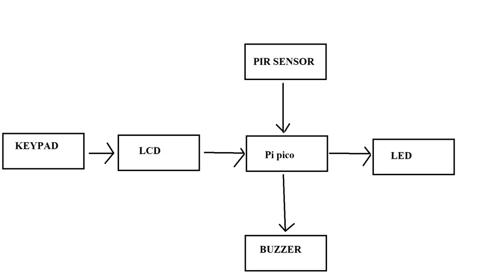
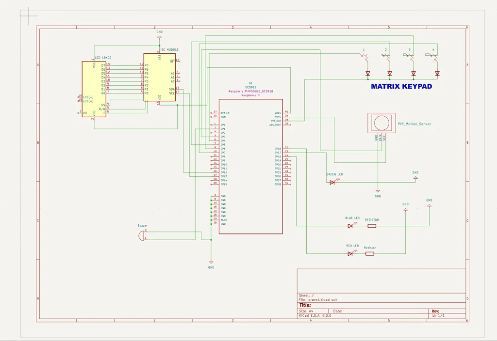
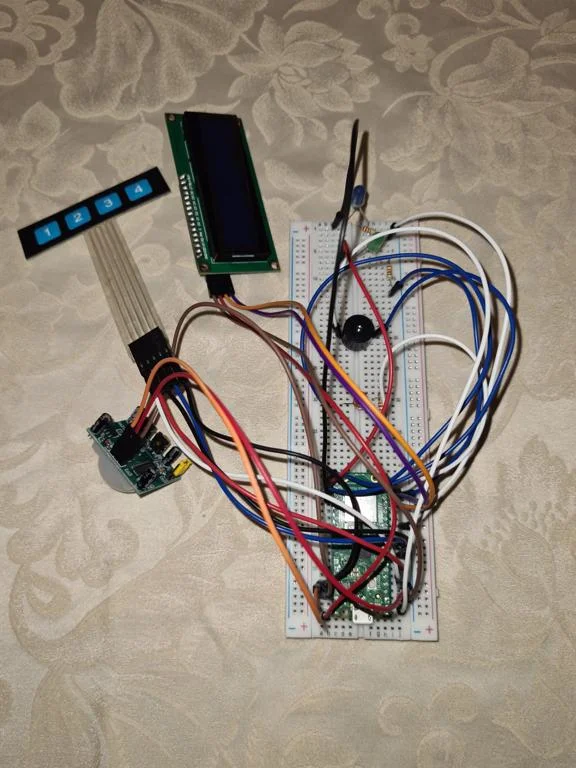
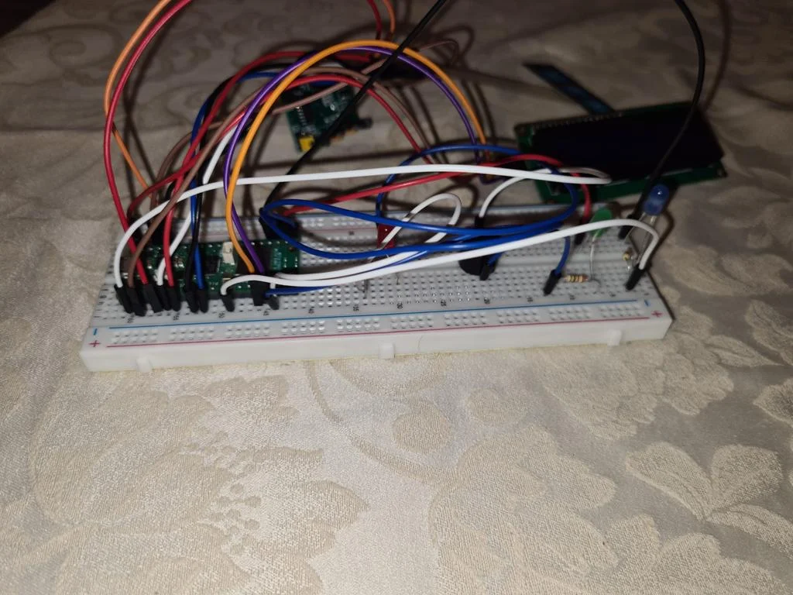
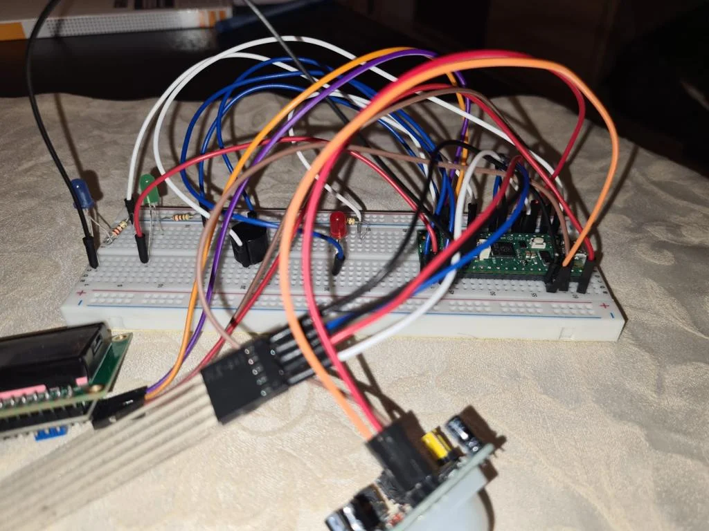
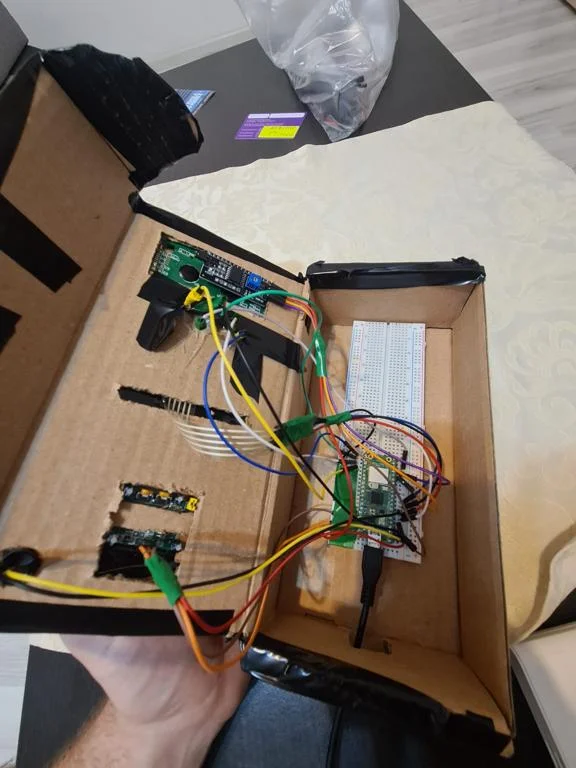
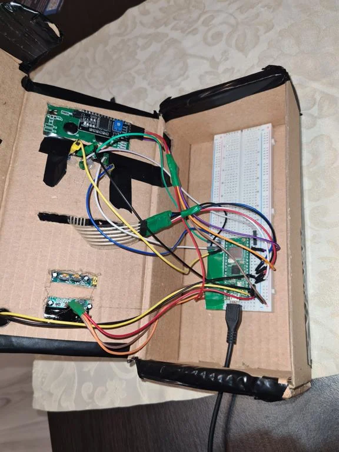
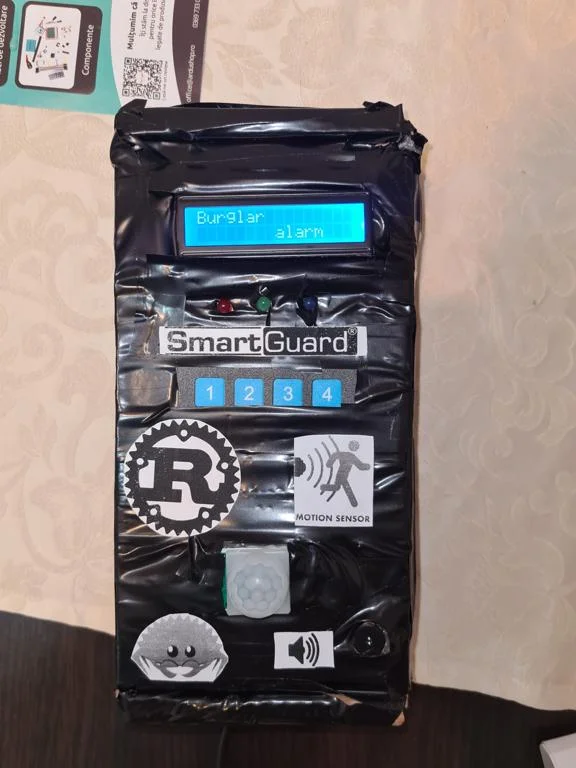
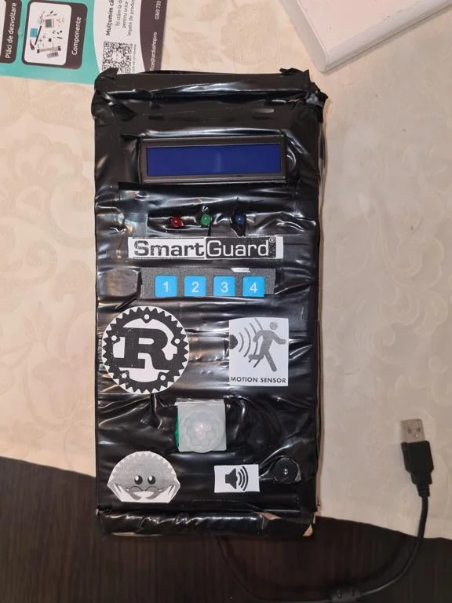

# SmartGuard: Raspberry Pi Pico W Burglar Alarm System

 Raspberry Pi Pico W-powered Smart Burglar Alarm System with Multi-Sensor Detection.
 
:::info 

**Author**: RATA MIRCEA-ANDREI \
**GitHub Project Link**: https://github.com/UPB-FILS-MA/project-MirceaAndrei/tree/main

:::

## Description

This project provides an opportunity to develop a smart alarm system tailored to modern security requirements. It offers a practical and efficient solution to detect intruders with advanced technology. Its compact, user-friendly design allows for seamless implementation in a wide range of environments, providing enhanced safety and peace of mind. Moreover,it has user-friendly interface where you can set custom security keys
 
# How it works:

For this project, we have developed a comprehensive alarm system utilizing a range of hardware components to enhance security and convenience. At the core of this system is the Raspberry Pi Pico W, which serves as the central controller and processor.

The system is equipped with a Passive Infrared (PIR) sensor, which is designed to detect motion in its vicinity. When the PIR sensor registers movement, it triggers an immediate response from the system: LEDs and a buzzer are activated, alerting those nearby of potential activity. 

Additionally, the system includes a keypad and an LCD screen. Once motion is detected and the alarm is activated, the person present must input the correct password into the keypad to deactivate the alarm. The password prompt is displayed on the LCD screen for easy reference, ensuring a seamless user experience and an added layer of security.Once the whole project starts, it displays on the LCD screen some information for configuration of the alarm. It takes like 8 seconds to initialize, then it will show you what to do to set this system. Basically once started, the user can self-input a custom password, and when motion is detected, it guides you to enter the password and disarm the alarm for a few seconds, enough time if you are the owner and not the intruder :), then it starts again. Additionally, a game of lights is starting when it checks if the password is correct. If the password is correct, after the game of lights,a small music will start for 3 seconds , and the green LED will remain on until it finish writing the messages on the LCD. After, the alarm is again initialized. It also has another function, if you enter the wrong password 3 times, you will need to wait an additional 5 seconds before entering it again. Also, if the password is wrong, after the game of lights, the red LED will remain on.

This combination of hardware and functionality results in a sophisticated yet user-friendly alarm system that offers reliable security for a variety of settings. It provides users with real-time alerts and control over the system, making it a valuable asset for safeguarding properties and ensuring peace of mind.


## Motivation

The motivation behind this project stems from a desire to enhance home and property security by leveraging modern technology. Traditional alarm systems can be costly and complex to install, often requiring professional services. In contrast, this project offers an opportunity to create an affordable and customizable smart alarm system using a Raspberry Pi Pico W and a range of hardware components.

## Architecture 



## Log

<!-- write every week your progress here -->

### 8-12.04
    I choose the concept and the main ideas for this project.
### 15-19.04
    I found all the hardware parts and everything that i need and i proceed a order.

### 26.04-3.05
    I already learned how it should work, and I am still at the hardware part, at all the connection and everything. I try to make them work
    
### 6.05-10.05
    I manage to do all the hardware part and finished soldering all the parts.
    
### 13.05-17.05
    I am  the software part,with small steps trying to learn how to do it.
    I'm still trying to improve as mush as I can, and find new ideas to implement for this project.
    
### 20.04-25.04
    I finished everything on the project,the software milestone and also the design and fix all the errors.

## Hardware

The hardware includes a Raspberry Pi Pico W for control, a PIR sensor for motion detection, LEDs for visual alerts, a buzzer for audio alerts, an LCD screen for display, and a keypad for user input and password authentication.
- **Raspberry Pi Pico W** is the microcontroller,the brain of this project.
- **Passive Infrared (PIR) sensor**  is used to detect movement.
- **LEDs** are used to provide visual alerts when motion is detected.
    I am am the software part,with small steps trying to learn how to do it.

## Hardware

The hardware includes a Raspberry Pi Pico W for control, a PIR sensor for motion detection, an LED for visual alerts, a buzzer for audio alerts, an LCD screen for display, and a keypad for user input and password authentication.
- **Raspberry Pi Pico W** is the microcontroller,the brain of this project.
- **Passive Infrared (PIR) sensor**  is used to detect movement.
- **LED** is used to provide visual alerts when motion is detected.
- **Passive Buzzer** is used for making sound when the alarm is triggered.
- **LCD with I2C MODULE** is used for displaying the information on lcd.
- **Matrix keypad** allows users to input a password for authentication and disarm the alarm system.
- **Breadboard** is used for connecting every pin of the hardware components.

### Schematics
**For the KiCad I connected the hardware as following :**
  <p>
<em><em class="u">LCD i2c</em></em>: 
</p>
<pre class="code">      
      VCC to pin VBUS
      GND to pin GND
      SDA to pin GP12
      SCL to pin GP13
</pre>

<p>
<em><em class="u">PIR MOTION SENSOR</em></em>: 
</p>
<pre class="code">       
       VCC to pin  VSYS
       GND to pin GND
       OUT to pin GP3 
</pre>

<p>
<em><em class="u">KEYPAD</em></em>: 
</p>
<pre class="code">      
      ROW to pin 3V3_OUT
      COL1 to pin GP4
      COL2 to pin GP5
      COL3 to pin GP6
      COL4 to pin GP7
</pre>

<p>
<em><em class="u">BUZZER</em></em>: 
</p>
<pre class="code">      
      POSITIVE to pin GP1
      NEGATIVE to GND   
</pre>

<p>
<em><em class="u">LEDS</em></em>: 
</p>
<pre class="code">      
      RED to pin GP16
      GREEN to pin GP17
      BLUE to pin GP18
</pre>




# Here are also a few pictures of the actual project :

<table>
<tr>
<td>



</td>
<td>



</td>
</tr>

<tr> 
<td>

 

</td>

<td>


</td>
</tr>
</table>


# The final project pictures: 

<table>
<tr>
<td>



</td>
<td>



</td>
</tr>
<tr>

<td>



</td>
<td>



</td>
</tr>
</table>

### Bill of Materials

<!-- Fill out this table with all the hardware components that you might need.

The format is 
```
| [Device](link://to/device) | This is used ... | [price](link://to/store) |

```

-->

| Device | Usage | Price |
|--------|--------|-------|
| [Rapspberry Pi Pico W](https://www.raspberrypi.com/documentation/microcontrollers/raspberry-pi-pico.html) | The microcontroller | [35 RON](https://www.optimusdigital.ro/en/raspberry-pi-boards/12394-raspberry-pi-pico-w.html) |
| [Lcd](http://wiki.sunfounder.cc/index.php?title=LCD1602_Module) | Display | [15 RON](https://ardushop.ro/ro/electronica/36-lcd-1602.html?search_query=lcd+i2c&results=147) |
| [I2c module](https://wiki.eprolabs.com/index.php?title=I2C_LCD_Adapter_Module) | DIsplay module | [6 RON](https://cleste.ro/modul-serial-i2c-iic-pentru-lcd.html?gad_source=1&gclid=Cj0KCQjwltKxBhDMARIsAG8KnqU7LK61NSB7DHVkKL_SpEnCMU25b99QS0knvlcc8odSx-R28GBbz90aAonSEALw_wcB) |
| [Led](https://en.m.wikipedia.org/wiki/File:LED,_5mm,_green_%28en%29.svg) | Visual alert | [0.45 RON](https://ardushop.ro/ro/electronica/299-led-5mm.html?search_query=led&results=242) |
| [Buzzer](https://wiki.zb45.nl/index.php?title=File:Buzzer.webp) | Sound | [4 RON](https://ardushop.ro/ro/electronica/194-buzzer.html?search_query=buzzer&results=16) |
| [PIR](http://wiki.sunfounder.cc/index.php?title=HC-SR501_Human_Body_Pyroelectricity_Infrared_Sensor_Module) | Sensor | [9 RON](https://ardushop.ro/ro/electronica/45-modul-pir-senzor-de-prezenta-miscare.html?search_query=PIR&results=54) |
| [Keypad](https://www.tinytronics.nl/en/switches/manual-switches/keypads/keypad-1x4-matrix) | User input| [4 RON](https://ardushop.ro/ro/home/1003-tastatura-cu-4-intrari.html?search_query=TASTATURA&results=29)|
 
## Software :


    
| Library | Description | Usage |
|---------|-------------|-------|
|[embassy-rp](https://crates.io/crates/embassy-rp) | RP2040 Peripherals | Used for accessing the peripherals|
|[PWM](https://docs.embassy.dev/embassy-nrf/git/nrf52840/pwm/index.html)|Pulse-Width Modulation|Used to make buzzer sound louder|
| [embassy-executor](https://crates.io/crates/embassy-executor) | Executor for Rust Embedded Systems | An async/await executor designed for embedded usage|
| [GPIO](https://crates.io/crates/gpio) | GPIO  | Used for interacting with GPIO Pins of the Pi Pico |
| [lcd_lcm1602_i2c](https://crates.io/crates/lcd-lcm1602-i2c) | HITACHI HD44780 LCD | Used to initialize the lcd with i2c module |
| [ufmt_write](https://crates.io/crates/ufmt-write) | 	A collection of methods that are required / used to format a message into a stream | Used to write strings on LCD |
| [rp2040-hal](https://crates.io/crates/rp2040-hal) | A Rust Embedded-HAL impl for the rp2040 microcontroller | Used for implementation of the embedded-hal traits for the RP2040 microcontroller  |
| [embassy-usb](https://crates.io/crates/embassy-usb) | A rust library | Used for Async USB device stack for embedded devices in Rust |
| [log](https://crates.io/crates/log) | A lightweight logging facade for Rust | Used for excluding messages with a lower priority |
| [cortex-m](https://crates.io/crates/cortex-m) | ARM Cortex-M Processor Support | Used for accessing Cortex-M peripherals |
| [embassy-time](https://crates.io/crates/embassy-time) | Time and Timer Utilities | Provides duration and timer utilities |
| [embassy-usb-logger](https://crates.io/crates/embassy-usb-logger) | USB Logging Utility | Used for logging via USB |
| [ufmt](https://crates.io/crates/ufmt) | Microcontroller-Friendly Formatting | Provides lightweight formatting utilities |

<h2>Software Explanation</h2>

<h3><strong>Project Power-Up and Initialization</strong></h3>

<p><strong>1. Power-Up:</strong></p>
<p>When you power up the Raspberry Pi Pico, the program begins execution starting from the main function, which is an asynchronous function denoted by #[embassy_executor::main].</p>

<p><strong>2. Peripheral Initialization:</strong></p>
<p>The first step is initializing the hardware peripherals:</p>
<ul>
    <li>The GPIO pins are set up for the LEDs, buzzer, PIR sensor, and keypad.</li>
    <li>The I2C bus is initialized for communication with the LCD.</li>
    <li>PWM configuration is set up for the buzzer to control its sound.</li>
</ul>

<h3><strong>LCD and LED Initialization Sequence</strong></h3>

<p><strong>3. LCD Welcome Message:</strong></p>
<p>The LCD displays the initial message "Burglar alarm" followed by "Calibrating PIR" and "Please wait...". This informs the user that the system is booting up and calibrating the PIR sensor.</p>

<p><strong>4. LED Visual Game:</strong></p>
<p>Simultaneously, the LEDs perform a visual game to indicate the system is initializing. This involves blinking LEDs in a sequence (RED -> GREEN -> BLUE) to provide a visual countdown.</p>

<h3><strong>PIR Sensor Calibration</strong></h3>

<p><strong>5. Calibration Countdown:</strong></p>
<p>The LCD displays a countdown from 5 to 1, indicating the time left for PIR sensor calibration. During this countdown:</p>
<ul>
    <li>LEDs continue their visual game, providing a dynamic visual feedback by flashing in sequence.</li>
</ul>

<h3><strong>Initialization Complete</strong></h3>

<p><strong>6. Initialization Complete Message:</strong></p>
<p>After the PIR sensor is calibrated, the LCD shows "Initializing software..." and then a countdown message from 5 to 1 again with the same LED visual game.</p>

<h3><strong>Main Functionality - Alarm Armed</strong></h3>

<p><strong>7. Alarm Armed Message:</strong></p>
<p>The LCD displays "Alarm armed!" indicating the system is now active. The blue LED is turned on to show that the alarm is armed.</p>

<p><strong>8. Prompt for Password Setup:</strong></p>
<p>The LCD asks the user to "Enter custom password:". The user enters a custom 4-digit password using the keypad. Each entered digit is displayed on the LCD, and a short buzzer sound is played for feedback.</p>

<h3><strong>Main Loop - Motion Detection and Alarm Activation</strong></h3>

<p><strong>9. Waiting for Motion:</strong></p>
<p>The system enters the main loop, where it waits for motion detection from the PIR sensor. The blue LED remains on, indicating the system is armed and in standby mode.</p>

<p><strong>10. Motion Detected:</strong></p>
<p>When motion is detected:</p>
<ul>
    <li>The buzzer sounds, and the LEDs flash in sequence to alert the user.</li>
    <li>The LCD displays "Motion alert!!!" for 2 seconds.</li>
</ul>

<h3><strong>Password Entry to Disarm the Alarm</strong></h3>

<p><strong>11. Password Entry Prompt:</strong></p>
<p>The LCD prompts "Enter password:" for the user to disarm the alarm. The user enters the 4-digit password using the keypad.</p>

<p><strong>Password Validation:</strong></p>
<ul>
    <li>If the password is correct:</li>
        <ul>
            <li>The LEDs flash in sequence, and the green LED is turned on.</li>
            <li>The LCD displays "Password correct".</li>
            <li>A melody is played using the buzzer.</li>
            <li>The LCD then shows "Alarm disarmed".</li>
        </ul>
</ul>
<p><strong>Password Validation</strong></p>
<ul>
    <li>If the password is incorrect:</li>
        <ul>
            <li>The incorrect attempt counter increments.</li>
            <li>The LEDs flash to indicate an incorrect password, and the red LED is turned on.</li>
            <li>The LCD displays "Password incorrect".</li>
        </ul>
</ul>        

<h3><strong>Handling Incorrect Password Attempts</strong></h3>

<p><strong>13. Max Incorrect Attempts:</strong></p>
<p>If the maximum number of incorrect attempts is reached:</p>
<ul>
    <li>The system locks for a period, showing a countdown on the LCD.</li>
    <li>The LEDs flash in a warning sequence.</li>
    <li>After the lock period, the system resets the incorrect attempt counter and prompts the user to enter the password again.</li>
</ul>

<h3><strong>Main Loop Continuation</strong></h3>

<p><strong>14. Resuming Main Loop:</strong></p>
<p>After disarming the alarm or handling incorrect attempts, the system re-enters the main loop to wait for motion detection again. The blue LED is turned on, indicating the system is armed.</p>

<h3><strong>Panic Handler</strong></h3>

<p><strong>Panic Handler:</strong></p>
<p>If the program encounters a critical error, it enters an infinite loop to halt further execution, preventing undefined behavior.</p>


<h2>Project Demo</h2>
<p>Here's the link to the project demo: <a href="https://www.youtube.com/watch?v=KWH8gEB5uHQ">Project Demo</a></p>    


## Links

<!-- Add a few links that inspired you and that you think you will use for your project -->

1. [Lab 4 ](https://embedded-rust-101.wyliodrin.com/docs/lab/04)
2. [Lab 7](https://embedded-rust-101.wyliodrin.com/docs/lab/04)
3. [Lab 8](https://embedded-rust-101.wyliodrin.com/docs/lab/04)
4. [Rust tutorials ](https://www.alexdwilson.dev/learning-in-public/how-to-program-a-raspberry-pi-pico)
5. [The concept](https://electrocredible.com/raspberry-pi-pico-motion-sensor-email-micropython/)

