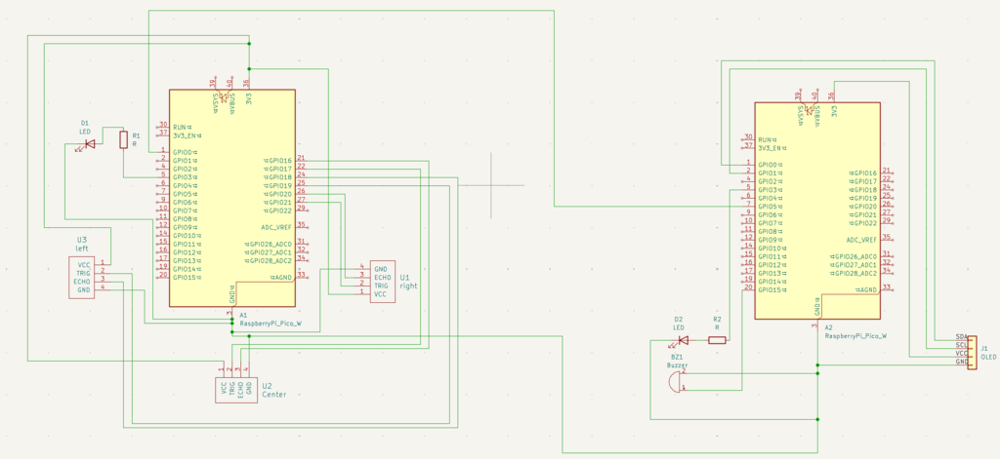
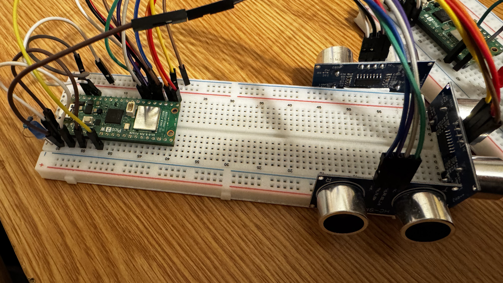
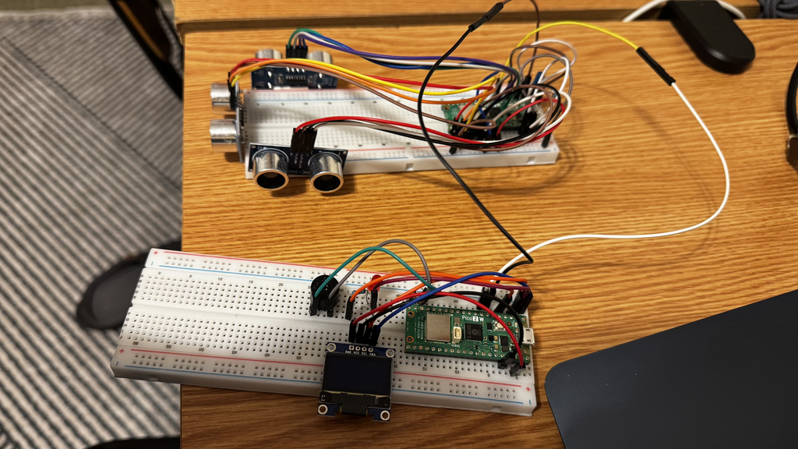

# Smart Parking Assistant

**Student:** Hemrayev Yslam
**Group:** 1241Ec
**GitHub Project Link:** https://github.com/UPB-PMRust-Students/project-dm-2025-Islam7681

## Description
The goal of the project is to create a functional parking assistant system using Rust. The hardware detects obstacles using ultrasonic sensors and provides visual and audio feedback to the driver to prevent collisions.

## Motivation
I chose this project to gain hands-on experience with embedded Rust and the `embassy-rs` framework. Parking safety is a real-world problem, and I wanted to explore more how the modern cars have the parking assitant and how it actully works.

## Architecture
The system is divided into two modules connected by a UART serial line:
1.  **Bumper Module:** Reads data from 3x HC-SR04 ultrasonic sensors.
2.  **Dashboard Module:** Receives the distance data, calculates the "danger level," and updates the OLED display and buzzer.

### Diagram

## Log

### Week 5 - 6
Got approved by the professor regarding the project topic. Decided to use `embassy-rs` for its async capabilities. Then ordered all the components

### Week 7 - 9
Components arrived. Started with basic hardware tests: blinking an LED on the Pico and reading raw timing data from a single HC-SR04 sensor using GPIO pins.

### Week 10 - 12
Made all the hardware wiring for both boards. Implemented the UART communication protocol. Connected two Picos together and successfully.

### Week 13 - 14
Finalized the software logic. Implemented the "Panic Mode" where the buzzer beeps faster as the object gets closer. Cleaned up the code, added comments and final test and cleanups.

## Hardware Design
The project uses the Raspberry Pi Pico2W (RP2350).
* **Sensors:** HC-SR04 ultrasonic sensors.
* **Display:** SSD1306 OLED (I2C connection).
* **Audio:** Active Buzzer.

### Schematics

### Bill of Materials

| Device | Usage | Price |
| :--- | :--- | :--- |
| **Raspberry Pi Pico 2W** (x2) | The microcontrollers for both nodes | 70 RON |
| **HC-SR04 Sensor** (x3) | Ultrasonic distance measurement | 9 RON |
| **SSD1306 OLED** | 0.96" Display for the dashboard | 25 RON |
| **Active Buzzer** | Audio alert system | 5 RON |
| **Jumper Wires** | Wiring | 5 RON |
| **LED** (x2)| For visuals | 4 RON |

### Photos of the Device

## Software

| Library | Description | Usage |
| :--- | :--- | :--- |
| `embassy-rp` | HAL for RP2350 | Controls GPIO, UART, I2C, and DMA on the Raspberry Pi Pico 2W. |
| `embassy-executor` | Async Executor | Runs the concurrent tasks (e.g., the sensor loop and the sending loop). |
| `ssd1306` | Display Driver | Drives the OLED screen over I2C (dashboard node). |
| `embedded-graphics` | Graphics Library | Draws the UI text and lines on the display buffer. |
| `heapless` | Static Memory | Provides fixed-size `String` buffers to format messages without using an allocator. |

## Software Design
The software is written in Rust using `embassy-rs` on the RP2350 architecture.
* **Bumper Firmware:** Runs a continuous loop measuring distances from three sensors sequentially to avoid ultrasonic interference. It serializes the data into a compact string format and transmits it via UART.
* **Dashboard Firmware:** Runs two asynchronous tasks:
    1.  **Alerter Task:** Monitors the shared "danger level" state and controls the buzzer/LED frequency (fast beeping for panic mode, slow for warning).
    2.  **Main Task:** Parses incoming UART messages, updates the shared state, and redraws the OLED interface using `embedded-graphics`.

## Links
* [Raspberry Pi Pico Documentation](https://www.raspberrypi.com/documentation/microcontrollers/pico-series.html)
* [Rust Embassy Framework](https://embassy.dev/)
* [Similar Project: Portable Distance Sensor](https://toptechboy.com/portable-distance-measurement-project-with-hc-sr04-ultrasonic-sensor/)