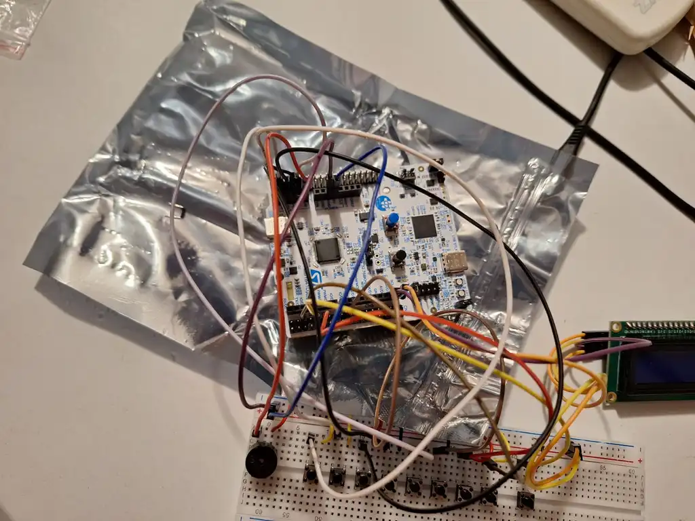
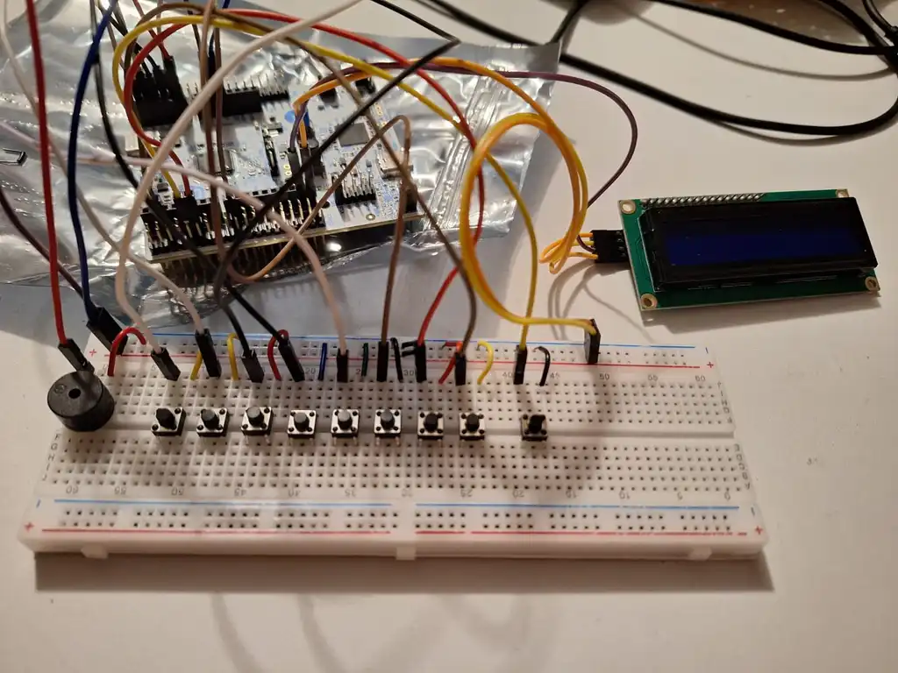
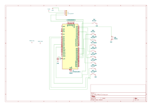

# STM32 Mini Piano

A playable mini piano with multiple modes built on the STM32 Nucleo-U545RE-Q.

:::info

**Author**: Oproiu Eduard  \
**GitHub Project Link**: https://github.com/UPB-PMRust-Students/fils-project-2026-OproiuEduard

:::

## Description

A fully functional mini piano built on the STM32 Nucleo-U545RE-Q microcontroller. The user can press one of 8 buttons, each mapped to a musical note (C4 to C5). The corresponding note is played through a passive buzzer via PWM, and an LCD display shows the current note being played. The device supports three operating modes: free play (press any button to hear the note), learning mode (the device plays a melody and guides you to repeat it), and challenge mode (press the correct note shown on the display before time runs out). A mode button switches between the three modes.

## Motivation

Music and embedded systems are two areas of personal interest. This project combines both by building a functional musical instrument from scratch using low-level hardware control in Rust. Adding interactive modes like learning and challenge makes it more than just a toy — it becomes a tool for actually learning music.

## Architecture

The project is structured around the following main components:

- **Input Module** — 8 tactile buttons (one per note C4–C5) plus 1 mode button
- **Sound Module** — Passive buzzer driven by PWM; frequency is set according to the active note
- **Display Module** — LCD display showing the current note, active mode, and prompts for learning/challenge modes
- **Mode Controller** — State machine managing transitions between Free Play, Learning, and Challenge modes

## Log

### Week 5 - 11 May

Decided on the project idea: a mini piano with multiple modes built on the STM32 Nucleo-U545RE-Q. Selected components and submitted the draft for approval.

### Week 12 - 18 May

Set up the development environment (Rust, embassy-rs, probe-rs on Windows). Got the first LED blinking on the board confirming the toolchain works. Connected the passive buzzer and tested PWM tone output. Started connecting buttons one by one and testing GPIO input.

### Week 19 - 25 May

Connected all 8 note buttons, mode button, and LCD display via I2C. Implemented Free Play, Learning, and Challenge modes in Rust using embassy-rs. LCD shows note names and current mode. All components tested and working together.

## Hardware

The project uses the STM32 Nucleo-U545RE-Q as the main microcontroller. Eight tactile 6x6x6 push buttons are wired to GPIO input pins with internal pull-up resistors enabled in software. A passive buzzer is connected to a PWM-capable timer output pin (PA0, TIM2). The lab LCD display (16x2 with I2C backpack HW-061) is connected via I2C on pins PB6 (SCL) and PB7 (SDA). One additional button handles mode switching. The onboard LED provides visual feedback while a note is active.

### Schematics

### Bill of Materials

| Device | Usage | Price |
| --- | --- | --- |
| [STM32 Nucleo-U545RE-Q](https://www.st.com/en/evaluation-tools/nucleo-u545re-q.html) | Main microcontroller | provided by lab |
| [Passive Buzzer 3.3V](https://www.optimusdigital.ro/en/buzzers/635-3-v-or-33v-passive-buzzer.html) | Play tones via PWM | 0.99 RON |
| [Tactile Button 6x6x6](https://www.optimusdigital.ro/en/buttons-switches/97-6x6x6-push-button.html) | Note input (8) + mode (1) | 0.36 RON x 9 = 3.24 RON |
| LCD Display 16x2 with I2C backpack | Show note and mode info | ~15 RON |
| Breadboard | Wiring components | ~10 RON |
| Jumper wires | Connections | ~8 RON |

## Software

| Library | Description | Usage |
| --- | --- | --- |
| [embassy-rs](https://github.com/embassy-rs/embassy) | Async embedded framework for Rust | Main framework for async tasks, GPIO, PWM, I2C |
| [embassy-stm32](https://github.com/embassy-rs/embassy/tree/main/embassy-stm32) | STM32 HAL for Embassy | Hardware access for STM32 Nucleo-U545RE-Q |
| [embedded-hal](https://github.com/rust-embedded/embedded-hal) | Hardware abstraction layer traits | Standard traits for GPIO, PWM, I2C |
| [hd44780-driver](https://github.com/JohnDoneth/hd44780-driver) | LCD driver for HD44780 displays | Used to control the 16x2 LCD via I2C |
| [defmt](https://github.com/knurling-rs/defmt) | Logging framework for embedded | Debug logging over RTT |

## Links

1. [Embassy-rs documentation](https://embassy.dev)
2. [STM32 Nucleo-U545RE-Q datasheet](https://www.st.com/en/evaluation-tools/nucleo-u545re-q.html)
3. [Microprocessor Architecture course website](https://embedded-rust-101.wyliodrin.com/docs/fils_en/project)
