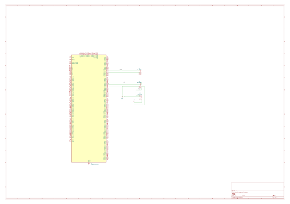

Robotic Bloom – Interactive Flower

Description
This project consists of an artificial flower that opens when a person approaches it. The system uses an ultrasonic sensor (HC-SR04) to measure the distance and multiple servomotors to control the movement of the petals.
The entire system is controlled by an STM32 microcontroller, which reads data from the sensor and sends commands to the servos using a PCA9685 PWM driver.

Motivation
I chose this project because I wanted to build something interactive, not just theoretical. It combines several concepts learned during the course, such as working with sensors, controlling motors and using communication protocols like I2C.
Also, I liked the idea of creating something visual that reacts to people.

Functionality
The flower has two main states:
- closed – when no object is nearby
- open – when an object is detected close to the sensor
The system continuously measures the distance. If the distance is smaller than a certain threshold, the flower opens. When the object moves away, the flower closes.
Eight servomotors are used to simulate the movement of the petals.

Architecture
The system is composed of the following components:
- STM32 microcontroller
- HC-SR04 ultrasonic sensor
- PCA9685 PWM driver
- 8 servomotors
- external power supply
The STM32 communicates with the PCA9685 via I2C and reads the sensor using GPIO pins.
Components and interconnection
The main components used are:
- STM32 – main controller
- HC-SR04 – distance sensor
- PCA9685 – PWM controller
- MG996R – servomotors
- power supply – used for servos
- level shifter – for voltage compatibility
- capacitors – for stabilizing the power supply

Connections:
- HC-SR04 is connected to STM32 using TRIG and ECHO pins
- PCA9685 is connected through I2C (SDA, SCL)
- servos are connected to PCA9685 outputs
- external power supply is used for servos
- all grounds are connected together

Weekly log

Week 1  
Project idea and components selection

Week 2  
System architecture design

Week 3  
Testing the ultrasonic sensor

Week 4  
Testing a servomotor

Week 5  
Integrating PCA9685

Week 6  
Mechanical structure of the flower

Week 7  
Software implementation in Rust

Week 8  
Final testing and documentation

Hardware design
Servomotors require a high current, so they are powered using an external power supply.
The PCA9685 module is used to generate PWM signals for all servos, reducing the load on the STM32.
All components share a common ground to ensure proper operation.

Hardware description
HC-SR04 is used to measure the distance.
MG996R servos are used to move the petals.
PCA9685 generates PWM signals for controlling the servos.
The level shifter is used to adapt voltage levels.
Capacitors help stabilize the power supply.
Schematic

Software design
The software is written in Rust and runs on the STM32.
It is responsible for:
- initializing GPIO and I2C
- reading sensor data
- controlling the servos
- making decisions based on distance

Detailed design
The program runs in a loop:

- measure distance
- compare with a threshold
- open or close the flower
- repeat

Functional diagram
START  
Initialize system  
Measure distance  
Distance < threshold?  
YES → Open flower  
NO → Close flower  
Repeat

Bill of materials
- STM32 board – 1  
- HC-SR04 – 1  
- MG996R – 8  
- PCA9685 – 1  
- power supply – 1  
- level shifter – 1  
- capacitors – multiple  
- wires – multiple   
- schematic  
- project photos  
