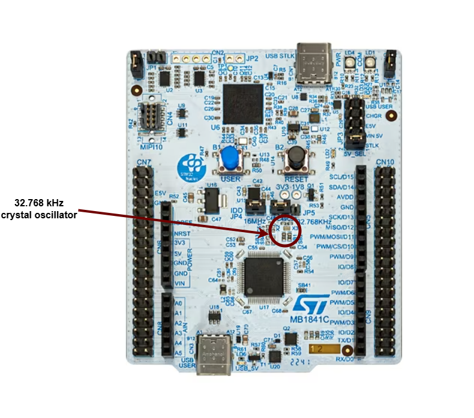

# 03 - PWM & ADC

The purpose of this lab is to help you learn about different types of signals in electronics and how to work with them.

import Tabs from '@theme/Tabs';
import TabItem from '@theme/TabItem';

## Concepts 

- Understanding digital vs. analog signals;
- Simulating analog signals using Pulse Width Modulation (PWM);
- Converting analog signals to digital using Analog-to-Digital Converters (ADC);
- Practical applications of PWM and ADC in circuit design.
- How to use the lab board's components.

## Resources

1. **STMicroelectronics**, *[STM32U545 Datasheet](https://www.st.com/resource/en/datasheet/stm32u545ce.pdf)*
2. **STMicroelectronics**, *[Nucleo STM32U545 User manual](https://www.st.com/resource/en/user_manual/um3062-stm32u3u5-nucleo64-boards-mb1841-stmicroelectronics.pdf)*
2. **Raspberry Pi Ltd**, *[RP2350 Datasheet](https://datasheets.raspberrypi.com/rp2350/rp2350-datasheet.pdf)*
   - Chapter 8 - *Clocks*
     - Subchapter 8.1.1
     - Subchapter 8.1.2
   - Chapter 12 - *Peripherals*
     - Chapter 12.4 - *ADC and Temperature Sensor*
       - Subchapter 12.4.1
       - Subchapter 12.4.3
       - Subchapter 12.4.6
     - Chapter 12.5 - *PWM*
     - Chapter 12.8 - *System Timers*

3. **Paul Denisowski**, *[Understanding PWM](https://www.youtube.com/watch?v=nXFoVSN3u-E)*

## Timing

In embedded applications, keeping track of time is crucial. Even for the simple task of blinking an LED at a certain time interval, we need a reference of time that is constant and precise. 

### Clocks

A clock is a piece of hardware that provides us with that reference. Its purpose is to oscillate at a fixed frequency and provide a signal that switches from high to low at a fixed interval.


<Tabs>
  <TabItem value="stm32u5" label="STM32 Nucleo-U545RE-Q" default>
The most precise type of clock on the STM32 Nucleo-U545RE-Q is the *High-Speed External oscillator (HSE)*. The reason why it is so accurate is because it uses the crystal’s natural vibration frequency to generate the clock signal. This oscillator is usually external to the microcontroller itself, requiring a crystal or external clock source connected to the HSE pins.

The processor also provides several *internal RC oscillators* (HSI, MSI, LSI), which are less accurate because they rely on resistor-capacitor timing rather than quartz resonance. These internal clocks are useful when small variations in clock pulses are acceptable, or when minimizing external components is important.

The STM32 Nucleo-U545RE-Q does not have a built-in crystal frequency. Instead, the board designer selects an appropriate crystal (commonly 8 MHz, 16 MHz, or 24 MHz) to drive the HSE, depending on the application requirements.


  </TabItem>

  <TabItem value="rp2350" label="Raspberry Pi Pico/Raspberry Pi Pico 2" default>
The most precise type of clock is the crystal oscillator (XOSC). The reason why it is so accurate is because it uses the crystal's natural vibration frequency to create the clock signal. This clock is usually external to the processor itself, but the processor also has an internal clock (ROSC) that is less accurate and that can be used in cases where small variations of clock pulses are negligible. When using the USB protocol, for instance, a more stable clock signal is required, therefore the XOSC is necessary. The crystal oscillator on the Raspberry Pi Pico board has a frequency of 12MHz.

This clock signal is just a reference, and most of the time we need to adjust it to our needs. This is done by either multiplying or dividing the clock, or in other words, elevating or lowering the frequency of the clock. For example, the RP2040 itself runs on a 133MHz clock, so the crystal oscillator frequency of 12MHz is multiplied (this is done using a method called Phase-Locked Loop). Similarly, the RP2350, the successor to the RP2040, also uses a PLL to adjust the 12MHz reference clock but supports a higher clock speed of 150MHz. This increased clock speed, along with more precise frequency control and improved power management, makes the RP2350 more versatile for both high-performance and energy-efficient applications.


  </TabItem>

</Tabs>

### Counters

A counter in electronics is a tool that tracks numbers, typically by adding or subtracting one each time the clock ticks. When it reaches its maximum (or minimum) value, it resets or wraps around. This reset is called an "overflow" (when counting up) or "underflow" (when counting down). Some counters can also switch between counting up and down based on control signals.

:::info
A regular counter on 8 bits would count up from 0 to 255, then loop back to 0 and continue counting. 
:::

In theory a counter is associated with 3 registers:

| Register | Description |
|-----------|----------|
| `value` | the current value of the counter |
| `direction` | whether the counter is counting UP or DOWN |
| `reset` | if the direction is UP, the value at which the counter resets to 0; if the direction is DOWN, the value at which the counter reset after reaching 0 |


The way the counter works here is that it increments/decrements every clock cycle and checks whether or not it has reached its reset value. If is has, then it resets to its initial value and starts all over again.


#### SysTick

The ARM Cortex‑M0+ used by the RP2040, the ARM Cortex‑M33 used by the RP2350, and the ARM Cortex‑M33 used by the STM32U545 all provide the SysTick time counter to keep track of time. This counter automatically decrements, and when it reaches 0, it triggers an exception and then resets to the reload value.

- `SYST_CVR` register - the value of the timer itself
- `SYST_RVR` register - the reset value
- `SYST_CSR_SET` register:
	- `ENABLE` field - enable/disable the counter
	- `TICKINT` field - enable/disable exception on reaching 0

**Difference:**

On the RP2040, documentation often describes the counter as decrementing “every microsecond,” since it is usually configured that way. On the RP2350 and STM32U5, the counter instead decrements on every processor clock cycle (or external reference clock), so to get a 1 µs or 1 ms tick you must calculate the reload value based on the actual system clock frequency.

### Timers

The simplest way to make a processor wait is to ask the processor to skip a clock cycle a number of times, or by calling the processor instruction `nop` (no operation) in a loop.
:::info
This method is not ideal, since the `nop` instruction stalls the processor and wastes valuable time that could otherwise be used to do other things in the meantime. To optimize this, we can use *alarms*.
:::
An **alarm** is a counter that triggers an interrupt every time it reaches a certain value. This way, an alarm can be set to trigger after a specific interval of time, and while the **alarm** hardware is *running in the background*, the main program can continue executing instructions, and so it is not blocked. When the alarm reaches the chosen value, it goes off and triggers an interrupt that can then be handled in its specific Interrupt Service Routine (ISR).


:::info
The **RP2350** timer and the **RP2040's** are fully monotonic, meaning they can never truly overflow. Their value is stored on 64 bits and incremented every 1 microsecond, ensuring precise and consistent timekeeping. This means the last value they can increment to before overflowing is 2<sup>64</sup>‑1, which is equivalent to roughly 500,000 years. RP2040 and RP2350 support 4 different alarms (TIMERx_IRQ_0/1/2/3), which can be used independently, allowing for multiple timed events or tasks to be managed simultaneously.

The **RP2350** provides two timer peripherals, while the **RP2040** provides only one.

The **STM32U5**, by contrast, does not use a single 64‑bit monotonic timer. Instead, it provides a set of general‑purpose 16‑bit and 32‑bit timers (TIMx) as well as advanced timers for motor control and low‑power timers for energy‑sensitive applications. These timers can be configured with prescalers and auto‑reload registers to generate periodic interrupts, PWM signals, input capture, or output compare events. Unlike the RP2040 and RP2350’s unified 64‑bit microsecond counter, STM32 timers can overflow depending on their bit‑width (e.g., a 16‑bit timer rolls over after 65,535 counts). To achieve long‑duration or monotonic timekeeping, software typically chains timers or uses the SysTick timer in combination with interrupts.
:::

## Analog and Digital Signals

**Analog signals** are a representation of real-world data. They communicate information in a continuous function of time. They are smooth and time-varying waves, and contain an infinite number of values within the continuous range. An example of an analog signal would be sound, or the human voice.


**Digital signals** are a discrete representation of data. They are represented by a sequence of binary values, taken from a finite set of possible numbers. They are square and discrete waves. In most cases, they are represented by two values: 0 and 1 (or 0V and 5V). Digital representation of signals is usually used in hardware.


## Pulse-Width Modulation (PWM)
Up to now, we learned to turn an LED on and off, or in other words, set a LED's intensity to 100% or 0%. What if we wanted to turn on the LED only at 50% intensity? We only have a two-level digital value, 0 or 1, so technically a value of 0.5 is not possible. What we can do is simulate this analog signal, so that it *looks* like the LED is at half intensity. 

**Pulse-Width Modulation** is a method of simulating an analog signal using a digital one, by varying the width of the generated square wave. 


:::note
We can think of the simulated analog signal being directly proportional to the change in digital signal pulse size. The larger the square wave at a given period T, the higher the average analog amplitude output for that period.
:::

The **duty cycle** of the signal is the percentage of time per period that the signal is high.


So if we wanted our led to be at 50% intensity, we would choose a duty cycle of 50%. By quickly switching between high and low, the led appears to the human eye as being at only 50% intensity, when in reality, it's only on at max intensity 50% of the time, and off the rest of the time.


$$

duty\_cycle = \frac{time\_on}{period} \%

$$

*Counters* are used by the STM32U5, the RP2350, and the RP2040  to generate PWM signals. On the RP2040 and RP2350, the PWM counters are controlled by channel registers (X can be from 0–7, depending on the channel). On the STM32U545, PWM generation is handled by the timer peripherals (`TIMx`), where each channel uses a counter (`TIMx_CNT`), a compare register (`TIMx_CCRy`), and an auto‑reload register (`TIMx_ARR`) to define the duty cycle and period.
<Tabs>
  <TabItem value="stm32u5" label="STM32 Nucleo-U545RE-Q" default>
- `TIMx_CNT` - the actual value of the counter
- `TIMx_CCRy` - the compare value for channel y (this sets the duty cycle)
- `TIMx_ARR` - the auto‑reload value, the maximum count before the counter resets (this sets the period)

When `TIMx_CNT` is reset (0), the output signal is set to 1 (active). The counter counts up until it reaches `TIMx_CCRy`, after which the output signal becomes 0 (inactive). The counter continues to count until it reaches `TIMx_ARR`, then it resets to 0 and the signal becomes 1 again.
  </TabItem>

  <TabItem value="rp2350" label="Raspberry Pi Pico 1 / 2" default>
- `CHX_CTR` - the actual value of the counter
- `CHX_CC` - the value that the counter will compare to
- `CHX_TOP` - the value at which the counter will reset (or *wrap*)

When `CHX_CTR` is reset, the value of the output signal is 1. The counter counts up until it reaches `CHX_CC`, after which the value of the output signal becomes 0. The counter continues to count until it reaches `CHX_TOP`, and then the signal becomes 1 again. This way, by choosing the value of `CHX_CC`, we set the duty cycle of the PWM signal.
  </TabItem>

</Tabs>


<Tabs>
  <TabItem value="stm32u5" label="STM32 Nucleo-U545RE-Q" default>
On STM32U5, PWM signals are generated by the timer peripherals (TIMx). Each timer provides multiple channels, and each channel can be mapped to specific GPIO pins through the alternate function system.

| Arduino connector | STM32 pin |PWMs |
|-----------|----------|----------|
| `D3` |`PB3` |`TIM2_CH2` |
| `D5` | `PB4`|`TIM3_CH1` |
| `D6` |`PB10`|`TIM2_CH3` |
| `D9` |`PC6`|`TIM3_CH1` |
| `D11` |`PA7`|`TIM3_CH2` |


:::info

You can find more details about the pins in the [user manual](https://www.st.com/resource/en/user_manual/um3062-stm32u3u5-nucleo64-boards-mb1841-stmicroelectronics.pdf) of the board(page 33)

:::
  
  </TabItem>

  <TabItem value="rp2350" label="Raspberry Pi Pico 1 / 2" default>
On RP2350 and RP2040, all GPIO pins support PWM. Every two pins share a PWM slice, and each one of them is on a separate channel. 


:::info
This means that in order to use a pin as PWM, we need to know what channel it's on, and which output it uses (A or B).
:::
  </TabItem>

</Tabs>


### Examples of hardware controlled through PWM

- leds
- motors
- buzzers
- RGB leds (what we will be using for this lab)

An **RGB** LED is a led that can emit any color, using a combination of red, green and blue light. On the inside, it's actually made up of 3 separate leds:
- *R* led - to control the intensity of the *red* light
- *G* led - to control the intensity of the *green* light
- *B* led - to control the intensity of the *blue* light

By using PWM on the R, G and B leds, we can control each of their intensity to represent any color.

:::info
For example, if we wanted to create the color purple, we would set the intensity of red and blue to 100%, and the intensity of green to 0%.
:::

There are two different types of RGB LEDs:

- common cathode: all LED cathodes are connected together. A LOW signal means off, and a HIGH signal means on at max intensity.
- common anode: all LED anodes are connected together. A LOW signal means on at max intensity, and a HIGH signal means off.


:::warning
For this lab, we will be using **common anode** RGB LEDs, which means that the PWM signal should be *opposite*. 0 will be 100% intensity, and 1 will be 0% intensity.
:::

#### How to wire an RGB LED

The RGB LED that the board provides is signaled with labels `RGB_B` (blue), `RGB_G` (green) and `RGB_R` (red) in the connectors section.


#### How to wire a servo motor

A **servo motor** is a motor that can be controlled with PWM. It has an arm that can be rotated to a specific angle, depending on the PWM signal it receives.

A servo motor has three wires:
- **Power** - usually red, connected to a voltage source (5V)
- **Ground** - usually black, connected to the ground
- **Signal** - usually orange, connected to a PWM pin


The board provides the connectors for the servo motor. These connectors are labeled `GND`, `PWR`, and `SIG` in the connectors section.


To wire the servo motor to the STM32 Nucleo-U545RE-Q, note that the servo’s `PWR`, `GND`, and `SIG` lines are already connected to the lab board. The only additional step is to place a jumper wire from the SIG connector of the the lab board to a suitable PWM-capable pin on the STM32 Nucleo-U545RE-Q.
### PWM in Embassy-rs

First, we need a reference to all peripherals, as usual.

<Tabs>
  <TabItem value="stm32u5" label="STM32 Nucleo-U545RE-Q" default>

```rust
// Initialize peripherals
let peripherals = embassy_stm32::init(Default::default());
```

```rust
use embassy_stm32::timer::simple_pwm::{PwmPin, SimplePwm};
use embassy_stm32::peripherals::TIM2;
use embassy_stm32::timer::Ch1;

    // Configure PA0 as TIM2_CH1 PWM output
    let led_pwm_pin: PwmPin<'_, TIM2, Ch1> = PwmPin::new(p.PA0, OutputType::PushPull);
```

    - `PA0` → the physical GPIO pin you want to use.
    - `TIM2` → the timer peripheral that will generate the PWM signal.
    - `Ch1` → the channel of that timer (channel 1).
    - `PwmPin::new_ch1` → ties PA0 to TIM2 channel 1’s output.
    - `OutputType::PushPull` → configures the electrical drive mode of the pin.

```rust
let mut pwm = SimplePwm::new(
    p.TIM2,              // Timer 2 peripheral
    Some(led_pwm_pin),   // Channel 1 output (PA0)
    None,                // Channel 2 not used
    None,                // Channel 3 not used
    None,                // Channel 4 not used
    khz(1),              // PWM frequency = 1 kHz
    Default::default(),  // Default configuration
);
```

:::warning

The code above is an example for PA0 with TIM2_CH1. You need to modify the timer, channel, and pin depending on which PWM‑capable pin you want to use!
:::

If we decide to modify the duty cycle of the PWM, we can update it directly on the channel:

```rust
let mut ch1 = pwm.ch1(); // Get handle for channel 1
ch1.enable();

// Set duty cycle to 50%
ch1.set_duty_cycle(50);

// Later, change duty cycle to 10%
ch1.set_duty_cycle(10);
```


  </TabItem>

  <TabItem value="rp2350" label="Raspberry Pi Pico 1 / 2" default>
```rust
// Initialize peripherals
let peripherals = embassy_rp::init(Default::default());
```

In order to modify the PWM counter configurations, we need to create a `Config` for our PWM.

```rust
// PWM config
use embassy_rp::pwm::Config as ConfigPwm; 

// Create config for PWM slice
let mut config: ConfigPwm = Default::default();
// Set top value (value at which PWM counter will reset)
config.top = 0x9088; // in HEX, equals 37000 in decimal
// Set compare value (counter value at which the 
// PWM signal will change from 1 to 0)
config.compare_a = config.top / 2;
```

In the example above:
    - `top` is the field from `Config` that will define the value at which the counter will reset back to 0
    - `compare_a` is the field from `Config` that will define the value at which the PWM signal will switch from 1 to 0
In this case, `config.compare_a` is half of `config.top`. This means that the duty cycle of the generated PWM signal will be 50%, or, in other words, that the PWM signal will switch from 1 to 0 halfway through each period.


To select the pin that we want to use for PWM, we need to create a new PWM driver that uses the correct channel and output for our pin.

```rust
// Create a PWM driver for pin 3
let mut pwm = Pwm::new_output_b( // Output B
    peripherals.PWM_SLICE1, // Channel 1
    peripherals.PIN_3,   // Pin 3 (modify this as needed)
    config.clone()
);
```

:::warning
1. The code above is an example for pin 3. You need to modify the channel, output and pin depending on the PWM pin you choose to use!
2. The value of `compare_a` or `compare_b` must be changed depending on the desired duty cycle!
:::

If we decide to modify the value of `compare_a` or `compare_b`, we have to update the configuration for the PWM.

```rust
config.compare_b += 100; // modified value of `compare_b`
pwm.set_config(&config); // set the new configuration for PWM
```
 
  </TabItem>

</Tabs>


### Controlling a Servo Motor Using PWM

Just like controlling other hardware through PWM, we start by initializing the peripherals.

Servos typically expect a 50 Hz PWM signal, which corresponds to a 20 ms period.

Servos interpret PWM signals based on the pulse width rather than just frequency:

- `Period`: The total time for one PWM cycle, which is 20 ms (50 Hz).
- `Minimum Pulse Width`: Typically **0.5 ms**, which corresponds to a servo position of **0 degrees**.
- `Maximum Pulse Width`: Typically **2.5 ms**, which corresponds to a servo position of **180 degrees**.


<Tabs>
  <TabItem value="stm32u5" label="STM32 Nucleo-U545RE-Q" default>

```rust
// Initialize peripherals
let peripherals = embassy_stm32::init(Default::default());
```

To control a servo motor using PWM, we need to calculate the **TOP value**, which determines the PWM period.

#### Calculating ARR value

STM32 timers tick at the timer input clock f_tim divided by the prescaler (PSC+1). The period in ticks is auto-reload value ARR.

$$

ARR = \left( \frac{f_{tim} \times T}{PSC+1} \right)

$$

Where:

- f_tim is the max frequency of the core/timer
- T is the target period

#### Converting pulse width to compare value

For PWM mode, duty is set via CCR relative to ARR. Given the desired pulse width pulse_width:

$$

compare = \left( \frac{pulse_{width} \times ARR}{T} \right)

$$


Now, let's implement it in Rust:
```rust
// Set the PWM pin
let servo_pin = PwmPin::new_ch1(p.PA0, OutputType::PushPull);

    // 50 Hz PWM (20 ms period)
    let mut pwm = SimplePwm::new(
        p.TIM2,
        Some(servo_pin),
        None,
        None,
        None,
        hz(50),
        Default::default(),
    );

// Enable the PWM channel
    let mut ch1 = pwm.ch1();
    ch1.enable();

// Compute the min
  const PERIOD = 20000;
  const ARR = 50000;

  let min = (500 * ARR)/PERIOD; //For a 0.5ms pulse
  let max = (2500 * ARR)/PERIOD; // For a 2.5ms pulse 

  // Main loop to move the servo back and forth
loop {
    // Move servo to maximum position (180 degrees)
    // Set compare value for max pulse width
    // Update PWM configuration
    // Wait 1 second
    // Then move the servo to minimum position (0 degrees)
}
```


  </TabItem>

  <TabItem value="rp2350" label="Raspberry Pi Pico 1 / 2" default>
```rust
// Initialize peripherals
let peripherals = embassy_rp::init(Default::default());
```

To control a servo motor using PWM, we need to calculate the **TOP value**, which determines the PWM period.

#### Calculating the TOP Value

$$

top = \left( \frac{f_{clock}}{f_{pwm} \times divider} \right) - 1

$$

For example, with:

$$
\begin{aligned}
f_{clock} &= 150 \,MHz \\
f_{PWM} &= 50 \,Hz \\
divider &= 64
\end{aligned}
$$

We get:

$$
top = \left( \frac{150\,000\,000}{50 \times 64} \right) - 1 = 46\,874
$$


which is `0xB71A` in hexadecimal.

The **clock divider** is used to slow down the high-frequency system clock so that it can generate a usable PWM signal. The RP2350's system clock runs at 150 MHz, which is too fast for direct PWM control of a servo. By setting the divider to 64, we effectively slow down the clock.

To convert these pulse widths into PWM compare values, we use:

$$
compare = \left( \frac{pulse_{width} \times top}{T} \right)
$$

where:
- $$pulse_{width}$$ is the desired pulse width in microseconds.
- $$top$$ is the previously calculated counter value (46,874).
- $$T$$ is the total period in microseconds (20,000 μs for 50 Hz).


Now, let's implement this in Rust:

```rust
// Set the PWM pin
let servo_pin = PwmPin::new_ch1(p.PA0, OutputType::PushPull);

// Set the calculated TOP value for 50 Hz PWM
servo_config.top = 0xB71A; 

// Set the clock divider to 64
servo_config.divider = 64_i32.to_fixed(); // Clock divider = 64

// Servo timing constants
const PERIOD_US: usize = 20_000; // 20 ms period for 50 Hz
const MIN_PULSE_US: usize = 500; // 0.5 ms pulse for 0 degrees
const MAX_PULSE_US: usize = 2500; // 2.5 ms pulse for 180 degrees

// Calculate the PWM compare values for minimum and maximum pulse widths
let min_pulse = (MIN_PULSE_US * servo_config.top as usize) / PERIOD_US;
let max_pulse = (MAX_PULSE_US * servo_config.top as usize) / PERIOD_US;
```

After setting up the PWM configuration, we want to create a control loop that can dynamically adjust the servo's position.

```rust
// Initialize PWM for servo control
let mut servo = Pwm::new_output_a(
    peripherals.PWM_SLICE1, 
    peripherals.PIN_2, 
    servo_config.clone()
);

// Main loop to move the servo back and forth
loop {
    // Move servo to maximum position (180 degrees)
    // Set compare value for max pulse width
    // Update PWM configuration
    // Wait 1 second
    // Then move the servo to minimum position (0 degrees)
}
```
  </TabItem>

</Tabs>


## Analog-to-Digital Converter (ADC)

Now we know how to represent an analog signal using digital signals. There are plenty of cases in which we need to know how to transform an analog signal into a digital one, for example a temperature reading, or the voice of a person. This means that we need to correctly represent a continuous wave of infinite values to a discrete wave of a finite set of values.
For this, we need to sample the analog signal periodically, in other words to measure the analog signal at a fixed interval of time. This is done by using an **Analog-to-Digital converter**.

The ADC has two important parameters that define the quality of the signal representation:

| Parameter | Description | Impact on quality |
|-----------|-------------|-------------------|
| Sampling Rate | Frequency at which a new sample is read | The higher the sampling rate, the more samples we get, so the more accurate the representation of the signal |
| Resolution | Number of bits which we can use in order to store the value of the sample | The higher the resolution, the more values we can store, so the more accurate the representation |

:::info
For example, a resolution of 8 bits means that we can approximate the analog signal to a value from 0 to 255.
:::


### Nyquist-Shannon Sampling Theorem

The [Nyquist-Shannon sampling theorem](https://en.wikipedia.org/wiki/Nyquist%E2%80%93Shannon_sampling_theorem) serves as a bridge between continuous-time signals and discrete-time signals. It establishes a link between the frequency range of a signal and the sample rate required to avoid a type of distortion called *aliasing*. Aliasing occurs when a signal is not sampled fast enough to construct an accurate waveform representation.

For an analog signal to be represented without loss of information, the conversion needs to satisfy the following formula:

$$
sampling_f > 2 \times max_{f}
$$

The analog signal needs to be sampled at a frequency greater than twice the *maximum frequency* of the signal.
In other words, we must sample at least twice per cycle.


### Examples of analog sensors

- temperature sensor
- potentiometer
- photoresistor

A **photoresistor** (or photocell) is a sensor that measures the intensity of light around it. Its internal resistance varies depending on the light hitting its surface; therefore, the more light there is, the lower the resistance will be. 


#### How to wire a photoresistor

The photoresistor that the board provides is signaled with the label `PHOTORESISTOR` in the connectors section.


:::info
To wire a photoresistor on your board at home, you need to connect one leg to *GND* and the other leg to a voltage divider. Take a look at the [Electronics](/tutorial/electronics/index.md#voltage-divider) tutorial:
$$
V_{out} = V_{in} * \frac{R_{2}}{R_{1} + R_{2}};
$$

In our case:
- $ V_{out} $ will be the voltage at the ADC pin on the MCU
- $ V_{in} $ will be the voltage at the from the GPIO pin the photoresistor is tied to
- $ R_{1} $ is the variable resistance of the photoresistor
- $ R_{2} $ is a resistance compatible with our photoresistor (in our case, 10k $\Omega$)

This way, the ADC pin measures the photoresistor's resistance, without the risk of a short-circuit.


:::


### ADC in Embassy-rs

<Tabs>
  <TabItem value="stm32u5" label="STM32 Nucleo-U545RE-Q" default>
    On the STM32, the ADC peripheral does not use a FIFO interrupt like the RP2. Instead, each ADC (ADC1, ADC2, etc.) can be configured directly, and Embassy provides a driver that handles resolution, averaging, and sample time for you. All we need to do is create the ADC driver, configure it, and then bind it to the pin we want to read from.
  
  ```rust
  // ---- fn main() ----

let p = embassy_stm32::init(Default::default());

// Create ADC driver on ADCx
let mut adc = adc::Adc::new(p.ADCx);

// Configure resolution, averaging, and sample time
adc.set_resolution(adc::Resolution::BITS14);
adc.set_averaging(adc::Averaging::Samples1024);
adc.set_sample_time(adc::SampleTime::CYCLES160_5);

const MAX_VALUE: u32 = adc::resolution_to_max_count(adc::Resolution::BITS14);
  ```

  :::warning 
  If we are using PWM and ADC in the same code, both modules export a Config type. To avoid compilation errors, we should import them with different names:
```rust
use embassy_stm32::adc::Config as ConfigAdc;   // ADC config
use embassy_stm32::timer::simple_pwm::Config as ConfigPwm; // PWM config
```
:::

  :::warning 
When reading the ADC, it is important to distinguish between the maximum digital count and the maximum input voltage. The function

```rust
const MAX_VALUE: u32 = adc::resolution_to_max_count(adc::Resolution::BITS14);
```
returns the largest integer code that the ADC can produce for a 14‑bit conversion.

- For a 14‑bit ADC, the digital output spans from 0 to `2^14 - 1 = 16383`.
- `MAX_VALUE` will therefore hold the value `16383`.
- This is not the maximum voltage that the ADC can measure. The maximum voltage is determined by the reference voltage (e.g., 3.3 V), while `MAX_VALUE` simply represents the highest possible digital code.
:::

Once we have the ADC and pin set up, we can start reading values from the pin. Here’s a simple loop that reads the raw ADC value, converts it to a voltage, and prints it:
```rust
loop {
    // Read a raw ADC value (blocking read)
    let level: u16 = adc.blocking_read(&mut adc_pin);
    let voltage = 3.3f32 * level as f32 / MAX_VALUE as f32;

    info!("Light sensor reading: {}, voltage: {}", level, voltage);

    // Wait a bit before reading again
    embassy_time::Timer::after_secs(1).await;
}
```

  </TabItem>

  <TabItem value="rp2350" label="Raspberry Pi Pico 1 / 2" default>
On the RP2040, ADC uses an interrupt called `ADC_IRQ_FIFO` to signal whenever a new sample has been added to the ADCs' FIFO. This new sample will be stored inside a FIFO. In the Embassy library, this interrupt is already implemented, so all we need to do is bind it and use it in our ADC variable.

```rust
// Bind the `ADC_IRQ_FIFO` interrupt to the Embassy's ADC handler
bind_interrupts!(struct Irqs {
    ADC_IRQ_FIFO => InterruptHandler;
});

// ---- fn main() ----

// Initialize peripherals
let peripherals = embassy_rp::init(Default::default());

// Create ADC driver
let mut adc = Adc::new(peripherals.ADC, Irqs, Config::default());
```

:::warning
If we are using PWM and ADC in the same code, we will have two different `Config` imports with the same name. In order to avoid compilation errors, we need to separate the PWM config import from the ADC one. To do this, we can import the two `Config`s with different names.

```rust
use embassy_rp::pwm::Config as ConfigPwm; // PWM config
use embassy_rp::adc::Config as ConfigAdc; // ADC config

// ---- fn main() ----
let mut adc = Adc::new(peripherals.ADC, Irqs, ConfigAdc::default());
```
:::

:::warning 
Since the RP2s uses a 12‑bit ADC, the maximum representable digital value is 4095.
:::

Now, we need to initialize the ADC pin we will be using. The Raspberry Pi Pico has 3 pins that support ADC: `ADC0`, `ADC1`, and `ADC2`.

```rust
// Initialize ADC pin
// X should be replaced with a pin number
let mut adc_pin = Channel::new_pin(peripherals.PIN_X, Pull::None); 
```

Once we have the ADC and pin set up, we can start reading values from the pin. 

```rust
loop {
    // read a value from the pin
    let level = adc.read(&mut adc_pin).await.unwrap(); 

    // print the value over serial
    info!("Light sensor reading: {}", level); 

    // wait a bit before reading and printing another value
    Timer::after_secs(1).await; 
}
```
  </TabItem>

</Tabs>

:::info
Cortex‑M33 cores include a hardware Floating Point Unit (FPU), but **only for single precision (`f32`)**.  
Double precision (`f64`) is emulated in software and runs much slower.  
Cortex‑M0 cores have **no FPU at all**, so all floating‑point math is emulated.

For clarity, examples here use volts represented as `f32` instead of millivolts.  
On RP2040 (Cortex‑M0+), floating‑point operations are **very slow**.  
For efficiency, prefer **integer arithmetic in mV** expressed as `u32` in performance‑sensitive code.
:::

## Exercises

:::info
If you need to remember the layout of the board, check the [Lab Board](./02#the-lab-board) section from the previous lab.

Remember that LEDs are wired so they light up on `Level::Low` and turn off on `Level::High` and buttons return `Level::Low` when pressed and `Level::High` when not pressed.
:::

:::danger 
Please make sure the lab professor verifies your circuit before it is powered up.
:::

1. Write a program using Embassy that adjusts the brightness of an LED connected to GPIO pin by changing the PWM duty cycle. 
    - Light up the LED at 25% intensity. (**1p**)
    - Make the LED change intensity from 0% to 100% in 10% increments every 1 second. (**1p**)
:::info
You should use the lab skeleton provided in the [Lab Repository](https://github.com/UPB-PMRust/lab-2025) as a starting point for your implementation.

Embassy will reset all the peripherals when the `main` function exits, that means `PWM` and `ADC` will stop. Make sure the `main` function never exits so you can see how the circuit behaves.
:::

2. Write a program using Embassy to control the led intensity using a potentiometer. The potentiometer is connected to an ADC-capable GPIO pin. The LED should change intensity based on the potentiometer's position. (**2p**) 

:::warning 
Unlike the photoresistor, which requires an external resistor to form a voltage divider, a potentiometer already has an internal voltage divider. You only need to connect its three pins:
    - One leg to VCC.
    - The middle pin to an ADC-capable GPIO pin.
    - One leg to GND.
    
    (The potentiometer that the board provides is signaled with label `POTENTIOMETER` in the connectors section.)
:::

3. Make the RGB LED switch from red -> yellow -> blue every time the button `S4` is pressed. (**2p**)
:::note
`PC6`, `PB4`, and `PB10` can be used to control an RGB LED. Although `PC6` and `PB4` share the same PWM channel and therefore have the same frequency, each pin can have an **independent duty cycle**, allowing individual control of the brightness for each color.
:::


4. Write a program using Embassy that measures light intensity using a photoresistor connected to ADC.
    - Use `defmt` to display the measured light intensity. (**1p**)
    - Make the RGB LED change color based on the light intensity. Red for low intensity, green for medium intensity, and blue for high intensity. (**1p**)

5. Write a program using Embassy that moves a servo motor smoothly between 0° and 180°, then back to 0°, in a continuous loop. (**2p**)

 
