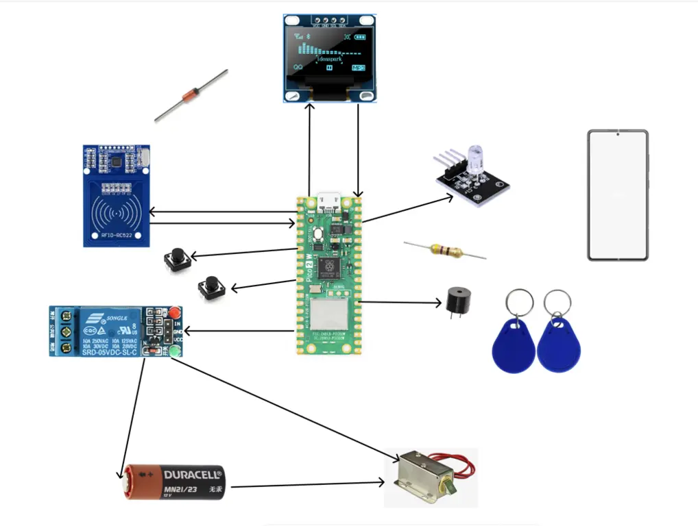
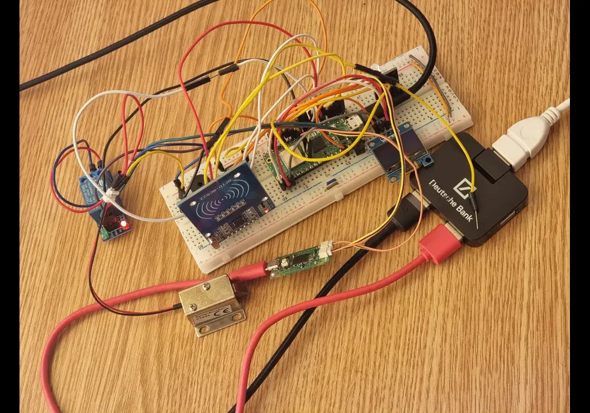

# Pico Access and Cloning System (PACS)
*A compact embedded solution for secure credential cloning and local access control*

:::info

**Author**: Abdulkadir Gobena DENBOBA \
**GitHub Project Link**: https://github.com/UPB-PMRust-Students/proiect-denboba

:::

## Description
**PACS (Pico Access and Cloning System)** is a compact and cost-effective embedded system designed to 
facilitate secure credential cloning and local access control. Built on the Wi-Fi-capable **Raspberry Pi Pico 2W**, 
PACS serves as a versatile solution for managing physical access to secured environments such as **residences,
offices, and dormitories**.

The system supports cloning of contactless smart cards (e.g., **MIFARE Classic**) and enables the configuration of
authorized credentials for entry control. It can be used in two modes: **User Mode** acting ass access system  or **Admin Mode**
acting as cloning system. it can also be used with a smartphone giving users more convenience

## Motivation

For my **PM project**, I wanted to work on a practical and real-world-relevant solution, and I could not find 
something more suitable for my level than **PACS**. In many institutions—such as **student dormitories**—each resident
is issued a smart card to gain entry. Replacing or duplicating these cards is often costly (typically 20 RON per card) 
and time-consuming.  PACS addresses this by allowing trusted users or administrators to securely clone authorized cards
directly from the device and even use **smartphones** (via card emulation) as digital credentials with no cost. 
This not only saves time and money but also enhances convenience and security by eliminating unnecessary intermediaries.
## Architecture
### Schematic Diagram

### Components and Connections
#### Raspberry Pi Pico  and RC522 RFID Module
| RFID (RC522) | Raspberry Pi Pico 2W  | Notes           |
|--------------|-----------------------|-----------------|
| VCC          | 3.3V                  |                 |
| GND          | GND                   |                 |
| RST          | GP6                   | Reset           |
| SDA (SS)     | GP5                   | SPI Chip Select |
| MOSI         | GP3                   | SPI Data Out    |
| MISO         | GP4                   | SPI Data In     |
| SCK          | GP2                   | SPI Clock       |
:::note 
The RFID module is used for reading and cloning card credentials. It communicates with the Raspberry Pi Pico via SPI.
Raspberry Pi Pico is the main controller that manages the entire system.
:::
#### Relay Module AND Raspberry Pi Pico
| Relay Module       | Raspberry Pi Pico 2W      | Notes                                      |
|--------------------|---------------------------|--------------------------------------------|
| IN                 | GP7                       | Activates solenoid                         |
| VCC                | VSYS (5V)                 | Power for relay module                     |
| GND                | GND                       | Common ground                              |
| NO (Normally Open) | Solenoid (-)              | Activates lock when relay is triggered     |
| COM (Common)       | 12V Power Source (-)      | Shared ground for solenoid and relay       |
| Flyback Diode      | Across solenoid terminals | 1N4007: Cathode → 12V+, Anode → GND        |

:::note
The relay module is used to control the solenoid lock. The Raspberry Pi Pico sends a signal to the relay to activate the lock.
:::

#### Display Module  and Raspberry Pi Pico
| OLED (I2C)    | Raspberry Pi Pico 2W | Notes                          |
|---------------|----------------------|--------------------------------|
| VCC           | 3.3V                 |                                |
| GND           | GND                  |                                |
| SDA           | GP16 (I^2C1)         | Avoid GP0/GP1 (debug conflict) |
| SCL           | GP17 (I^2C1)         |                                |

:::note
The display module is used for user interaction and feedback. It communicates with the Raspberry Pi Pico via I2C.
:::
#### Buzzer Module and Raspberry Pi Pico
| Buzzer        | Raspberry Pi Pico 2W | Notes               |
|---------------|----------------------|---------------------|
| +             | GP8                  |                     |
| -             | GND                  |                     |
:::note
The buzzer module provides audio feedback for various events in the system, such as successful cloning or access denial.
:::
#### Push Button and Raspberry Pi Pico
| Button        | Raspberry Pi Pico 2W  | Notes                         |
|---------------|-----------------------|-------------------------------|
| User (GP12)   | → GND                 | Internal pull-up              |
| Admin (GP13)  | → GND                 |                               |
:::note
The push button is used to switch between user and admin modes. The Raspberry Pi Pico uses internal pull-up resistors for the button inputs.
:::
#### LED connection and Raspberry Pi Pico with resistor
| LED           | Raspberry Pi Pico 2W  | Purpose        |
|---------------|-----------------------|----------------|
| Green         | GP9 → 220Ω → GND      | Access granted |
| Red           | GP10 → 220Ω → GND     | Access denied  |
| Blue          | GP11 → 220Ω → GND     | Cloning mode   |
:::note
The LEDs provide visual feedback for different system states. The resistors limit the current to the LEDs to prevent damage.
:::
#### power supply and Raspberry Pi Pico
| Power Supply      | Raspberry Pi Pico 2W  | Notes                           |
|-------------------|-----------------------|---------------------------------|
| USB Cable         | Micro-USB             | 5V (VSYS) + 3.3V logic power    |
| 12V Power Source  | Solenoid Lock (+)     | External 12V adapter/battery    |
:::note
The Raspberry Pi Pico is powered via a USB cable, while the solenoid lock requires a separate 12V power source.
:::
#### Selenoid Lock connection

| Solenoid Lock      | Component                 | Note                                      |
|--------------------|---------------------------|-------------------------------------------|
| (+)                | 12V Power Source          | External 12V supply                       |
| (-)                | Relay NO                  | Relay breaks ground (safety)              |
| Flyback Diode      | Across solenoid terminals | 1N4007: Cathode → 12V+, Anode → GND       |

:::note
The solenoid lock is connected to the relay module, which controls its activation. The common ground is shared between the 
solenoid and the relay.
:::
The system consists of two main functional modules:

- **Cloning Module** – Reads and replicates card credentials (UID-based).
- **Access Control Module** – Validates presented credentials and manages door lock mechanisms.

Core components are orchestrated via the **Raspberry Pi Pico 2W** and communicate through **GPIO, I2C, and SPI** 
interfaces.

## Log

### Week 5 - 11 May

In this initial phase, I focused on identifying and acquiring the essential components required for the project,
as well as designing the initial system architecture. The key tasks accomplished during this phase are:

- Selected and acquired the necessary components
- Drafted the initial architecture and schematic diagrams
- Identified a potential software library for use in the project
- Documented the initial project structure 

### Week 12 - 18 May
In this phase, I concentrated on the hardware design and initial software setup. The key tasks accomplished during this phase are:
- Designed the PCB layout
- Tested the rgb led and buzzer modules
- Tested the relay module with the solenoid lock
- Tested the OLED display with the Raspberry
- Tested the RC522 RFID module with the Raspberry Pi Pico

### Week 19 - 25 May

## Hardware
### Raspberry Pi Pico 2W
- **Usage**: Main controller
- **Function**: Processes all logic and manages peripherals

### RC522 RFID Module
- **Usage**: Card reader
- **Function**: Reads/writes RFID card UIDs

### 5V Relay Module
- **Usage**: Lock controller
- **Function**: Switches 12V solenoid circuit

### 12V Solenoid Lock
- **Usage**: Door lock
- **Function**: Physically secures entry point

### SSD1306 OLED Display
- **Usage**: User interface
- **Function**: Shows system status/messages

### Active Buzzer
- **Usage**: Audio feedback
- **Function**: Signals operations/errors

### RGB LEDs
- **Usage**: Visual indicators
- **Function**:
   - Green: Access granted
   - Red: Access denied
   - Blue: Cloning mode active

### Tactile Buttons
- **Usage**: Mode selection
- **Function**: Toggle between user/admin modes

### 1N4007 Diode
- **Usage**: Circuit protection
- **Function**: Prevents voltage spikes

### 220Ω Resistors
- **Usage**: LED protection
- **Function**: Limits current to LEDs

### MIFARE Classic Cards
- **Usage**: Test credentials
- **Function**: Authentication testing

### Schematics

### PCB Design

### 

### Bill of Materials

| **Device**                                                                                                                                  | **Usage**                                  | **Price**                                                                                                                                      |
|---------------------------------------------------------------------------------------------------------------------------------------------|--------------------------------------------|------------------------------------------------------------------------------------------------------------------------------------------------|
| [Raspberry Pi Pico W](https://www.raspberrypi.com/documentation/microcontrollers/raspberry-pi-pico.html)                                    | Core microcontroller                       | [35 RON](https://www.optimusdigital.ro/en/raspberry-pi-boards/12394-raspberry-pi-pico-w.html)                                                  |
| [RC522 RFID Module](https://www.optimusdigital.ro/en/wireless-rfid/67-mfrc522-rfid-module.html?search_query=rc522&results=1)                | RFID card reading and cloning (via SPI)    | [10 RON](https://www.optimusdigital.ro/en/wireless-rfid/67-mfrc522-rfid-module.html)                                                           |
| [Solenoid Lock](https://ethercom.ro/yale-electromagnetice-accesorii/39637-atlo-dt-l09.html)                                                 | Physical locking mechanism                 | [34 RON](https://ethercom.ro/yale-electromagnetice-accesorii/39637-atlo-dt-l09.html?gad_source=1)                                              |
| [5V Relay Module](https://www.optimusdigital.ro/en/relays/166-modul-releu-5v-1-canal-0700153810653.html)                                    | Controls power to solenoid lock            | [15 RON](https://www.optimusdigital.ro/en/relay-modules/2390-modul-releu-cu-senzor-de-temperatura.html?search_query=relay+module+&results=100) |
| [Active Buzzer Module](https://www.optimusdigital.ro/en/buzzers/635-3v-active-buzzer.html)                                                  | Audio feedback for events                  | [1 RON](https://www.optimusdigital.ro/en/buzzers/635-3v-active-buzzer.html)                                                                    |
| [LEDs (RGB)](https://www.bitmi.ro/modul-led-rgb-3-culori-10401.html?gad_source=1)                                                           | Visual feedback for status                 | [2 RON](https://www.bitmi.ro/modul-led-rgb-3-culori-10401.html?gad_source=1)                                                                   |
| [Push Button](https://www.optimusdigital.ro/en/buttons-and-switches/1119-6x6x6-push-button.html?search_query=button&results=491)            | Mode switch (admin/user)                   | [~1 RON](https://www.optimusdigital.ro/en/buttons-and-switches/1119-6x6x6-push-button.html?search_query=button&results=491)                    |
| [12V Duracell Battery + Holder](https://tinyurl.com/4fhcf793)                                                                               | Power source for relay/lock                | [11 RON]( https://tinyurl.com/4fhcf793)                                                                                                        |
| [1N4007 Diode](https://www.optimusdigital.ro/en/diodes/7457-dioda-1n4007.html?search_query=1N4007&results=12)                               | Flyback and polarity protection            | [0.5 RON](https://www.optimusdigital.ro/en/diodes/7457-dioda-1n4007.html?search_query=1N4007&results=12)                                       |
| [220Ω Resistors](https://www.optimusdigital.ro/en/resistors/856-025w-220k-resistor.html?search_query=220+ohm&results=23)                    | Current limiting for LEDs                  | [0.76 RON](https://www.optimusdigital.ro/en/resistors/856-025w-220k-resistor.html?search_query=220+ohm&results=23)                             |
| [OLED Display](https://tinyurl.com/3hu5x7pw)                                                                                                | Displays messages or status                | [15 RON](https://tinyurl.com/3hu5x7pw)                                                                                                         |
| [PCB Board](https://www.optimusdigital.ro/en/protoboards/13044-15-x-20-cm-universal-pcb-prototype-board-single-sided-254mm-hole-pitch.html) | Board for mounting components              | [15 RON](https://www.optimusdigital.ro/en/protoboards/13044-15-x-20-cm-universal-pcb-prototype-board-single-sided-254mm-hole-pitch.html)       |
| [RFID and NFC Cards](https://tinyurl.com/3hc92af7)                                                                                          | Cards used for unlocking system(15 cards ) | [11 RON](https://tinyurl.com/3hc92af7)                                                                                                         |

### hardware connections
 

## Software 

| Library                                                                                             | Description                                        | Usage                                                |
|-----------------------------------------------------------------------------------------------------|----------------------------------------------------|------------------------------------------------------|
| [embassy-rp](https://github.com/embassy-rs/embassy)                                                 | RP2350 Hardware Abstraction Layer                  | Mandatory for Pico W (GPIO, SPI, I2C, Wi-Fi control) |
| [cyw43](https://github.com/embassy-rs/embassy) + [cyw43-pio](https://github.com/embassy-rs/embassy) | CYW43439 Wi-Fi driver for Pico W                   | Required for Wi-Fi connectivity                      |
| [embassy-sync](https://github.com/embassy-rs/embassy)                                               | Async synchronization primitives (Mutex, Channels) | Thread-safe sharing of RFID data between tasks       |
| [embedded-hal-async](https://github.com/rust-embedded/embedded-hal)                                 | Async hardware traits (SPI/I2C)                    | Non-blocking RFID (RC522) communication              |
| [heapless](https://github.com/japaric/heapless)                                                     | Stack-allocated collections (no_std)               | Stores UIDs (e.g., `Vec<Uid, 32>`) without heap      |
| [defmt](https://github.com/knurling-rs/defmt) + [defmt-rtt](https://github.com/knurling-rs/defmt)   | Lightweight logging over RTT                       | Efficient debugging with minimal overhead            |
| [panic-probe](https://github.com/knurling-rs/panic-probe)                                           | Crash logging with defmt integration               | Graceful panic handling during development           |
| [embedded-graphics](https://github.com/embedded-graphics/embedded-graphics)                         | 2D drawing library for embedded displays           | Renders UI on OLED (text/icons for access status)    |
| [ssd1306](https://github.com/eldruin/ssd1306)                                                       | I2C/SPI driver for SSD1306 OLED displays           | Interfaces with the OLED screen                      |
| [embedded-storage](https://github.com/embassy-rs/embedded-storage)                                  | Traits for non-volatile storage                    | Saves authorized UIDs to flash (persistent storage)  |

## Links

1. [link](https://pico.implrust.com/rfid/access-bits.html)
2. [link](https://example3.com)
   ...
