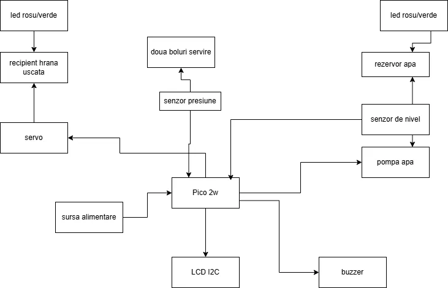
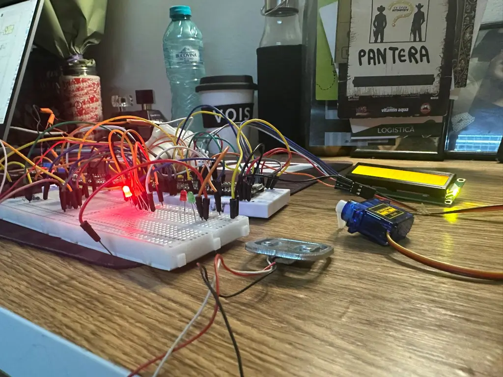
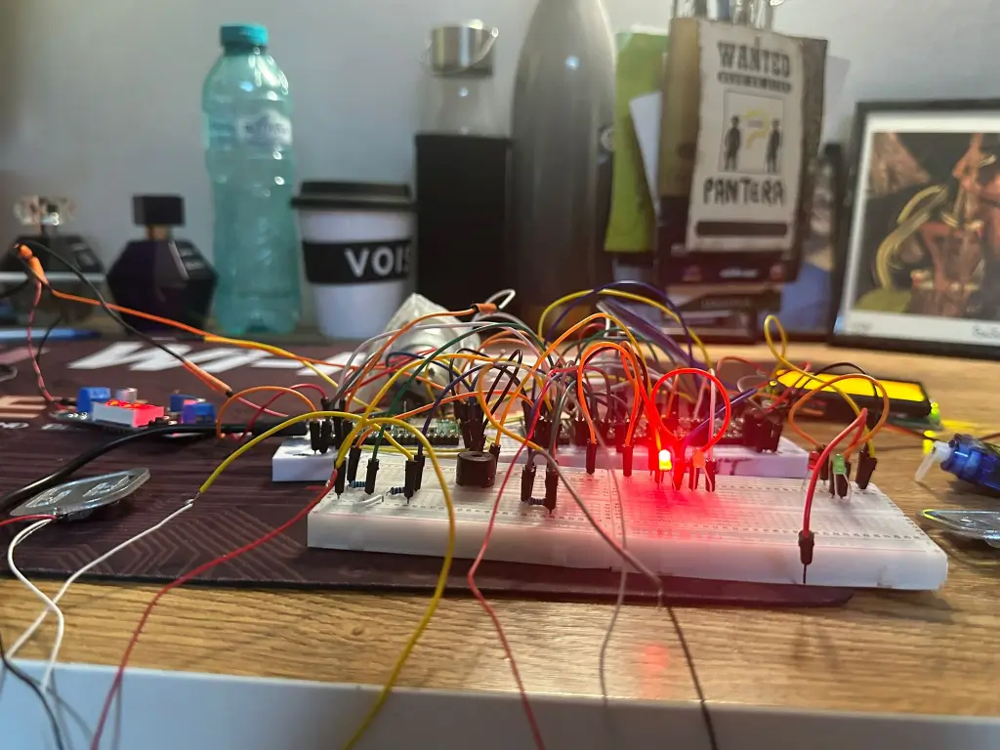
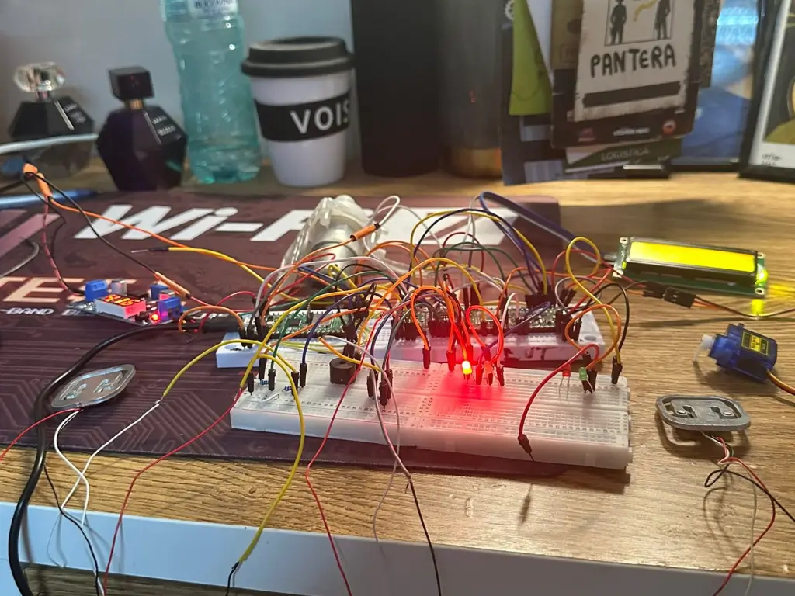
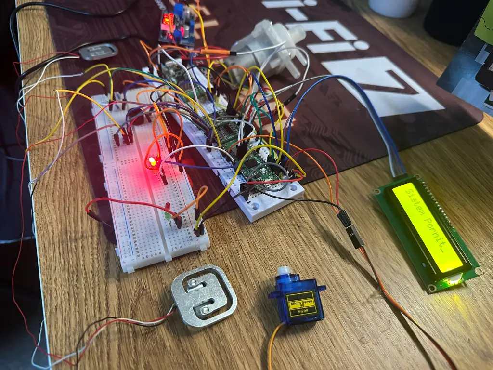
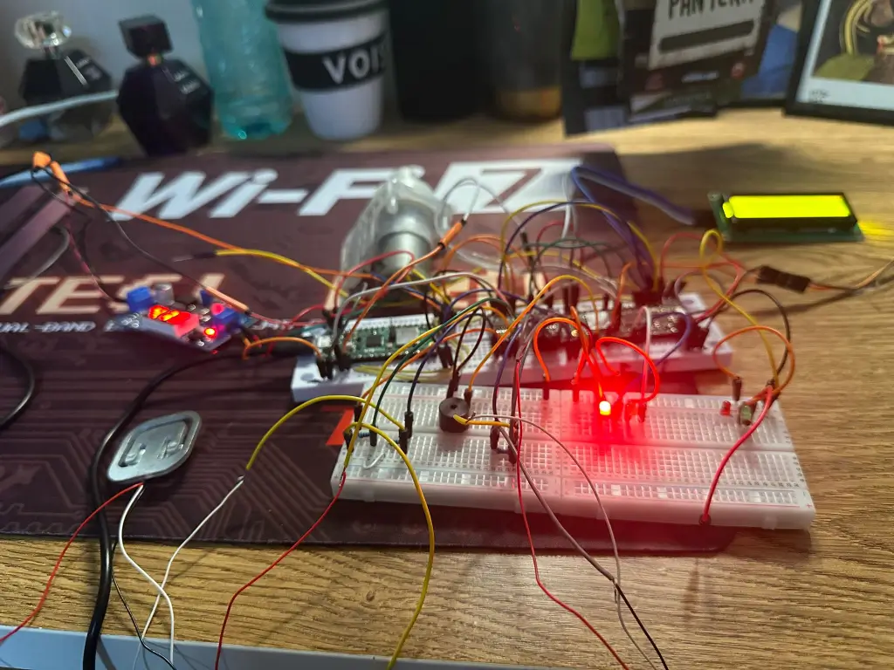

# Automatic feeder for animals
An automatic pet feeder that, at fixed times, dispenses a specific amount of food until the bowls.
:::info 

**Author**: Lazar Alessia-Alessandra \
**GitHub Project Link**: https://github.com/UPB-PMRust-Students/proiect-lalessiaa

:::

## Description

My project consists of an automatic pet feeder that dispenses food at scheduled times: 7 AM, 12 PM, and 7 PM. It functions independently, even when the owner is away.

Weight sensors monitor the levels of food and water in the bowls. When either of them reaches zero, the system activates the water pump for 6 seconds and the servo motor for 4 seconds to release a fixed amount of food and water. This ensures a constant supply in the bowls throughout the day.

I also added a manual feeding button. When the owner presses it, the feeder automatically dispenses food and water based on the current weight in the bowls. Depending on the measured values, the pump may run for 6 seconds, 3 seconds, or not at all, while the servo may run for 4 seconds or remain off.

Red LEDs indicate when the food drops below 50g or the water below 100g, while green LEDs light up when the levels are optimal.

To enhance functionality, I added a buzzer to notify the pet when it’s feeding time, and an LCD screen that displays the current weight in each bowl and the total number of meals dispensed.

## Motivation

I chose this project because of my love for animals and the desire to simplify the feeding process on busy days. If the owner has a full day or is away from home all day, the pet will still have enough food, in moderate amounts throughout the day. This way, the feeding process becomes automated and easier to manage in everyday life.

## Architecture 



## Log

<!-- write your progress here every week -->

### Week 5 - 11 May
- I did research related to the project implementation
- I looked for suitable components that are compatible with each other
- I searched for the datasheets of the components

### Week 12 - 18 May
- In the following week, I assembled the components, trying to figure out how they should be connected to each other.
Thus, I managed to connect the Raspberry Pi Pico 2W to the servo motor, to the pressure sensors, to the water pump, to the buzzer, and to the button I intended to use for faster testing.
I used a Dual Motor Driver Module L298N to power the pump, which runs on 12V (I have an external 12V power supply purchased specifically for the pump).
The 12V output is connected to the pump, and the 5V output is connected to the Pico.

- I also implemented some small test codes to check if the components work well together.

### Week 19 - 25 May

- In the last week, I worked constantly on the code and tried to add new and useful features, while also ensuring the proper functionality of the code to integrate the components effectively.
Thus, I managed to make the servo and the pump operate using the RTC integrated in the microcontroller — meaning it dispenses at 9 AM, 12 noon, and 7 PM.
Additionally, if the quantity in the bowls drops below a certain level (all measured by the scales), the servo and the pump will dispense a specific amount.
The LEDs light up according to the weight in the bowls: green if the weight is optimal, and red if it is below a certain threshold.
On the LCD, the number of meals already served is displayed, along with the weight in the bowls and the current time.

## Hardware

Pico 2W – control board for the feeder

Servo motor – operates the flap for dispensing kibble

Water pump – fills the water container

Level sensor – measures the water level in the container

Pressure sensor – measures the total weight of dry food

Instrumentation module HX711 – converts the pressure sensor data to control the motor

Buzzer – audio signal

LEDs – reservoir level indicators








### Schematics


### Bill of Materials

<!-- Fill out this table with all the hardware components that you might need.

The format is 
```
| [Device](link://to/device) | This is used ... | [price](link://to/store) |

```

-->

| Device | Usage | Price |
|--------|--------|-------|
| [Raspberry Pi Pico 2W](https://www.optimusdigital.ro/ro/placi-raspberry-pi/13327-raspberry-pi-pico-2-w.html) | The microcontroller |39.66 RON|
| [ HX711 Load Cell Amplifier Module](https://www.optimusdigital.ro/ro/senzori-altele/130-modul-de-intrumentatie-hx711.html) | Data convertor |5.99 RON|
| [Servo](https://www.optimusdigital.ro/ro/motoare-servomotoare/271-servomotor-mg90s.html) | Operates the flap |19.33 RON|
| [Mini water pump](https://www.optimusdigital.ro/ro/altele/8141-mini-pompa-de-apa-12-v.html) | Fills the water container |15.99 RON|
| [Pressure sensor](https://www.optimusdigital.ro/ro/senzori-altele/816-traductor-de-apasare-de-50-kg.html) | Data measurement |29.59 RON|
| [Dual Motor Driver Module L298N](https://www.optimusdigital.ro/ro/drivere-de-motoare-cu-perii/145-driver-de-motoare-dual-l298n.html?search_query=Driver+motor+&results=119) | Motor driver |10.99 RON|
| [3.3V Passive Buzzer](https://www.optimusdigital.ro/ro/audio-buzzere/12247-buzzer-pasiv-de-33v-sau-3v.html?search_query=Buzzer+Pasiv+de+3.3V+sau+3V&results=1) | 3.3V or 3V Passive Buzzer |0.99 RON|

## Software

| Library       | Description                 | Usage                                                                 |
|---------------|-----------------------------|------------------------------------------------------------------------|
| hx711         | HX711 Load Cell Amplifier   | Used for reading weight data from the pressure sensor (load cell).    |
| stepper       | Stepper motor driver        | Controls the stepper motor to dispense food accurately.               |
| lcd-i2c       | I2C LCD display             | Displays real-time data such as time, weight, and alerts.             |
| rtc-pcf8523   | Real-Time Clock (RTC)       | Keeps track of time for scheduled feeding.                            |
| pico-sdk      | Raspberry Pi Pico SDK       | Low-level support for the Pico 2W microcontroller.                    |
| embedded-hal  | Embedded Hardware Abstraction Layer | Provides traits for abstracting embedded hardware peripherals. |


## Links

<!-- Add a few links that inspired you and that you think you will use for your project -->

1. [Pet feeders and water dispensers](https://www.designswan.com/archives/tech-savvy-pet-care-a-deep-dive-into-8-intelligent-pet-feeders-and-water-dispensers.html)
2. [Pet feeder arduino](https://www.youtube.com/shorts/OVoXJtKARpU)

