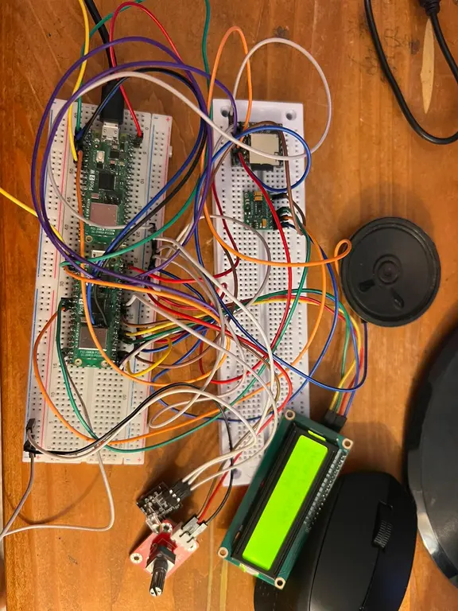
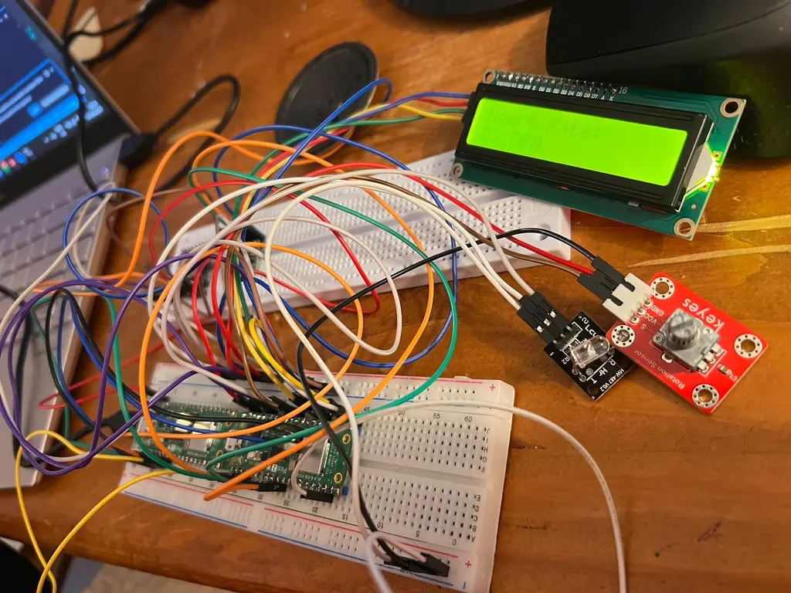
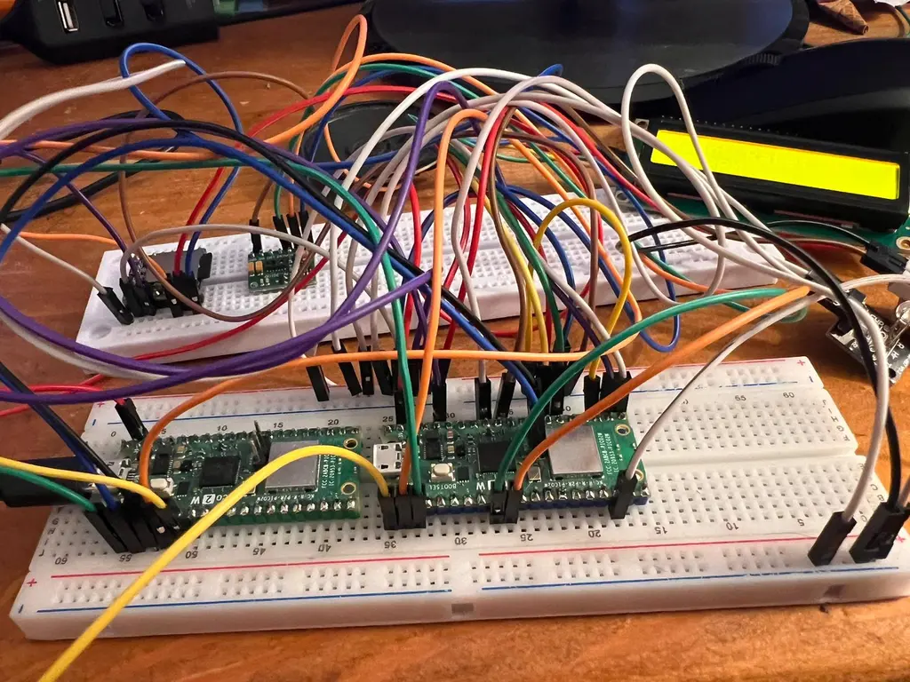
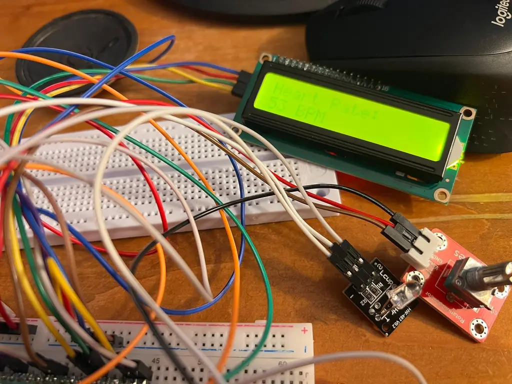

# PulseBeats  
A small device that reads your heart rate and plays matching sound feedback.

:::info

**Author**: Alexia-Andra Mihai \
**GitHub Project Link**: https://github.com/UPB-PMRust-Students/proiect-alexiamihai

:::

## Description  
PulseBeats is a portable embedded device built with a Raspberry Pi Pico W that monitors the user’s heart rate using the MAX30102 sensor. It provides real-time visual and audio feedback through an LCD display and a passive speaker. The goal is to offer a simple way to reflect biometric signals in an engaging way.

## Motivation  
I enjoy working with sound and music, and I wanted to explore how it could be used in a meaningful, helpful way. This project gave me a chance to combine audio output with a real-life use case — monitoring your pulse — and make the data feel more alive through sound and display. It's both fun and potentially useful for relaxation or health awareness.

## Architecture  

```mermaid
graph TD
    RASPBERRY_PI_PICO2W["RASPBERRY PI<br>PICO2W"]

    SENZOR_PULS["SENZOR PULS"]
    ECRAN_LCD["ECRAN LCD"]
    DFPLAYER_MINI["DFPLAYER MINI"]
    CARD_SD["CARD SD"]
    DIFUZOR["DIFUZOR"]
    POTENTIOMETRU["POTENTIOMETRU"]

    RASPBERRY_PI_PICO2W --> SENZOR_PULS
    RASPBERRY_PI_PICO2W --> ECRAN_LCD
    RASPBERRY_PI_PICO2W --> DFPLAYER_MINI
    RASPBERRY_PI_PICO2W --> POTENTIOMETRU


    DFPLAYER_MINI --> CARD_SD
    DFPLAYER_MINI --> DIFUZOR
```

Main components of the system:

- **Pulse Sensor (MAX30100/KY-039)**  
  A digital pulse oximeter and heart-rate sensor that reads the user's heart rate using infrared light. It communicates with the controller via I2C.

- **Controller (Raspberry Pi Pico W)**  
  A low-cost microcontroller that manages the logic, processes sensor data, and controls both the audio and visual outputs.

- **Audio Output (Passive Speaker)**  
  A small passive speaker driven. It plays rhythmic tones or feedback sounds based on heart rate.

- **Visual Output (LCD 1602 with I2C)**  
  A 16x2 character display with I2C interface, used to show the current BPM (beats per minute) or system messages.

- **DFPlayer Mini**  
  A compact MP3 player module that reads audio files from a microSD card. Controlled via UART, it allows playback of songs or audio messages, enabling richer sound feedback.

- **Optional UI (Buttons, Rotation Angle Sensor)**  
  - **Buttons** are used for starting/stopping sound.  
  - **Rotation Angle Sensor** (Potentiometer-based) provides analog input for adjusting volume.

- **Storage (MicroSD Card Module)**  
  A module for reading/writing data to a microSD card via SPI. Used for storing the music that will be played according to the user’s pulse.

## Log  

### Week 21 – 27 April

Ordered some of the required hardware components for the project, including the Raspberry Pi Pico W, LCD display, and audio modules. Also explored available alternatives for out-of-stock parts (the pulse sensor).

### Week 28 April – 4 May

Worked on the initial project documentation. Defined the main structure, described the motivation, outlined the architecture, and began listing the components and their roles.

### Week 5 – 11 May

Ordered additional components needed for the project. Set up a development environment by connecting two Raspberry Pi boards in a debugging configuration, which allowed for more efficient testing and troubleshooting of individual modules before final integration.

### Week 12 – 18 May

Completed the hardware assembly phase of the project. Connected all components according to the planned schematic and performed individual testing of each module to ensure proper functionality.
   
### Week 19 – 25 May
I developed code for each individual component separately and then integrated everything into a complete, functional program that meets all the required specifications. During the process, I addressed issues caused by unstable power supply to ensure reliable operation. Additionally, I made efforts to arrange the components in a more organized and aesthetically pleasing manner.

## Hardware  

- **Raspberry Pi Pico W** – The main microcontroller that reads sensor data, controls output devices, and handles logic.
- **MAX30100 Pulse Sensor** – Detects heart rate using infrared light and communicates via I2C.
- **KY-039 Pulse Sensor** – Alternative analog finger pulse sensor that detects heartbeats using infrared light reflection.
- **1602 LCD Display (I2C)** – Displays heart rate, system messages, or prompts in real time.
- **DFPlayer Mini** – MP3 audio playback module used to play sound files stored on a microSD card.
- **MicroSD Card Module** – Stores audio files or logs data; used with DFPlayer Mini.
- **Passive Speaker (0.5W)** – Plays simple tones or audio feedback through the DFPlayer or filtered signal.
- **Keyes 300 Rotation Angle Sensor** – Potentiometer-based sensor for adjusting volume or other parameters.
- **Jumper wires, breadboard** – Used to connect all components for prototyping.

## Schematics  

## Bill of Materials  

| Device | Usage | Price |
|--------|-------|-------|
| [Raspberry Pi Pico W(2)](https://www.optimusdigital.ro/en/raspberry-pi-boards/12394-raspberry-pi-pico-w.html) | Microcontroller | [39,66 RON](https://www.optimusdigital.ro/en/raspberry-pi-boards/12394-raspberry-pi-pico-w.html) |
| [MAX30100](https://www.optimusdigital.ro/en/others/2166-green-max30100-heart-rate-sensor-module.html?search_query=max+30100&results=4) | Heart rate & SpO₂ sensor | [25 RON](https://www.optimusdigital.ro/en/others/2166-green-max30100-heart-rate-sensor-module.html?search_query=max+30100&results=4) |
| [LCD 1602 (I2C)](https://www.optimusdigital.ro/en/lcds/62-1602-lcd-with-i2c-interface-and-yellow-green-backlight.html) | Display | [15 RON](https://www.optimusdigital.ro/en/lcds/62-1602-lcd-with-i2c-interface-and-yellow-green-backlight.html) |
| Miniature Speaker (0.25W) | Sound feedback | borrowed |
| [MicroSD Card](https://www.optimusdigital.ro/en/memories/8678-original-microsd-card-16-gb-for-raspberry-pi-4-model-b-preinstalled-with-noobs-bulk.html?search_query=microsd&results=91) | Data storage | [40 RON](https://www.optimusdigital.ro/en/memories/8678-original-microsd-card-16-gb-for-raspberry-pi-4-model-b-preinstalled-with-noobs-bulk.html?search_query=microsd&results=91) |
| [Breadboard(2)](https://www.optimusdigital.ro/en/breadboards/13245-breadboard-750-points.html?search_query=breadboard&results=362) | Prototyping | [12 RON](https://www.optimusdigital.ro/en/breadboards/13245-breadboard-750-points.html?search_query=breadboard&results=362) |
| [DFPlayer Mini](https://www.optimusdigital.ro/en/audio/1484-dfplayer-mini-miniature-mp3-player-module.html) | MP3 Player | [14 RON](https://www.optimusdigital.ro/en/audio/1484-dfplayer-mini-miniature-mp3-player-module.html) |
| [Keyes 300 Rotation Angle Sensor](https://www.pfdeal.com/products/keyes-300-degree-rotation-angle-sensor-for-arduino-red) | Potentiometer | [12 RON](https://www.pfdeal.com/products/keyes-300-degree-rotation-angle-sensor-for-arduino-red) |
| [Modul Senzor Puls](https://www.optimusdigital.ro/ro/senzori-altele/12594-modul-senzor-puls.html?search_query=Modul+Senzor+Puls&results=17) | Heart rate sensor | [2 RON](https://www.optimusdigital.ro/ro/senzori-altele/12594-modul-senzor-puls.html?search_query=Modul+Senzor+Puls&results=17) |

---

## Software  

| Library | Description | Usage |
|---------|-------------|-------|
| [embassy-rs](https://github.com/embassy-rs/embassy) | Async multitasking framework for embedded systems | Used to manage asynchronous tasks |
| [embedded-hal](https://github.com/rust-embedded/embedded-hal) | Hardware abstraction layer for embedded systems | Used to interface with embedded peripherals generically |
| [max3010x](https://github.com/almindor/max3010x) | Driver for MAX30100/MAX30102 pulse oximeter sensors | Used to read heart rate and SpO₂ data |
| [dfplayer-async](https://crates.io/crates/dfplayer-async) | Library for controlling the DFPlayer Mini MP3 module | Used for audio playback via serial communication |
| [lcd1602-diver](https://crates.io/crates/lcd1602-diver)       | Simple LCD1602 I2C driver                      | Provides display control for messages on the LCD       |
| [defmt](https://github.com/knurling-rs/defmt)                 | Lightweight logging for embedded systems       | Logs runtime information via RTT                       |
| [defmt-rtt](https://github.com/knurling-rs/defmt)             | Real-Time Transfer (RTT) backend for `defmt`   | Transfers logs from the device to the host             |
| [panic-probe](https://github.com/knurling-rs/panic-probe)     | Panic handler for embedded Rust with `defmt`   | Handles and logs panics efficiently                    |
| [embassy-time](https://docs.rs/embassy-time)                  | Time and delays for async Embassy tasks        | Handles timers, delays, and time measurements          |
| [embassy-sync](https://docs.rs/embassy-sync)                  | Lightweight async synchronization primitives   | Provides channels and mutexes for task comms           |
| [static\_cell](https://docs.rs/static_cell)                   | Safe static memory allocations                 | Used to initialize peripherals with `'static` lifetime |

---

## Links  
https://crates.io/crates/dfplayer-async
https://sensorkit.joy-it.net/en/sensors/ky-039
https://wiki.dfrobot.com/DFPlayer_Mini_SKU_DFR0299

