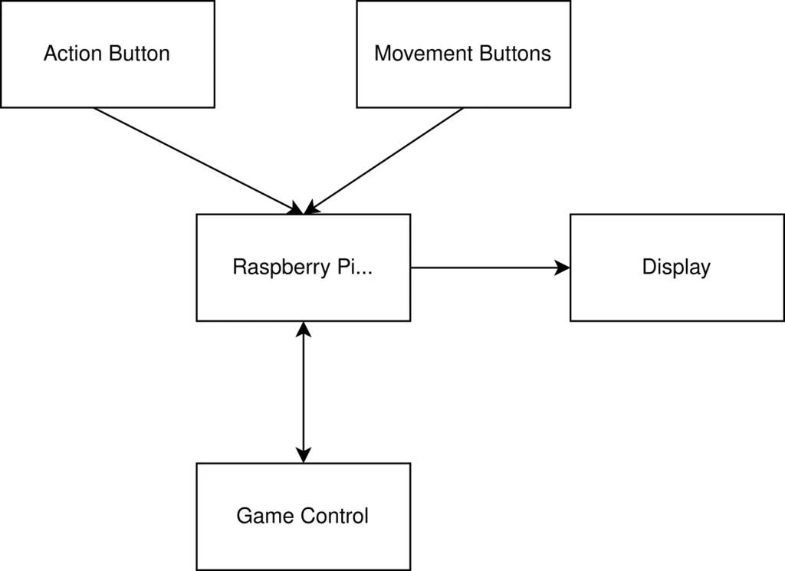
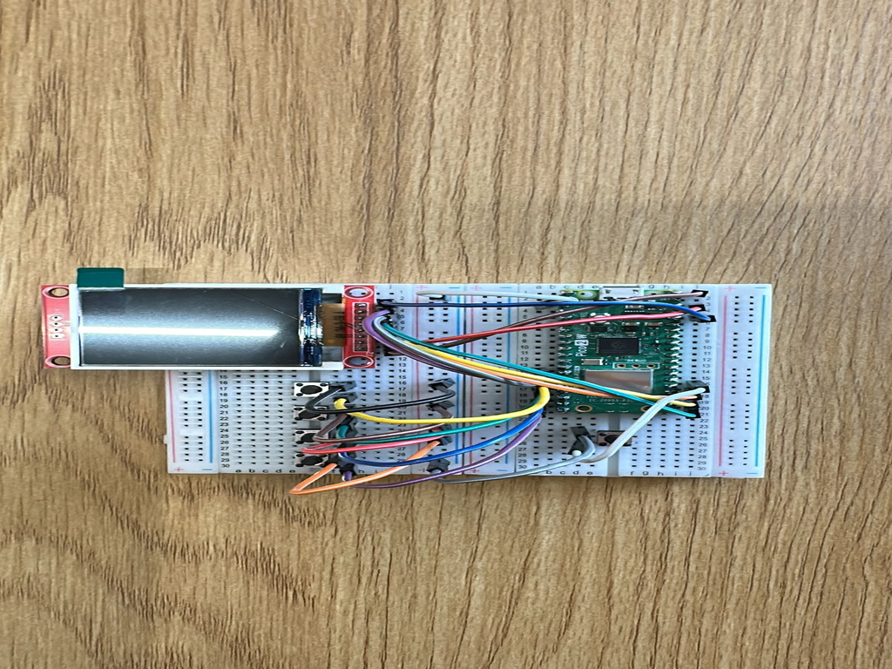
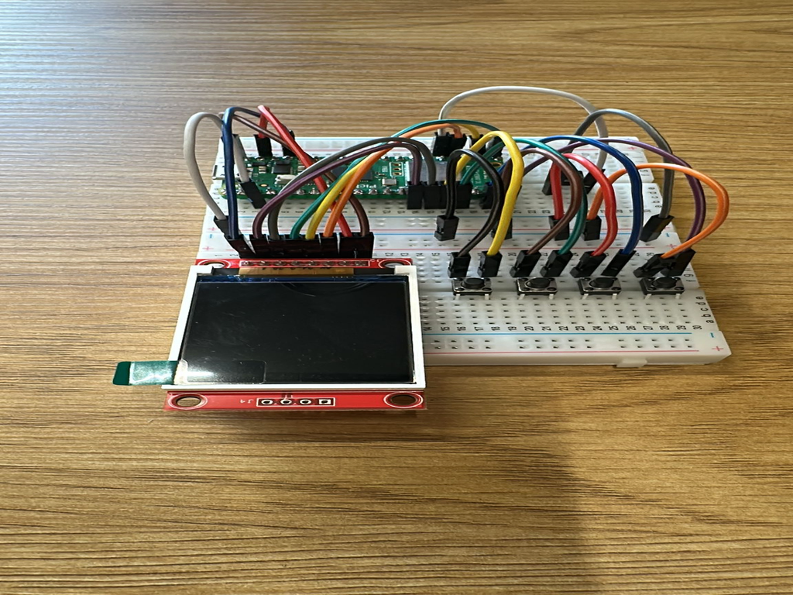
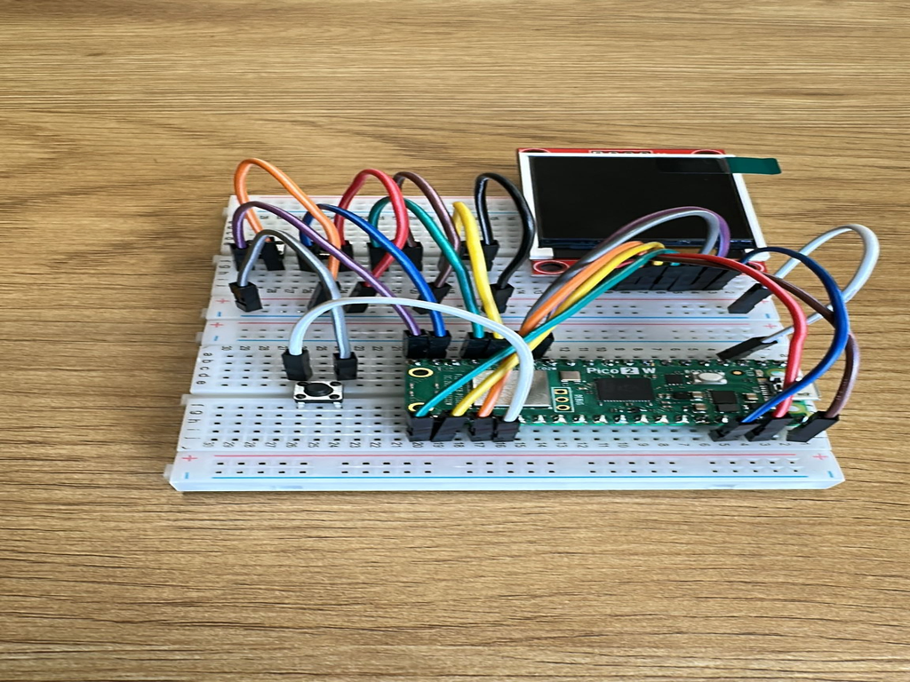
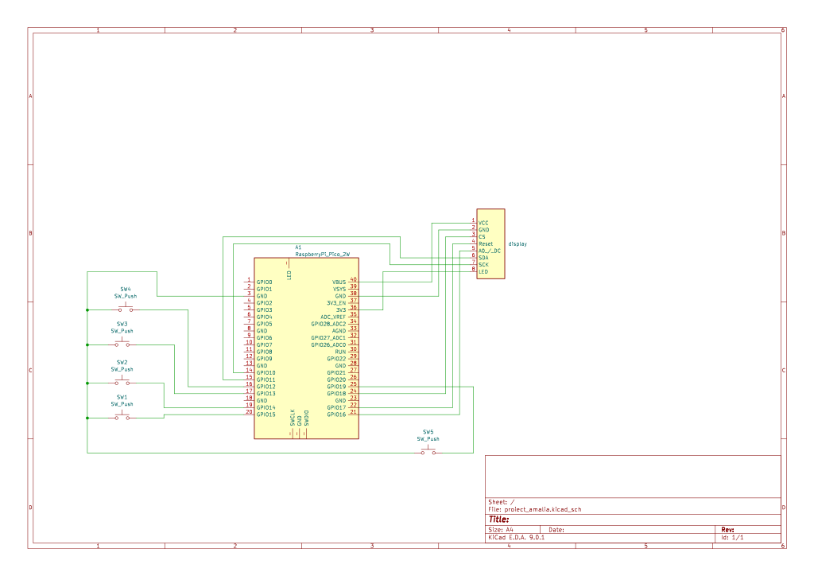

# Ultimate tic tac toe
Ultimate tic tac toe implemented in rust

:::info
**Author**: Grumazescu Amalia - Maria \
**Github Project Link**: https://github.com/UPB-PMRust-Students/proiect-amaliagrumazescu

:::

## Description

Ultimate Tic Tac Toe is a variation of the classic Tic Tac Toe game, composed of 9 games of classic Tic Tac Toe on a 3x3 board. The game is a lot more complex than the classic variation, with each move determining where the other player is allowed to place their next symbol. When a player places a symbol into a case on the small board the other player is forced to place their symbol in the corresponding small board. When someone completes a small board it is replaced by a large symbol and no further moves are allowed in that board, with the game ending when one player has a line of large symbols.

## Motivation

The decision to implement this game was rather simple, as I always enjoyed playing the classic Tic Tac Toe, however it was too simple to code, so I decided to challange myself with the more complex variation, known as Ultimate Tic Tac Toe

## Arhitecture

## Log

### Week 28 April - 4 May

Final documentation

### Week 5 - 11 May

Checking the components and initial testing of the build

### Week 12 - 18 May

Final hardware design \
Initial software testing

### Week 19 - 25 May

Final version of the project

# Hardware

Raspberry Pi Pico 2W - main controller of the components
LCD Display -  displays the game
Buttons - used to control the game
Breadboard - to simplify the connections

### Schematics

### Bill of materials

| Device | Usage | Price |
|--------|-------|-------|
| [Raspberry Pi Pico 2W](https://www.raspberrypi.com/documentation/microcontrollers/pico-series.html) | Main controller of components | [40 RON](https://www.optimusdigital.ro/ro/placi-raspberry-pi/13327-raspberry-pi-pico-2-w.html) |
| Buttons | 5 buttons for the game controls | [2 RON](https://www.optimusdigital.ro/ro/butoane-i-comutatoare/1119-buton-6x6x6.html) |
| Rezistors | 10k Ohm rezistors for the buttons | [1 RON](https://www.optimusdigital.ro/ro/componente-electronice-rezistoare/1088-rezistor-025w-100k.html) |
| Breadboard | 400 point breadboard to ease connecting the pieces | [5 RON](https://www.optimusdigital.ro/ro/prototipare-breadboard-uri/44-breadboard-400-points.html) |
| Cables | Used for connections between the components | [6 RON](https://www.optimusdigital.ro/ro/fire-fire-mufate/93-fire-colorate-tata-tata-20cm.html) |
| Lcd display | For displaying the game | [45 RON](https://ardushop.ro/ro/display-uri-si-led-uri/1349-modul-lcd-spi-128x160-6427854019561.html) |

## Software

| Library | Description | Usage |
|---------|-------------|-------|
| [st7735](https://github.com/Matiasus/ST7735) | Display driver | Used of the LCD display |
| [embedded-graphics](https://github.com/embedded-graphics/embedded-graphics) | 2D graphics library | Used for drwaing for the display |

# Links
1. [About Ultimate Tic Tac Toe](https://en.wikipedia.org/wiki/Ultimate_tic-tac-toe)
