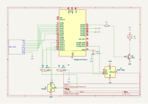
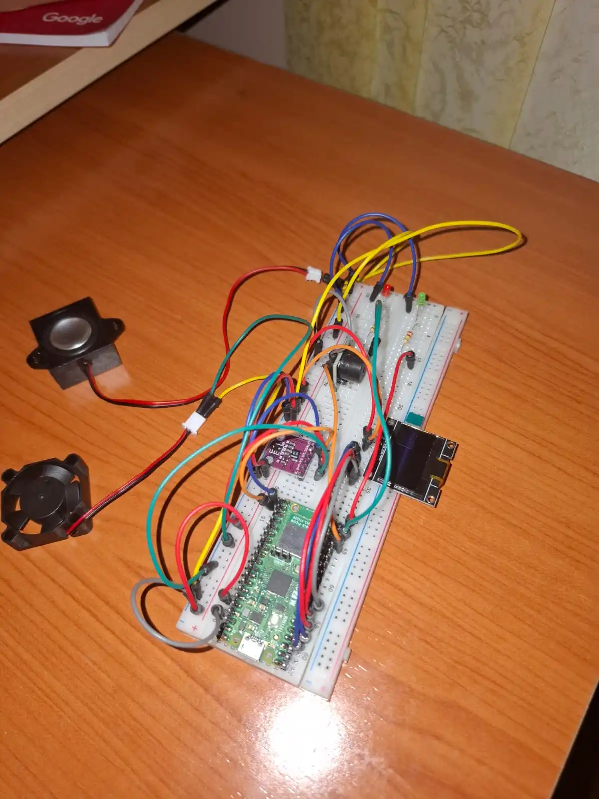
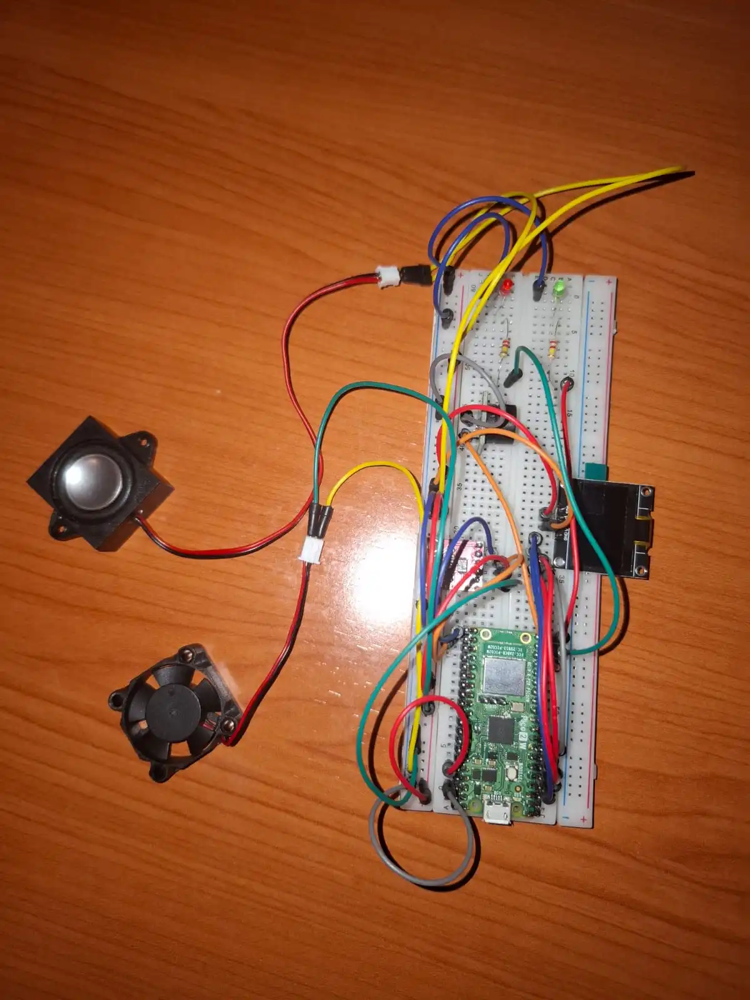

# Project Name
Mini-sera inteligenta

:::info 

**Author**: Ionescu Ana-Corina 334CC \
**GitHub Project Link**: [link_to_github](https://github.com/UPB-PMRust-Students/proiect-Corina0408)

:::

## Description

Acest proiect urmareste realizarea unei mini-sere inteligente care monitorizeaza conditiile de
mediu si reactioneaza automat pentru a proteja plantele. Sistemul citeste temperatura, umiditatea
si luminozitatea, afiseaza valorile pe un ecran LCD si semnaleaza situatiile critice prin LED-uri si
buzzer. In plus, un ventilator este folosit.

## Motivation

Am ales sa dezvolt o mini-sera inteligenta deoarece imbina mai multe domenii de interes personal: tehnologia embedded, automatizarea si grija pentru plante. Acest proiect ofera o oportunitate practica de a lucra cu senzori, afisaj LCD, controlul GPIO si componente de alertare, contribuind la dezvoltarea unei solutii utile si intuitive pentru monitorizarea mediului. In plus, sistemul de ventilatie adauga un plus de relevanta practica si personala acestui proiect

## Architecture 

Sistemul este compus din urmatoarele **module arhitecturale**:

   - **Modul de monitorizare a mediului** 
    Format din senzorul de temperatura si umiditate (DHT11) si senzorul de lumina (LDR), care masoara conditiile de mediu si trimit valorile catre celelalte module.

    - **Modul de afisare**
    Preia informatiile de la modulul de monitorizare si le afiseaza pe un ecran  cu interfata I2C.

    - **Modul de alerta**
    Verifica daca valorile senzorilor depasesc pragurile setate si activeaza componentele de avertizare:

        - In caz de situatie critica: se aprinde LED-ul rosu si se activeaza buzzer-ul.

        - In caz de valori normale: se aprinde LED-ul verde.

    - **Modul de ventilatie automata**
    Daca temperatura depaseste un anumit prag, se porneste ventilatia

    - **Modul de control principal – Raspberry Pi**
    Coordoneaza toate modulele, citeste datele de la senzori, actualizeaza afisajul, genereaza alertele si controleaza ventilatia.
    Logica este implementata in Rust, folosind bibliotecile:

        - rppal – pentru controlul pinilor GPIO si PWM

        - dht-sensor – pentru senzorul de temperatura/umiditate

        - hd44780-driver – pentru afisajul LCD

        - tokio – pentru gestionarea asincrona a task-urilor

## Log

<!-- write your progress here every week -->

### Week 5 - 11 May
Finalizarea cumpararii componentelor.

### Week 12 - 18 May
Aranjarea componentelor pe placuta si testarea functionalitatii lor.

### Week 19 - 25 May
Finalizarea codului pt alerta.

## Hardware
- Raspberry Pi RP2350 (Pico 2W)
- Senzor de lumina: APDS-9930 (I2C, 0x39)
- Display OLED SSD1306 (I2C, 0x3C, 128x64 px)
- GPIO 0 – SDA, GPIO 1 – SCL
- Conexiuni optionale: LED, buzzer, etc. (pentru feedback de alerta)


### Schematics





### Bill of Materials

<!-- Fill out this table with all the hardware components that you might need.

The format is 
```
| [Device](link://to/device) | This is used ... | [price](link://to/store) |

```

-->

| Device | Usage | Price |
|--------|--------|-------|
| [Raspberry Pi Pico W](https://www.raspberrypi.com/documentation/microcontrollers/raspberry-pi-pico.html) | The microcontroller | [35 RON](https://www.optimusdigital.ro/en/raspberry-pi-boards/12394-raspberry-pi-pico-w.html) |
| [Header de Pini Tată de 2.54 mm 2 x 25p](https://www.optimusdigital.ro/ro/componente-electronice-headere-de-pini/8446-header-de-pini-tata-de-254-mm-2-x-25p.html?search_query=Header+de+Pini+Tata+de+2.54+mm+2+x+25p&results=1) | Pini | [14,19 RON]
| [Header de Pini Mamă 3p 2.54 mm](https://www.optimusdigital.ro/ro/componente-electronice-headere-de-pini/4145-header-de-pini-mama-3p-254-mm.html?search_query=Header+de+Pini+Mama+3p+2.54+mm&results=68) | Pini | [5,88 RON]
| [LED Roșu de 3 mm cu Lentile Difuze](https://www.optimusdigital.ro/ro/cautare?controller=search&orderby=position&orderway=desc&search_query=LED+Ro%C8%99u+de+3+mm+cu+Lentile+Difuze+&submit_search=) | LED | [1,95 RON]
| [LED Verde de 3 mm cu Lentile Difuze](https://www.optimusdigital.ro/ro/cautare?controller=search&orderby=position&orderway=desc&search_query=+%09LED+Verde+de+3+mm+cu+Lentile+Difuze+&submit_search=) | LED | [1,95 RON]
| [Senzor de Temperatura și Umiditate DHT22](https://www.optimusdigital.ro/ro/senzori-senzori-de-temperatura/1199-senzor-de-temperatura-i-umiditate-dht22.html?search_query=Senzor+de+Temperatura+%C8%99i+Umiditate+DHT22+&results=6) | Senzor pentru temperatura si umiditate | [22,99 RON]
| [Senzor de Proximitate si Lumina Ambientala APDS-9930](https://www.optimusdigital.ro/ro/senzori-altele/1690-senzor-de-proximitate-si-lumina-ambientala-apds-9930.html?search_query=Senzor+de+Proximitate+si+Lumina+Ambientala+APDS-9930+&results=1) | Senzor de lumina | [14,99 RON]
| [Rezistor 0.25W 220KΩ](https://www.optimusdigital.ro/ro/componente-electronice-rezistoare/856-rezistor-025w-220k.html?search_query=Rezistor+0.25W+220K%CE%A9+&results=2) | Rezistente | [1 RON]

## Software

| Library | Description | Usage |
|---------|-------------|-------|
| [st7789](https://github.com/almindor/st7789) | Display driver for ST7789 | Used for the display for the Pico Explorer Base |
| [embedded-graphics](https://github.com/embedded-graphics/embedded-graphics) | 2D graphics library | Used for drawing to the display |
| [defmt](https://github.com/knurling-rs/defmt) | Logging framework for embedded Rust | Used for efficient logging |
| [embassy-executor](https://github.com/embassy-rs/embassy) | Asynchronous task executor | Used for async multitasking on embedded |
| [embassy-rp](https://github.com/embassy-rs/embassy) | Embassy support for Raspberry Pi Pico (RP2040) | Used for I2C, interrupts and peripherals |
| [embassy-time](https://github.com/embassy-rs/embassy) | Timer utilities | Used for delays and timers |
| [embassy-sync](https://github.com/embassy-rs/embassy) | Async synchronization primitives | Used for mutexes and signals |
| [embedded-hal-async](https://github.com/embassy-rs/embedded-hal-async) | Async traits for HAL | Used for async I2C communication |
| [heapless](https://github.com/japaric/heapless) | Fixed-capacity data structures | Used for dynamic strings without heap |
| [static-cell](https://github.com/embassy-rs/static-cell) | Single-assignment static memory cells | Used for static initialization of resources |
| [panic-probe](https://github.com/knurling-rs/panic-probe) | Panic handler | Used for debugging panics |
| [defmt-rtt](https://github.com/knurling-rs/defmt) | RTT backend for `defmt` | Used for real-time logging over RTT |
| [core::fmt::Write](https://doc.rust-lang.org/core/fmt/trait.Write.html) | Core formatting trait | Used for writing formatted strings |

## Links

<!-- Add a few links that inspired you and that you think you will use for your project -->

1. [link](https://example.com)
2. [link](https://example3.com)
...
