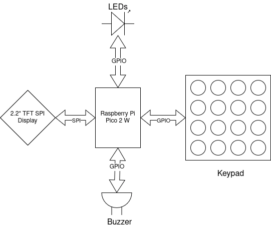
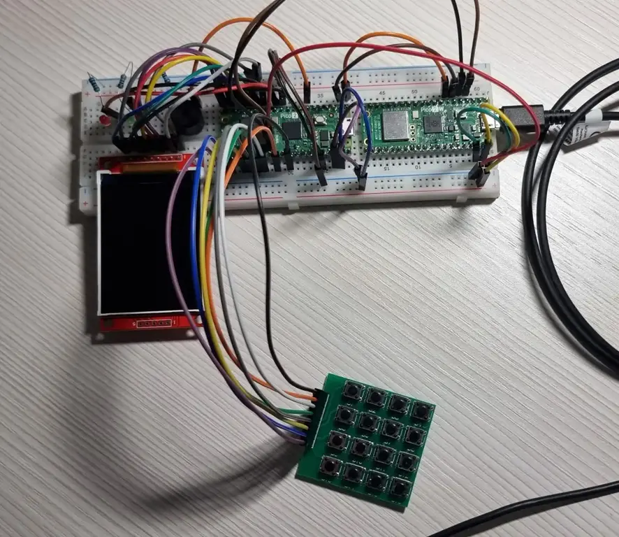
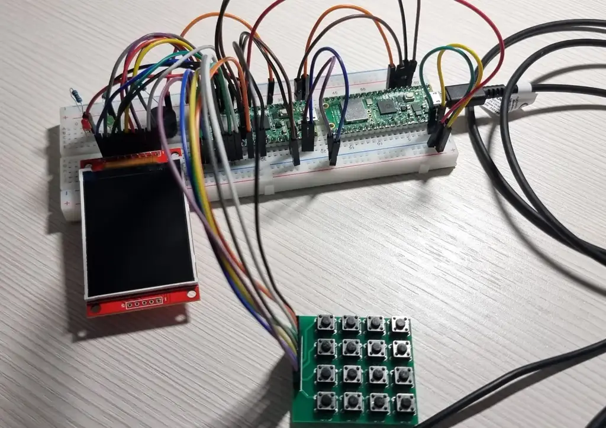
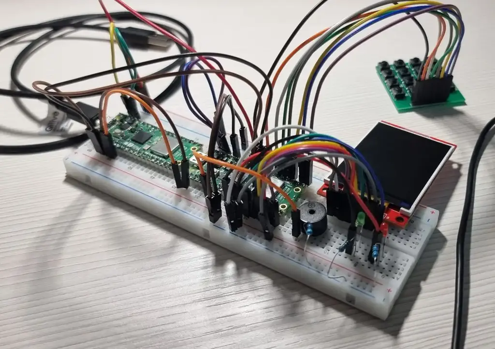

# Tic-Tac-Toe
Four cool Tic-Tac-Toe variants in one device.

:::info 

**Author**: Cîrstescu Andrei-Vlad \
**GitHub Project Link**: https://github.com/UPB-PMRust-Students/proiect-cirstescuandrei

:::

## Description

This project implements a classic Tic-Tac-Toe game on an RP2350 development board, using a 2.2" SPI TFT display for \
graphical output and a 4x4 button matrix for user input. Players interact with the game by selecting grid positions \
via the button matrix, while the display shows the game board, moves, and results in real time. The project will also \
include multiple variants to the Tic-Tac-Toe game: 
  * Misère Tic-Tac-Toe -> The goal is to not get 3 in a row.
  * Wild Tic-Tac-Toe -> Players can place either O or X.
  * Forgetful Tic-Tac-Toe -> Fourth-last moves are erased at each step.

## Motivation

This project was created to explore how simple games like Tic-Tac-Toe can be made more engaging through creative \
variants, while also providing a fun way to apply embedded programming skills and hardware integration. I decided upon \
this project because I was interested in working with a display in an embedded context, while also recreating a staple \
pen-and-paper game turned digital like Tic-Tac-Toe.

## Architecture 



- ### Raspberry Pi Pico 2 W
  * Central Microcontroller, manages button inputs and interfaces with the Display.
  * Connects directly to the Button Matrix and the TFT Display.
- ### 2.2" TFT SPI LCD Display(ILI9341)
  * Display to show the state of the game, as well as player scores and the game variant.
  * Interfaces with the Microcontroller through SPI.
- ### 4x4 Button Matrix
  * Handles inputs for X and O placements, game variant selection and restart.
- ### Passive Buzzer
  * Used to play the background song.
  * The song is Lost Woods(Saira's Song) from The Legend of Zelda: Ocarina of Time.
- ### LEDs
  * Two LEDs, green and red.
  * Lights up according to winner.

## Device pictures










## Log

<!-- write your progress here every week -->

### Week 5 - 11 May
  * Bought components.
  * Tested button matrix and screen.

### Week 12 - 18 May
  * Decided to add LEDs and a buzzer.
  * Finished hardware assembly.

### Week 19 - 25 May
  * Finished documentation.
  * Translated the sheet music for Lost Woods to note frequecies and durations.
  * Spent the week writing the code for the device.
  * Ironed out all the bugs by the end of the week.

## Hardware

  - ### Raspberry Pi Pico 2 W
    * Connected through GPIOs to the Display and Button Batrix.
  - ### 2.2" TFT SPI LCD Display(ILI9341)
    * SCK, MOSI, MISO, RESET, DC and CS pins connected to Pico GPIOs on SPI1.
    * LED and VCC are connected to 3V3.
    * Connections on GP2, GP3, GP4, GP5
  - ### 4x4 Button Matrix
    * Connected to 4 input and 4 output pins on the Pico.
    * GP20, GP21, GP22, GP26 for inputs.
    * GP16, GP17, GP18, GP19 for outputs.
  - ### Passive Buzzer
    * Connected to GP5 on the Pico.
  - ### LEDs
    * Red LED connected to GP9.
    * Red LED connected to GP8.

### Schematics


### Bill of Materials

<!-- Fill out this table with all the hardware components that you might need.

The format is 
```
| [Device](link://to/device) | This is used ... | [price](link://to/store) |

```

-->

| Device | Usage | Price |
|--------|--------|-------|
| [Raspberry Pi Pico 2 W](https://www.raspberrypi.com/documentation/microcontrollers/raspberry-pi-pico.html) | The microcontroller | [39.66 RON](https://www.optimusdigital.ro/en/raspberry-pi-boards/13327-raspberry-pi-pico-2-w.html) |
| [4x4 Button Matrix](https://ardushop.ro/ro/butoane--switch-uri/295-modul-tastatura-matriciala-4x4-6427854003126.html) | Button Matrix | [4.19 RON](https://ardushop.ro/ro/butoane--switch-uri/295-modul-tastatura-matriciala-4x4-6427854003126.html) |
| [2.2" TFT SPI Display](https://cdn-shop.adafruit.com/datasheets/ILI9341.pdf) | LCD Display | [59.99 RON](https://www.optimusdigital.ro/en/lcds/1260-lcd-spi-22-240x320-px.html) |
| [Passive Buzzer](https://www.optimusdigital.ro/en/buzzers/12247-3-v-or-33v-passive-buzzer.html) | Passive Buzzer | [0.99 RON](https://www.optimusdigital.ro/en/buzzers/12247-3-v-or-33v-passive-buzzer.html) |
| [Red LED](https://www.optimusdigital.ro/en/leds/29-5-mm-red-led-with-difused-lens.html) | Red LED | [0.39 RON](https://www.optimusdigital.ro/en/leds/29-5-mm-red-led-with-difused-lens.html) |
| [Green LED](https://www.optimusdigital.ro/en/leds/38-5-mm-green-led-with-difused-lens.html) | Green LED | [0.39 RON](https://www.optimusdigital.ro/en/leds/38-5-mm-green-led-with-difused-lens.html) |

## Software

| Library | Description | Usage |
|---------|-------------|-------|
| [embassy-rp](https://github.com/embassy-rs/embassy) | Framework for embedded devices | Used for general functions |
| [embedded-hal](https://github.com/rust-embedded/embedded-hal) | HAL for peripherals | Used for connecting with the buttons/display |
| [mipidsi](https://crates.io/crates/mipidsi) | Generic library for TFT displays | Used for interfacing with the display |
| [ili9341](https://github.com/yuri91/ili9341-rs) | Display driver ILI9341 | Used for the display for the Pico Explorer Base |
| [embedded-graphics](https://github.com/embedded-graphics/embedded-graphics) | 2D graphics library | Used for drawing on the display |

## Links

<!-- Add a few links that inspired you and that you think you will use for your project -->

1. [Link to short demo](https://www.youtube.com/shorts/w8CUQvX3xd8)
2. [Link to the sheet music for Lost Woods from Ocarina of Time](https://musescore.com/user/2114686/scores/780391)
...
