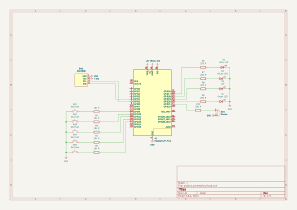
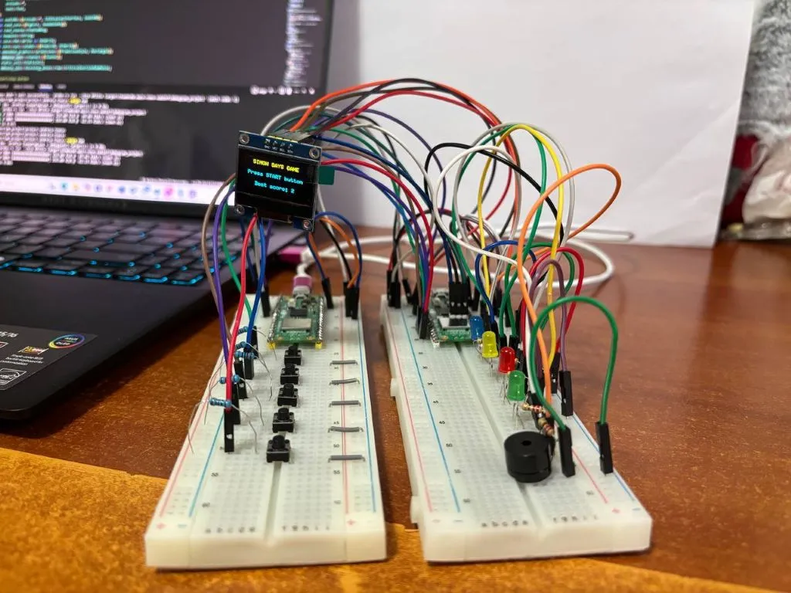

# Simon Says Game

Rust-based interactive memory game with lights.

:::info
**Author:** Toacă Andreia  
**GitHub Project Link:** [https://github.com/UPB-PMRust-Students/proiect-andreia-toaca](https://github.com/UPB-PMRust-Students/proiect-andreia-toaca)
:::

## Description

The game "Simon Says" uses a Raspberry Pi Pico to create an interactive memory game involving lights generated by LEDs. The player must reproduce randomly generated light sequences in the exact order to advance through the levels. As the level increases, the game's difficulty also rises. Throughout the game, various messages are displayed on the screen to guide the player. Real-time feedback is provided, and mistakes are indicated by an error message and a distinct sound. The game includes a timer, requiring the player to complete each sequence before time runs out. There is also a limited number of attempts, and once these are exhausted, the game ends.

## Motivation

The decision to develop a "Simon Says" game using the Raspberry Pi Pico was driven by the desire to combine embedded systems programming with an engaging and educational game concept. "Simon Says" is ideal for testing both hardware interaction (LEDs, buttons, buzzer, OLED display) and software logic (random sequence generation, timers, user input validation). The game offers a clear progression system through levels, which allows for scalable complexity and challenges. Additionally, it enhances the player's memory and reaction time, making it not just entertaining, but also cognitively stimulating. Implementing this game was a valuable opportunity to integrate real-time feedback, user interface elements, and embedded timing mechanisms - all within a fun and interactive project.

## Architecture

The game is built around a Raspberry Pi Pico, which acts as the central controller. It receives input from four push buttons and generates output through RGB LEDs, an OLED display, and a buzzer. The diagram below illustrates how the components interact to implement the game logic.

- Four RGB LEDs will display a random sequence that the player must memorize.  
- The OLED display will show messages.
- By pressing one of the four buttons, the player will try to reproduce the sequence step by step.  
- The buzzer will emit sounds indicating whether the input was correct or incorrect, while the OLED display will provide real-time visual feedback. 
- A countdown timer will limit the time the player has to complete each sequence.  
- After a certain number of failed attempts, the game will end and offer the option to restart.

The entire interaction is cyclic:
1. Wait for the player to press the Start button
2. Generate and display sequence  
3. Wait for player input  
4. Provide feedback after each action  
5. Evaluate result and either advance level or reset

## Log

### Week 6 – 12 May
During this week, I gathered all the components needed for my Simon Says game. This includes the Raspberry Pi Pico W, 4 LEDs in different colors, 4 push buttons, a buzzer, an OLED display, resistors, jumper wires, and a breadboard. I checked that each part is compatible with the Pico and made sure I understand where and how it will be connected. All the parts were organized and prepared, so I can easily start building the circuit in the next step. 

### Week 7 – 19 May  
This week I created the circuit schematic in KiCad, connecting all the components virtually to plan the real setup. After that, I placed the components on the breadboard following the same connections from the schematic. I made sure that the OLED display, LEDs, buttons, buzzer, and Raspberry Pi Pico are correctly connected and ready to be tested.

### Week 8 – 26 May  
During this week, I finalized the software implementation of the project. This included completing all game logic for level progression, input validation, sequence generation, and score tracking using atomic operations. I ensured the OLED display renders all game states - home screen, loading animation, level info, error messages, and win/lose outcomes, using the embedded-graphics library. I also integrated buzzer melodies via PWM for win/lose feedback and configured LED and button interaction through GPIO. Full system testing was conducted to confirm proper behavior across all peripherals. Lastly, I reviewed and updated the documentation to match the final project implementation.

## Hardware

The hardware setup consists of the following components:

- **Raspberry Pi Pico**  – the main microcontroller responsible for controlling the game logic and all connected peripherals.
- **Start button** – used to start the game.

- **Four individual LEDs** (Red, Green, Blue, Yellow) – used to visually display the sequences that the player must follow.

- **Four push buttons** – allow the player to input the color sequence, corresponding to each LED.

- **Buzzer** – emits audio feedback for correct or incorrect actions.

- **OLED Display** – displays game-related information.

- **Breadboard and jumper wires** – connect the components and help build the circuit.

- **Resistors** – ensure current-limiting for the LEDs to prevent damage.

## Schematics

## Bill of Materials

| Device                                                                                      | Usage                            | Price         |
|---------------------------------------------------------------------------------------------|----------------------------------|---------------|
| [Raspberry Pi Pico 2 (RP2350, 2pcs)](https://www.raspberrypi.com/products/raspberry-pi-pico-2/)   | The microcontroller              | [79.32 RON](https://www.optimusdigital.ro/ro/placi-raspberry-pi/13327-raspberry-pi-pico-2-w.html?srsltid=AfmBOopT8Y9ultcTpCnplLLBvfYiR-1ehIjvuN4Q_uidpizk46YSSxWM)     |
| RGB LEDs (4pcs)                  | LED sequence                     | [1.2 RON](https://ardushop.ro/ro/led-uri/293-467-led-5mm.html?gad_source=1&gbraid=0AAAAADlKU-7m8tvyuVfJMIXYMetezkndV&gclid=Cj0KCQjw_dbABhC5ARIsAAh2Z-RlwuC8AUDzaVayGZwuKJ4qlQ-M8NUku7Or-8V5DS7vlqUY01mmlo0aAo9vEALw_wcB#/culoare-rosu)        |
| Push buttons (5pcs)              | Player input                     | [1.8 RON](https://www.optimusdigital.ro/ro/butoane-i-comutatoare/1119-buton-6x6x6.html)     |
| [Buzzer](https://components101.com/misc/buzzer-pinout-working-datasheet)                  | Sound feedback                   | [0.99 RON](https://www.optimusdigital.ro/ro/audio-buzzere/12247-buzzer-pasiv-de-33v-sau-3v.html?gad_source=1&gad_campaignid=19615979487&gbraid=0AAAAADv-p3DpzQivl1HoGD6feRIlY_6Bz&gclid=Cj0KCQjwiqbBBhCAARIsAJSfZkYiNmbbR6wtiKxtw_Z-az7s0-IqqgHVrrbAzRrgrk-mZn9BDgP7iL4aAq9kEALw_wcB)|
| [OLED display](https://cdn-learn.adafruit.com/downloads/pdf/adafruit-oled-displays-for-raspberry-pi.pdf)| Display game feedback | [23.29 RON](https://www.emag.ro/ecran-oled-0-96-ai409-s322-323-324/pd/D69S02MBM/)     |
| [Resistors (220Ω, 5pcs)](https://www.electronicwings.com/components/resistor-220-ohms/1/datasheet) | Limit LED current and protect the buzzer from overcurrent            | [0.50 RON](https://www.optimusdigital.ro/en/resistors/1097-025w-220-resistor.html)|
| Resistors (10kΩ, 5pcs) | Used as pull-down resistors for buttons | [3.21 RON](https://www.emag.ro/rezistor-10k-ohm-set-10-bucati-ai249-s143/pd/DGB423MBM/?ref=history-shopping_423410733_112784_1)|
| Male Pin Header (40p, 2.54mm, 2pcs)  | Connects Pico to breadboard      | [1.98 RON](https://www.optimusdigital.ro/ro/componente-electronice-headere-de-pini/465-header-de-pini-galben-254-mm-40p.html)|| Breadboard                     | Prototype Platform               | [9.98 RON](https://www.optimusdigital.ro/en/breadboards/8-breadboard-hq-830-points.html?search_query=Breadboard&results=363)|
| Breadboard (2pcs) | Prototyping platform for wiring components | [23.8 RON](https://www.emag.ro/breadboard-830-puncte-mb102-cl01/pd/DF0C5JBBM/?utm_campaign=share%20product&utm_source=mobile%20app&utm_medium=ios) |
| Jumper wires(Male to Male, 20pcs, 10 cm) | Connections between Raspberry Pi Pico and breadboard| [ 5.7 RON](https://www.optimusdigital.ro/ro/fire-fire-mufate/885-set-fire-tata-tata-10p-10-cm.html?search_query=fire+tata-tata&results=73)|
| Jumper wires(Male to Male, 20pcs, 20 cm) | Connections between Raspberry Pi Pico and breadboard| [ 5.06 RON](https://www.emag.ro/10-x-fire-dupont-tata-tata-20cm-cl55/pd/DV8M9WBBM/)|
| Jumper wires(Male to Female, 40 pcs, 20 cm) | Connections between Raspberry Pi Pico and hardware modules | [ 7.99 RON](https://www.optimusdigital.ro/ro/fire-fire-mufate/92-fire-colorate-mama-tata-40p.html)|

## Software

| Library               | Description                                                    | Usage                        |
|-----------------------|----------------------------------------------------------------|------------------------------|
| [embassy-rp](https://github.com/embassy-rs/embassy)              | HAL for RP2350 with async support    | Core hardware abstraction    |
|  [embassy_executor](https://github.com/embassy-rs/embassy/tree/main/embassy-executor) | Lightweight async task executor for `no_std` targets  | Schedules and runs the async tasks, `main` and `button_task` are driven by this executor  |
|  [embassy_time](https://github.com/embassy-rs/embassy/tree/main/embassy-time) | Asynchronous timers and delays  | Provides Timer::after and Instant, which are used to time LED blinks, progress bars, and overall time-outs  |
| [embassy_sync](https://github.com/embassy-rs/embassy/tree/main/embassy-sync)  | Lock-free channels and mutexes  | Supplies `Channel` and `CriticalSectionRawMutex`, the channel passes `BtnEvent` messages from `button_task` to the main game loop.  |
| [embedded-graphics](https://github.com/embedded-graphics/embedded-graphics)            | Drawing library for OLED             | Displaying messages          |
| [ssd1306](https://github.com/rust-embedded-community/ssd1306)                          | Display driver                       | OLED control                 |
| [rand](https://docs.rs/rand/latest/rand/)                                              | Random generation                    | Generate random LED sequences |
| [rand_core](https://github.com/rust-random/rand/blob/master/rand_core/src/lib.rs)  | Random generation | Generate random LED sequences |
| [heapless](https://github.com/rust-embedded/heapless)            | Fixed-capacity data structures that do not allocate |  Provides the `String<…>` buffer used when composing on-screen text |
| [static_cell](https://github.com/embassy-rs/static-cell) | Safe and unique initialization of static data | Stores the `Input<'static>` instance for the Start/Stop button so the async task can borrow it for the entire program lifetime  |

## Links

- [Simon Says Game logic – classic version](https://en.wikipedia.org/wiki/Simon_(game))
- [GPIO](https://pmrust.pages.upb.ro/docs/acs_cc/lab/02)
- [Simon Game on Raspberrypi Pico](https://www.youtube.com/watch?v=wOGWu2v-Wgc)

