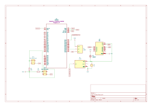
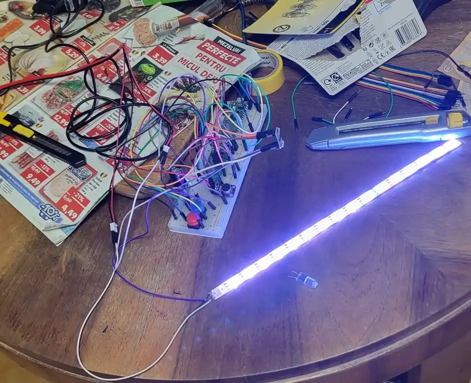
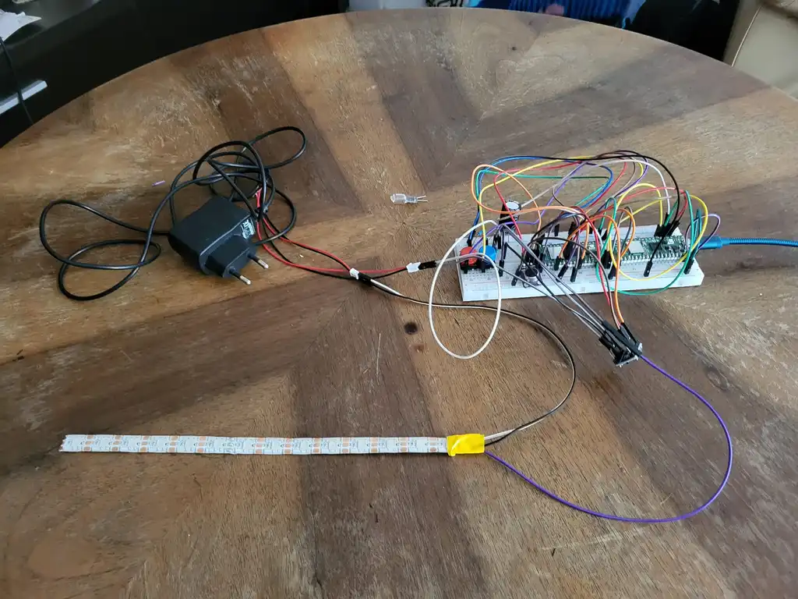
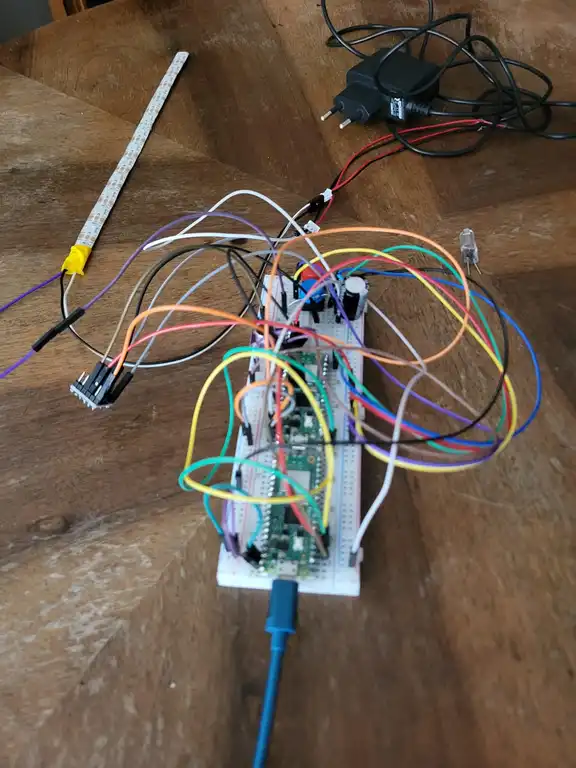
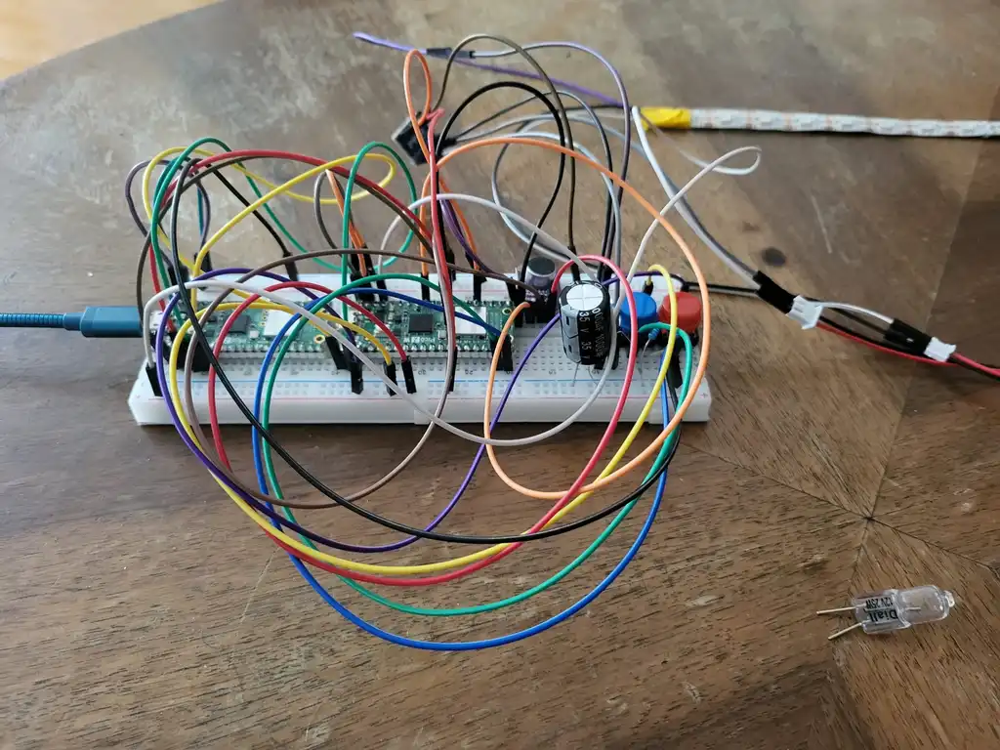
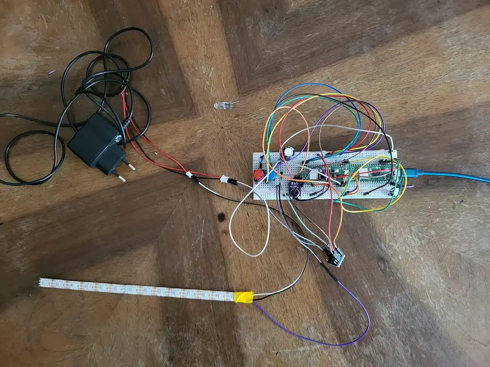

# Music Lights
A Raspberry Pi Pico system that synchronizes LED lighting with music

:::info

**Author:** Antonio-Christian Carazeanu  \
**GitHub Project Link:** [link_to_github](https://github.com/UPB-PMRust-Students/proiect-antocarazeanu)

:::

## Description
Music Lights is a project that uses a Raspberry Pi Pico to control an LED ring based on live music input. A microphone captures ambient audio, and a signal processing algorithm detects the beat and dominant frequencies. The LEDs react in real-time by changing color and brightness, creating an immersive audio-visual experience.

## Motivation
The idea behind this project came from a desire to blend music with dynamic visual effects. I wanted to explore how embedded systems can process audio and produce synchronized lighting, making music more interactive and engaging.

## Architecture

The project is composed of the following main components:
- **Microcontroller**: Raspberry Pi Pico running real-time firmware using Embassy.
- **Audio Input**: MAX4466 Microphone module connected to the Pico's ADC, capturing audio signals.
- **Signal Processing**: Algorithm performing FFT using the `microfft` library to analyze frequencies.
- **LED Control**: LED ring controlled via the RP2040's **PIO unit** using `embassy-rp` and a compatible WS2812 PIO program (like `ws2812-pio` or similar). Requires a **Logic Level Shifter** (3.3V to 5V) for the data signal.
- **Output**: WS2812 LED ring visualizing music dynamically.

Connections:
- Microphone Analog Out → Pico ADC GPIO (e.g., GPIO26)
- Pico GPIO (PIO Output) → Level Shifter (Low Voltage Input)
- Level Shifter (High Voltage Output) → LED Ring Data In (via ~330Ω resistor)
- Buttons → Pico GPIO Inputs (with 10kΩ pull-up/pull-down resistors)
- Pico USB → Power (for Pico) and programming
- **Separate 5V Power Supply → LED Ring (+5V, GND)**
- **Separate 5V Power Supply → Level Shifter (HV Pin)**
- **Common Ground:** Crucial connection between Pico GND, Level Shifter GND, and the Separate 5V Power Supply GND.

## Log
- **Week 5 - 11 May**: Set up the Raspberry Pi Pico and assembled the main hardware components.
<<<<<<< HEAD
- **Week 12 - 18 May**: Completed the full hardware assembly and tested each component individually using example code. Encountered an issue with the LED strip: several LEDs were not functioning correctly, so I tried cutting off the faulty sections and re-soldering, but this did not fully resolve the problem. Ultimately, I replaced the LED strip with a WS2812 LED ring, which worked reliably in the final setup.
- **Week 19 - 25 May**: Finished the software code, adding more reactive modes for the LEDs.  
The audio processing proved to be one of the most challenging aspects of the project, especially tuning the beat and frequency detection algorithms. It required significant trial and error to achieve reliable real-time responsiveness.
=======
- **Week 12 - 18 May**: Completed the full hardware assembly and tested each component with example code.
- **Week 19 - 25 May**:
>>>>>>> upstream/main

## Hardware
- Raspberry Pi Pico W (x2 - one for development/debug)
- WS2812 LED Ring (24 LEDs)
- MAX4466 Microphone Module
- Logic Level Shifter Module
- Jumper wires (M-M, M-F) and Breadboard
- USB cables (for Pico power/programming)

## Schematics

## Project Photos

## Bill of Materials

| Item                                                                                                  | Quantity | Unit Price                                                                                                                                                             | Total Price |
|-------------------------------------------------------------------------------------------------------|----------|------------------------------------------------------------------------------------------------------------------------------------------------------------------------|-------------|
| Jumper Wires for Breadboard                                                                           | 1        | [7.99 RON](https://www.optimusdigital.ro/ro/fire-fire-mufate/12-set-de-cabluri-pentru-breadboard.html?search_query=Set+Fire+pentru+Breadboard&results=37)             | 7.99 RON    |
| Raspberry Pi Pico W                                                                                   | 2        | [39.66 RON](https://www.optimusdigital.ro/ro/placi-raspberry-pi/13327-raspberry-pi-pico-2-w.html?search_query=raspberry+pi+pico+2&results=26)                          | 79.32 RON   |
| Breadboard HQ (830 tie points)                                                                        | 1        | [9.98 RON](https://sigmanortec.ro/Breadboard-830-puncte-MB-102-p125923983)                                                                                            | 9.98 RON    |
| White Pin Header 2.54 mm (40p)                                                                         | 3        | [0.99 RON](https://www.optimusdigital.ro/ro/cautare?controller=search&orderby=position&orderway=desc&search_query=header+pini+alb&submit_search=)                     | 2.97 RON    |
| Colored Jumper Wires Female-Male (40p, 15 cm)                                                          | 1        | [7.99 RON](https://www.optimusdigital.ro/ro/toate-produsele/877-set-fire-mama-tata-40p-15-cm.html)                                                                    | 7.99 RON    |
| Electrolytic Capacitor 1000 µF, 35 V                                                                   | 1        | [2.99 RON](https://www.optimusdigital.ro/ro/componente-electronice-condensatoare/3004-condensator-electrolitic-de-1000-uf-la-35-v.html?search_query=condensator+electrolitic&results=105) | 2.99 RON    |
| Electrolytic Capacitor 470 µF, 50 V                                                                    | 1        | [0.79 RON](https://www.optimusdigital.ro/ro/componente-electronice-condensatoare/3008-condensator-electrolitic-de-470-uf-la-50-v.html?search_query=condensator+electrolitic&results=105) | 0.79 RON    |
| USB Cable                                                                        | 1        | -                                                                                                                                                                      | -           |
<<<<<<< HEAD
| Addressable LED Ring WS2812, 24leds                                                          | 1        | [23,18 RON](https://www.optimusdigital.ro/ro/optoelectronice-altele/5623-inel-cu-24-led-uri-rgb-adresabile-ws2812.html?search_query=ws2812&results=35)                                                                       | 8.07 RON    |
=======
| Addressable LED Strip WS2812, 10 cm (60led/m)                                                          | 3        | [2.69 RON](https://sigmanortec.ro/Banda-LED-adresabila-RGB-WS2812-60led-m-IP67-10cm-p166125661)                                                                       | 8.07 RON    |
>>>>>>> upstream/main
| Button 12x12x7.3 mm                                                                                    | 2        | [1.10 RON](https://sigmanortec.ro/Buton-12x12x7-3-p160373654)                                                                                                          | 2.20 RON    |
| Button Cap 12x12x7.3 mm, Blue                                                                          | 1        | [0.34 RON](https://sigmanortec.ro/capac-buton-12x12x73-albastru)                                                                                                       | 0.34 RON    |
| Button Cap 12x12x7.3 mm, Red                                                                           | 1        | [0.34 RON](https://sigmanortec.ro/capac-buton-12x12x73-albastru)                                                                                                       | 0.34 RON    |
| MAX4466 Microphone Module with Amplifier                                                               | 1        | [7.18 RON](https://sigmanortec.ro/modul-microfon-max4466-cu-amplificare-castig-reglabil-23-5vdc)                                                                      | 7.18 RON    |
| 4-Channel Logic Level Converter Module                                                                 | 1        | [4.00 RON](https://sigmanortec.ro/Modul-Translator-nivel-logic-I2C-IIC-bidirectional-8-canale-3-3V-5V-TXS0108E-p136254032)                                            | 4.00 RON    |
| 330 Ω Resistor                                                                                         | 2        | 0.12 RON                                                                                                                                                               | 0.24 RON    |
| 10k Ω Resistor                                                                                         | 1        | 0.13 RON                                                                                                                                                               | 0.13 RON    |
| Sursă alimentare 5V                                                                                    | 1        | [23.38 RON](https://sigmanortec.ro/sursa-alimentare-5v-3a-55x21-220vac)                                                                                                | 23.38 RON   |
| Conector DC mamă                                                                                       | 1        | [2.07 RON](https://sigmanortec.ro/conector-dc-mama-55x21-25cm)                                                                                                         | 2.07 RON    |
| Conector JST PH2.0 2P                                                                                  | 2        | [2.00 RON](https://sigmanortec.ro/conector-micro-jst-ph20-2p-tata-cu-cablu-15cm)                                                                                       | 4.00 RON    |
| Jumper Wires Male-Male (40p, 30 cm)                                                                    | 1        | [8.00 RON](https://www.optimusdigital.ro/ro/fire-fire-mufate/890-set-fire-tata-tata-40p-30-cm.html?search_query=0104210000007886&results=1)                           | 8.00 RON    |
| Conector pentru LED                                                                                    | 1        | [2.99 RON](https://www.optimusdigital.ro/ro/conectori/12551-set-conector-pentru-led-10-mm-cu-3-pini.html?search_query=0104110000084446&results=1)           | 2.99 RON    |
<<<<<<< HEAD
=======

**Estimated Total:** ~ 173.27 RON (excluding USB cables)

>>>>>>> upstream/main

**Estimated Total:** ~ 188.38 RON (excluding USB cable)

## Software
<<<<<<< HEAD

This list details the recommended Rust crates for the "Music Lights" project using the Embassy async runtime on the Raspberry Pi Pico, based on the provided code.

| Library                                                                                                     | Description                                                              | Usage                                                                                                |
| ----------------------------------------------------------------------------------------------------------- | ------------------------------------------------------------------------ | ---------------------------------------------------------------------------------------------------- |
| [`embassy-executor`](https://crates.io/crates/embassy-executor)                                             | Core asynchronous task executor.                                         | Runs all concurrent operations. (Ex: `Spawner`)                                                      |
| [`embassy-time`](https://crates.io/crates/embassy-time)                                                     | Async time primitives (Delay, Timer, Instant).                           | Essential for timing and scheduling. (Ex: `Duration`, `Ticker`, `Instant`)                           |
| [`embassy-sync`](https://crates.io/crates/embassy-sync)                                                     | Async synchronization tools (Mutex, Channel, Signal).                    | Enables safe data sharing between async tasks. (Implicitly needed for `Atomic...` in concurrent contexts) |
| [`embassy-rp`](https://crates.io/crates/embassy-rp)                                                         | HAL for RP2040 peripherals (ADC, GPIO, PIO, etc.).                       | Async access to hardware on the RP2040, including WS2812 control via PIO. (Ex: `Pio`, `Adc`, `Input`, `PioWs2812`) |
| [`smart-leds`](https://crates.io/crates/smart-leds)                                                         | Utilities and types (RGB8, effects, gamma, brightness).                  | Defines LED colors and can be used for visual effects. (Ex: `RGB8`)                                   |
| **[`libm`](https://crates.io/crates/libm)**                                                                 | Pure Rust implementations of C math functions (`sqrt`, `powf`, etc.).    | May be required for math operations in signal processing or effects.                                 |
| [`panic-probe`](https://crates.io/crates/panic-probe)                                                       | Panic handler for embedded targets.                                      | Works well with `defmt` for debugging.                                                               |
| [`defmt`](https://crates.io/crates/defmt)                                                                   | Efficient logging for embedded (RTT).                                    | Enables lightweight debugging output.                                                                |
| [`defmt-rtt`](https://crates.io/crates/defmt-rtt)                                                           | RTT backend for `defmt`.                                                 | Enables real-time logging via debug probe.                                                           |
| `core::sync::atomic`                                                                                        | Atomic types from the `core` standard library.                           | For thread-safe atomic operations between tasks. (Ex: `AtomicBool`, `AtomicU8`)                      |

=======

This list details the recommended Rust crates for the "Music Lights" project using the Embassy async runtime on the Raspberry Pi Pico.

| Library                                                                                                     | Description                                                           | Usage                                                                     |
| ----------------------------------------------------------------------------------------------------------- | --------------------------------------------------------------------- | ------------------------------------------------------------------------- |
| [`embassy-executor`](https://crates.io/crates/embassy-executor)                                             | Core asynchronous task executor.                                      | Runs all concurrent operations.                                           |
| [`embassy-time`](https://crates.io/crates/embassy-time)                                                     | Async time primitives (Delay, Timer, Instant).                        | Essential for timing and scheduling.                                      |
| [`embassy-sync`](https://crates.io/crates/embassy-sync)                                                     | Async synchronization tools (Mutex, Channel, Signal).                 | Enables safe data sharing between async tasks.                            |
| [`embassy-rp`](https://crates.io/crates/embassy-rp)                                                         | HAL for RP2040 peripherals (ADC, GPIO, DMA, SPI, etc.).               | Async access to hardware on the RP2040.                                   |
| [`embedded-hal`](https://crates.io/crates/embedded-hal)                                                     | Standard HAL traits.                                                  | Used by embedded drivers like `ws2812-spi`. (\[Docs.rs]\[1])              |
| [`embedded-hal-async`](https://crates.io/crates/embedded-hal-async)                                         | Async HAL traits.                                                     | For async control of peripherals like SPI, I2C, etc.                      |
| **[`ws2812-spi`](https://crates.io/crates/ws2812-spi)**                                                     | SPI-based driver for WS2812 & SK6812, implements `SmartLedsWrite`.    | Sends LED data over SPI to WS2812 strips. (\[Crates]\[2], \[Docs.rs]\[1]) |
| **[`smart-leds`](https://crates.io/crates/smart-leds)**                                                     | Utilities and types (RGB8, effects, gamma, brightness).               | Defines LED colors and visual effects. (\[Docs.rs]\[3], \[Crates]\[4])    |
| **[`smart-leds-trait`](https://crates.io/crates/smart-leds-trait)**                                         | Traits for smart LED drivers (`SmartLedsWrite`).                      | Enables calling `write()` on `Ws2812<SPI>`. (\[Crates]\[5])               |
| **[`microfft`](https://crates.io/crates/microfft)**                                                         | `no_std` FFT implementation (Radix-2 in-place).                       | Real-time audio frequency analysis for LED effects. (\[Crates]\[6])       |
| **[`libm`](https://crates.io/crates/libm)**                                                                 | Pure Rust implementations of C math functions (`sqrt`, `powf`, etc.). | Required for FFT math operations and signal processing. (\[Docs.rs]\[7])  |
| [`cortex-m`](https://crates.io/crates/cortex-m)                                                             | Access to ARM Cortex-M core peripherals.                              | Used for low-level embedded operations.                                   |
| [`cortex-m-rt`](https://crates.io/crates/cortex-m-rt)                                                       | Minimal runtime for Cortex-M.                                         | Defines program entry and exception vectors.                              |
| [`panic-probe`](https://crates.io/crates/panic-probe) / [`panic-halt`](https://crates.io/crates/panic-halt) | Panic handlers for embedded targets.                                  | Choose one; `panic-probe` works well with `defmt`.                        |
| [`defmt`](https://crates.io/crates/defmt)                                                                   | Efficient logging for embedded (RTT).                                 | Enables lightweight debugging output.                                     |
| [`defmt-rtt`](https://crates.io/crates/defmt-rtt)                                                           | RTT backend for `defmt`.                                              | Enables real-time logging via debug probe.                                |
| [`embedded-io`](https://crates.io/crates/embedded-io)                                                       | Standard I/O traits.                                                  | Enables cross-crate I/O compatibility.                                    |
| [`embedded-io-async`](https://crates.io/crates/embedded-io-async)                                           | Async I/O traits.                                                     | Used for async communication drivers.                                     |
| [`heapless`](https://crates.io/crates/heapless)                                                             | `no_std` data structures (Vec, String, etc.).                         | Useful for fixed-size buffers without dynamic allocation.                 |

>>>>>>> upstream/main

## Links
- [Lab1](https://pmrust.pages.upb.ro/docs/acs_cc/lab/01)
- [Lab2](https://pmrust.pages.upb.ro/docs/acs_cc/lab/02)
- [Lab3](https://pmrust.pages.upb.ro/docs/acs_cc/lab/03)
- [Lab4](https://pmrust.pages.upb.ro/docs/acs_cc/lab/04)
- [Lab5](https://pmrust.pages.upb.ro/docs/acs_cc/lab/05)
<<<<<<< HEAD
=======
- [Lab6](https://pmrust.pages.upb.ro/docs/acs_cc/lab/06)
>>>>>>> upstream/main
- [Setup Level Shifter](https://youtu.be/4oA4KKxxBXE?si=5sifG2gcFJKux5GH)
- [Setup Led Strip WS2812](https://www.youtube.com/watch?v=MCBSYVftAWE)
- [Setup Power Source for Led Strip](https://www.youtube.com/watch?v=TqDxBJFcFRQ)
- [Setup Button](https://www.youtube.com/watch?v=q_sXuOMiWjY)
- [Use of MAX4466](https://www.youtube.com/watch?v=dzHZVTsBX7Q)
