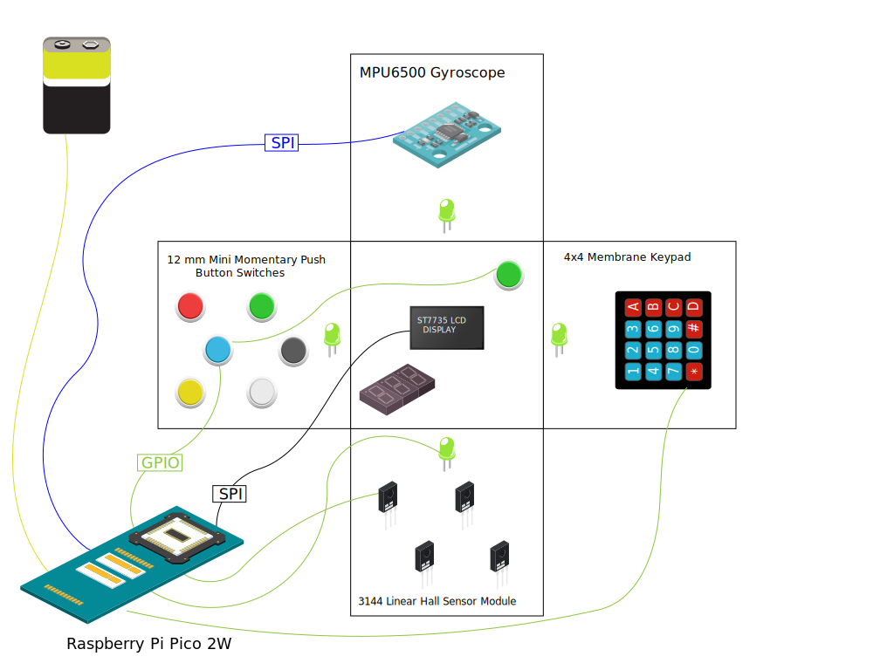
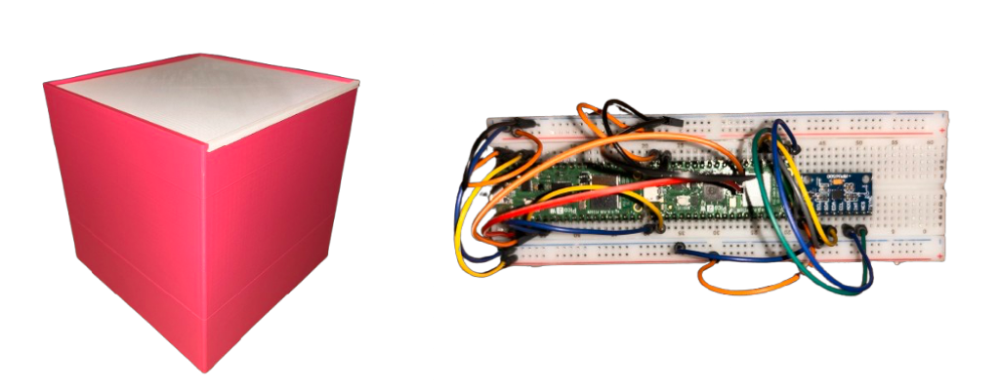
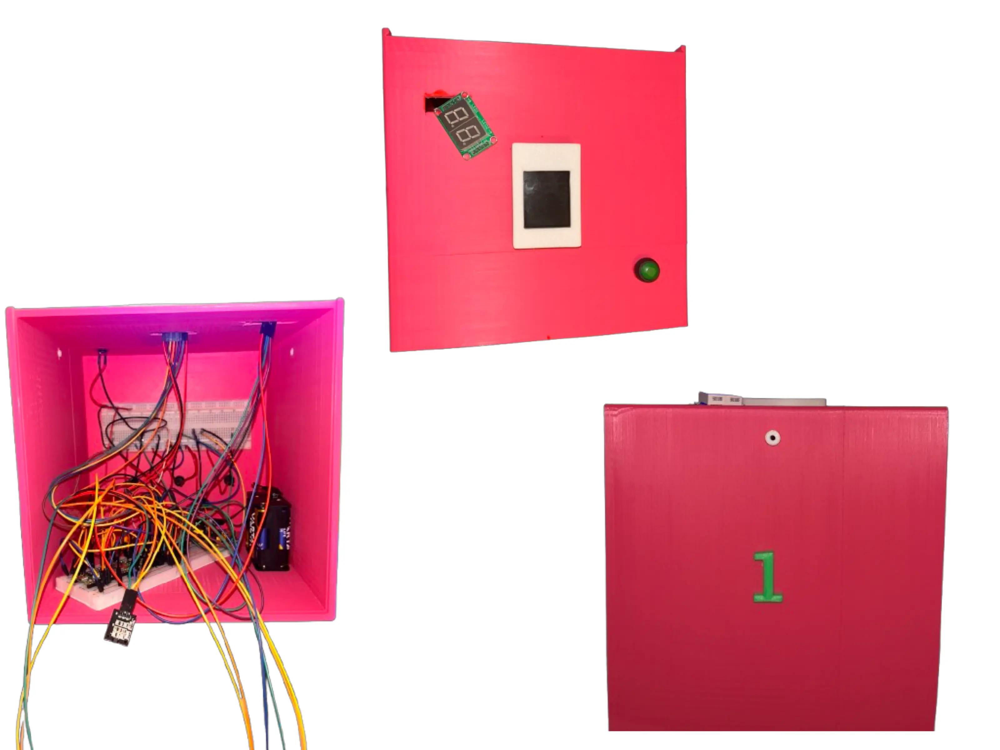
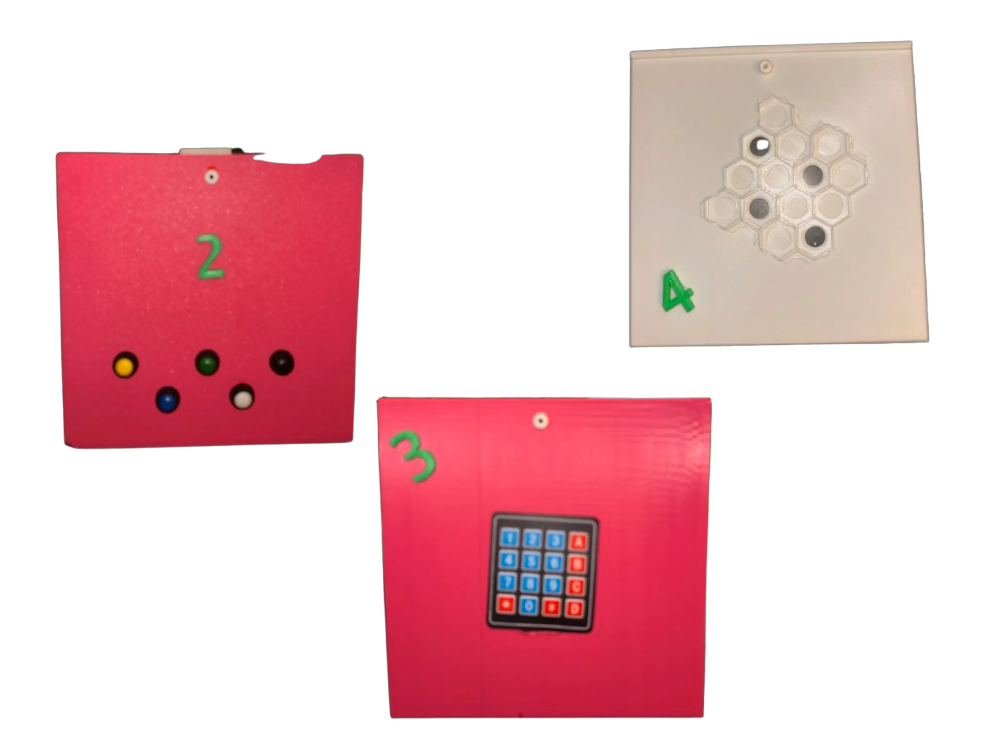

# PoliCube
A portable, interactive escape room in cube form that challenges players with sequential puzzles. 
:::info 

**Author**: Claudia Golăeș \
**GitHub Project Link**: [https://github.com/UPB-PMRust-Students/proiect-claudia-golaes](https://github.com/UPB-PMRust-Students/proiect-claudia-golaes)
:::

## Description

PoliCUBE is an innovative portable escape room experience in the form of an interactive cube. This project integrates electronic components, programming, and puzzle design to create an engaging and challenging game experience. The PoliCUBE is a physical cube where each face presents a different puzzle that must be solved sequentially. One face features a display that shows clues and text guidance, while the other faces contain linear puzzles that must be solved in order. 

### Key features
+ **Sequential puzzle progression**: Puzzles must be solved in a specific order, with each solution unlocking the next challenge
+ **Visual indicators**: LEDs on each face show which puzzle is currently active
+ **Display interface**: LCD screen displays hints, text, and necessary information
+ **Self-contained design**: All components housed in a portable cube format

### Puzzle Types
+ **Motion-based puzzle**: Players must move the cube according to on-screen instructions to solve this challenge
+ **Color sequence puzzle**: Five colored buttons must be pressed in the correct sequence based on provided clues (8 chances before reset)
+ **Numerical keypad challenge**: Players must solve calculations shown on the display and enter the correct results (3 chances before reset)
+ **Magnetic map navigation**: A map of a university building floor (ED/EC) is presented, and players must touch specific rooms with a magnet according to a schedule provided in the clues

## Motivation

I decided from the beginning that I would either find something innovative or make a game. After exploring various possibilities and researching existing projects in the field, I didn't manage to discover something truly innovative that hadn't been done before, so I shifted my focus towrd making a game, but I wanted there to be a catch - not just a simple game, but something that would be a challenge for the player, and that's how I came up with this compact escape room idea, a portable puzzle cube.

## Architecture 


### 1. User Interface (UI Module)
This module is responsible for delivering visual feedback and guiding the player through the game:
+ **ST7735 LCD Display**: Displays puzzle instructions, clues, and status messages, via SPI
+ **4 Green LEDs**: Indicate the currently active puzzle face and provide progress feedback, via GPIO
+ **Dual 7-Segment LED Display with 74HC595 Shift Register**: Displays timing information or numerical values during gameplay, via GPIO + SPI-like control via shift register (74HC595)

### 2. Physical Input Module
Handles all direct physical interactions from the player:
+ **6 Colored Push Buttons**: Used in the color sequence puzzle and for starting the game, via GPIO
+ **4x4 Matrix Keypad**: Used for inputting numerical answers in the math puzzle, via GPIO
+ **MPU6500 Gyroscope/Accelerometer**: Detects cube movement and orientation for the motion-based puzzle, via I2C
+ **4 Linear Hall Effect Sensors (3144)**: Detect magnetic field presence on specific points of the map puzzle, via GPIO

### 3. Core Processing Unit
Manages game state, handles puzzle progression, processes input, and triggers outputs:
+ **Raspberry Pi Pico 2W**: Central microcontroller for all puzzle logic and hardware coordination which runs embedded Rust software and manages all communication with peripherals.

### 4. Software & Logic Layer
The software stack running on the Pico includes:
+ **Language**: Rust 
+ **Libraries/Frameworks**: embedded-hal, embassy-rp, embassy-time, etc. 

### 5. Power Supply Module
Provides portable and self-contained power for the system:
+ **9V Battery with DC Connector**: Supplies power to the Raspberry Pi Pico and all connected peripherals. 
+ **Breadboard and Wiring**: Used for prototyping and connecting components to the Pico's GPIO pins.

## Log

<!-- write your progress here every week --> 
### Week 28 April - 4 May
This week, I 3D printed the cube structure, with the white side functioning as the map for the Hall sensors. I connected both Raspberry Pi Pico boards and completed the initial setup. I finished the wiring for the gyroscope and started coding the first puzzle.


### Week 5 - 11 May
This week, I finished the hardware part, and realized that I miscalculated some things and made some changes. Everything that I said in the sequence before can be seen in the video I made for the Hardware Milestone: [https://youtu.be/XMGbFsKHQaA](https://youtu.be/XMGbFsKHQaA).

### Week 12 - 18 May
After finishing 90% of the hardware part, not the design of the outer faces of the cube, I started the software part, which can be seen in my Github repository: [https://github.com/UPB-PMRust-Students/proiect-claudia-golaes](https://github.com/UPB-PMRust-Students/proiect-claudia-golaes)

### Week 19 - 25 May
Hardware part is 99.9% ready, the software part is 101% ready, I just need a case for the 7-segment 2 digit display. Also, I asked some friends to review the game, and I implemented some of their feedback like way too much waiting for the instructions part and lack of details in the instructions.



## Hardware

+ **Two Raspberry Pi Pico 2W microcontrollers** - Microcontrollers with built-in wireless capabilities, providing the processing power needed to run the puzzle logic and coordinate all components. 
+ **ST7735 LCD Display** - A 1.8" color TFT display with 160x128 pixel resolution that connects via SPI protocol. This screen provides visual feedback to players, displaying puzzle instructions, clues, and game status information with vibrant colors and decent viewing angles.
+ **MPU6500 Gyroscope/Accelerometer** - A precise 6-axis motion tracking device that detects the cube's orientation and movement in three-dimensional space. This sensor enables the motion-based puzzle by accurately measuring rotation and acceleration across all axes.
+ **7 Push Buttons** - Momentary tactile switches with colored caps that provide physical input for the color sequence puzzle. Players must press these buttons in the correct order based on clues shown on the display, with each button providing tactile feedback when pressed.
+ **4 Linear Hall Sensor Modules** - 3144 Hall effect sensors that detect the presence of magnetic fields. These are positioned beneath a map of a university building, allowing the system to recognize when a magnet is placed at specific locations to solve the magnetic map navigation puzzle.
+ **4x4 Matrix Keypad** - A 16-button keypad arranged in a grid formation that provides numerical input capability. Used for the calculation puzzle where players must solve math problems and enter the correct answers through the keypad.
+ **4 Green LEDs** - 3mm diffused LEDs that provide visual indication of which puzzle is currently active. Each LED corresponds to a different puzzle face, illuminating to guide the player to the current challenge.
+ **Dual 7-Segment LED Display with 74HC595** - A numeric display component with shift register that shows timing information during gameplay. The shift register reduces the number of GPIO pins needed to control the display, allowing for efficient pin management.
+ **8xAA Battery with DC Connector** - Provides portable power to the entire system, enabling the cube to function without external power sources.
+ **Breadboards and Female-Male Wires** 
+ **Pin Headers** 


### Schematics


### Bill of Materials

<!-- Fill out this table with all the hardware components that you might need.

The format is 
```
| [Device](link://to/device) | This is used ... | [price](link://to/store) |

```

-->

| Device | Usage | Price |
|:-------:|:-------:|:--------:|
| 2x [Raspberry Pi Pico 2W](https://www.raspberrypi.com/documentation/microcontrollers/raspberry-pi-pico.html) | The microcontroller | [79,32 RON](https://www.optimusdigital.ro/ro/placi-raspberry-pi/13327-raspberry-pi-pico-2-w.html?search_query=+5056561803975+&results=1) |
| HQ830 Breadboard Kit with Wires and Power Supply | Prototyping platform for circuit testing | [22.00 RON](https://www.optimusdigital.ro/ro/kituri/2222-kit-breadboard-hq-830-p.html?search_query=+kit+breadboard+&results=35) |
| 5x [3144 Linear Hall Sensor Module](https://components101.com/sites/default/files/component_datasheet/A3144%20Hall%20effect%20Sensor.pdf) | Detects magnets for the map navigation puzzle. | 19.95 RON |
| Colored Wires Female-Male | Connects components to Raspberry Pi Pico GPIO pins. | [7.99 RON](https://www.optimusdigital.ro/ro/toate-produsele/877-set-fire-mama-tata-40p-15-cm.html?search_query=0104210000007817&results=1) |
| 6x 3mm Green LED with Diffused Lens | Shows active puzzle status on cube faces. | [2.34 RON](https://www.optimusdigital.ro/ro/optoelectronice-led-uri/697-led-verde-de-3-mm-cu-lentile-difuze.html?search_query=+0104210000006209+&results=1) |
| 3x Pin Header | Creates connections between components and microcontroller. | [2.97 RON](https://www.optimusdigital.ro/ro/componente-electronice-headere-de-pini/85-header-de-pini.html?search_query=+0104210000001587+&results=1) |
| 12x 12mm Mini Momentary Push Button Switches with Wire | Input controls for the sequence puzzle challenge. | [50.00 RON](https://www.amazon.de/-/en/gp/aw/d/B08JCNHF1H?ref=ppx_pop_mob_b_asin_title&th=1) |  
| [LCD Screen ST7735](https://www.displayfuture.com/Display/datasheet/controller/ST7735.pdf)  | Shows puzzle instructions and clues to players. | [27.50 RON](https://www.amazon.de/-/en/gp/aw/d/B0CWN27HVB?psc=1&ref=ppx_pop_mob_b_asin_title) |  
| MPU6500 Gyroscope/Accelerometer  | Detects cube motion for orientation-based puzzle challenges. | 0.00 RON | 
| 4x4 Matrix Keypad with Female Pin Connector | Numeric input device for calculation puzzle solutions. | [6.99 RON](https://www.optimusdigital.ro/ro/senzori-senzori-de-atingere/470-tastatura-matriceala-4x4-cu-conector-pin-de-tip-mama.html) |
| 0.5'' Dual 7-Segment LED Display with 74HC595 Shift Register | Timer display for timed puzzle challenges. | [8.99 RON](https://www.optimusdigital.ro/ro/optoelectronice-afisaje-led/4163-afiaj-led-dual-cu-7-segmente-de-05-cu-registru-de-deplasare-74hc595.html) | 
| Breadboard HQ (830 points) | Prototyping platform for circuit testing | [9.98 RON](https://www.optimusdigital.ro/en/breadboards/8-breadboard-hq-830-points.html?search_query=breadboard&results=363) |
| 9 V Battery Connector with DC Jack | Connecting to a 9-volt battery. | [1.49 RON](https://www.optimusdigital.ro/en/wires-with-connectors/896-9v-battery-connector-with-dc-jack.html?search_query=9v+battery&results=796) |

## Software
This embedded Rust application implements a finite state machine with 10 distinct states (PUZZLE_NUMBER 0-9) for an escape room controller.The code uses unsafe global variables like PUZZLE_NUMBER and COUNTDOWN_SECONDS to keep track of game state - not the prettiest Rust code, but it gets the job done. The hardware part (buttons, sensors, display) each get their own module with async functions that talk to the actual pins using standard embedded Rust traits. When things go wrong (like sensors failing or timers expiring), the system just rolls back to an earlier puzzle state instead of crashing, so players can keep trying without losing all their progress.

### State Flow
This module is responsible for delivering visual feedback and guiding the player through the game:
**Linear Progression**: The game follows a sequential flow from State 0 → State 9, where each puzzle must be completed to advance.
**Failure Recovery**: The system implements rollback mechanisms - when timers expire or wrong inputs occur, the state machine transitions back to previous states rather than terminating.

### Key States
+ **State 0**: Entry point - waits for START button
+ **States 1,3,5,7**: Instruction screens between puzzles
+ **States 2,4,6,8**: Active puzzle states with countdown timers
+ **State 9**: Terminal success state

### Technical Features
+ **Async timer management** using Embassy runtime
+ **Hardware abstraction** through dedicated modules (buttons, gyroscope, Hall sensors)
+ **Global state variables** for inter-state communication
+ **Event-driven transitions**: based on user input and sensor data


| Library | Description | Usage |
|:---------:|:-------------:|:-------:|
| [st7789](https://github.com/almindor/st7735-lcd) | Display driver for ST7735 | Used for the display for the Pico Explorer Base |
| [embedded-graphics](https://github.com/embedded-graphics/embedded-graphics) | 2D graphics library | Used for drawing to the display |
| [embassy-rp](https://github.com/embassy-rs/embassy/tree/main/embassy-rp) | Raspberry Pi Pico HAL | Used for accessing the peripherals |
| [embassy-time](https://github.com/embassy-rs/embassy/tree/main/embassy-time) | Time library | Used for Timeouts and Delays |
| [embassy-executor](https://docs.embassy.dev/embassy-executor/git/std/index.html) | Asynchronous executor for Rust embedded systems | Used for task scheduling and asynchronous programming |
| [embassy-executor](https://github.com/rust-embedded/embedded-hal) | Hardware Abstraction Layer for embedded systems | Used for SPI and GPIO control |


## Links

<!-- Add a few links that inspired you and that you think you will use for your project -->
1. [Electronic Puzzle Cube - Tutorial Instructables](https://www.instructables.com/Electronic-Puzzle-Cube/)
2. [Simple Electronics to Escape Room Owners - PCBWay](https://www.pcbway.com/project/shareproject/Simple_Electronics_to_Escape_Room_Owners_First_Chapter_dacfa4d9.html)
3. [BaldGuyDIY - Escape Room Puzzle cu Raspberry Pi și PySimpleGU](https://blog.adafruit.com/2020/09/11/escape-room-puzzle-counter-dial-logic-on-raspberry-pi-with-pysimplegui-raspberrypi/)
