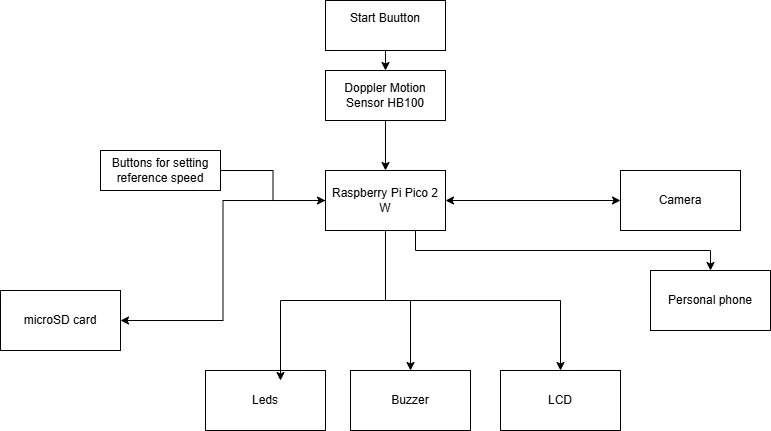
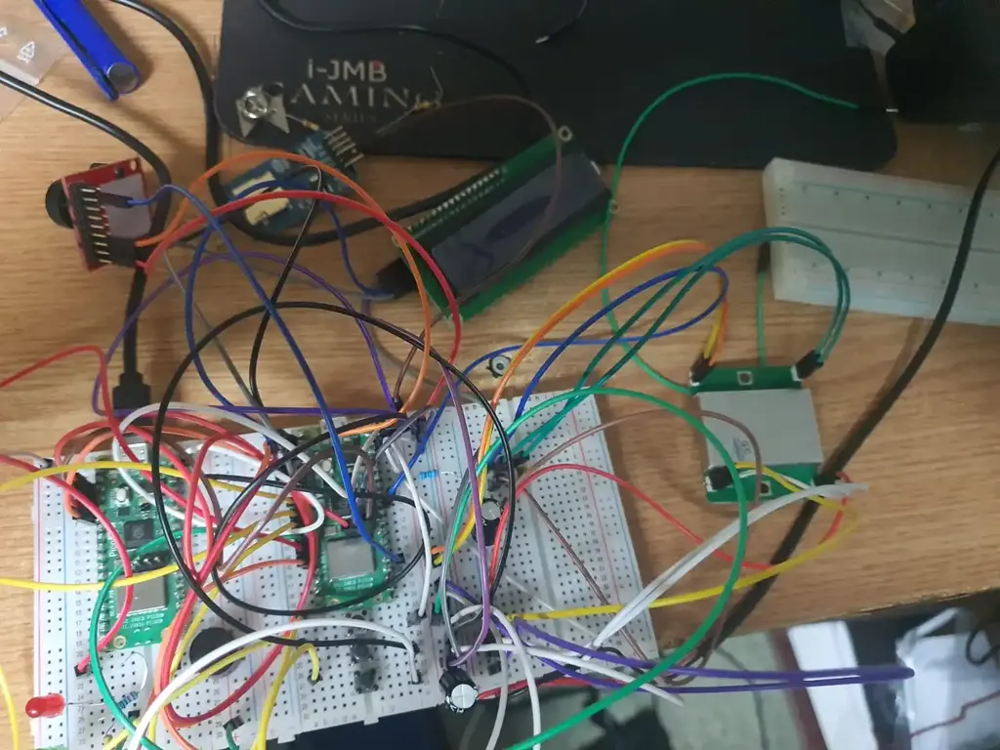
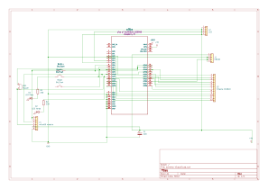
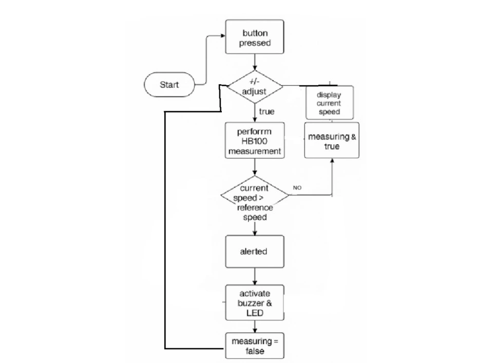

# Speed gun 
Portable speed detection device.

**Author**: Rîpeanu Constantin-Adrian \
**GitHub Project Link**: https://github.com/UPB-PMRust-Students/proiect-RipeanuAdrian

## Description

A portable radar device that uses a Doppler sensor to measure the speed of moving objects. If the detected speed exceeds a configurable threshold, it activates a buzzer, lights up a red LED, and captures a picture using an OV2640 camera module.

+ The measured speed and speed limit are shown on an LCD 1602 I²C display.

+ The reference speed can be adjusted using physical buttons.

+ When speed is within the safe range, a green LED is lit.

+ When overspeed is detected, the red LED lights up and a buzzer sounds.

+ The image is stored on a microSD card or sent over WiFi via a Telegram bot or HTTP request.

## Motivation
This project allowed me to explore embedded systems and real-time hardware control using Rust. I wanted to build something educational and practical — a compact device that detects motion and responds automatically.

I chose this topic because fixed speed cameras are a current subject, especially with the rollout of systems like “e-Sigur”. Inspired by how real traffic radars work, I aimed to recreate a simpler, portable version that can measure speed and take photos.

## Arhitecture

The **Raspberry Pi Pico 2W** acts as the core of the system, coordinating all modules:

The **HB100 Doppler sensor** detects motion and outputs a frequency that reflects the speed.

An **LM358 op-amp** amplifies the Doppler signal to be read via ADC.

The **LCD 1602 I²C** displays the measured speed and configurable speed limit.

**OV2640 camera** captures an image when overspeed is detected.

The **microSD card module** stores the image, while WiFi can send it to a remote server or Telegram.

**Buttons** allow manual adjustment of the speed threshold.

**LEDs** indicate if the detected speed is within or above the limit.

**A buzzer** sounds on overspeed detection.

## Log

### Week 1 – May 6–12

- Chose the project topic: a speed measurement system using the HB100 radar sensor.
- Studied documentation for the HB100 module and its compatibility with the RP2040 Pico W board.
- Created the initial wiring plan (breadboard layout and power distribution).
- Began the schematic documentation using KiCad.
- Set up the development environment: Embassy + probe-rs + defmt logging.
- Wrote a simple test program to verify GPIO functionality and LCD output.

### Week 2 – May 13–19

- Purchased the following components:
  - HB100 radar sensor
  - LCD 1602 with I²C interface
  - 5V active buzzer
  - Tactile push buttons
  - LEDs and resistors (220 Ω, 10 kΩ)
  - Capacitors (10 nF, 220 µF)
  - Jumper wires and large breadboard
  - OV2640 camera module (for future use)
- Tested the HB100 sensor in both digital and analog modes using RP2040 and defmt logging.
- Partially completed the KiCad schematic:
  - Added components: RP2040 Pico, HB100, LCD, buzzer, buttons, and LEDs.
  - Learned how to add, rename, and manage components in KiCad.
- Analyzed HB100 behavior with and without filtering (resistor + capacitors).
- Clarified the power supply layout: +5V on RR, GND on RB, common ground with Pico.
- Documented all necessary pin connections for the Pico board in the project setup.

### Week 3  -  May 20-27
- Implemented the software for the hardware setup. 
 

## Hardware

1. **Raspberry Pi Pico 2W**  
   – Acts as the main controller and WiFi client

1. **HB100 Doppler Radar Sensor**  
   – Measures object speed via frequency shift

1. **LM358 Operational Amplifier**  
   – Amplifies weak IF signal for ADC processing

1. **LCD 1602 with I²C Adapter**  
   – Displays speed and settings

1. **OV2640 Camera Module**  
   – Captures images when threshold is exceeded

1. **microSD Card Module**  
   – Stores JPEG images locally

1. **Buzzer**  
   – Audible alert when speed is exceeded

1. **Red & Green LEDs**  
   – Visual status indicators

1. **Push Buttons (×3)**  
   – Adjust speed threshold and trigger capture

1. **Logic Level Shifter**  
    – For safe I²C communication (LCD module at 5 V, Pico at 3.3 V)

1. **Breadboard & jumper wires**  
    – Rapid prototyping and testing

1. **External 5 V USB Power Supply**  
    – Ensures sufficient power for all components

    ### Schematics

### Bill of Materials

| Device | Usage | Price |
|--------|-------|-------|
| [Raspberry Pi Pico 2W](https://datasheets.raspberrypi.com/picow/pico-2-w-datasheet.pdf) | Main microcontroller, handles all components and WiFi | [39,66 RON](https://www.optimusdigital.ro/ro/placi-raspberry-pi/13327-raspberry-pi-pico-2-w.html?search_query=Raspberry+Pi+Pico+2W%09&results=26) |
| [HB100 Doppler Radar Sensor](https://www.limpkin.fr/public/HB100/HB100-Microwave-Sensor-Module-Datasheet.pdf) | Measures object speed via Doppler shift | [19,99 RON](https://www.optimusdigital.ro/ro/senzori-senzori-de-distanta/2093-senzor-de-micare-cu-microunde-in-banda-x.html?search_query=HB100&results=1) |
| [LM358 Operational Amplifier](https://www.ti.com/lit/ds/symlink/lm358.pdf) | Amplifies low-frequency IF signal from HB100 | [2,40 RON](https://www.optimusdigital.ro/ro/componente-electronice-altele/1470-amplificator-operational-lm358-dip-8.html?search_query=Amplificator+Operational+LM358+%28DIP-8%29%09&results=1) |
| [OV2640 Camera Module](https://www.uctronics.com/download/cam_module/OV2640DS.pdf?srsltid=AfmBOooiiIox7DoarSrq-wPIcIRJ23FCxc5izk5W3lv8eYRGvUFFdbo8) | Captures images when speed exceeds threshold | [51,28 RON](https://sigmanortec.ro/Modul-camera-OV2640-2-0MP-p159914244) |
| [LCD 1602 I²C Display](https://www.waveshare.com/datasheet/LCD_en_PDF/LCD1602.pdf) | Displays measured speed and configurable speed limit | [16,34 RON](https://www.optimusdigital.ro/ro/optoelectronice-lcd-uri/2894-lcd-cu-interfata-i2c-si-backlight-albastru.html?search_query=LCD+1602+cu+Interfata+I2C+si+Backlight+Albastru%09&results=2) |
| [microSD Card Module ](https://www.electronicwings.com/nodemcu/sd-card-module-interfacing-with-nodemcu) | Stores captured images on microSD card | [4,08 RON](https://sigmanortec.ro/Modul-MicroSD-p126079625) |
| [microSD Card 16 GB](https://www.kingston.com/datasheets/SDCIT-specsheet.pdf) | Storage medium for image files | [39,99 RON](https://www.optimusdigital.ro/ro/memorii/8678-card-microsd-original-de-16-gb-cu-noobs-compatibil-cu-raspberry-pi-4-model-b-varianta-bulk.html?search_query=Card+MicroSD+Original+de+16+GB+cu+NOOBs+Compatibil+cu+Raspberry+Pi+4+Model+B+Varianta+Bulk%09&results=2) |
| [Level Shifter 3.3V ↔ 5V (TXS0108E)](https://www.ti.com/lit/ds/symlink/txs0108e.pdf) | Enables safe I²C communication between Pico and 5V devices | [3,99 RON](https://sigmanortec.ro/Modul-Translator-nivel-logic-I2C-IIC-bidirectional-8-canale-3-3V-5V-TXS0108E-p136254032) |
| [Breadboard 400-point](https://www.handsontec.com/dataspecs/Breadboard.pdf) | Rapid prototyping without soldering | [4,56 RON](https://www.optimusdigital.ro/ro/prototipare-breadboard-uri/44-breadboard-400-points.html?search_query=Breadboard+HQ+%28400+Points%29%09&results=1) |
| [Jumper Wires (Male–Male)](https://components101.com/connectors/jumper-wires) | Connects components on breadboard | [7,99 RON](https://www.optimusdigital.ro/ro/fire-fire-mufate/12-set-de-cabluri-pentru-breadboard.html?search_query=Set+Fire+pentru+Breadboard%09&results=37) |
| [Push Buttons 6×6×6 mm](https://components101.com/switches/tactile-switch) | Used for user input (threshold control & manual trigger) | [2,16 RON](https://www.optimusdigital.ro/ro/butoane-i-comutatoare/1119-buton-6x6x6.html?search_query=Buton+6x6x6%09&results=1) |
| [Red & Green LEDs 5mm](https://www.kingbrightusa.com/images/catalog/spec/diffused_l-53id.pdf) | Visual indicators for speed status | [2 RON](https://www.optimusdigital.ro/ro/optoelectronice-led-uri/708-led-infrarosu-de-5-mm-cu-lungime-de-unda-940-nm.html?search_query=LED+Ro%C8%99u+de+5+mm%09&results=166) |
| [Buzzer](https://components101.com/buzzer-pinout-features-datasheet) | Audible alert for overspeed detection | [1,98 RON](https://www.optimusdigital.ro/ro/audio-buzzere/12247-buzzer-pasiv-de-33v-sau-3v.html?search_query=Buzzer+Pasiv+de+3.3V+sau+3V%09&results=1) |
| [Resistors (10 kΩ, 220 Ω)](https://www.vishay.com/docs/28729/cfrc.pdf) | Pull-up resistors, current limiting for LEDs and filters | [1 RON](https://www.optimusdigital.ro/ro/componente-electronice-rezistoare/856-rezistor-025w-220k.html?search_query=Rezistor+0.25W+220K%CE%A9%09&results=2) |
| [Condensator 10 nF ceramic](https://www.murata.com/en-us/products/productdetail?partno=GRM188R71H103KA01) | Filter for Doppler signal smoothing | [2,34 RON](https://www.optimusdigital.ro/ro/componente-electronice-condensatoare/2749-condensator-10nf.html?search_query=Condensator+10nF%09&results=3) |

## Software

| Library | Description | Usage |
|---------|-------------|-------|
| [embassy-rp](https://github.com/embassy-rs/embassy/tree/main/embassy-rp) | RP2040 HAL + async executor support | Low-level access to GPIO, I²C, timers and board initialization (init, Input/Output, I2C) |
| [embassy-executor](https://github.com/embassy-rs/embassy/tree/main/embassy-executor) | Async task executor for embedded | `#[embassy_executor::main]` entry point, task scheduling |
| [embassy-time](https://github.com/embassy-rs/embassy/tree/main/embassy-time) | Async timers and delays | `Timer::after(...)` and `Delay` types for non-blocking waits |
| [embedded-hal](https://github.com/rust-embedded/embedded-hal) | Hardware abstraction traits | Underlying trait layer used by embassy-rp for GPIO/I²C interfaces |
| [defmt-rtt](https://github.com/knurling-rs/defmt/tree/main/defmt-rtt) | Real-time logging over RTT | `defmt::info!` for printing debug/log messages via probe |
| [panic-probe](https://github.com/knurling-rs/panic-probe) | Panic handler that logs via RTT | Catches panics and reports stack trace over RTT |
| [hd44780-driver](https://github.com/JohnDoneth/hd44780-driver) | HD44780-based LCD over I²C | Drives the 16×2 character display (`lcd.clear`, `lcd.write_str`) |

## Detailed Design

### 1. Reference Speed Control
- **Libraries used**: `embassy-rp::gpio`, `embassy-time`  
- **Responsibilities**:  
  - Read “+” and “–” buttons with 50 ms debounce (`Timer::after`)  
  - Increment/decrement the `ref_speed` variable 
  - Update the LCD only when `ref_speed` changes  

### 2. Measurement Control
- **Libraries used**: `embassy-rp::gpio`, `embassy-executor`  
- **Responsibilities**:  
  - Toggle measurement on/off with the “Start” button  
  - Manage `measuring` and `alerted` flags to coordinate measurement cycles and one-time alerts  

### 3. Doppler Sensor Task
- **Libraries used**: `embassy-rp::gpio`, `embassy-time`  
- **Responsibilities**:  
  - Sample the HB100 IF pin for `GATE_MS = 200 ms`, counting falling edges  
  - Compute Doppler frequency `f_d = pulses * (1000 / GATE_MS)`  
  - Apply threshold filter (`MIN_F_HZ = 80 Hz`)  
  - Convert to speed in km/h: `v = 0.5 * f_d * λ * 3.6`  

### 4. Display Manager
- **Libraries used**: `embassy-rp::i2c`, `hd44780-driver`, `heapless::String`  
- **Responsibilities**:  
  - Initialize I²C and the 16×2 HD44780 LCD over address  
  - Clear display, position cursor, and write formatted “Ref: X km/h” and “Cur: Y km/h” lines  
  - Use `heapless::String<16>` to build strings without heap allocation  

### 5. Alert System
- **Libraries used**: `embassy-rp::gpio`, `embassy-time`  
- **Responsibilities**:  
  - On `measuring && current_speed > ref_speed && !alerted`:  
    - Generate 100 PWM cycles on the buzzer 
    - Blink the red LED for 500 ms  
    - Clear the current‐speed line on the LCD  
    - Stop measuring and set `alerted = true`  
 

## Links

1. [PM‑Rust Laboratory Guide – Lab 01 GPIO & Timers](https://pmrust.pages.upb.ro/docs/acs_cc/category/lab/#lab01)  
2. [PM‑Rust Laboratory Guide – Lab 03 I²C & LCD](https://pmrust.pages.upb.ro/docs/acs_cc/category/lab/#lab03)  
3. [PM‑Rust Laboratory Guide – Lab 05 SPI & microSD](https://pmrust.pages.upb.ro/docs/acs_cc/category/lab/#lab05)  
4. [PM‑Rust Laboratory Guide – Lab 06 Wi‑Fi Networking](https://pmrust.pages.upb.ro/docs/acs_cc/category/lab/#lab06)
5. [Github](https://github.com/UPB-PMRust-Students/proiect-RipeanuAdrian)