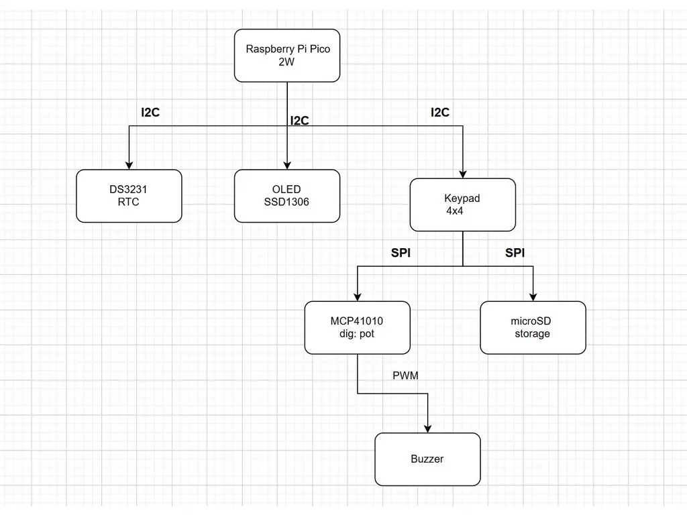
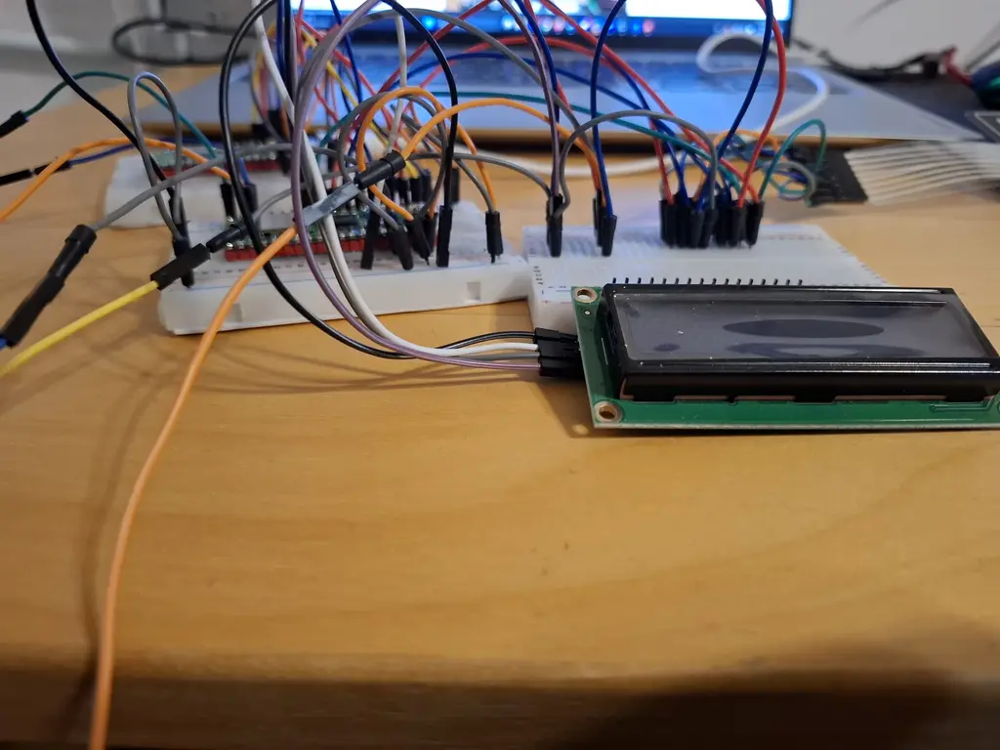
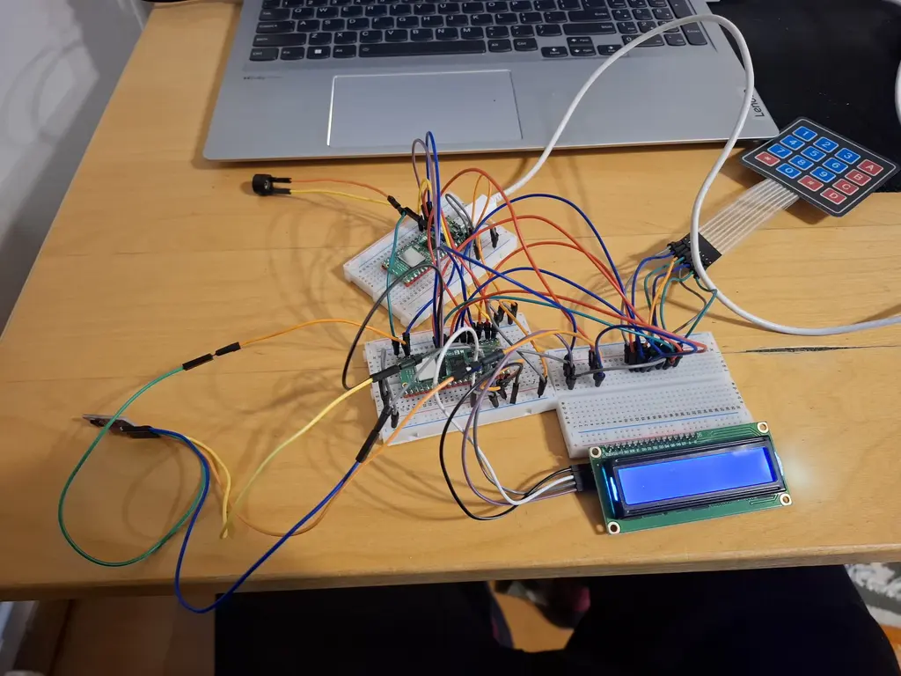
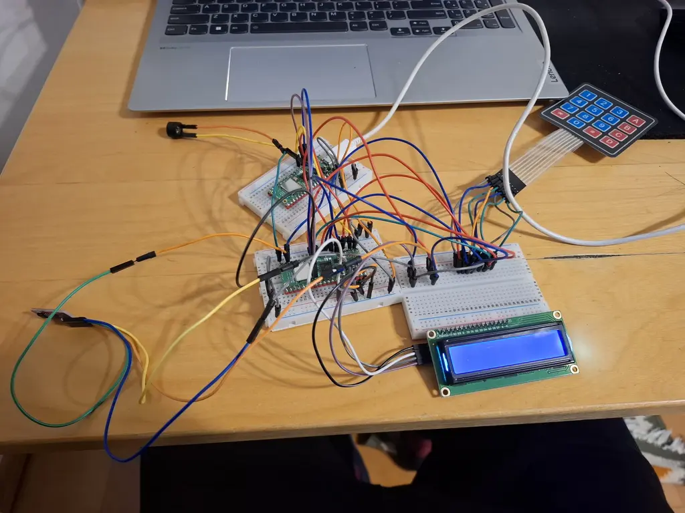
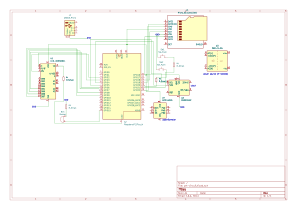

# Xtreme Math Alarm Clock
An alarm clock that requires solving a math problem to be turned off.

:::info 

**Author**: Cristian-Andrei Frant \
**GitHub Project Link**: https://github.com/UPB-PMRust-Students/proiect-CristiFrant

:::

## Description

This project involves the development of a digital alarm clock, designed to improve the morning waking experience. The clock functions like a regular one, but it stands out by how the alarm is turned off: the sound gradually increases in volume until it reaches a maximum level, and to stop it, the user must input the correct answer to a math problem displayed on the screen.

## Motivation

Many students struggle to wake up in the morning, especially during exam periods or important lectures. Regular alarms can be ignored or turned off easily, either because they are not loud enough or because they can be disabled with a single button press.

The Xtreme Math Alarm Clock is an innovative solution that introduces an intellectual challenge to the waking process: to stop the alarm, the user must solve a math problem shown on the screen. The volume increases progressively, promoting active waking, and the required interaction reduces the chances of falling back asleep. This project successfully combines embedded hardware with cognitive stimulation in a useful and creative way.

## Architecture

**Raspberry Pi Pico 2W**: Serves as the central unit, managing all logic and timekeeping operations of the system, including interfacing with other components.

**DS3231 RTC Module**: Maintains accurate time, even without power, enabling precise alarm scheduling.

**OLED Display (SSD1306)**: Displays the current time and the math problem required to stop the alarm.

**4x4 Matrix Keypad**: Allows the user to input their answer to the displayed math problem. Each key press is read by the Pico for validation.

**Passive Buzzer**: Emits the alarm sound, with intensity controlled via PWM by the Pico.

**Digital Potentiometer MCP41010**: Programmatically adjusts the buzzer’s volume, increasing the intensity over time.

**MicroSD Module**: Enables storing data such as last wake-up times, settings, or usage logs.

All components are controlled and synchronized by the Raspberry Pi Pico 2W, which acts as the system's brain. The RTC provides timekeeping, and when the alarm time is reached, the Pico activates the buzzer and displays a math question. The user must input the correct answer through the keypad. In the meantime, the sound level is progressively increased using the digital potentiometer.



## Log

### Week 21 - 27 April
- Identified the primary components required for the project.
- Outlined the overall system architecture.
- Began researching key elements such as the potentiometer and LCD module.

### Week 28 April - 4 May
- Placed orders for all necessary hardware components.
- Started drafting the official project documentation.
- Completed the full electronic schematic using KiCad.

### Week 5 - 11 May

- Built a demo of the project with the hardware i had
- Got more hardware parts and updated the demo

### Week 12 - 18 May
- Started writing code and testing the componenets one by one
- Tried linking the lcd with the keypad
- Finished a small demo

### Week 19 - 25 May
- Finished the final code
- Linked all the parts with each other

## Hardware
1602 LCD with I2C Interface and Blue Backlight
R1-4 10kohm
Micro-SD-Card AT24C256 I2C EEPROM
Clock- DS3231MZ
2 Raspberry pi pico 2w
Passive buzzer 3.3 volt 
4x4 Keypad





### Schematics

Place your KiCAD schematics here.


### Bill of Materials

<!-- Fill out this table with all the hardware components that you might need.

The format is 
```
| [Device](link://to/device) | This is used ... | [price](link://to/store) |
```
-->

| Device | Usage | Price |
|--------|--------|-------|
| [Raspberry Pi Pico W](https://www.raspberrypi.com/documentation/microcontrollers/raspberry-pi-pico.html) | Main platform, Embassy support | [35 RON](https://www.optimusdigital.ro/en/raspberry-pi-boards/12394-raspberry-pi-pico-w.html) |
| [DS3231 RTC Module](https://www.adafruit.com/product/3013) | Real-time clock for accurate alarms | [~25 RON](https://www.optimusdigital.ro/en/real-time-clocks/866-ds3231-rtc-module.html) |
| [OLED Display 128x64 (SSD1306)](https://www.adafruit.com/product/326) | Time, menu and math problem display | [~30 RON](https://www.optimusdigital.ro/en/displays/866-display-096inch-oled-i2c.html) |
| [Passive Buzzer](https://www.optimusdigital.ro/en/buzzers/1873-5v-passive-buzzer-module.html) | Alarm sound with adjustable volume | [~5 RON](https://www.optimusdigital.ro/en/buzzers/1873-5v-passive-buzzer-module.html) |
| [MCP41010 Digital Potentiometer](https://www.microchip.com/en-us/product/MCP41010) | Programmatic volume control | [~15 RON](https://www.optimusdigital.ro/en/digital-potentiometers/652-mcp41010.html) |
| [4x4 Matrix Keypad](https://www.optimusdigital.ro/en/keypads/29-4x4-matrix-keypad.html) | Math answer input | [~10 RON](https://www.optimusdigital.ro/en/keypads/29-4x4-matrix-keypad.html) |
| [MicroSD Module](https://www.optimusdigital.ro/en/sd-microsd-modules/150-microsd-card-module.html) | Configuration and logs storage | [~15 RON](https://www.optimusdigital.ro/en/sd-microsd-modules/150-microsd-card-module.html) |
| [MicroUSB cable + 5V Power Source](https://www.optimusdigital.ro/en/power-supplies/1013-usb-power-adapter-5v-2a.html) | Powering the Pico | [~20 RON](https://www.optimusdigital.ro/en/power-supplies/1013-usb-power-adapter-5v-2a.html) |
| [Breadboard + jumper wires](https://www.optimusdigital.ro/en/breadboards/37-breadboard-830.html) | Easy connections without soldering | [~20 RON](https://www.optimusdigital.ro/en/breadboards/37-breadboard-830.html) |
| [Plastic enclosure](https://www.optimusdigital.ro/en/enclosures/1645-universal-plastic-enclosure.html) | Physical protection and aesthetic finish | [~25 RON](https://www.optimusdigital.ro/en/enclosures/1645-universal-plastic-enclosure.html) |


## Software

| Library | Description | Usage |
|---------|-------------|-------|
| [embassy-executor](https://crates.io/crates/embassy-executor) | Async executor | Task scheduling with Embassy |
| [embassy-rp](https://crates.io/crates/embassy-rp) | HAL for RP2040 | Specific support for Pico 2W |
| [embedded-hal-async](https://crates.io/crates/embedded-hal-async) | Async peripheral abstraction | I2C, SPI, GPIO |
| [ssd1306](https://crates.io/crates/ssd1306) | OLED display driver | Displaying time and math problems |
| [embedded-graphics](https://crates.io/crates/embedded-graphics) | Drawing library | Text and shapes on OLED |
| [ds323x](https://crates.io/crates/ds323x) | RTC driver | Real-time clock and alarm |
| [keypad](https://crates.io/crates/keypad) | Keypad handling | Scanning keypad input |
| [embedded-sdmmc](https://crates.io/crates/embedded-sdmmc) | microSD file system | Configuration and data storage |
| [heapless](https://crates.io/crates/heapless) | No-heap data structures | Buffers, strings, queues |
| [fugit](https://crates.io/crates/fugit) | Timing utilities | Async delays and timers |
| [panic-probe](https://crates.io/crates/panic-probe) | Panic debugging | RTT-based panic logging |
| [defmt + rtt-target](https://crates.io/crates/defmt) | Efficient logging | For embedded debugging |
| [cortex-m](https://crates.io/crates/cortex-m) | ARM core support | Resets, NOPs, etc. |

## Links

1. [Embassy async embedded framework](https://embassy.dev)
2. [Rust Embedded Book](https://docs.rust-embedded.org/book/)
3. [SSD1306 Display Rust Driver](https://crates.io/crates/ssd1306)
4. [DS3231 RTC Rust Driver](https://crates.io/crates/ds323x)