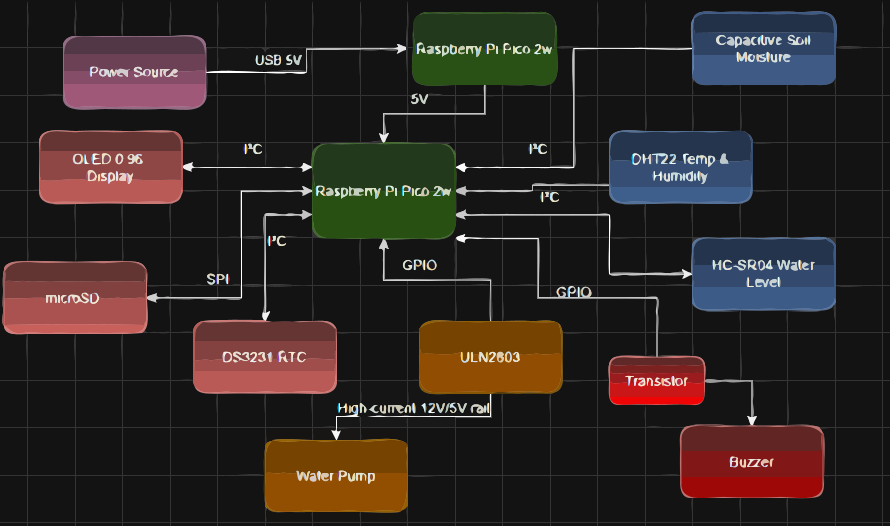
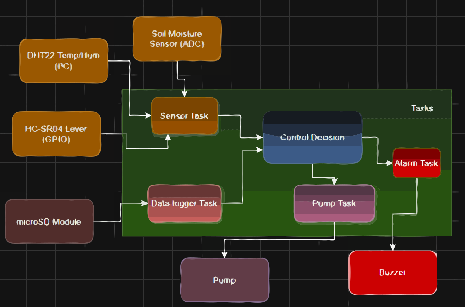

# SIrriS

Smart Irrigation System using Dual Raspberry Pi Pico 2 (Rust Embedded)


**Author**: Dobrinoiu David \
**GitHub Project Link**: [PMRust](https://github.com/UPB-PMRust-Students/proiect-david1203d)


## Description

An automated irrigation system using two Raspberry Pi Pico boards programmed in Rust.
The system measures soil moisture, air temperature and humidity, and water tank levels. 
Based on sensor data, it controls water pumps and valves. One Pico manages the sensors
and actuators, while the second Pico handles user interaction, data logging, 
and debugging functionalities.

## Motivation

I was inspired to create this project by a real-world problem I personally observed: 
the inefficiency of manual irrigation systems. My goal is to design a solution that 
brings real added value by automating irrigation based on environmental conditions. 
Using the knowledge and ideas I developed, I aim to build a system that is practical, 
efficient, and can have a positive impact in everyday life.

## Architecture 



### Overview

**Pico 1 (Main Node – Application Logic)**  
- Reads data from:  
  - Soil moisture sensor  
  - DHT22/BME280 for temperature & humidity  
  - Ultrasonic sensor (HC-SR04) for water level  
- Controls:  
  - Mini water pump  
  - Valves via Relay Module  
- Uses:  
  - DS3231 RTC for scheduling  
  - OLED I2C display for live status  
  - microSD card (SPI) for data logging  
- Provides Wi-Fi web interface using `smoltcp` or `embassy-net`.

**Pico 2 (Debugger Node)**  
- Used exclusively for flashing, live debugging, and UART logging via USB  
- Connected via SWD/UART to Pico 1

### Communication

- Between Pico 1 and Pico 2: UART or SWD  
- User interface: Web access over Wi-Fi (Pico 1), or USB serial debug console



## Log

<!-- write your progress here every week -->

### Week 5 - 11 May

### Week 12 - 18 May

### Week 19 - 25 May

## Hardware


The project integrates sensor modules, actuators, power electronics, 
and communication interfaces, connected via breadboard and jumper wires. 
Logic-level circuits operate at 3.3–5 V, while the pump is powered from a 
separate 12 V supply.


| Component | Purpose |
|----------|---------|
| **Raspberry Pi Pico W (x2)** | One as the main controller, the second as debugger/logger |
| **Capacitive Soil Moisture Sensor** | Measures the moisture level in the soil (ADC) |
| **DHT22 Sensor** | Measures air temperature and relative humidity |
| **HC-SR04 Ultrasonic Sensor** | Determines the water level in the irrigation tank |
| **Relay Module / ULN2803** | Drives the water pump and valves |
| **Mini Water Pump (3–6V DC)** | Pumps water to the plants |
| **RTC DS3231 Module** | Maintains accurate date/time for scheduled irrigation |
| **OLED Display 0.96″ (I²C)** | Displays live data locally |
| **microSD SPI Module** | Logs data as `.csv` for offline review |
| **Passive Buzzer + NPN Transistor** | Audible alert in case of failure or water tank empty |
| **RGB LEDs** | Visual feedback (idle, watering, error) |
| **Resistors, Breadboard, Jumpers** | Electrical connections and protection circuits |

---

### Schematics

Place your KiCAD schematics here.

### Bill of Materials

<!-- Fill out this table with all the hardware components that you might need.

The format is 
```
| [Device](link://to/device) | This is used ... | [price](link://to/store) |

```

-->

| Device | Usage | Price |
|--------|-------|-------|
| [2x Raspberry Pi Pico W](https://www.optimusdigital.ro/en/raspberry-pi-boards/12394-raspberry-pi-pico-w.html) | Dual microcontroller setup: one for sensors/actuators, one for networking/interface | 2 × 34.50 RON = [69 RON](https://www.optimusdigital.ro/en/raspberry-pi-boards/12394-raspberry-pi-pico-w.html) |
| [Capacitive Soil Moisture Sensor v1.2](https://www.optimusdigital.ro/ro/senzori-umiditate-sol/5156-senzor-umiditate-sol-capacitiv-3-3v-5v.html) | Measures soil moisture levels | [~25 RON](https://www.optimusdigital.ro/ro/senzori-umiditate-sol/5156-senzor-umiditate-sol-capacitiv-3-3v-5v.html) |
| [DHT22 Sensor](https://www.optimusdigital.ro/ro/senzori-temperatura/1912-senzor-temperatura-si-umiditate-dht22-am2302.html) | Measures air temperature and humidity | [~30 RON](https://www.optimusdigital.ro/ro/senzori-temperatura/1912-senzor-temperatura-si-umiditate-dht22-am2302.html) |
| [HC-SR04 Ultrasonic Sensor](https://www.optimusdigital.ro/ro/senzori-distanta/168-senzor-distanta-ultrasonic-hc-sr04.html) | Measures water tank level | [~6.49 RON](https://www.optimusdigital.ro/ro/senzori-distanta/168-senzor-distanta-ultrasonic-hc-sr04.html) |
| [Relay Module (2 Channel)](https://www.optimusdigital.ro/ro/relee/1908-modul-releu-2-canale-5v.html) | Controls water pump or valves | [~15 RON](https://www.optimusdigital.ro/ro/relee/1908-modul-releu-2-canale-5v.html) |
| [Mini Water Pump 3-6V DC](https://www.optimusdigital.ro/ro/motoare-pompe/360-mini-pompa-de-apa-3-6v-dc.html) | Pumps water for irrigation | [~20 RON](https://www.optimusdigital.ro/ro/motoare-pompe/360-mini-pompa-de-apa-3-6v-dc.html) |
| [OLED Display 0.96" I2C](https://www.optimusdigital.ro/ro/display-uri/4691-display-oled-i2c-096-inch-128x64-pixeli-alb.html) | Displays real-time sensor values | [~25 RON](https://www.optimusdigital.ro/ro/display-uri/4691-display-oled-i2c-096-inch-128x64-pixeli-alb.html) |
| [RTC Module DS3231](https://www.optimusdigital.ro/ro/ceasuri-in-timp-real-rtc/2066-modul-rtc-ds3231-i2c.html) | Keeps track of time for scheduled irrigation | [~15 RON](https://www.optimusdigital.ro/ro/ceasuri-in-timp-real-rtc/2066-modul-rtc-ds3231-i2c.html) |
| [microSD Card Module SPI](https://www.optimusdigital.ro/ro/module/3152-modul-microsd-spi.html) | Logs data to microSD | [~20 RON](https://www.optimusdigital.ro/ro/module/3152-modul-microsd-spi.html) |
| [Breadboard + Jumper Wires Kit](https://www.optimusdigital.ro/ro/accesorii/1995-breadboard-kit-cu-cabluri-jumper.html) | Prototyping connections | [~20 RON](https://www.optimusdigital.ro/ro/accesorii/1995-breadboard-kit-cu-cabluri-jumper.html) |
| [**Passive Buzzer 5 V**](https://www.optimusdigital.ro/ro/buzzer/123-buzzer-pasiv-5v.html) | Audible feedback (beeps for mode change, low-water alarm, etc.) | [~8 RON](https://www.optimusdigital.ro/ro/buzzer/123-buzzer-pasiv-5v.html) |
| [**NPN Transistor 2N2222**](https://www.optimusdigital.ro/ro/tranzistoare/2752-tranzistor-npn-2n2222.html) | Switches the buzzer from a 3.3V GPIO | [~1 RON](https://www.optimusdigital.ro/ro/tranzistoare/2752-tranzistor-npn-2n2222.html) |
| [**Resistor 1 kΩ**](https://www.optimusdigital.ro/ro/rezistoare/5885-rezistor-14w-1kω-1-.html) | Base-current limiter for transistor | [~0.30 RON](https://www.optimusdigital.ro/ro/rezistoare/5885-rezistor-14w-1kω-1-.html) |


## Software

| Library/Crate | Description | Usage |
|---------|-------------|-------|
| [rp-pico](https://github.com/rp-rs/rp-hal) | Rust support crate for Raspberry Pi Pico | Basic hardware abstraction |
| [embedded-hal](https://github.com/rust-embedded/embedded-hal) | Traits for embedded hardware access | Standardized interfaces for GPIO, ADC, I2C |
| [dht-sensor](https://github.com/eldruin/dht-sensor) | Library for DHT22 sensor | Reading temperature and humidity |
| [ssd1306](https://github.com/jamwaffles/ssd1306) | Driver for OLED displays via I2C | Displaying system status |
| [smoltcp](https://github.com/smoltcp-rs/smoltcp) | Lightweight TCP/IP stack | Serving a small web page over Wi-Fi |
| [embassy](https://embassy.dev/) | Async embedded runtime | Handling async events efficiently |
## Links

<!-- Add a few links that inspired you and that you think you will use for your project -->

1. [Rust on Raspberry Pi Pico – The Embedded Rust Book](https://docs.rust-embedded.org/discovery/f3discovery/03-setup/index.html)  
2. [Soil Moisture Monitoring with Pico W (Python)](https://projects.raspberrypi.org/en/projects/plant-watering-system) – adapted idea  