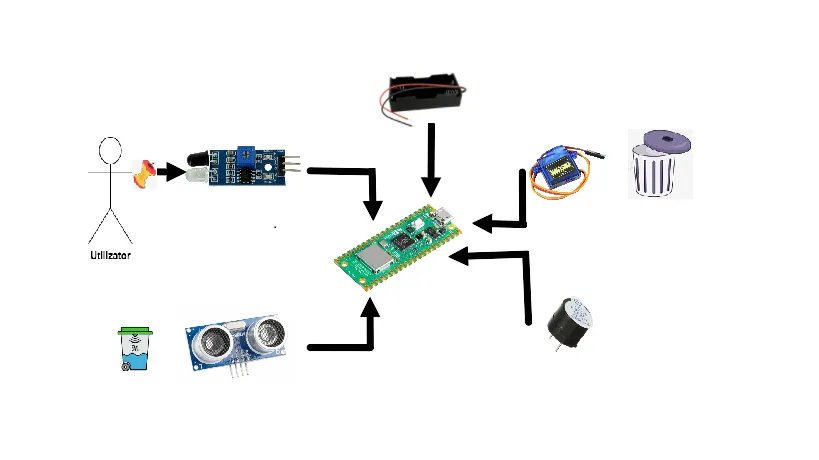
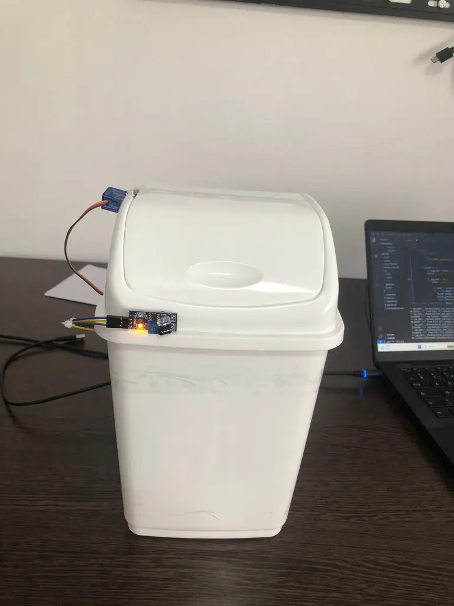
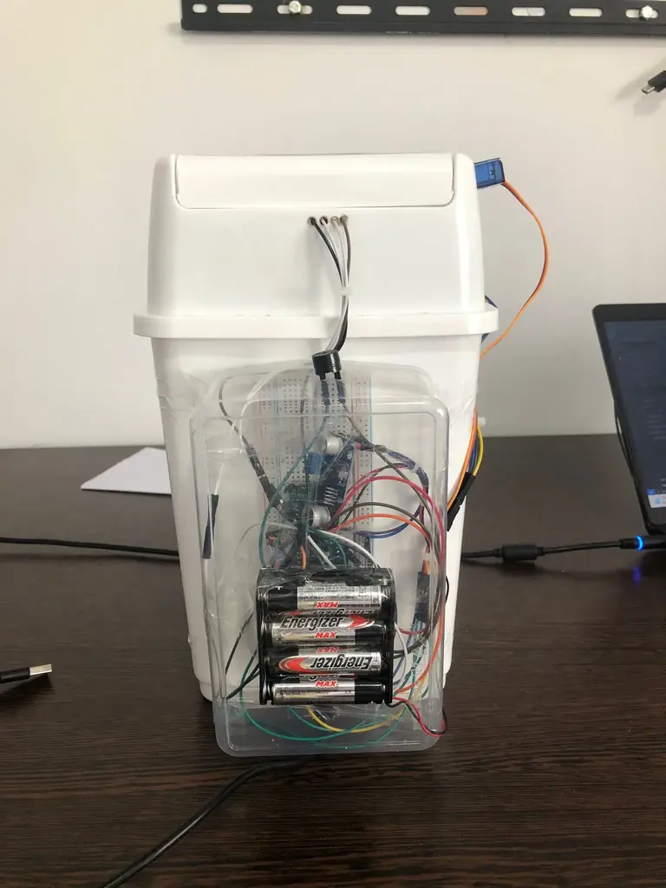
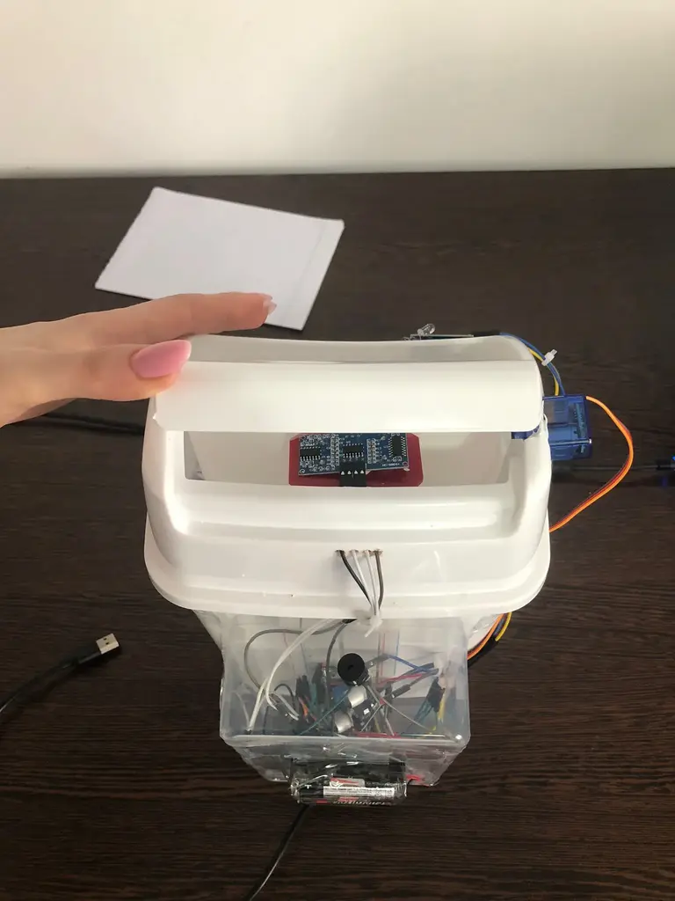

# Smart Trash Can

A contactless, smart solution for detecting full trash bins and automatically opening the lid.

:::info INFO
**Author:** Delia Tudor \
**GitLab Project Link:** https://github.com/UPB-PMRust-Students/proiect-Delia37
:::

## Description

The Smart Trash Can is designed to make household waste management more hygienic, intelligent, and fair — especially in shared living spaces. The bin opens its lid automatically when a person approaches, using an infrared motion sensor that detects hand movement without requiring any physical contact.

To monitor the trash level, the system uses an ultrasonic distance sensor, which determines when the bin is full. When this happens, an audible buzzer alert is triggered to let users know it’s time to empty it.

What makes the project more engaging is its roommate-friendly logic: the software allows you to enter the number of people in the apartment, and when the trash fills up, the buzzer plays a personalized alert to indicate whose turn it is to take the trash out — solving the eternal “not my turn” dilemma in a smart, automated way.

## Motivation

Taking out the trash is a task often postponed, especially in shared living spaces where no one feels responsible. Additionally, touching the bin lid can be unpleasant or unhygienic. This project was created to solve both problems by building a smart trash can that opens automatically when someone approaches and signals clearly when it’s full. The goal is to make waste disposal more hygienic, efficient, and user-friendly.

## Architecture

  <!-- replace with the correct path if needed -->

## Log

### Week 5 - 11 May
- This week, I focused on shaping the overall concept of the project. I worked on the documentation, clarified the main functionalities, and outlined how the system should behave. I also made a first draft of the list of components I would need, researching their roles and how they would connect together.

### Week 12 - 18 May
- I began working on the hardware side of the project. I started assembling the components, connecting the sensors and microcontroller, and testing how they work together on the breadboard. During this stage, I also finalized and completed the Bill of Materials based on the actual needs of the system.

### Week 19 - 25 May
- 

## Hardware

- **Raspberry Pi Pico W** – the microcontroller that runs the software and controls all components.
- **Infrared Sensor** – detects movement (e.g., a hand) near the trash can to trigger the lid to open automatically.
- **Ultrasonic Sensors (HC-SR04)** – used to measure the distance from the top of the bin to the trash, helping determine when it’s full.
- **SG90 Servo Motor** – lifts the lid of the trash can when motion is detected.
- **Buzzer** – sounds an alert when the bin is full and indicates whose turn it is to take out the trash.
- **Breadboard, wires, power supply** – used for prototyping and connecting all components easily.
- **Male and Female Pin Headers** – allow modular, solder-free connections between components and the microcontroller.
- **Battery Holder (2x 18650)** – powers the entire circuit without needing a USB connection.
- **Mounting Bracket** – securely holds the ultrasonic sensor inside the trash can.

## Schematics
 <!-- replace with the correct path if needed -->

## Bill of Materials

| Component | Quantity | Description | Price (RON) |
|----------|----------|-------------|-------------|
| [Raspberry Pi Pico W](https://www.optimusdigital.ro/ro/placi-raspberry-pi/13327-raspberry-pi-pico-2-w.html) | 2 | Main microcontroller unit | 37.00 x 2 |
| [HC-SR04 Ultrasonic Sensor](https://www.optimusdigital.ro/ro/senzori-senzori-ultrasonici/2328-senzor-ultrasonic-de-distana-hc-sr04-compatibil-33-v-i-5-v.html) | 2 | Measures distance to detect if the trash bin is full | 9.00 x 2 |
| [Infrared Obstacle Sensor](https://www.optimusdigital.ro/ro/senzori-senzori-optici/4514-senzor-infrarosu-de-obstacole.html) | 1 | Detects hand movement near the trash can | 3.50 |
| [SG90 Micro Servo Motor](https://www.optimusdigital.ro/ro/motoare-servomotoare/2261-micro-servo-motor-sg90-180.html) | 1 | Opens the bin lid automatically | 11.99 |
| [Active Buzzer 5V](https://www.optimusdigital.ro/en/buzzers/633-buzzer-activ-de-5-v.html) | 1 | Alerts when the bin is full and whose turn it is | 1.40 |
| [Breadboard Kit with Wires & Power Supply](https://www.optimusdigital.ro/ro/kituri/2222-kit-breadboard-hq-830-p.html) | 1 | For prototyping and connecting components | 22.00 |
| [Female Pin Headers](https://www.optimusdigital.ro/ro/componente-electronice-headere-de-pini/4166-header-de-pini-mama-20p-254-mm.html) | 4 strips | Connect to male pins on the board and sensors | 2.00 x 4 |
| [Battery Holder (2x18650)](https://www.optimusdigital.ro/ro/suporturi-de-baterii/941-suport-de-baterii-2-x-18650.html) | 1 | Provides portable power to the system | 3.99 |
| [DC-DC Step-Down Module LM2596HV](https://www.optimusdigital.ro/ro/surse-coboratoare-reglabile/1108-modul-dc-dc-step-down-lm2596hv.html) | 1 | Regulates voltage from battery to appropriate level for components | 12.99 |

<!-- **Estimated Total:** ~168.00 RON -->

## Software

| Library           | Description                            | Usage                                                                 |
|-------------------|----------------------------------------|-----------------------------------------------------------------------|
| embassy-executor  | Asynchronous executor for Rust embedded systems | Used for task scheduling and asynchronous programming        |
| embassy-time      | Time management library                | Used for time-based operations such as delays                         |
| embassy-rp        | Peripheral access library              | Used for initializing and interacting with peripherals                |
| gpio              | GPIO control library                   | Used to control the pins connected to the sensors, buzzer, and servo |
| panic-halt        | Panic handler for embedded Rust        | Used to stop the program safely in case of an unrecoverable error     |
| HC-SR04           | HC-SR04 manipulation                   | Used for controlling the ultrasonic sensor                            |

## Links

1. [Embassy async embedded framework](https://embassy.dev/) – Modern embedded async executor used in your project.
2. [HC-SR04 Ultrasonic Sensor in Rust](https://crates.io/crates/hc-sr04) – Crate for controlling the HC-SR04 distance sensor.
3. [Rust Embedded on Raspberry Pi Pico](https://github.com/embassy-rs/embassy/blob/main/examples/rp/src/bin/pwm.rs) – PWM control example for servos on the Raspberry Pi Pico using Embassy.
4. [Sneha711/Smart-Trash-Can](https://github.com/Sneha711/Smart-Trash-Can) – A similar project written in Python using a Raspberry Pi and motion detection.

