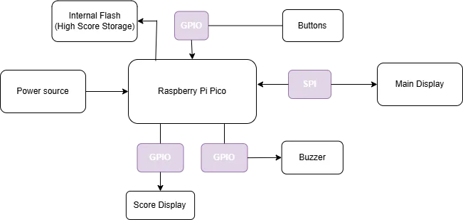

# Pico Tetris Game
A game made in rust that resembles the classic Tetris game.

:::info 

**Author**: Chelaru Diana-Mariana \
**GitHub Project Link**: https://github.com/UPB-PMRust-Students/proiect-DianaChelaru

:::


## Description
This project aims to recreate the classic Tetris game. The player can control the falling blocks using physical buttons for left, right, fast drop and rotation. The game will be displayed on an LCD screen, along with the next block preview and the highest score, while the current score will be shown on a separate LED display. A buzzer will go off when a line is completed or when the player loses. Additionally, a restart button allows the player to reset/restart the game at any time. To enhance the gameplay experience, the highest scores will be stored permanently in the internal flash memory of the Raspberry Pi Pico, ensuring they are preserved even after the device is powered off.


## Motivation
I chose to recreate Tetris because it’s one of the games I’ve always liked for how simple but addictive it is. I wanted a project that combines both coding and hardware, and making a physical version of a game I grew up seeing felt like a really cool idea. It’s also a good challenge because Tetris isn’t as easy to implement as it looks, and it lets me practice both working with displays, buttons and saving data on the device.

## Architecture 
The **Raspberry Pi Pico 2W** serves as the brain of the project, handling all the game logic and hardware communication. It reads inputs from the physical buttons, updates the displays through the SPI interface, controls the buzzer for sound feedback, and saves the high score into its internal flash memory. The Pico is powered via a USB connection or an external battery.

The main **LCD display** is connected to the Pico through SPI and is responsible for showing the Tetris grid, the falling blocks, and a preview of the next block. The display updates dynamically according to the game state managed by the Pico.

A score **LED display**, also connected via SPI, shows the current score separately from the main game display. This allows the player to track their performance at a glance without cluttering the main game area.

The **buttons** are simple digital inputs connected to the GPIO pins of the Pico. Each button corresponds to a specific in-game action: moving the block left or right, rotating it, dropping it faster, or restarting the game after a loss. The microcontroller constantly polls the buttons to detect player input.

The **buzzer** is connected to a GPIO pin and is activated by the Pico in specific situations, such as completing a line or losing the game. This provides basic sound feedback to enhance the gameplay experience.

All components are connected through a **breadboard**, making it easy to organize the wiring and quickly modify the setup if needed.

**Wires** are used to make the necessary connections between the Pico and the other hardware elements.

The entire system is powered through a USB cable connected to the Pico.




## Log

<!-- write every week your progress here -->

### Week  - 11 May
-modified/updated the schematic

-assembled some components on the breadboard

-started working on the software


### Week  -  May


### Week  -  May
 

## Hardware

1. **Raspberry Pi Pico 2W**
**Purpose**: Acts as the main controller of the system.
**Function**: Reads button inputs, updates the main LCD and score LED displays, controls the buzzer for sound events, and permanently saves the highest score into internal flash memory.

2. **Main Display (LCD)**
**Purpose**: Displays the main game elements and information.
**Function**: Shows the Tetris game grid, the falling blocks, the next block preview, the current score, and the highest score. Controlled by the Pico via SPI communication.

3. **Score Display (LED Display)**
**Purpose**: Provides a dedicated view for the current player score.
**Function**: Displays the current score separately from the main game area, continuously updated by the Pico through SPI.

4. **Buttons**
**Purpose**: Allow the player to interact with the game.
**Function**: Send digital signals to the Pico when pressed, enabling actions like moving the block left/right, rotating it, fast-dropping, or restarting the game.

5. **Buzzer**
**Purpose**: Gives sound feedback for key game events.
**Function**: Activated by the Pico to emit sounds when a line is cleared or when the player loses.

6. **Breadboard**
**Purpose**: Organizes and connects all components without soldering.
**Function**: Provides a reusable platform for connecting the microcontroller, displays, buttons, and buzzer through wires.

7. **Wires**
**Purpose**: Ensure physical and electrical connections between components.
**Function**: Carry data signals and power between the Raspberry Pi Pico and all peripheral devices.

### Schematics


### Bill of Materials

<!-- Fill out this table with all the hardware components that you might need.

The format is 
```
| [Device](link://to/device) | This is used ... | [price](link://to/store) |

```

-->

| Device | Usage | Price |
|--------|--------|-------|
| [Rapspberry Pi Pico 2W](https://datasheets.raspberrypi.com/picow/pico-2-w-datasheet.pdf) | The microcontroller | [40 RON x2](https://www.optimusdigital.ro/en/raspberry-pi-boards/13327-raspberry-pi-pico-2-w.html?search_query=raspberry+pi+pico+2&results=36) |
| [LCD Display](http://www.lcdwiki.com/1.44inch_SPI_Module_ST7735S_SKU:MSP1443) | Main Display SPI LCD| [28 RON](https://www.optimusdigital.ro/ro/optoelectronice-lcd-uri/870-modul-lcd-144.html) |
| [LED Display](https://robojax.com/learn/arduino/robojax-TM1637_display_manual.pdf) | Score Display TM1637| [9 RON](https://www.optimusdigital.ro/en/led-displays/1202-led-display-module-with-serial-interface-tm1637-chip.html?search_query=led+display&results=499) |
| [Breadboard](https://docs.sunfounder.com/projects/sf-components/en/latest/component_breadboard.html) | Bredboard for connecting the hardware | [4.56 RON](https://www.optimusdigital.ro/ro/prototipare-breadboard-uri/44-breadboard-400-points.html?search_query=breadboard&results=128) |
| [Button](https://components101.com/sites/default/files/component_datasheet/Push-Button.pdf) | Game Interactions | [0.36 RON x5](https://www.optimusdigital.ro/en/buttons-and-switches/1119-6x6x6-push-button.html?search_query=buttons&results=259) |
| [Buzzer](https://components101.com/sites/default/files/component_datasheet/Buzzer%20Datasheet.pdf) | Sound Effects | [1 RON](https://www.optimusdigital.ro/en/buzzers/12247-3-v-or-33v-passive-buzzer.html?search_query=3+V+or+3.3V+Passive+Buzzer&results=2) |
| [Wires](https://www.farnell.com/datasheets/3178883.pdf) | Connections | [8 RON](https://www.optimusdigital.ro/en/wires-with-connectors/12-breadboard-jumper-wire-set.html?search_query=wires&results=556) |


## Software

| Library | Description | Usage |
|---------|-------------|-------|
| [embassy-rp](https://github.com/embassy-rs/embassy/tree/main/embassy-rp) | Rust framework for embedded programming | Used for accessing the peripherals|
| [embedded-graphics](https://crates.io/crates/embedded-graphics) | 2D graphics library | Used for displaying the game|
| [rand](https://crates.io/crates/rand) | Random number generating | Random tetris block generating|
| [tm1637-embedded-hal](https://crates.io/crates/tm1637-embedded-hal) | Rust crate for TM1637 microcontroller | TM1637 module control|
| [ST7789](https://github.com/almindor/st7789/tree/master) | Display driver for ST7789 | Main display control|

## Links

<!-- Add a few links that inspired you and that you think you will use for your project -->

1. (https://donte.dev/tetris/)
