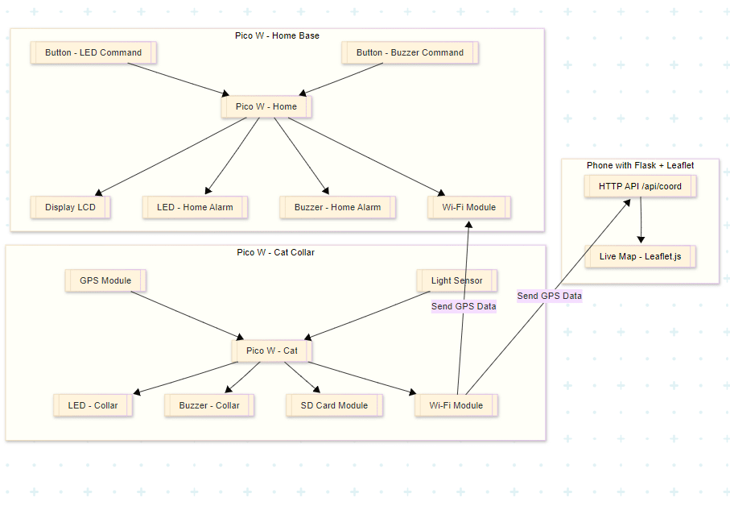
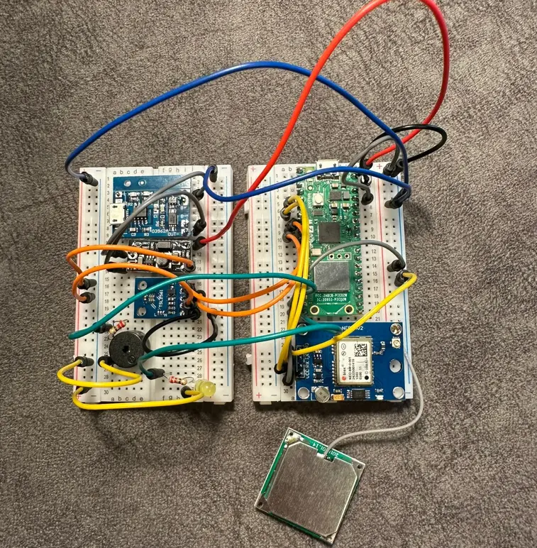
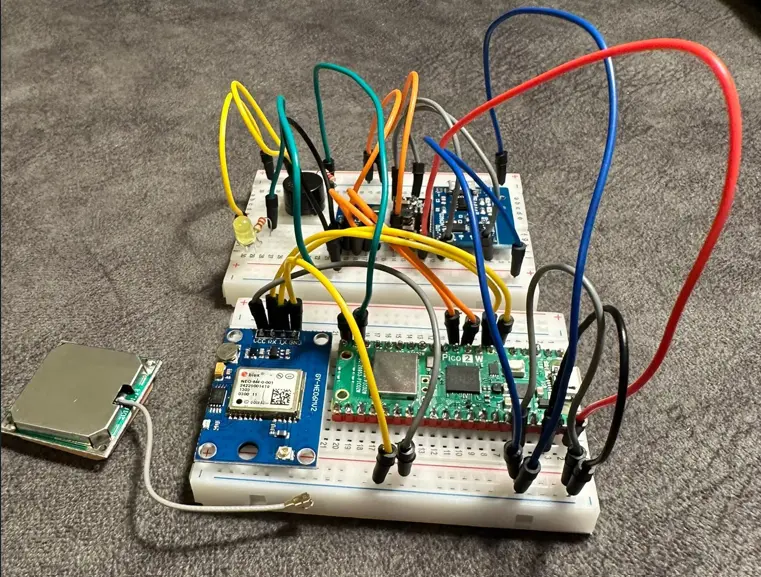
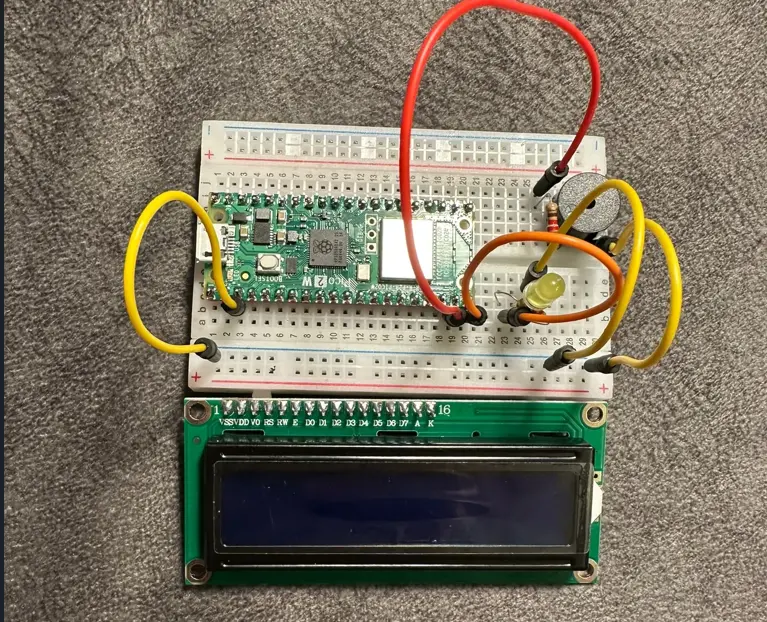

# Cat GPS Tracker & Home Alarm
Keep my cat safe and close to home using Wi-Fi-based tracking, smart alerts, SD card backup, and live map tracking

:::info 

**Author**: Dragoș-Andrei Sava \
**GitHub Project Link**: https://github.com/UPB-PMRust-Students/proiect-savaandrei2003

:::

## Description

A two-device system based on Raspberry Pi Pico 2W boards to track a cat using GPS and Wi-Fi, while offering local and remote alerts, SD logging, and live map integration via a mobile device.

Key functionalities:

- The **collar Pico W**:
  - Sends GPS coordinates every 5 seconds via Wi-Fi to:
    1. The **home Pico W** 
    2. A **server running on my computer**
  - Saves coordinates on a microSD card if Wi-Fi is unavailable.
  - Activates a night mode - LED + beep every 10s -  based on light sensor.
  - Can activate its buzzer or LED remotely via buttons on the home unit.

- The **home Pico W**:
  - Displays live coordinates or last known data on an LCD screen.
  - Triggers LED and buzzer alarm if connection is lost.
  - Two buttons control the collar LED or buzzer remotely.

- The **server running on my computer**:
  - Receives GPS coordinates via HTTP API.
  - Maps the real-time location using **Leaflet.js + OpenStreetMap**.
  - Can be accessed via browser for live tracking.

## Motivation

Commercial GPS trackers are expensive and full of subscriptions. This DIY alternative uses affordable hardware, local Wi-Fi, and a custom pc-hosted map server to help my mother keep track of her cat. It offers a rich feature set including real-time alerts, offline GPS logging, and a live web map.


## Architecture 



## Log

<!-- write your progress here every week -->

### Week 5 - 11 May

### Week 12 - 18 May

### Week 19 - 25 May

## Hardware

1. Raspberry Pi Pico 2W x2:
- Wi-Fi-enabled microcontrollers  
- One on the cat's collar, one in the house 
2. GY-NEO6MV2:
- GPS module
- Real-time positioning of the cat
3. TSL2561:
- Light intensity sensor
- Takes periodic measurements and sends the data to the MCU
- Detects ambient darkness to trigger beacon mode  
4. LCD screen:
- Shows live GPS coordinates in house 
5. LEDs x2:
- One on the collar for visibility in dark  
- One in house unit for alarm signal   
6. Buzzer x2:
- One in collar for locating the cat  
- One in house unit for lost-signal alarm 
7. Push Buttons ×2  
- Control collar LED and buzzer remotely  
8. SD Card Module + microSD  
- Stores GPS coordinates when offline   

### Schematics


## Schematics
**ABOVE**


**SIDE**


**COLAR**



### Bill of Materials

<!-- Fill out this table with all the hardware components that you might need.

The format is 
```
| [Device](link://to/device) | This is used ... | [price](link://to/store) |

```

-->

| Device | Usage | Price |
|--------|--------|-------|
| [Raspberry Pi Pico 2W](https://www.raspberrypi.com/documentation/microcontrollers/pico-series.html#pico2w-technical-specification) | The microcontroller and debugger | [39.66 RON × 3](https://www.optimusdigital.ro/ro/placi-raspberry-pi/13327-raspberry-pi-pico-2-w.html) |
| [TSL2561](https://cdn-learn.adafruit.com/downloads/pdf/tsl2561.pdf) | Light intensity sensor | [22.99 RON](https://www.optimusdigital.ro/en/optical-sensors/137-tsl2561-light-intensity-sensor-module.html) |
| [GY-NEO6MV2](https://www.mantech.co.za/datasheets/products/GY-NEO6MV2.pdf?srsltid=AfmBOopLKLqdQ1J7A7ymF9OSc_P0oyHDmRPk4yhrHdXcxkb17nsCUqgT) | GPS Module | [44.95 RON](https://www.optimusdigital.ro/en/gps/105-gy-neo6mv2-gps-module.html) |
| Breadboard | Connect all the components | [9.98 RON x2](https://www.optimusdigital.ro/en/breadboards/8-breadboard-hq-830-points.html) |
| LCD screen | Display the sensors' measurements | [16.34 RON](https://www.optimusdigital.ro/en/lcds/2894-1602-lcd-with-i2c-interface-and-blue-backlight.html) |
| Buzzer | Audio alarm | [1.40 RON x2](https://www.optimusdigital.ro/en/buzzers/634-5v-passive-buzzer.html) |
| Push Buttons | Remote commands | [0,49 RON x2](https://www.optimusdigital.ro/ro/butoane-i-comutatoare/8585-buton-smd-4-x-4-x-15-mm.html?gad_source=1&gbraid=0AAAAADv-p3ANSmBXgzfvJpe3E86DHpwLt&gclid=Cj0KCQjwoNzABhDbARIsALfY8VNLoFcAWnMuWyKtui9UEPItQS4YjLcDfaB3ppHb1_aHJZ8QLUjy46IaAmUlEALw_wcB) |
| LED | Visual alarm | [0.39 RON × 2](https://www.optimusdigital.ro/en/leds/29-5-mm-red-led-with-difused-lens.html) |
| Pin header | Connect components to the breadboard | [0.99 RON × 10](https://www.optimusdigital.ro/en/pin-headers/464-colored-40p-254-mm-pitch-male-pin-header-red.html) |
| Battery | Power the circuit | [60.00 RON](https://ampul.eu/ro/baterii/4292-baterie-li-pol-1000mah-37v-523450?gad_source=1&gad_campaignid=17339270587&gbraid=0AAAAADSG6LGS2RVOxxoCAwPIMxeuiyRLW&gclid=Cj0KCQjwiqbBBhCAARIsAJSfZkZ3iI0qDqWb6CUqsdIzNTqvXcvScrz3jXA4keBdxxhp5xyv6VECMUYaAhUmEALw_wcB) |
| Total | - | ~ 300 RON |


## Software

| Library | Description | Usage |
|---------|-------------|-------|
| [embassy-rp](https://crates.io/crates/embassy-rp) | RP2040 HAL | GPIO, UART, SPI, I2C |
| [embassy-time](https://crates.io/crates/embassy-time) | Timekeeping, delays and timeouts | Create timers |
| [embassy-net](https://crates.io/crates/embassy-net) | Async network stack | Send messages over Wi-Fi |
| [embassy-executor](https://crates.io/crates/embassy-executor) | An async/await executor | Create different tasks |
| [lcd1602-rs](https://crates.io/crates/lcd1602-rs) | Display library | Display coordinates |
| [heapless](https://crates.io/crates/heapless) | Statically allocated data | Buffers for display and packets |


## Links

<!-- Add a few links that inspired you and that you think you will use for your project -->

1. [Lab 03 - PWM & ADC](https://pmrust.pages.upb.ro/docs/acs_cc/lab/03)
2. [Lab 04 - Asynchronous Development](https://pmrust.pages.upb.ro/docs/acs_cc/lab/04)
3. [Lab 06 - Inter-Integrated Circuit](https://pmrust.pages.upb.ro/docs/acs_cc/lab/06)
4. [Lab 07 - Wi-Fi](https://pmrust.pages.upb.ro/docs/acs_cc/lab/07)
5. [How to connect LCD without I2C](https://www.youtube.com/watch?v=Xq0bt-0kbBk)
