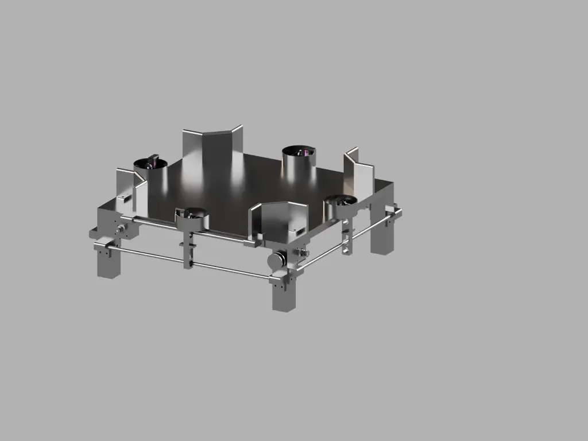
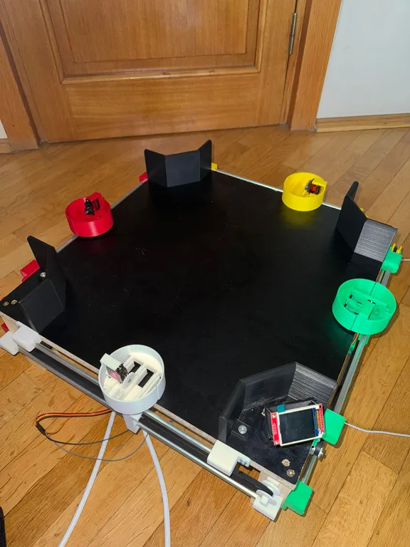
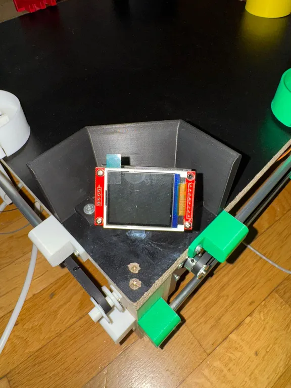
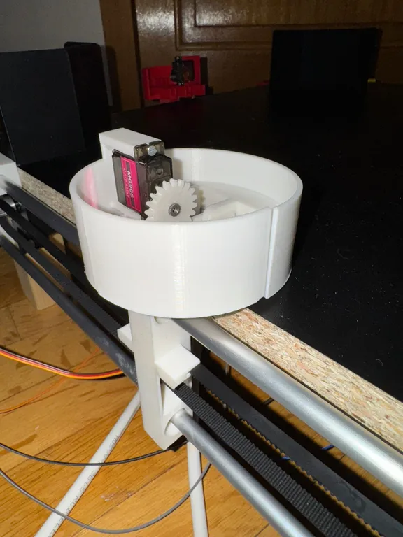
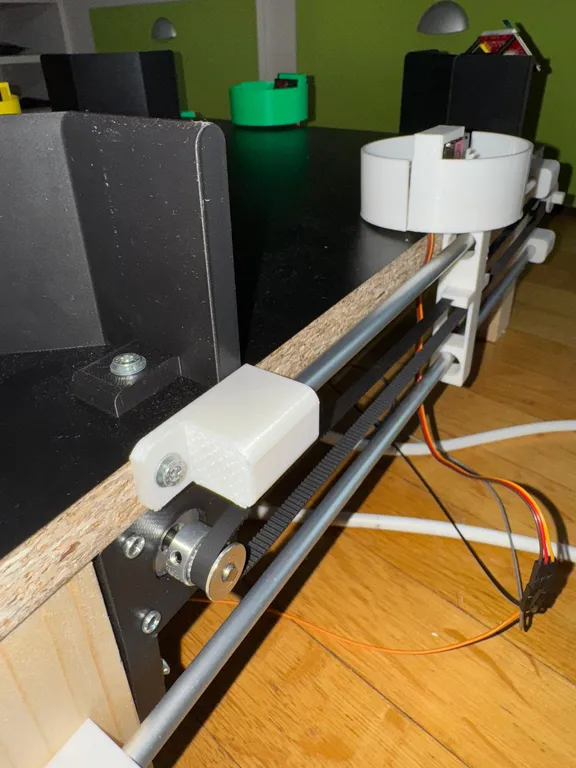
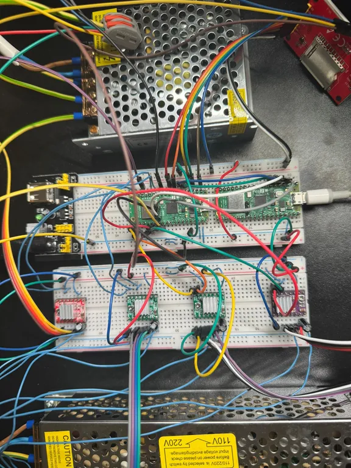
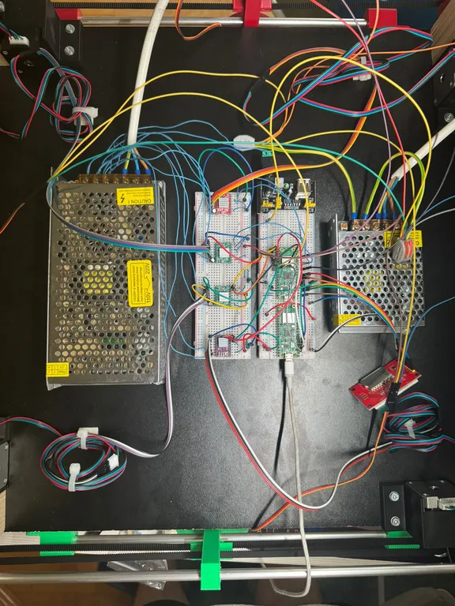

# 4Clash
Battleground of buttons, motors, and multiplayer mayhem!

:::info 

**Author**: Gabriel-Valentin Pitic \
**GitHub Project Link**: [https://github.com/UPB-PMRust-Students/proiect-gabrielpitic](https://github.com/UPB-PMRust-Students/proiect-gabrielpitic)

:::

## Description

4Clash is a DIY multiplayer gaming table that brings players together in physical space for competitive digital battles. Using 3D printed components, stepper motors, servos, and Raspberry Pi Pico 2W microcontrollers, this project creates an interactive tabletop gaming experience where multiple players can compete simultaneously. The system combines physical controls with digital gameplay elements, all powered by custom Rust software that handles game mechanics, player interactions, and visual feedback.

## Motivation

I created 4Clash to explore the intersection between digital gaming and physical social interaction. In an era dominated by online multiplayer experiences, I wanted to build something that brings people together in the same room, fostering face-to-face competition. The project also serves as an excellent platform to deepen my understanding of embedded systems programming with Rust, physical computing, and real-time multiplayer game development. Building 4Clash has allowed me to combine my interests in gaming, electronics, and software development while creating something that friends can gather around and enjoy together.

## Architecture 
 

## Log

<!-- write your progress here every week -->

### Week 5 - 11 May

I finished the CAD version on the project.

I started printing all the components, taking around 60h of printing time.

### Week 12 - 18 May

I switched the mechanism to use a timing belt, instead of a rope and spool.

I changed the communication protocol, instead of using TCP to communicate, i started using UDP for lower latency.

### Week 19 - 25 May

I fully changed the architecture by creating a UDP client written in Python to handle player controls (from keyboard or joysticks).

The new architecture hosts an HTTP server just for score keeping which sends HTTP packets that are parse by the pico and then update the
live scoreboard, which is displayed on the ST7735.

I bought another power supply for the servos since the one i had wasn't enough.

I dropped the QR code idea since it required some `std`features.

## Hardware

- Raspberry Pi Pico 2W - Used as the main microcontroller handling all the motors, as well as the wi-fi connections for the players.
- 17HS4401 Stepper motor - Used for the linear movement of the player.
- MG90S Servo - Used for the shooting mechanism of the player.
- DRV8825 and A4988 - Stepper motor drivers used to control the stepper motors.
- ST7735 display - Used to display the QR code for the players to connect to the game.
- 3D printed parts - Used to create the physical structure of the game, including the player housing and shooting mechanism.
- Power supply - Used to power the entire system, including the motors and microcontroller.
- Wood parts - Used to create the base of the game.
- Bolts and nuts - Used to assemble the 3D printed parts and wood parts together.
- Wires and connectors - Used to connect the various components together.
- Breadboard - Used for prototyping and testing the circuit connections before final assembly.

 







### Schematics


### Bill of Materials

<!-- Fill out this table with all the hardware components that you might need.

The format is 
```
| [Device](link://to/device) | This is used ... | [price](link://to/store) |

```

-->

| Device | Usage | Price |
|--------|--------|-------|
| 2x [Raspberry Pi Pico 2W](https://www.optimusdigital.ro/ro/placi-raspberry-pi/13327-raspberry-pi-pico-2-w.html) | The microcontroller | 80 LEI |
| 4x [17HS4401 Stepper Motor](https://www.optimusdigital.ro/ro/motoare-motoare-pas-cu-pas/5057-motor-pas-cu-pas-17hs4401-17-a-40-ncm.html) | Used for the linear movement of the player | 136 LEI |
| 4x [MG90S Servo](https://www.optimusdigital.ro/ro/motoare-servomotoare/271-servomotor-mg90s.html) | Used for the shooting mechanism of the player | 78 LEI |
| 4 x [A4988 Stepper Motor Driver](https://www.optimusdigital.ro/ro/drivere-de-motoare-pas-cu-pas/866-driver-pentru-motoare-pas-cu-pas-a4988-rosu.html) | Used to control the stepper motors | 32 LEI |
| [ST7735 Display](https://www.amazon.de/GERUI-Display-Module-Screen-ST7735/dp/B0CWN27HVB/ref=sr_1_14_sspa) | Used to display the QR code for the players to connect to the game | 29 LEI |
| [Switched Power Supply](https://www.optimusdigital.ro/ro/surse-ac-dc-de-12-v/1947-sursa-de-tensiune-in-comutaie-12v-15a-180-w.html) | Used to power the entire system, including the motors and microcontroller | 60 LEI |
| [Switched Power Supply](https://www.optimusdigital.ro/ro/surse-ac-dc-de-5-v/1954-sursa-de-tensiune-in-comutaie-5v-10a-50-w.html) | Used to power the servos | 48 LEI |
| Consumables (3D printed parts, wood parts, bolts, nuts, wires, connectors etc.) | Used to create the physical structure of the game | 120 LEI |

## Software

| Library | Description | Usage |
|-------|-------------|------------------|
| [embassy-executor](https://crates.io/crates/embassy-executor) | Async executor for Embassy | Task spawning and async runtime management |
| [embassy-rp](https://crates.io/crates/embassy-rp) | Embassy HAL for RP2040/RP2350 | GPIO, PWM, SPI, UART hardware control |
| [embassy-net](https://crates.io/crates/embassy-net) | Embassy networking stack | TCP/UDP server implementation |
| [embassy-time](https://crates.io/crates/embassy-time) | Embassy time utilities | Timers, delays, and timing operations |
| [embassy-sync](https://crates.io/crates/embassy-sync) | Embassy synchronization primitives | Inter-task communication channels and signals |
| [embassy-embedded-hal](https://crates.io/crates/embassy-embedded-hal) | Embassy embedded-hal compatibility layer | Shared SPI bus implementation |
| [embassy-futures](https://crates.io/crates/embassy-futures) | Embassy async utilities | Select operations for concurrent tasks |
| [cyw43](https://crates.io/crates/cyw43) | CYW43439 WiFi driver | WiFi connectivity for Raspberry Pi Pico 2 |
| [mipidsi](https://crates.io/crates/mipidsi) | MIPI DSI display driver | ST7735s TFT display control |
| [embedded-graphics](https://crates.io/crates/embedded-graphics) | 2D graphics library for embedded devices | Text rendering and display drawing |
| [display-interface-spi](https://crates.io/crates/display-interface-spi) | SPI display interface implementation | SPI communication protocol for display |
| [static-cell](https://crates.io/crates/static-cell) | Static memory allocation utilities | Network stack resource allocation |
| [heapless](https://crates.io/crates/heapless) | Collections without heap allocation | Strings and vectors for embedded use |
| [fixed](https://crates.io/crates/fixed) | Fixed-point arithmetic | PWM frequency and timing calculations |
| [defmt](https://crates.io/crates/defmt) | Efficient logging framework | Debug and info logging throughout system |
| [defmt-rtt](https://crates.io/crates/defmt-rtt) | RTT transport for defmt logging | Log output via Real-Time Transfer |
| [panic-probe](https://crates.io/crates/panic-probe) | Panic handler for probe-rs debugging | Panic handling and debugging support |
| embassy-lab-utils | Embassy laboratory utilities | WiFi initialization and network setup helpers |
