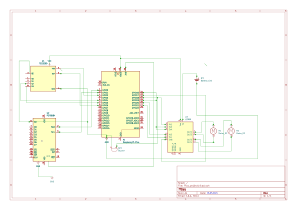
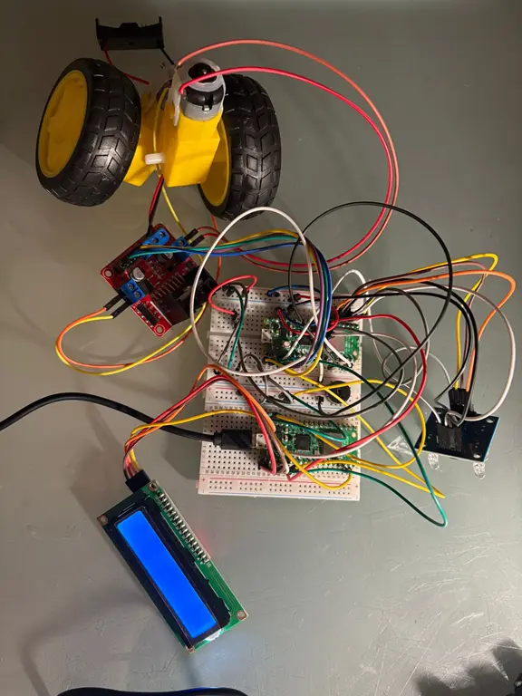

# AutoCash  
Automated banknote and coin sorting & counting device

:::info 

**Author**: Logofatu Gabriela-Patricia \
**GitHub Project Link**: https://github.com/UPB-PMRust-Students/proiect-Patrickgabr

:::

## Description

**AutoCash** is an automated device that detects, identifies, counts, and sorts banknotes and coins based on their value.
The project combines weight sensors, image sensors, and control components to recognize the type of currency inserted and
distribute it into the correct compartments.
The system provides real-time feedback on an OLED display and can save the total sum or history of processed amounts.
It is useful for cash handling in educational or commercial contexts.

---

## Motivation

The project reflects my desire to integrate embedded Rust programming with practical electronic design. I chose this idea
because it combines mechanical control, real-time sensor feedback, and user interaction in an engaging way.
I believe AutoCash can be the foundation for future smart kiosk or cash-handling systems, and it allowed me to explore
image recognition, precision electronics, and embedded system control simultaneously.

---

## Architecture

The **Raspberry Pi Pico 2W** acts as the central processing unit, handling input from sensors and issuing commands to actuators and the OLED display. It is mounted on a **breadboard** for easy prototyping and wiring.

The **OLED 128x64 I2C display** is used to provide real-time feedback to the user, displaying detected values and the running total. It communicates with the Pico via I2C protocol.

The **camera module** captures an image of each inserted banknote. The data is sent to the Pico for value recognition using basic image processing.

The **HX711 sensor**, paired with a **load cell**, is responsible for detecting the weight of inserted coins and mapping them to predefined currency values.

The optional **TCS3200 color sensor** assists in further distinguishing coins of similar weight by analyzing their color.

The **MG90S servo motors** are responsible for physically sorting the identified coins and banknotes into designated compartments based on their values. They are more robust than SG90s and provide higher torque, improving precision in sorting.

The **RGB LEDs** provide visual feedback for different states of the system (detection, error, completion, etc.).

The **buzzer** gives audio confirmation or alerts depending on the system status.

The **push buttons** allow the user to manually start or reset the sorting/counting process.

All components are connected using the **breadboard** for modularity and ease of testing.

---

## Log

<!-- write every week your progress here -->

### Week 1
I created the project documentation, including its purpose, the required components, and the general architecture.

### Week 2
I worked on the hardware documentation, detailing the connections between components, the power supply, and specific information about each module used.

### Week 3
I assembled the hardware on a breadboard according to the schematic, testing the connections and integration of components (LCD, TCS3200, motors, buzzer, etc.).
 

## Hardware

1. **Raspberry Pi Pico 2W**  
- **Purpose**: Central controller of the system  
- **Function**: Manages data acquisition from sensors, controls the servomotors, handles user input and displays feedback on the OLED display.

2. **Camera Module**  
- **Purpose**: Captures banknote image  
- **Function**: Takes a snapshot of the inserted banknote, which is processed to determine its value using basic image analysis.

3. **HX711 + Load Cell**  
- **Purpose**: Detects the weight of coins  
- **Function**: Measures the weight of each inserted coin and compares it to known values to determine the coin's denomination.

4. **TCS3200 Color Sensor** *(optional)*  
- **Purpose**: Differentiates similar coins  
- **Function**: Reads the color pattern of a coin to distinguish between coins of similar weight (e.g., 10 bani vs. 50 bani).

5. **MG90S Servomotors**  
- **Purpose**: Physical sorting  
- **Function**: Rotate arms or compartments to direct banknotes and coins into the correct sorting bins based on their identified value.

6. **OLED 128x64 I2C Display**  
- **Purpose**: User interface  
- **Function**: Displays detected value, total amount, and status messages for the user.

7. **RGB LEDs**  
- **Purpose**: Visual feedback  
- **Function**: Light up with different colors to indicate successful detection, errors, or completion of sorting.

8. **Buzzer**  
- **Purpose**: Audio feedback  
- **Function**: Emits short beeps for confirmation, alerts, or interaction prompts.

9. **Push Buttons (Start/Reset)**  
- **Purpose**: Manual control  
- **Function**: Allow the user to begin or reset the sorting/counting process.

10. **Breadboard + Wires + Resistors**  
- **Purpose**: Prototyping and wiring  
- **Function**: Enable modular and safe interconnection between all components without soldering.

---

### Hardware Overview

- The **Raspberry Pi Pico 2W** serves as the brain of the system, orchestrating all operations.  
- The **camera module** and **load cell** provide input data for recognizing money.  
- The **OLED display** keeps the user informed with live feedback.  
- The **MG90S servos** handle the mechanical sorting of cash.  
- **LEDs** and **buzzer** offer quick and intuitive feedback.  
- The entire circuit is assembled on a **breadboard**, allowing flexibility in testing and debugging.

---

### Bill of Materials

| Device | Usage | Price |
|--------|--------|-------|
| [Raspberry Pi Pico 2W](https://datasheets.raspberrypi.com/picow/pico-2-w-datasheet.pdf) | Main microcontroller responsible for controlling sensors, actuators, and display | [39,66 RON](https://www.optimusdigital.ro/en/raspberry-pi-boards/13327-raspberry-pi-pico-2-w.html?search_query=raspberry+pi+pico+2&results=36) |
| [HX711 + Load Cell](https://cdn.sparkfun.com/datasheets/Sensors/Force/hx711_english.pdf) | Measures the weight of coins for value identification | [28 RON](https://www.optimusdigital.ro/ro/senzori-greutate/1665-hx711-cu-load-cell.html) |
| [TCS3200 Color Sensor](https://www.mouser.com/datasheet/2/588/TCS3200-Datasheet-1863947.pdf) | Distinguishes coins with similar weight using color recognition | [38,99 RON](https://www.optimusdigital.ro/ro/senzori-senzori-optici/1854-modul-senzor-de-culoare-tcs230-albastru.html?gad_source=1&gad_campaignid=19615979487&gbraid=0AAAAADv-p3B5TYhyjMqYSQe-vwiSkvVW-&gclid=Cj0KCQjw2tHABhCiARIsANZzDWrkoU33N0RPPdmr1FscYr2vGT08BYkZe_V3TDtUoROWS7zREEg4lKAaAr4uEALw_wcB) |
| [Camera OV7670](https://cdn.sparkfun.com/datasheets/Dev/Arduino/Other/OV7670.pdf) | Captures images of banknotes for value recognition | [25 RON](https://www.optimusdigital.ro/ro/module-camera/757-camera-ov7670.html) |
| [OLED 128x64 I2C Display](https://www.waveshare.com/wiki/1.3inch_OLED_Module) | Displays feedback and detected values to the user | [30 RON](https://sigmanortec.ro/display-oled-096-i2c-iic-alb?SubmitCurrency=1&id_currency=2&gad_source=1&gad_campaignid=22174019478&gbraid=0AAAAAC3W72O583Lr5l62Wu-ikqzQMfuL2&gclid=Cj0KCQjw2tHABhCiARIsANZzDWr2EP1tdJRM4oiHFRUcC1w4hUvSPaTZ6qxoR34rp6V-loIeyl9eoQoaAtAaEALw_wcB) |
| [MG90S Servo Motors](https://datasheet.lcsc.com/lcsc/2108221530_Tower-Pro-MG90S_C505114.pdf) | Rotates arms or compartments to sort coins and banknotes | [15,90 RON](https://www.optimusdigital.ro/ro/motoare-servomotoare/271-servomotor-mg90s.html?gad_source=1&gad_campaignid=19615979487&gbraid=0AAAAADv-p3B5TYhyjMqYSQe-vwiSkvVW-&gclid=Cj0KCQjw2tHABhCiARIsANZzDWoz1tCEPHcCwrJjGvixIEEHA0ucaYwopthJbHuNqvLg32sTGU5LhVUaAqmhEALw_wcB) |
| [Breadboard + Wires](https://www.optimusdigital.ro/ro/breadboard/1855-mini-breadboard-alb.html) | Rapid prototyping and safe connections between components | [15 RON](https://www.optimusdigital.ro/ro/prototipare-breadboard-uri/44-breadboard-400-points.html?gad_source=1&gad_campaignid=19615979487&gbraid=0AAAAADv-p3B5TYhyjMqYSQe-vwiSkvVW-&gclid=Cj0KCQjw2tHABhCiARIsANZzDWpdUXj9kch93lJ4Nl8gd_hk4-eTLgCW_QEZOwpYMkuBO0nA84xmgFsaArduEALw_wcB) |
| [RGB LEDs + Buzzer](https://www.optimusdigital.ro/ro/componente-pasive/148-kit-leduri-5mm-400-bucati.html) | Visual and audio feedback | [10 RON](https://www.optimusdigital.ro/ro/optoelectronice-led-uri/11831-set-10-led-uri-stralucitoare-rgb-5050.html?gad_source=1&gad_campaignid=19615979487&gbraid=0AAAAADv-p3B5TYhyjMqYSQe-vwiSkvVW-&gclid=Cj0KCQjw2tHABhCiARIsANZzDWrjXo5KSmlkW1hGPLXRzp1G12ZIBohbdHCi4FMR_2ip1wE4qD68u48aAr6qEALw_wcB) |
| [Push Buttons + 220Ω Resistors](https://www.optimusdigital.ro/ro/componente-pasive/246-butone-push-button-6x6mm-50buc.html) | Start/reset input and wiring | [5 RON](https://www.optimusdigital.ro/ro/butoane-i-comutatoare/2375-modul-cu-buton-rou.html?gad_source=1&gad_campaignid=19615979487&gbraid=0AAAAADv-p3B5TYhyjMqYSQe-vwiSkvVW-&gclid=Cj0KCQjw2tHABhCiARIsANZzDWpTwYaleucpOw-71oqhmGrJjxXHrWlDf4h1JDyKbr3Za6rQuF011CQaAmcDEALw_wcB) |

---

## Software

| Library | Description | Usage |
|---------|-------------|-------|
| [embassy-rp](https://github.com/embassy-rs/embassy/tree/main/embassy-rp) | RP2040 Peripherals | Used for accessing the Pico's hardware peripherals |
| [embedded-hal](https://github.com/rust-embedded/embedded-hal) | Hardware abstraction layer | Common traits for working with GPIO, I2C, SPI, etc. |
| [ssd1306](https://docs.rs/ssd1306/latest/ssd1306/) | OLED Display Driver | For controlling the 128x64 OLED via I2C |
| [embedded-graphics](https://docs.rs/embedded-graphics/latest/embedded_graphics/) | Draw graphics & text | Used to display formatted output on OLED |
| [heapless](https://docs.rs/heapless/latest/heapless/) | Fixed-size collections | Used for storing values without dynamic allocation |
| [serde](https://docs.rs/serde/latest/serde/) + [serde_json](https://docs.rs/serde_json/latest/serde_json/) | Serialization framework | Used to store/export history or detected values |
| [opencv](https://github.com/twistedfall/opencv-rust) | Image processing | Used for recognizing banknote images (host-side or pre-processing) |

---

## Links

1. [Rust on the Raspberry Pi Pico](https://embassy.dev/)

