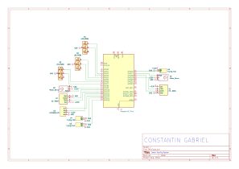
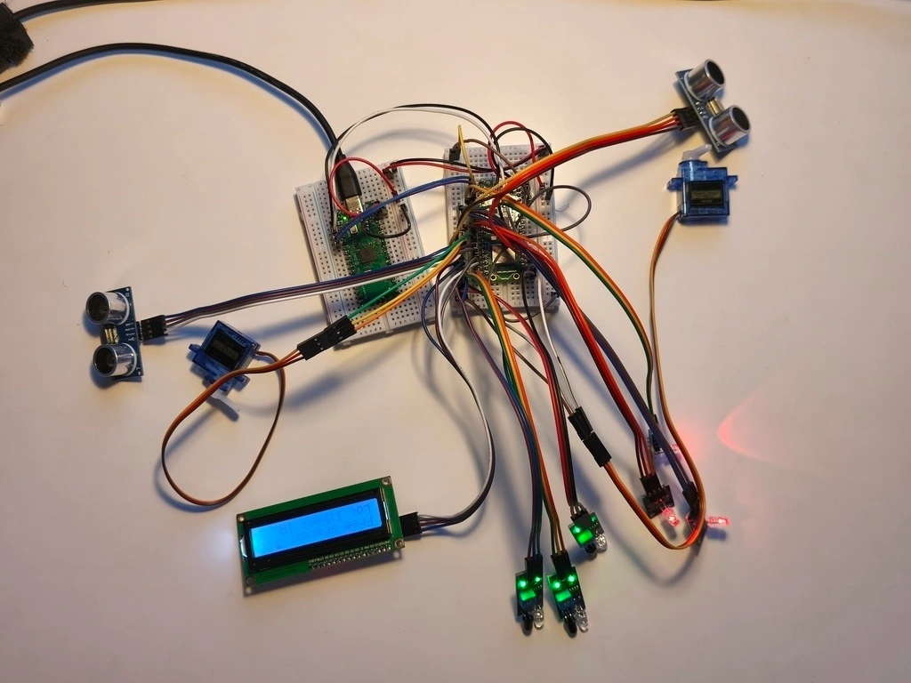
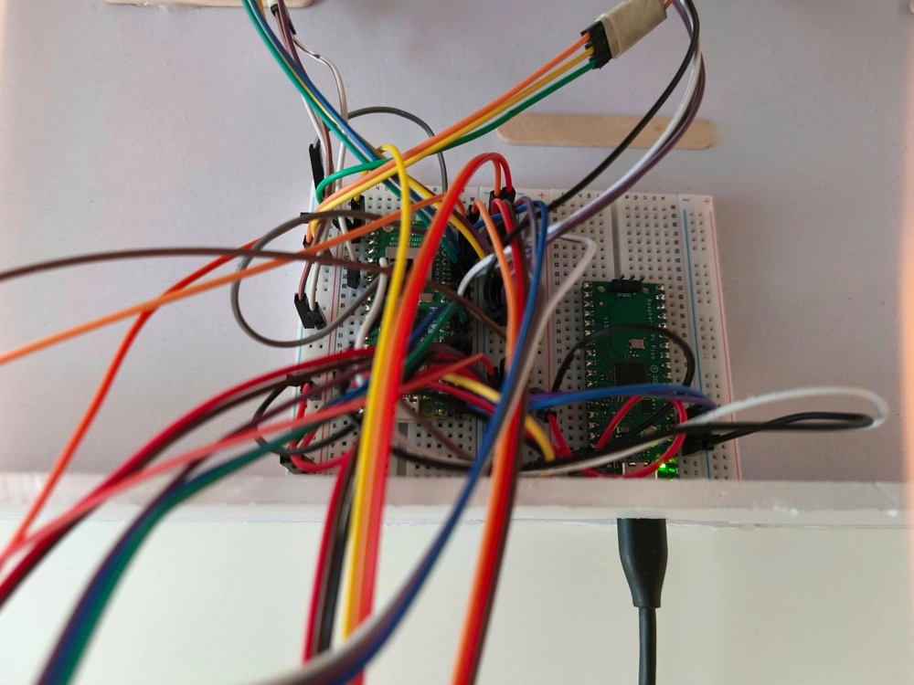
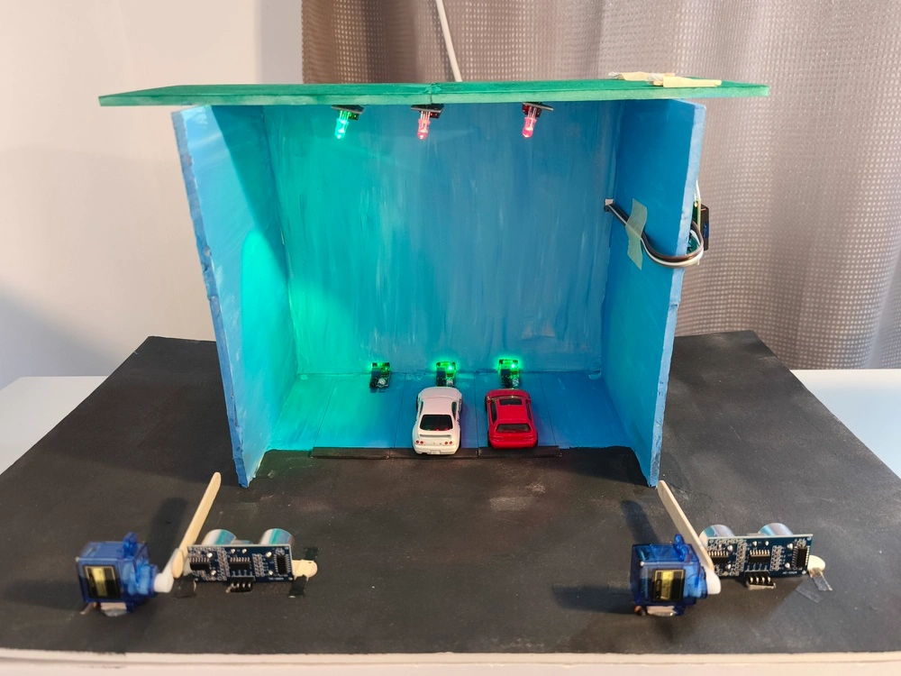
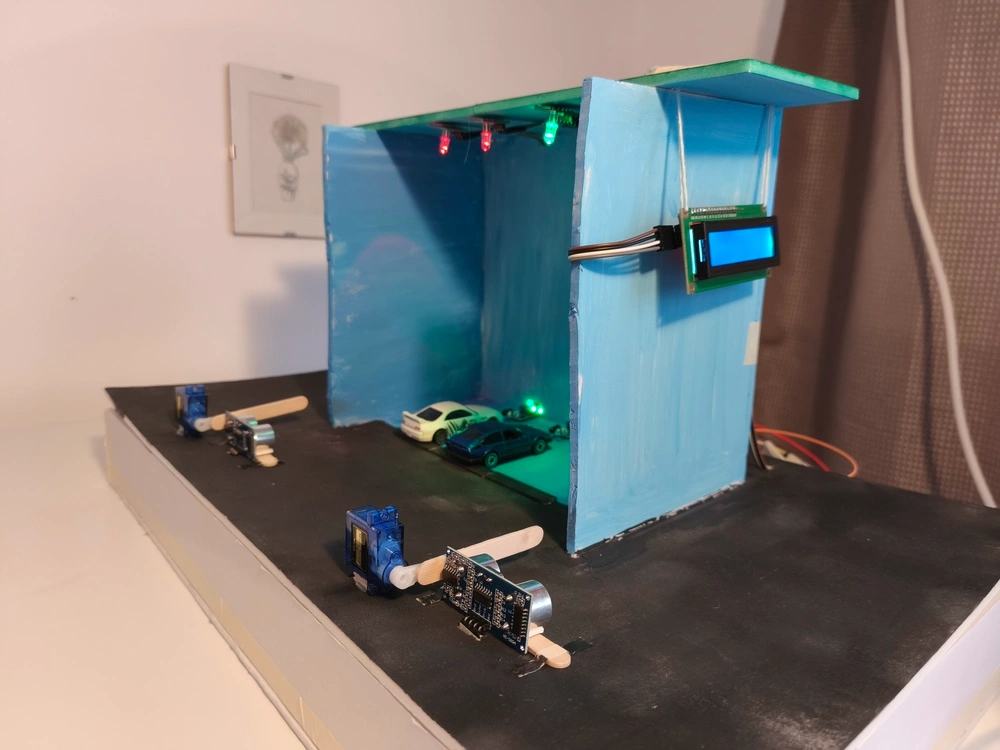
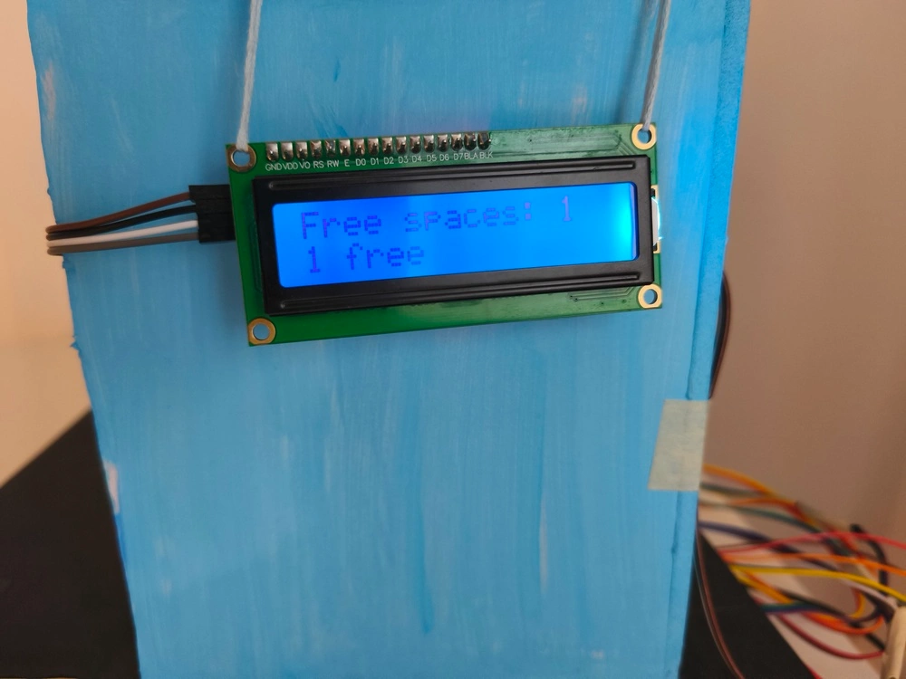

# Smart Parking Sistem
A parking sistem that use infrared sensors, ultrasound sensors and Raspberry Pi Pico 2W

:::info

**Author**: Gabriel Constantin \
**GitHub Project Link**: https://github.com/UPB-PMRust-Students/proiect-pachirishu

:::

## Description

The parking sistem use ultrasound sensors that detect when a car wants to enter and a servomotor will activate as a barrier. Inside there are 3 parking slots that use led rgb modules to generate the use for each spot and infrared sensors that check the availability. At the entrance there is a lcd module that will tell the number of available spots and the closest one to the entrance. The parking also use wifi connection, so the driver can see online how many spots are left.

## Motivation

I chose this project because it addresses a real-world problem related to the organization and management of parking spaces, especially in small or private areas such as driveways, company lots, or residential complexes. The proposed system offers an automated, cost-effective, and scalable solution for access control and parking availability display, without relying on expensive equipment like cameras or commercial barriers.

## Architecture

The **Raspberry Pi Pico 2W** acts as the central controller, managing all data exchange and operations between input and output modules.
The **ultrasonic sensors** detect vehicle presence near the entry and exit, triggering barrier actions.
The **micro servomotors** lift or lower the entry and exit barriers based on sensor data.
The **infrared sensors** detect car presence in each parking spot.
The **RGB LED modules** indicate the occupancy status: green for available, red for occupied.
The **LCD 1602** displays the number of available parking spaces in real time.
The built-in **Wi-Fi module** allows the Pico to transmit parking status data to a remote server, enabling remote monitoring.
The **PC** is used for programming and optional debugging, while the battery supplies power to the entire system.

## Log

### Week 5 - 11 May

Acquired the development boards and the necessary peripherals.

Set up the Rust Embassy development environment on my laptop.

Created the project webpage.

### Week 12 - 18 May

Tested the functionality of the peripherals and replaced the ones that were not working.

Designed the schematic in KiCad.

Connected the components on the breadboards.

### Week 19 - 25 May

Wrote the code for the peripherals (encountered issues with delay timing between them, so I created separate tasks for each to run them in parallel)

Built the parking prototype and mounted the peripherals on it

Painted the parking prototype to be more aesthetic

Purchased replacement sensors after some of the original ones stopped working, as well as longer cables

## Hardware

### Schematics

### Photos

### Bill of materials

| Device | Usage | Price |
|--------|--------|-------|
| [Rapspberry Pi Pico 2W](https://www.raspberrypi.com/documentation/microcontrollers/pico-series.html#pico-2-family) | Microcontroller | [39.66 RON](https://www.optimusdigital.ro/ro/placi-raspberry-pi/13327-raspberry-pi-pico-2-w.html?search_query=raspberry+pi+pico+2w&results=26) |
| [Rapspberry Pi Pico](https://www.raspberrypi.com/documentation/microcontrollers/pico-series.html#pico-1-family) | Debugger | [22.49 RON](https://www.optimusdigital.ro/en/raspberry-pi-boards/12024-raspberry-pi-pico-728886755172.html?srsltid=AfmBOopzfbrSkCAOiZWVeX2qe2_Jwcdpe1hIj6UWpEmNRnZYO2zb_Jat) |
|[Modul Led RGB](https://arduinomodules.info/ky-009-rgb-full-color-led-smd-module/)| Led RGB | [4.99 RON](https://www.optimusdigital.ro/ro/optoelectronice-led-uri/737-modul-cu-led-rgb.html?search_query=modul+cu+led&results=338)|
|[Micro Servomotor SG90 180°](http://www.ee.ic.ac.uk/pcheung/teaching/DE1_EE/stores/sg90_datasheet.pdf)| Micro Servomotor | [11.99 RON](https://www.optimusdigital.ro/ro/motoare-servomotoare/2261-micro-servo-motor-sg90-180.html)|
| [Male to male jumper wires 10cm](https://media.digikey.com/pdf/Data%20Sheets/Digi-Key%20PDFs/Jumper_Wire_Kits.pdf) | Wires | [4.99 RON](https://www.optimusdigital.ro/ro/fire-fire-mufate/884-set-fire-tata-tata-40p-10-cm.html?search_query=fire&results=429) |
| [Male to female jumper wires 20cm](https://media.digikey.com/pdf/Data%20Sheets/Digi-Key%20PDFs/Jumper_Wire_Kits.pdf) | Wires | [7.99 RON](https://www.optimusdigital.ro/ro/fire-fire-mufate/92-fire-colorate-mama-tata-40p.html) |
| [Male to female jumper wires 40cm](https://media.digikey.com/pdf/Data%20Sheets/Digi-Key%20PDFs/Jumper_Wire_Kits.pdf) | Wires | [22.99 RON](https://www.optimusdigital.ro/ro/fire-fire-mufate/12466-fire-colorate-mama-tata-40p-40-cm.html?search_query=mama+tata&results=89) |
| [Infrared Sensor ](https://studylib.net/doc/25541782/arduino-ir-infrared-obstacle-avoidance-sensor-module) | Infrared Sensor | [3.49 RON](https://www.optimusdigital.ro/ro/senzori-senzori-optici/4514-senzor-infrarosu-de-obstacole.html) |
| [Ultrasonic Sensor ](https://cdn.sparkfun.com/datasheets/Sensors/Proximity/HCSR04.pdf) | Ultrasonic Sensor | [6.49 RON](https://www.optimusdigital.ro/ro/senzori-senzori-ultrasonici/12897-senzor-ultrasonic-hc-sr04-.html?search_query=senzor+ultrasunet&results=7) |
| [LCD 1602 ](https://handsontec.com/dataspecs/module/I2C_1602_LCD.pdf) | LCD | [14.99 RON](https://www.optimusdigital.ro/ro/optoelectronice-lcd-uri/62-lcd-1602-cu-interfata-i2c-si-backlight-galben-verde.html?search_query=ecran+16+2&results=192) |
| [Breadboards ](https://components101.com/sites/default/files/component_datasheet/Breadboard%20Datasheet.pdf) | Breadboard | [4.56 RON](https://www.optimusdigital.ro/ro/prototipare-breadboard-uri/44-breadboard-400-points.html?search_query=breadboard&results=127) |

## Software

| Library | Description | Usage |
|---------|-------------|-------|
| [embassy-rp](https://docs.embassy.dev/embassy-rp/git/rp2040/index.html)| Peripheral access crate for the RP2040 chip used in Raspberry Pi Pico | Used to interact with the microcontroller's hardware|
| [embassy-executor](https://docs.embassy.dev/embassy-executor/git/std/index.html)| Asynchronous task executor for embedded systems| Enables non-blocking async execution|
| [embassy-time](https://embassy.dev/book/dev/time_keeping.html)| Time management library| Used for implementing delays and measuring durations|
| [log](https://docs.embassy.dev/embassy-usb-logger/git/default/index.html)| Logging facade for embedded Rust| Used to add structured logging|
| [embassy-net](https://docs.embassy.dev/embassy-net/git/default/index.html)| Asynchronous embedded networking stack built on smoltcp| Used for network connection|
| [embassy-net-driver](https://docs.embassy.dev/embassy-net-driver/git/default/index.html)| Network interface drivers for embassy-net| Used to connect embassy-net with hardware like the CYW43 Wi-Fi chip on the Raspberry Pi Pico 2W|
| [embedded-hal-async](https://docs.rs/embedded-hal-async/1.0.0/embedded_hal_async/)| 	Async traits for embedded hardware| Needed for async I2C communication (used by LCD)|
| [lcd1602-diver](https://docs.rs/lcd1602-diver/latest/lcd1602_diver/)| LCD driver over I2C| Used to control the LCD1602 screen using Embassy I2C|
| [heapless](https://docs.rs/heapless/0.8.0/heapless/)| Fixed-capacity data structures| Used for memory-safe strings in no_std environments|

The software uses asynchronous tasks to independently monitor ultrasonic and infrared sensors, managing entrance and exit barriers while tracking parking spot availability. Sensor data updates an atomic counter for free spots, and the LCD displays the current status. Using Embassy’s async executor on a Raspberry Pi Pico, the design ensures responsive, non-blocking handling of all inputs and outputs in a safe, efficient manner.

### Functional Diagram

## Links

1. [I2C LCD 1602 with Raspberry Pi Pico](https://www.tomshardware.com/how-to/lcd-display-raspberry-pi-pico)
2. [IR Sensor on Raspberry Pi Pico](https://www.youtube.com/watch?v=zh_g6J6T_5w&ab_channel=YoungWonks)
3. [For Wi-Fi](https://murraytodd.medium.com/rust-networking-with-the-raspberry-pi-pico-w-002384a5954b)