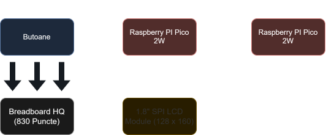
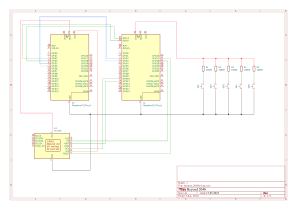
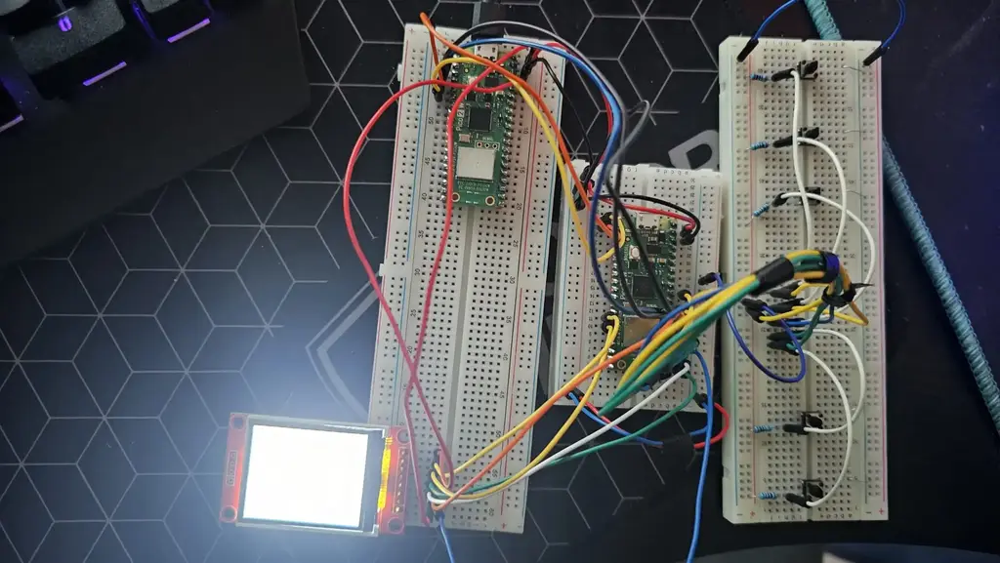
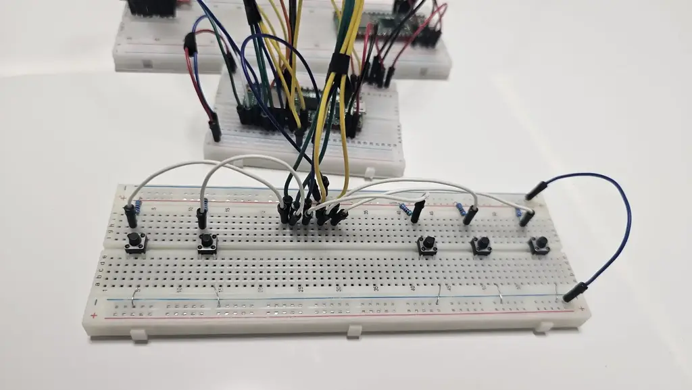
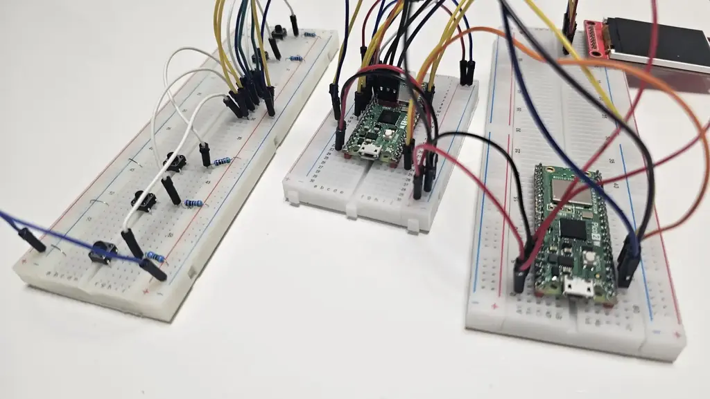
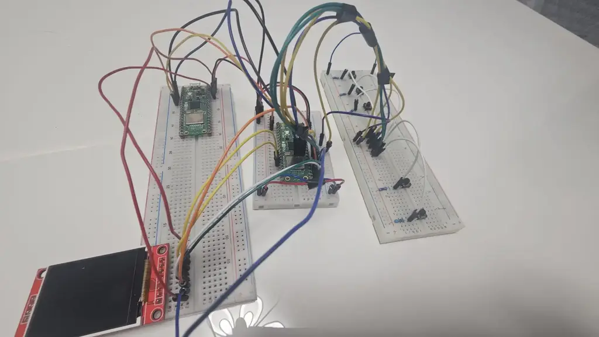

# Beyond 2048
A project about mixing classic 2D games in a single one on Raspberry Pico, having 2048 in the main stage.

:::info

**Author**: Nenciu George-Robert \
**GitHub Project Link**: https://github.com/UPB-PMRust-Students/proiect-robertnen

:::
## Description
The objective of the project is to show the knowledge gained throughout the semester by making functional hardware that runs games written in Rust. Starting with a 2048 games, it can be very
fast changed to Tetris, creating more fun for the player.

## Motivation
For many years I loved playing games, even it is not in a computer. While trying to prove what I
learn this semester about Rust and hardware, I wanted to show that anyone can create a game on
anything that has electricity.

## Arhitecture

## Log

### Week 28 April - 4 May
Forked the project and started the documentation. Added the bill of materials and the software most likely used.

### Week 5 May - 11 May
Most time spend testing each component to be working and fixing small typos. I should not forget that I started to code and to add small functions.

### Week 12 April - 18 May
Created basic logic after finishing with the hardware part. Everything is working very well and testing was taken more serious. Added logic for the SPI LCD module and for the buttons. Holding a button will execute it's command only one time. To do it more, the player has to press multiple times

### Week 19 May - 25 May
Implemented a mechanic that prevents executing the same command when holding a button. It will happen only one time, after it will stop until a new button is pressed (or the same). The game is was created using
a struct and an impl. There are tiles with numbers until 2^14 and it can go beyond it without any problem. The grid can be changed between 4x4, 5x5 and 6x6.

## Hardware

This project is using the following components:
- 2x Raspberry Pi Pico 2W for controlling the display and the results intended while pressing the buttons;
- 1x 1.8" SPI LCD Module (128 x 160) to display the game;
- 5x push buttons (4 for movements, 1 to change / reset a game).

## Schematics

## Photos

## Bill of materials
| Name                            	| Quantity 	| Usage                                                                   	| Price     	|
|---------------------------------	|----------	|-------------------------------------------------------------------------	|-----------	|
| [Raspberry Pi Pico 2W](https://datasheets.raspberrypi.com/picow/pico-2-w-datasheet.pdf)          	| 2        	| One for debugging (UART), the other for controlling the architecture 	| [39,66 lei](https://www.optimusdigital.ro/ro/placi-raspberry-pi/13327-raspberry-pi-pico-2-w.html?search_query=Raspberry+Pi+Pico+2W&results=26) 	|
| [1.8" SPI LCD Module (128 x 160)](https://www.openhacks.com/uploadsproductos/tutorial_display_tft.pdf) 	| 1        	| Display for game status, score etc.                                     	| [28,99 lei](https://www.optimusdigital.ro/en/lcds/1311-modul-lcd-spi-de-18-128x160.html) 	|
| [Breadboard Jumper Wires Set](https://www.optimusdigital.ro/en/wires-with-connectors/12-breadboard-jumper-wire-set.html)     	| 66       	| Connections between components (picos, buttons,  LCD, etc.)          	| [7,99 lei](https://www.optimusdigital.ro/en/wires-with-connectors/12-breadboard-jumper-wire-set.html)  	|
| [0.25 W 10K Ω Resistor](https://www.optimusdigital.ro/en/resistors/1088-025w-10k-resistor.html?srsltid=AfmBOooY9X9nv76tKLTFI8nP2GXllgvsesQF6wgHzpZGptqivIrFWPnP)           	| 10       	| Pull-down resistors for buttons                                         	| [1 leu](https://www.optimusdigital.ro/en/resistors/1088-025w-10k-resistor.html?search_query=0.25+W+10K+Ω+Resistor&results=5)     	|
| [2.54 mm Red Pin Headers](https://www.pololu.com/product/2665)         	| 3        	| Headers for connecting Picos and LCD to the breadboard               	| [2.97 lei](https://www.optimusdigital.ro/ro/componente-electronice-headere-de-pini/464-header-de-pini-rosu-254-mm-40p.html?search_query=2.54+mm&results=301)  	|
| [Breadboard HQ (830 Points)](https://www.pololu.com/product/352)      	| 2        	| Main breadboard for connecting the buttons                              	| [19,96 lei](https://www.optimusdigital.ro/ro/prototipare-breadboard-uri/8-breadboard-830-points.html) 	|
| [400p HQ Breadboard](https://www.pololu.com/product/4000)              	| 1        	| Auxiliary breadboard, likely for GPIO and others                        	| [4,56 lei](https://www.optimusdigital.ro/en/breadboards/44-400p-hq-breadboard.html)  	|
| [6 x 6 x 6 Push Button](https://www.optimusdigital.ro/en/buttons-and-switches/1119-6x6x6-push-button.html?search_query=Push+Button+&results=85)           	| 8        	| 4 for movement, 1 for reset / game switch, others as spares          	| [2,88 lei](https://www.optimusdigital.ro/en/buttons-and-switches/1119-6x6x6-push-button.html?search_query=Push+Button+&results=85)  	|
| [Micro USB 1 m Black Cable](https://www.optimusdigital.ro/en/usb-cables/497-micro-usb-1-m-black-cable.html?search_query=Micro+USB+1+m+Black+Cable&results=38)       	| 1        	| Power and programming for a Pico                                        	| [6,95 lei](https://www.optimusdigital.ro/en/usb-cables/497-micro-usb-1-m-black-cable.html?search_query=Micro+USB+1+m+Black+Cable&results=38)  	|

## Software
This is not final. This is most likely what I'll use after I get the last order of components which are missing.
|                    Crate                   	|                               Description                              	|                                  Usage                                 	|
|:------------------------------------------:	|:----------------------------------------------------------------------:	|:----------------------------------------------------------------------:	|
| [rp2035-hal](https://crates.io/crates/rp2035-hal)                                 	| Hardware Abstraction Layer for the RP2035 microcontroller              	| Direct access to GPIOs, UART, SPI, I2C, timers, PWM, etc., on the Pico 	|
| [embedded-hal](https://crates.io/crates/embedded-hal)                               	| Standard traits for embedded peripherals (e.g., digital I/O, SPI, I2C) 	| Foundation for cross-platform driver development and HALs              	|
| [panic-halt](https://crates.io/crates/panic-halt) (or) [defmt](https://crates.io/crates/defmt)                      	| panic-halt: minimal panic handler; defmt: logging and debug output     	| Handling panics or enabling real-time logging/debugging                	|
| [embedded-graphics](https://crates.io/crates/embedded-graphics)                          	| 2D graphics primitives for displays (no-std)                           	| Drawing shapes, text, images on the LCD                                	|
| [st7735-lcd](https://crates.io/crates/st7735-lcd) 	| Driver for ST7735-based SPI displays                                   	| Communicating with and rendering to the 1.8" SPI LCD module            	|
| [heapless](https://crates.io/crates/heapless)                                   	| Fixed-capacity data structures with no heap allocation                 	| Queues, buffers, or hash maps without dynamic memory                   	|
| [cortex-m](https://crates.io/crates/cortex-m)                                  	| Low-level access to ARM Cortex-M processor features                    	| Accessing special registers, enabling interrupts, etc.                 	|
| [cortex-m-rt](https://crates.io/crates/cortex-m-rt)                                	| Runtime support for Cortex-M processors                                	| Defines the entry point, vector table, and startup code                	|
| [usb-device](https://crates.io/crates/usb-device)                                 	| USB device stack for embedded systems                                  	| Creating USB peripherals (e.g., serial communication over USB)         	|

## Links
I got inspiered from the links mentioned below:
1. [Lab 01 - Debug](https://pmrust.pages.upb.ro/docs/acs_cc/lab/01)
2. [Lab 02 - GPIO](https://pmrust.pages.upb.ro/docs/acs_cc/lab/02)
3. [Lab 05 - Serial Peripheral Interface](https://pmrust.pages.upb.ro/docs/acs_cc/lab/05)
4. [2048](https://play2048.co/)
5. [More than just 2048](http://rayxiao92.github.io/)
