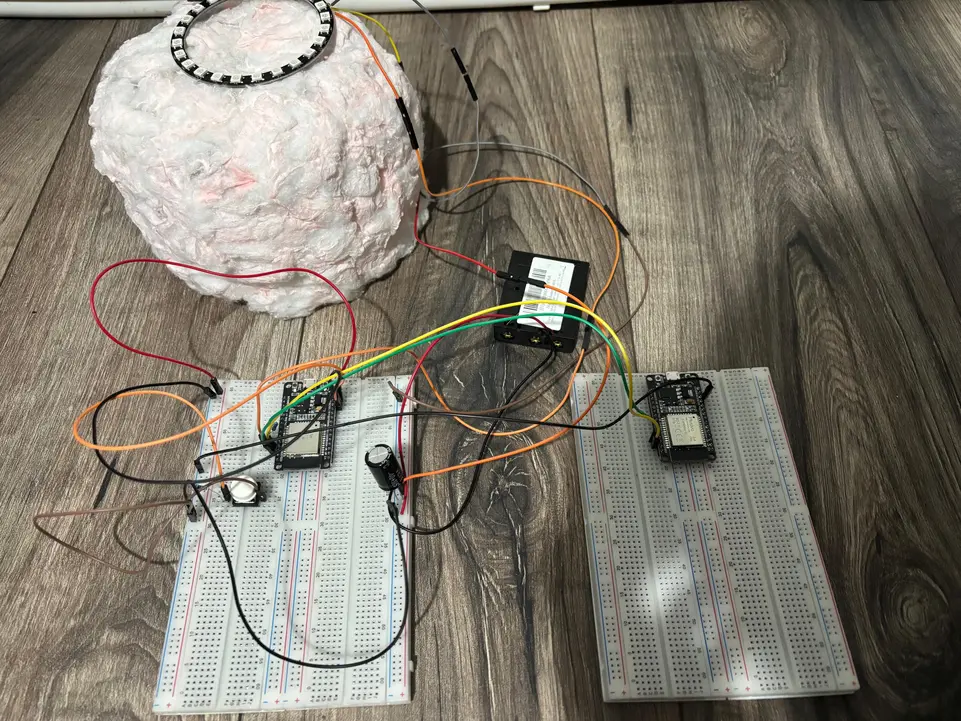
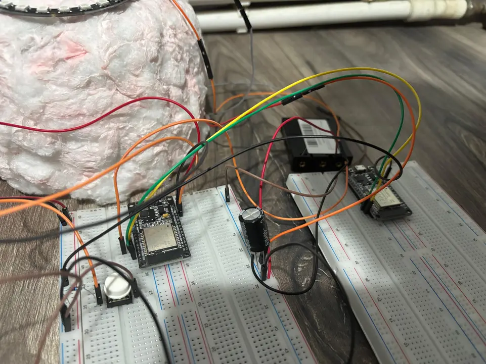

# Weather-Based Mood Lamp
A decorative lamp that adapts its ambient color effects based on weather conditions.

:::info 

**Author**: Georgiana-Elena Ilie \
**GitHub Project Link**: https://github.com/UPB-PMRust-Students/proiect-georgianailie109

:::

## Description

The Weather-Based Mood Lamp is a smart decorative device that changes its RGB lighting effects based on the weather outside. It uses two ESP32 microcontrollers: one that connects to the internet and fetches real-time weather information from the OpenWeatherMap API, and a second one that allows the user to simulate local weather by inputting custom temperature and humidity values. 

This allows for both automatic operation and manual testing, with a button enabling the user to switch between real-time online data and locally simulated weather. The lamp uses a ring of individually addressable RGB LEDs (WS2812) to generate ambient lighting effects based on the current weather, such as sunshine, rain, snow, or clouds.

## Motivation

I chose this project as a way to combine aesthetics with technology. It brings together microcontroller programming in Rust, real-time data interaction, and RGB lighting to create a decorative lamp that changes its appearance based on the current weather. The cloud-shaped design makes the lamp look friendly and relaxing, which means it can work not just as a smart decorative light, but also as a fun way for kids to learn about the weather or use it as a nightlight. The project also gives me a way to demonstrate communication between two microcontrollers and the integration of internet-based data.

## Architecture 

The project consists of two main components:

- **ESP32 A (Main Controller)**
  - Connects to the internet
  - Fetches weather data from OpenWeatherMap API
  - Controls the RGB LED ring
  - Reads mode switch input (button)
  - Communicates with ESP32 B via UART

- **ESP32 B (Local Weather Simulator)**
  - Allows the user to simulate weather via UART
  - Sends temperature and humidity data to ESP32 A

**Mode Switching:**
- Controlled via a physical button connected to ESP32 A
- Toggles between ONLINE mode (API weather) and LOCAL mode (simulated weather)


## Log

<!-- write your progress here every week -->

### Week 5 - 11 May
I ordered the necessary components, worked on project documentation, and planned the schematic design.
I placed the ESP32 boards on separate breadboards, connected the WS2812 LED ring. I also ordered additional
components such as jumper wires, resistors, capacitor, and a button for mode switching.
### Week 12 - 18 May
I assembled the hardware setup on breadboards, connected both ESP32 boards via UART, added the LED ring,
button, and protective components. I began working on the software side, setting up the basic structure of the Rust project.
I also started the software development and began designing the external casing of the lamp to match the decorative theme.
### Week 19 - 25 May

## Hardware

1. **ESP32 Dev Board A**  
   - Main microcontroller; connects to Wi-Fi, gets weather data from the internet using an API, controls the LEDs, and handles the mode switching.
   - Communicates with the secondary controller via UART in local mode.

2. **ESP32 Dev Board B**  
   - Secondary microcontroller; simulates weather conditions by sending custom temperature and humidity values to the main controller via UART.

3. **WS2812 RGB LED Ring (24 LEDs)**  
   - Displays ambient lighting that changes based on the current weather (sunny, rainy, snowy, cloudy).  
   - Controlled by a single data pin from the main ESP32.

4. **Push Button**  
   - Allows switching between online (API-based) and local (simulated) weather modes.

5. **Power Bank (5V / 2A)**  
   - Portable power supply for both ESP32 boards and the LED ring.




### Schematics


### Bill of Materials

<!-- Fill out this table with all the hardware components that you might need.

The format is 
```
| [Device](link://to/device) | This is used ... | [price](link://to/store) |

```

-->

| Device | Usage | Price |
|--------|--------|-------|
| [ESP32 cu WiFi si Bluetooth 4.2](https://www.optimusdigital.ro/ro/placi-cu-bluetooth/4371-placa-de-dezvoltare-esp32-cu-wifi-i-bluetooth-42.html) | Main and secondary controller | [2 x 34,99 lei = 69,98 lei](https://www.optimusdigital.ro/ro/placi-cu-bluetooth/4371-placa-de-dezvoltare-esp32-cu-wifi-i-bluetooth-42.html) |
| [WS2812 RGB LED Ring 24](https://www.optimusdigital.ro/ro/optoelectronice-altele/5623-inel-cu-24-led-uri-rgb-adresabile-ws2812.html) | RGB lighting | [23,18 lei](https://www.optimusdigital.ro/ro/optoelectronice-altele/5623-inel-cu-24-led-uri-rgb-adresabile-ws2812.html) |
| [DHT22 Temp/Humidity Sensor](https://www.optimusdigital.ro/ro/senzori-senzori-de-temperatura/1449-modul-senzor-de-temperatura-i-umiditate-dht22.html) | Optional local sensor | [23,12 lei](https://www.optimusdigital.ro/ro/senzori-senzori-de-temperatura/1449-modul-senzor-de-temperatura-i-umiditate-dht22.html) |
| [Breadboard 830 points](https://www.optimusdigital.ro/en/breadboards/8-breadboard-hq-830-points.html) | Connect all components | [4 x 9,98 lei = 39,92 lei](https://www.optimusdigital.ro/en/breadboards/8-breadboard-hq-830-points.html) |
| [Jumper Wires M-M 30cm](https://www.optimusdigital.ro/ro/fire-fire-mufate/882-set-fire-mama-mama-40p-30-cm.html) | Connections | [7,98 lei](https://www.optimusdigital.ro/ro/fire-fire-mufate/882-set-fire-mama-mama-40p-30-cm.html) |
| [Jumper Wires F-F 30cm](https://www.optimusdigital.ro/ro/fire-fire-mufate/890-set-fire-tata-tata-40p-30-cm.html) | Connections | [9,99 lei](https://www.optimusdigital.ro/ro/fire-fire-mufate/890-set-fire-tata-tata-40p-30-cm.html) |
| [Jumper Wires M-F 20cm](https://www.optimusdigital.ro/ro/fire-fire-mufate/92-fire-colorate-mama-tata-40p.html) | Connections | [7,99 lei](https://www.optimusdigital.ro/ro/fire-fire-mufate/92-fire-colorate-mama-tata-40p.html) |
| [Capacitor 1000uF 35V](https://www.optimusdigital.ro/ro/componente-electronice-condensatoare/3004-condensator-electrolitic-de-1000-uf-la-35-v.html) | LED spike protection | [2,99 lei](https://www.optimusdigital.ro/ro/componente-electronice-condensatoare/3004-condensator-electrolitic-de-1000-uf-la-35-v.html) |
| [Micro USB Cable](https://www.optimusdigital.ro/ro/cabluri-cabluri-usb/11939-cablu-negru-micro-usb-1-m.html) | Power + programming | [2 x 3,99 lei = 7,98 lei](https://www.optimusdigital.ro/ro/cabluri-cabluri-usb/11939-cablu-negru-micro-usb-1-m.html) |
| [10kΩ Resistor](https://www.optimusdigital.ro/en/resistors/1088-025w-10k-resistor.html) | Pull-up for sensor | [0,10 lei](https://www.optimusdigital.ro/en/resistors/1088-025w-10k-resistor.html) |
| [470Ω Resistor](https://www.optimusdigital.ro/en/resistors/1099-025w-470-resistor.html) | Signal line protection | [0,10 lei](https://www.optimusdigital.ro/en/resistors/1099-025w-470-resistor.html) |
| Enclosure Box | Component protection | |
| [White Round Button](https://www.optimusdigital.ro/en/buttons-and-switches/1115-white-button-with-round-cover.html) | Mode switch | [1,99 lei](https://www.optimusdigital.ro/en/buttons-and-switches/1115-white-button-with-round-cover.html) |
| [3xR6 Battery Holder](https://www.optimusdigital.ro/ro/suporturi-de-baterii/1090-suport-baterii-3-x-r6.html) | Battery holder | [3,95 lei](https://www.optimusdigital.ro/ro/suporturi-de-baterii/1090-suport-baterii-3-x-r6.html) |
| Power Bank PROMATE Bolt-20PD | Power supply | |

Total: ~200 de lei

## Software

| Library | Description | Usage |
|---------|-------------|-------|
| [embassy](https://github.com/embassy-rs/embassy) | Async runtime for embedded Rust | Used for async execution, Wi-Fi, and peripheral control |
| [ws2812-rs](https://github.com/smart-leds-rs/ws2812-spi-rs) | WS2812 LED control | Drives RGB lighting effects |
| [serde](https://github.com/serde-rs/serde) | Serialization framework | Used to parse JSON from API |
| [serde_json](https://github.com/serde-rs/json) | JSON parsing | Parses weather data |
| [esp-idf-hal](https://github.com/esp-rs/esp-idf-hal) | ESP32 hardware abstraction | For pin, UART, and GPIO access |

## Links

<!-- Add a few links that inspired you and that you think you will use for your project -->

1. [OpenWeatherMap API](https://openweathermap.org/api)
2. [WS2812 RGB LEDs Documentation](https://cdn-shop.adafruit.com/datasheets/WS2812.pdf)
3. [Lab 03 - PWM & ADC](https://pmrust.pages.upb.ro/docs/acs_cc/lab/03)
4. [Lab 07 - Wi-Fi](https://pmrust.pages.upb.ro/docs/acs_cc/lab/07)
5. [ESP32 Rust Book](https://esp-rs.github.io/book/)

