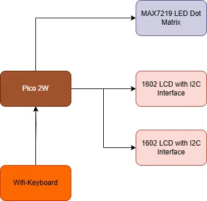
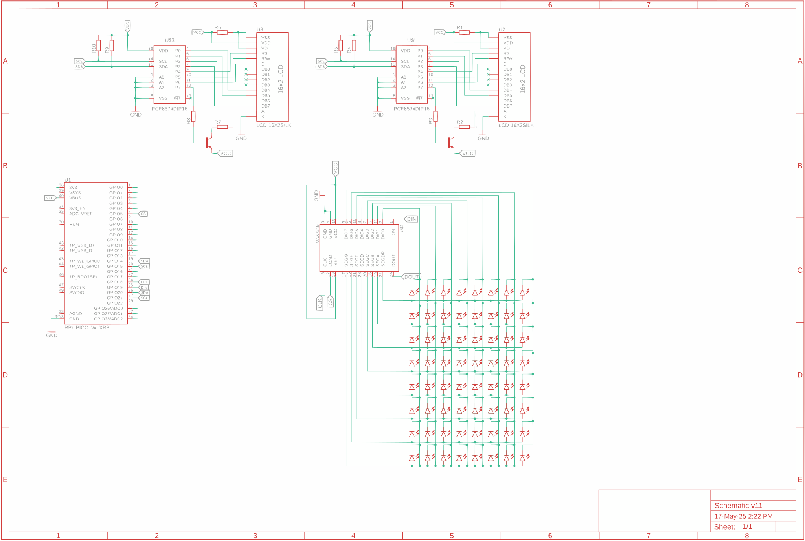
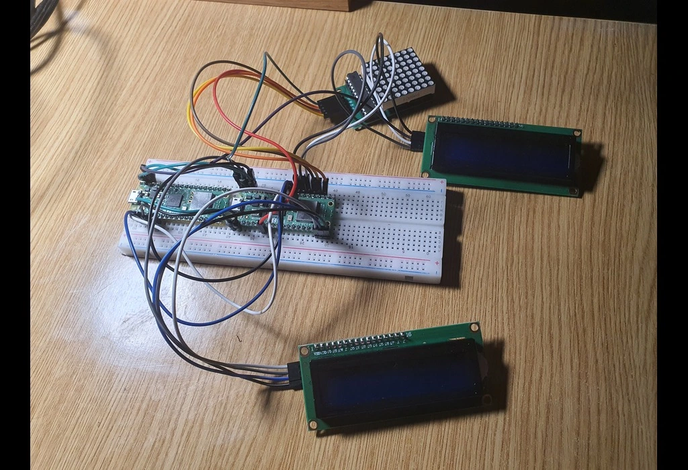
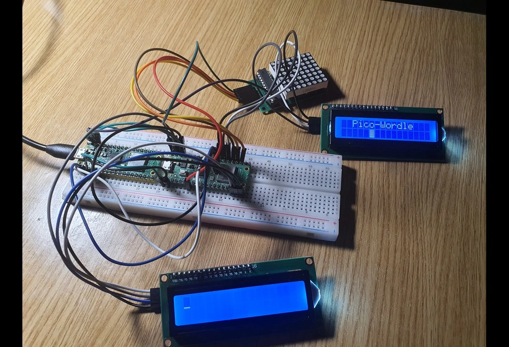

# Pico-Wordle

Wordle game build with Pico and programed in Rust

:::info 

**Author**: Iudenco Ianos \
**GitHub Project Link**: https://github.com/UPB-PMRust-Students/proiect-iragut

:::

## Description

Pico-Wordle is a simple word guessing game inspired by the popular game Wordle. 
The game is designed to be played on a Pico device, and it is implemented in Rust. 
The objective of the game is to guess a secret word within a limited number of attempts.
The brain is the Raspberry Pi Pico 2W, the word apear to 1602LCD with I2C Interface display, the
feedback is given by MAX7219LED 8x8 Matrix Module and the input is given by the PC keyboard via wi-fi.
Words history is displayed on a second 1602LCD up to 5 words.

## Motivation

I like to play logics games, so I decided to create a simple game who can easly kill some time.

## Arhitecture

##### Raspberry Pi Pico 2W
<ul> 
  <li>Conect all componets </li>
</ul>

##### 1602LCD with I2C Interface
<ul> 
  <li>Interface: I2C0</li>
  <li>Pin connections SDA(GP20), SCL(GP21)</li>
  <li>Display the word</li>
</ul>

##### Second 1602LCD with I2C Interface
<ul> 
  <li>Interface: I2C1</li>
  <li>Pin connections SDA(GP14), SCL(GP15)</li>
  <li>Display used words</li>
</ul>

##### MAX7219LED 8x8 Matrix Module
<ul>
    <li>Interface: SPI</li>
    <li>Pin connections: DIN(GP19), CS(GP5), CLK(GP18), VBUS(VCC)</li>
    <li>Display the feedback</li>
</ul>

## Log 

<ul>
    <li> 21 - 27 april: Finish documentation </li>
</ul>

<ul>
    <li> 28 - 04 april - may: Finish hardware and update documentation </li>
</ul>

<ul>
    <li> 05 - 11 may: Start coding the game and functionality </li>
</ul>

<ul>
    <li> 12 - 18 may: Finish coding and add history of the words </li>
</ul>

## Hardware

Using the Raspberry Pi Pico 2W, it will communicate with other components so when, someone
give a input by keyboard(Wi-fi), the letter will be displayed on the LCD and after all 5 letters
appear on the LCD, the player can press the Enter key to send the word. On the Matrix LED, 
the player will see the feedback of the word and the word will be visible on the second display.

### Schematic

### Bill of Materials

| Device | Usage | Price |
|--------|-------|-------|
| [MAX7219 LED Dot Matrix Module](https://www.analog.com/media/en/technical-documentation/data-sheets/MAX7219-MAX7221.pdf) | LED Display | [17.49 lei](https://www.optimusdigital.ro/en/led-matrices/118-max7219-led-dot-matrix-module.html) |
| [2.54 mm Pitch 40P Pin Header - Yellow](https://www.mouser.com/catalog/additional/Amphenol_bwb_bergstik.pdf) | Connector | [2.56 lei](https://www.optimusdigital.ro/en/pin-headers/1285-header-de-pini-mama-40p-254-mm-separabil.html) |
| [2.54 mm Pitch 40P Pin Header - Green](https://www.mouser.com/catalog/additional/Amphenol_bwb_bergstik.pdf) | Connector | [2.56 lei](https://www.optimusdigital.ro/en/pin-headers/1285-header-de-pini-mama-40p-254-mm-separabil.html) |
| [Micro USB Blue Cable 50 cm](https://www.optimusdigital.ro/en/usb-cables/4576-cablu-albastru-micro-usb.html) | USB Cable | [3.03 lei](https://www.optimusdigital.ro/en/usb-cables/4576-cablu-albastru-micro-usb.html) |
| [Raspberry Pi Pico 2W](https://datasheets.raspberrypi.com/picow/pico-2-w-datasheet.pdf) | Microcontroller | [39.66 lei](https://www.optimusdigital.ro/en/raspberry-pi-boards/13327-raspberry-pi-pico-2-w.html) |
| [Breadboard Kit HQ 830 P](https://www.optimusdigital.ro/en/kits/2222-breadboard-kit-hq-830-p.html) | Breadboard | [22.00 lei](https://www.optimusdigital.ro/en/kits/2222-breadboard-kit-hq-830-p.html) |
| [1602 LCD with I2C Interface and Blue Backlight](https://www.waveshare.com/datasheet/LCD_en_PDF/LCD1602.pdf) | LCD Display | [2x 16.34 lei](https://www.optimusdigital.ro/en/lcds/2894-1602-lcd-with-i2c-interface-and-blue-backlight.html) |

## Software
| Library | Description | Usage |
|---------|-------------|-------|
| [lcd1602-driver](https://github.com/imrank03/lcd1602-driver)| Display driver | Display driver for lcd1602 using I2C interface |
| [embassy-rs](https://github.com/embassy-rs/embassy) | Embeded framework | Libary what give me the tools to operate |
| [embassy-net](https://github.com/embassy-rs/embassy) | Driver for wi-fi | Library using to operate via wi-fi|
| [rand](https://github.com/rust-random/rand)| Random crate | Tools to make random select on words |

## Links

1. [Lab 07](https://pmrust.pages.upb.ro/docs/acs_cc/lab/07)
2. [Async](https://dev.to/theembeddedrustacean/sharing-data-among-tasks-in-rust-embassy-synchronization-primitives-59hk)
3. [Lab 05](https://pmrust.pages.upb.ro/docs/acs_cc/lab/05)
