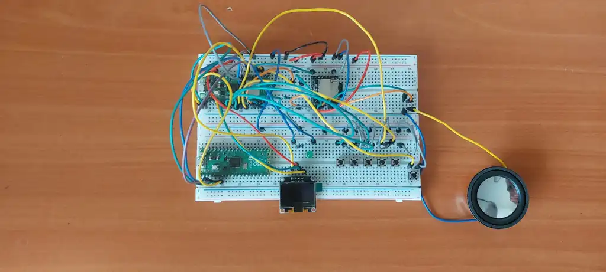
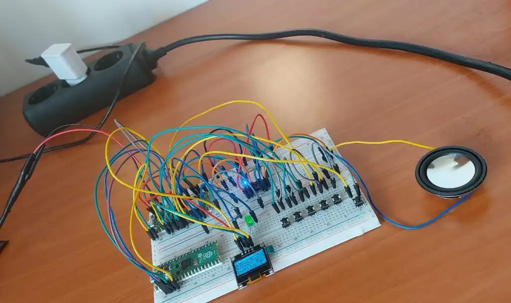
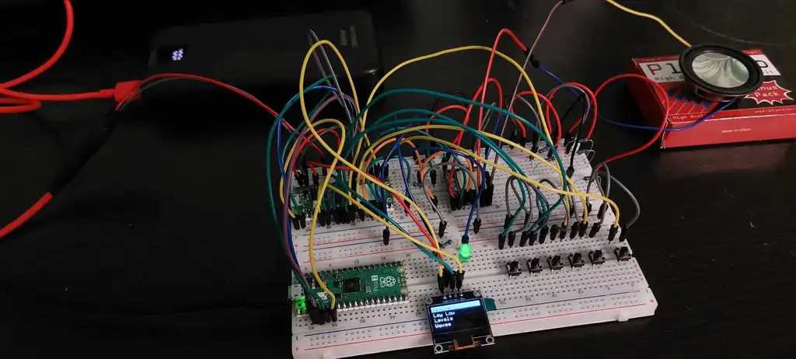
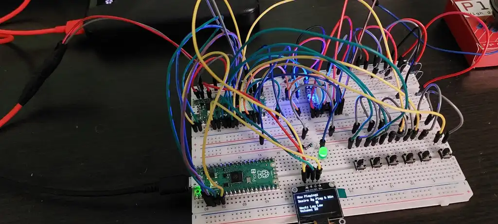
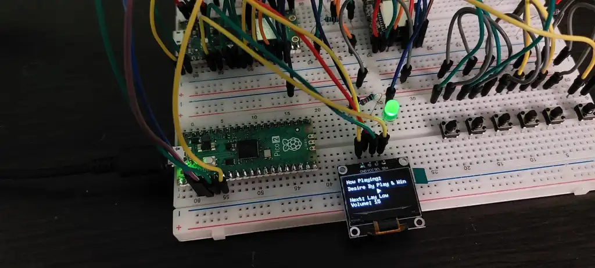

# MP3 Player
An MP3 player with button controls, a menu for song selection, and a display showing the current track, play/pause status, and volume, plus an LED indicating volume via PWM.

:::info 

**Author**: Nistor Ioan-Mario \
**GitHub Project Link**: https://github.com/UPB-PMRust-Students/proiect-marionistor

:::

## Description

This MP3 player, built around the Raspberry Pi Pico 2W microcontroller, enables playback of MP3 files stored on a microSD card. It features five tactile buttons for intuitive control—play/pause, next/previous track, and volume up/down, plus an additional button to return to a navigable menu where users can browse and select songs. A 1.3″ I2C OLED display delivers real-time updates, showing the current track title, playback status, and a menu interface. Playback is handled by a DFPlayer Mini module interfaced via UART. An on-board LED, driven by PWM from the Pico, provides a visual volume indicator that brightens or dims in direct proportion to the current volume setting. Power is supplied by a 5V Samsung charger or a power bank, ensuring reliable, portable performance.

## Motivation

This project draws inspiration from the nostalgia of early portable MP3 players, known for their compact screens and tactile buttons, aiming to revive their charm with modern technology. Using the Raspberry Pi Pico 2W, DFPlayer Mini, and OLED display, the goal is to create a functional player that captures the simplicity and joy of those classic devices.

## Architecture 


### Connections
- **Microcontroller ↔ DFPlayer Mini**: UART (GPIO0 TX → DFPlayer RX, GPIO1 RX → DFPlayer TX) for playback commands.
- **Microcontroller ↔ Display**: I2C (GPIO4 SDA, GPIO5 SCL) for displaying track info and menu interface, with OLED VCC connected to 3V3(OUT) and GND to Pico GND.
- **Microcontroller ↔ Buttons**: GPIO6–10 as inputs for the playback and volume control buttons, and GPIO21 for the back to menu button used to eturn to the song selection menu.
- **Microcontroller ↔ LED Indicator**: GPIO11 configured for PWM output, connected to a green LED through a 220Ω resistor, with brightness dynamically adjusted based on volume level.
- **DFPlayer Mini ↔ Speaker**: DFPlayer output connected to the 4Ω/3W speaker.
- **Power**: 5V Samsung charger/Power Bank connected to VSYS of the Raspberry Pi Pico 2W, supplying 5V directly DFPlayer Mini VCC.

## Log

<!-- write your progress here every week -->

### Week 5 - 11 May
Soldered all the components and connected the power cable to the system. During testing, I found that the Raspberry Pi Pico 2W includes internal pull-up resistors on its GPIO pins, so I didn’t need to add external pull-up resistors for the buttons, simplifying the design. I experimented with using a PAM8403 amplifier to boost the audio output from the DFPlayer Mini, but the sound quality suffered noticeably due to unwanted noise and distortion. Since the direct audio output from the DFPlayer Mini was clean and clear, I opted to stick with the direct connection approach. I also tried powering the device using a 5V power bank, but ran into an issue where the power bank would shut off if the current draw was too low, as it detected no active load. To keep it running, I added 220 Ω resistors in parallel to increase the load current, but this caused the current draw to exceed what the USB 2.0 cable could supply. Ultimately, I decided to power the device using a Samsung charger, which provides stable and sufficient current.

### Week 12 - 18 May
Configured the five main buttons to handle essential controls: play/pause, volume up/down, and next/previous track navigation. I implemented functionality so that when a track finishes playing, the next one in the playlist starts automatically. I have planned a menu system to allow users to browse and select songs from the playlist, with navigation via the next and previous buttons acting as up/down controls, but this feature is not yet implemented. I connected an additional button dedicated to returning to the menu during playback; this button has been wired but its software functionality is not yet implemented. The 1.3" I2C OLED display has been initialized but currently does not show any track or menu information, as the display software is still under development. For better user feedback, I added a green LED controlled via PWM that changes brightness in proportion to the volume level, giving a visual indication of volume changes.

Below are some pictures showing the current state of the project. The first picture displays the setup without the power source connected, highlighting the wiring and components. The second picture shows the project in operation.





### Week 19 - 25 May
Configured the display to show a menu with the songs from the list. The user can navigate through the songs and select one, with the selected song highlighted by a white rectangle. The next and prev buttons are used for navigation between songs, while the play/pause button is used to play the selected song. After playing a song, the display shows its details (name, artist and the next song in the list) along with the current volume. The song information updates automatically when a new song starts playing. In order to see the status of the playing song (playing/paused), a symbol is displayed: a triangle when the song is paused and two rectangles when the song is playing - similar to YouTube or other music players. I also configured the menu button that when pressed, stops the currently playing song and goes back to the menu, where the user can select another song. After using a better USB cable, I managed to make the project work with the power bank (by adding 220Ω resistors like I tried in the previous week). [Here](https://youtu.be/CsgfrlmEkdk) is the link for the project demo video.

The images below show the final state of the project. The first shows the menu, the second shows the display when a song is playing and the third shows the display when a song is paused.







## Hardware

- **Microcontroller**: Raspberry Pi Pico 2W manages playback logic, UART communication with the DFPlayer Mini, I2C interface with the OLED display, button input, and PWM for LED brightness control.
- **Audio Module**: DFPlayer Mini plays MP3 files from a microSD card, controlled via UART.
- **Display**: 1.3" I2C OLED (SSD1306) displays track info, playback status, and a navigable song selection menu. Powered from the Pico’s 3.3V (3V3_OUT), within the display's 3.3V–5V operating range.
- **Input**: Six tactile buttons — five (SW1–SW5) for play/pause, next, previous, and volume control, plus one (SW6) for navigating back to the track selection menu.
- **Volume Feedback**: A green LED connected via a 220Ω resistor to a PWM-capable GPIO pin indicates volume level through brightness changes.
- **Speaker**: 4Ω/3W speaker connected to the DFPlayer Mini’s audio output or through a PAM8403D amplifier (if used).

### Schematics


### Bill of Materials

<!-- Fill out this table with all the hardware components that you might need.

The format is 
```
| [Device](link://to/device) | This is used ... | [price](link://to/store) |

```

-->

| Device | Usage | Price |
|--------|--------|-------|
| [Raspberry Pi Pico 2](https://www.raspberrypi.com/documentation/microcontrollers/raspberry-pi-pico.html) | Main microcontroller running the firmware | [28 RON](https://www.optimusdigital.ro/ro/placi-raspberry-pi/13266-raspberry-pi-pico-2.html) |
| [Raspberry Pi Pico 2W](https://www.raspberrypi.com/documentation/microcontrollers/raspberry-pi-pico.html) | Debugging | [40 RON](https://www.optimusdigital.ro/ro/placi-raspberry-pi/13327-raspberry-pi-pico-2-w.html) |
| [DFPlayer Mini](https://wiki.dfrobot.com/DFPlayer_Mini_SKU_DFR0299) | MP3 decoder and audio playback module | [14 RON](https://www.optimusdigital.ro/ro/audio/1484-modul-mp3-player-in-miniatura-dfplayer-mini.html) |
| [SanDisk 32GB MicroSD Card](https://documents.westerndigital.com/content/dam/doc-library/en_us/assets/public/sandisk/product/memory-cards/ultra-uhs-i-microsd/data-sheet-ultra-uhs-i-microsd.pdf) | Stores the MP3 files for playback | [Already owned](https://www.around.ro/card-de-memorie-microsd-sandisk-32gb-adaptor-sd-class-4-40414) |
| [4Ω/3W Speaker](https://docs.rs-online.com/6abb/A700000011931840.pdf) | Outputs the audio playback | [11 RON](https://tehnoelectric.ro/difuzoare/1307-12159-difuzor-50x18mm-4-3w.html) |
| [OLED 1.3" Display](https://cdn.awsli.com.br/945/945993/arquivos/1.3inch_IIC_OLED_Module_MC130GX&MC130VX_User_Manual_EN.pdf) | Displays song info and player status | [30 RON](https://www.electrospot.ro/display-oled-13-alb-128x64) |
| Samsung charger | Provides power to the breadboard setup | Already owned |
| HAMA PD10 201719 | Power Bank that provides power to the breadboard setup | [Already owned](https://altex.ro/baterie-externa-hama-pd10-201719-20000mah-2xusb-c-1xusb-a-gri/cpd/AIS201719/) |
| [Buttons](https://www.farnell.com/datasheets/2343587.pdf) | User input for controlling playback and volume | [5 x 0.36 RON](https://www.optimusdigital.ro/ro/butoane-i-comutatoare/1119-buton-6x6x6.html) |
| [Resistors](https://www.farnell.com/datasheets/3111754.pdf) | Resistors used for buttons | [10 x 0.10 RON](https://www.optimusdigital.ro/ro/componente-electronice-rezistoare/853-rezistor-025w-51k.html) |
| [LED](https://www.farnell.com/datasheets/1519875.pdf) | LED used for volume information | [1 RON](https://www.optimusdigital.ro/en/leds/38-5-mm-green-led-with-difused-lens.html) |
| [Breadboard](https://www.busboard.com/documents/datasheets/BPS-DAT-(BB830)-Datasheet.pdf) | For prototyping the entire circuit | [2 x 10 RON](https://www.optimusdigital.ro/ro/prototipare-breadboard-uri/8-breadboard-830-points.html) |
| Wires | Connect all components on breadboard | 19 RON |
| Total | - | 166 RON |

## Software

| Library | Description | Usage |
|---------|-------------|-------|
| [embassy-rp](https://crates.io/crates/embassy-rp) | Embassy framework for RP2350 | Used to control peripherals like UART, I2C, GPIO, and timers on the Pico 2 |
| [ssd1306](https://github.com/rust-embedded-community/ssd1306) | Driver for SSD1306 OLED displays via I2C | Used to control the 1.3" I2C OLED display |
| [embassy-time](https://crates.io/crates/embassy-time) | Async timers and delays | Used for implementing delays and scheduling tasks |
| [dfplayer-async](https://github.com/1-rafael-1/dfplayer-async/) | Async Rust driver for DFPlayer Mini MP3 module | Provides MP3 playback control over UART using async calls |
| [embassy-executor](https://crates.io/crates/embassy-executor) | Async task executor for embedded systems | Manages and schedules async tasks on the microcontroller |
| [embedded-graphics](https://github.com/embedded-graphics/embedded-graphics) | 2D graphics library for embedded systems | Used to draw text, icons, and other UI elements on the OLED display |
| [embedded-hal](https://github.com/rust-embedded/embedded-hal) | Hardware Abstraction Layer for embedded devices | Interface layer used by all driver crates for GPIO, I2C, UART, etc. |
| [defmt](https://github.com/knurling-rs/defmt) | Lightweight logging framework for embedded Rust | Used for debug logging during development |
| [panic-probe](https://crates.io/crates/panic-probe) | Minimal panic handler for embedded Rust | Provides panic messages via logging for embedded debug purposes |

## Links

<!-- Add a few links that inspired you and that you think you will use for your project -->

1. [ MP3 Player made using Arduino ](https://www.electronics-lab.com/project/mp3-player-using-arduino-dfplayer-mini/)
2. [ Connecting Audio Amplifier to DF Player Mini ](https://www.youtube.com/watch?v=eYF1Fa0uTDU&list=WL)
2. [ Ways to power the breadboard ](https://www.zabeducation.com/project/physics/breadboardPowerSupplies.html)