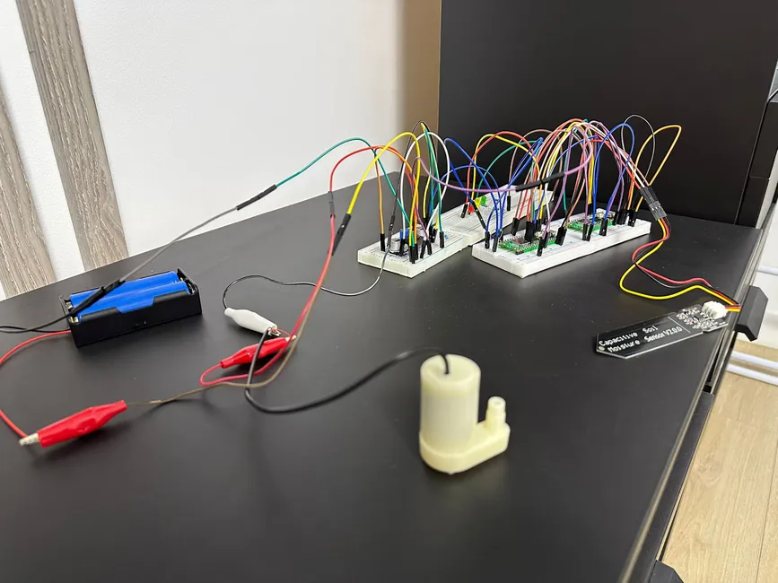
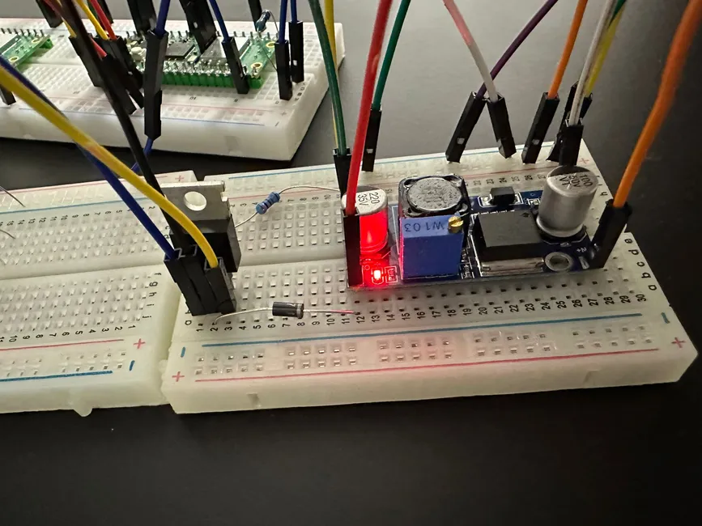
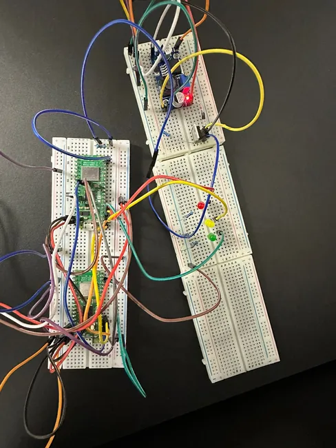
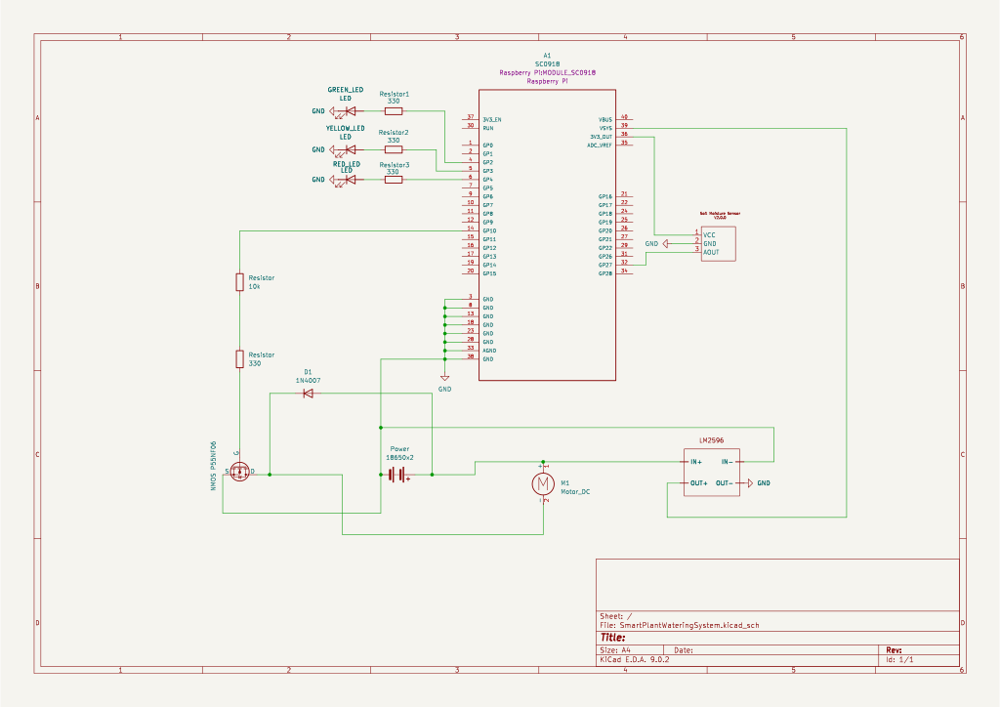

# Smart Plant Watering System

Automatically waters a plant based on real-time soil humidity and temperature readings.

:::info
**Author**: Iulia-Andreea Lovin \
**GitHub Project Link**: [https://github.com/UPB-PMRust-Students/proiect-iuliaandreea30](https://github.com/UPB-PMRust-Students/proiect-iuliaandreea30)
:::

## Description

A device that monitors soil humidity and ambient temperature to automatically water a plant when needed. It also uses LED indicators to visually display the current moisture level of the soil.

- The system uses a capacitive soil moisture sensor v2.0 to measure soil humidity.

- A DHT22 sensor detects the air temperature and humidity.

- A mini water pump is activated automatically via a MOSFET (STP55NF06L), controlled by the Raspberry Pi Pico 2 W.

- LEDs (green, yellow, red) indicate the soil moisture status visually.

- The water pump is powered separately via a 2x18650 battery pack and a step-down voltage module to ensure stable 5V output.

**Diagram**

## Motivation

**This project** reflects my interest in diving deeper into embedded systems using **Rust**, a language known for its speed and safety. It also solves a practical problem — helping maintain healthy plants automatically.

While planning this system, I realized it's not only about writing code, but also about integrating hardware, sensors, and electronics — a hands-on approach that connects creativity with engineering.

## Architecture

The **Raspberry Pi Pico 2 W** acts as the central controller, managing all components in the system.

The **capacitive soil moisture sensor v2.0** provides a more accurate and stable analog reading of soil water content.

The **DHT22 sensor** reads the ambient air temperature and humidity.

The **MOSFET STP55NF06L** controls the activation of the **mini water pump** based on moisture and temperature conditions.

**LED indicators**:

- **Green LED**: Soil is well-watered
- **Yellow LED**: Soil is moderately moist
- **Red LED**: Soil is dry (triggers watering)

The **2x18650 battery pack** supplies power to the water pump, regulated to 5V by an **LM2596 step-down module**.

---

## Log

### Week 5 - 11 May
Completed documentation milestone, purchased necessary materials, prepared them for installation, and tested individual components.

### Week 12 - 18 May
Completed assembly and wiring of all components. Developed and executed test programs to validate individual component functionality. Created KiCad schematics to reflect the physical setup. Concluded the Hardware Milestone phase.

### Week 19 - 25 May
Developed embedded software to manage soil moisture monitoring logic. Implemented ADC reading for the moisture sensor and control routines for status LEDs (green/yellow/red) and water pump activation via MOSFET. Integrated async timers using Embassy framework for stable delays. Successfully validated moisture thresholds and motor control logic in hardware tests.

---

## Hardware

1. **Raspberry Pi Pico 2 W**:
   - **Purpose**: Central control unit.
   - **Function**: Runs Rust code to control sensors, pump, and LEDs.

2. **Capacitive Soil Moisture Sensor v2.0**:
   - **Purpose**: Measure soil humidity with better stability and waterproofing.
   - **Function**: Sends analog voltage proportional to soil moisture.

3. **DHT22 Sensor**:
   - **Purpose**: Measure ambient temperature and air humidity.
   - **Function**: Provides digital temperature and humidity data via a GPIO pin.

4. **Mini Submersible Water Pump (5V)**:
   - **Purpose**: Water the plant automatically.
   - **Function**: Powered separately and switched using MOSFET.

5. **MOSFET STP55NF06L**:
   - **Purpose**: Switching the water pump safely at 5V with logic-level control.
   - **Function**: Acts as an electronic switch controlled by Pico.

6. **LEDs (Red, Yellow, Green)**:
   - **Purpose**: Visual indicator of soil moisture status.
   - **Function**: Light up according to defined moisture thresholds.

7. **Power System**:
   - **2x 18650 battery pack** to power the pump.
   - **LM2596 Step-Down Converter** to regulate voltage to 5V.

### Imagine 1

### Imagine 2

### Imagine 3

---

### Hardware Overview

- The **Pico 2 W** reads moisture and temperature.
- Based on soil conditions, it controls the **pump** via the **STP55NF06L** MOSFET.
- LEDs give real-time feedback on soil humidity.

---

### Schematics

---

## Bill of Materials

| Device                                                                                                                       | Usage                                                      | Price   |
|------------------------------------------------------------------------------------------------------------------------------|------------------------------------------------------------|---------|
| [Raspberry Pi Pico 2W](https://www.optimusdigital.ro/ro/placi-raspberry-pi/13327-raspberry-pi-pico-2-w.html)                 | Main microcontroller                                       | ~40 RON |
| [Capacitive Soil Moisture Sensor v2.0](https://www.robofun.ro/senzori/senzor-de-umiditate-a-solului-capacitiv-analogic.html) | Soil humidity sensing                                      | ~20 RON |
| [DHT22 Sensor](https://sigmanortec.ro/senzor-temperatura-si-umiditate-dht22-am2302-original)                                 | Ambient temperature/humidity sensor                        | ~35 RON |
| [Mini Submersible Water Pump 5V](https://sigmanortec.ro/Pompa-apa-submersibila-3-6VDC-verticala-p172447502)                  | Watering plant                                             | ~30 RON |
| [MOSFET STP55NF06L](https://sigmanortec.ro/MosFet-STP55NF06-P55NF06-p130575402)                                              | Switching the pump                                         | ~9 RON  |
| [LM2596 Step-Down Module](https://sigmanortec.ro/Modul-coborator-tensiune-adjustabil-LM2596-DC-DC-4-5-40V-3A-p134532509)     | Voltage regulation                                         | ~12 RON |
| [2x 18650 Batteries + Holder](https://sigmanortec.ro/suport-acumulatori-18650-2s)                                            | Pump power supply                                          | ~20 RON |
| [1-meter water pump hose](https://sigmanortec.ro/Furtun-Pompa-Apa-8x10-1-metru-p148295684)                                   | Transports water                                           | ~7 RON  
| [LEDs](https://sigmanortec.ro/led-5mm-rosu)                                                                                  | Indicators of soil status                                  | ~2 RON  
| [Breadboard](https://sigmanortec.ro/Breadboard-830-puncte-MB-102-p125923983)                                                 | For building and testing the plant watering circuit        | ~12 RON 
| [330-ohm resistors](https://sigmanortec.ro/Rezistor-p126025265#/16-valoare_rezistor-330)                                     | Used to limit current to LEDs and other components         | ~3 RON  
| [10k-ohm resistors](https://sigmanortec.ro/Rezistor-p126025265#/20-valoare_rezistor-10k)                                                                                                        | Used as pull-up/pull-down resistors or in voltage dividers | ~3 RON  
| [20 cm male-to-male jumper wire](https://sigmanortec.ro/40-Fire-Dupont-20cm-Tata-Tata-p210851325)                            | Used to connect elements          | ~9 RON  
| [20 cm male-to-female jumper wire](https://sigmanortec.ro/40-Fire-Dupont-20cm-Tata-Mama-p210854317)                          | Used to connect elements   | ~9 RON  

---

## Software

| Library           | Description                             | Usage                                  |
|------------------|-----------------------------------------|----------------------------------------|
| [`embassy-rp`]   | Async embedded support for RP2040       | Core hardware abstraction (ADC, GPIO)  |
| [`embassy-executor`] | Async runtime for embedded tasks     | Main async loop, task scheduling       |
| [`embassy-time`] | Async delays and timers                 | Non-blocking delays (e.g. `Timer::after`) |
| [`defmt`] + [`defmt-rtt`] | Lightweight logging framework   | RTT logging of sensor values/status    |
| [`panic-probe`]  | Panic handler with `defmt` support       | Captures and logs panics               |
| [`cortex-m-rt`]  | Runtime for Cortex-M                     | Startup, interrupts, memory layout     |

[`embassy-rp`]: https://crates.io/crates/embassy-rp  
[`embassy-executor`]: https://crates.io/crates/embassy-executor  
[`embassy-time`]: https://crates.io/crates/embassy-time  
[`defmt`]: https://crates.io/crates/defmt  
[`defmt-rtt`]: https://crates.io/crates/defmt-rtt  
[`panic-probe`]: https://crates.io/crates/panic-probe  
[`cortex-m-rt`]: https://crates.io/crates/cortex-m-rt

---

## Links

1. [Rust Embedded Book](https://docs.rust-embedded.org/book/)
2. [Embassy Rust Project](https://github.com/embassy-rs/embassy)
3. [Raspberry Pi Pico SDK Documentation](https://datasheets.raspberrypi.com/pico/raspberry-pi-pico-c-sdk.pdf)
