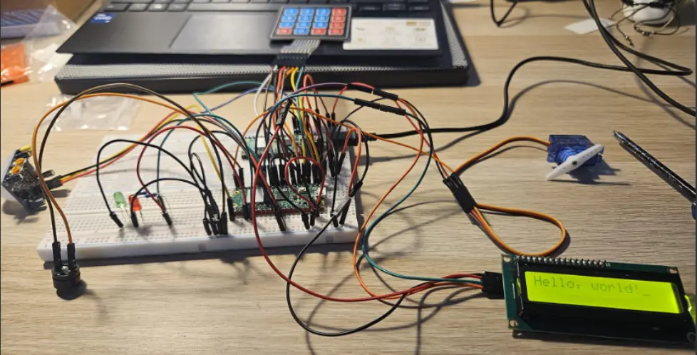
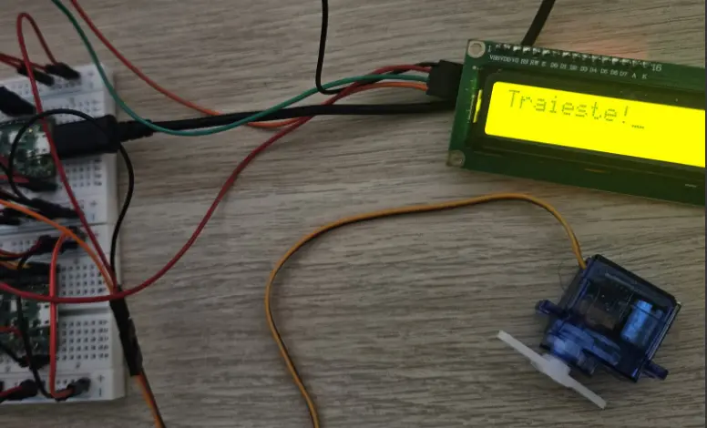
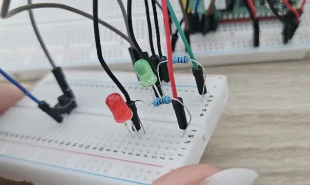
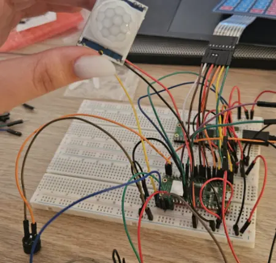

# Security System  
A smart access control system using username and PIN authentication

:::info 

**Author**: Iulia-Elena Giuroiu  \
**Group**: 333CC \
**GitHub Project Link**: [source code](https://github.com/UPB-PMRust-Students/proiect-IuliaGIE)

:::

## Description

This project implements a smart security system for controlling access to a restricted area. Authentication is based on a 4-character username and a 4-digit PIN entered via a matrix keypad. Only one person is allowed inside at any given time. If motion is detected without valid authentication, an alarm is triggered using a buzzer and flashing red LED.

## Motivation

The motivation behind this project is to combine embedded programming with real-world security applications. It provides a simple but effective way of managing access, detecting unauthorized entries, and signaling alerts.

## Architecture

The system is organized modularly, with each logic component responsible for a distinct functionality. They communicate through events triggered by sensors and shared internal states.

### Main architectural components:

* **Authentication Module** – handles input and validation of username and PIN
* **Access Control** – controls the servo motor that opens or closes the door
* **Alert Module** – detects unauthorized movement and activates the red LED and buzzer
* **Display Module** – shows messages on an OLED or LCD screen
* **State Management** – allows access for only one person at a time

### Flowchart Diagram

```mermaid
flowchart TB
    PICO["Raspberry Pi Pico W"]

    OLED["LCD 1602 (I2C)"]
    KEYPAD["Keypad 4x4"]
    BUZZER["Buzzer (BZ1)"]
    LED_RED["Red LED"]
    LED_GREEN["Green LED"]
    MOTOR["Servo Motor SG90"]
    PIR["PIR Motion Sensor"]
    BUTTON["Push Button (SW1)"]

    PICO --> OLED
    PICO --> KEYPAD
    PICO --> BUZZER
    PICO --> LED_RED
    PICO --> LED_GREEN
    PICO --> MOTOR
    PICO --> PIR
    PICO --> BUTTON

    subgraph OUTPUTS
        LED_RED
        LED_GREEN
        MOTOR
        BUZZER
    end

    subgraph INPUTS
        PIR
        KEYPAD
        BUTTON
    end

```

## Log

<!-- write your progress here every week -->

### Week 5 - 11 May

During this week, I focused on defining the concept and direction of the project. I analyzed the required functionality and started outlining the system specifications. I identified the components needed (PIR sensor, keypad, LEDs, servo motor, buzzer, LCD, push button) and mapped them to the available GPIOs on the Raspberry Pi Pico 2W.

I also considered how the different modules will interact—such as how authentication should trigger access control, and how motion detection without prior authentication should trigger an alert. I began drafting the hardware schematic in KiCad and planned the software architecture using Embassy’s async multitasking. Additionally, I evaluated what parts I already had available and what still needed to be sourced.

### Week 12 - 18 May

This week I connected each hardware component to the Raspberry Pi Pico 2W individually and tested its functionality. Using small, dedicated Rust programs, I verified that every module operated correctly in isolation. This included:

reading input from the matrix keypad (keypad.rs),

detecting motion with the PIR sensor (senzorpir.rs),

controlling the servo motor via PWM (servomotor.rs),

toggling LEDs and activating the buzzer (buzzer.rs),

displaying messages on the LCD1602 via I2C (ecran.rs),

and reading input from the push button (button.rs).

These tests ensured that the electrical connections were correct and that each peripheral worked reliably before integrating them into the main system.

### Build Gallery

Here are several photos taken during development and testing:

| System Overview | LCD & Servo Testing |
|------------------|----------------------|
|  |  |

| LED Indicator Test | Keypad + PIR + Buzzer Test |
|--------------------|-----------------------------|
|  |  |


### Week 19 - 25 May

This week I integrated all the individual components into a unified authentication system. I implemented the state machine architecture using Embassy's async framework, enabling smooth transitions between authentication states. The main challenges were:

1. **Flash memory integration** - implementing persistent storage for users, logs, and system time with checksum validation
2. **State management** - coordinating between authentication, admin menu, motion detection, and alarm states
3. **User interface flow** - creating intuitive keypad navigation and LCD feedback
4. **Data persistence** - ensuring all user data and logs survive power cycles

**Hardware modification note**: During integration testing, I discovered that the servo motor component was defective and not responding to PWM signals correctly. Rather than delay the project, I made the strategic decision to remove the physical door control mechanism and instead focus on implementing comprehensive administrative functionality. This pivot allowed me to develop advanced features including:

- Complete user management system with add/remove capabilities
- Detailed access log viewing and navigation
- System reset functionality with confirmation
- Enhanced security with motion-triggered lockdown (without physical door control)

The final implementation includes a complete admin menu accessible via hardware button, allowing user management and system reset functionality. All authentication attempts are logged with timestamps, and the PIR sensor provides motion-triggered security lockdown. This approach resulted in a more sophisticated security monitoring system rather than a simple access control device.

Final week focused on testing, debugging, and documentation. I conducted comprehensive testing of all system states, edge cases, and error conditions. Performance optimizations were made to reduce flash write cycles and improve response times. The system now operates reliably with full data persistence and security features.

The decision to pivot from physical access control to comprehensive security monitoring proved beneficial, as it allowed for deeper exploration of embedded data management, state machine design, and user interface development. The resulting system demonstrates advanced embedded programming concepts while maintaining practical security applications.

## Hardware

The system uses two Raspberry Pi Pico 2W boards. The main board handles authentication, motor control, and alert logic, while the second board is optional for debugging or logging. All components interact via GPIO, PWM, and I²C protocols.

| Hardware Device                                                                                                                                 | Purpose              | Usage                                           |
| ----------------------------------------------------------------------------------------------------------------------------------------------- | -------------------- | ----------------------------------------------- |
| [Raspberry Pi Pico 2W](https://www.optimusdigital.ro/ro/placi-raspberry-pi/13327-raspberry-pi-pico-2-w.html)                                    | Main microcontroller | Controls authentication, logic, and peripherals |
| Raspberry Pi Pico 2W (Debug)                                                                                                                    | Debugging            | UART logging and state tracing                  |
| [Matrix Keypad 4x4](https://www.optimusdigital.ro/ro/senzori-senzori-de-atingere/470-tastatura-matriceala-4x4-cu-conector-pin-de-tip-mama.html) | Input                | User input for username and PIN                 |
| [PIR Motion Sensor HC-SR501](https://www.optimusdigital.ro/ro/senzori-senzori-pir/106-modul-senzor-pir-hc-sr501.html)                           | Detection            | Triggers alert on unauthorized motion           |
| [Micro Servo SG90 180°](https://www.optimusdigital.ro/ro/motoare-servomotoare/2261-micro-servo-motor-sg90-180.html)                             | Actuator             | Controls door movement                          |
| [Buzzer 3V/5V](https://www.optimusdigital.ro/ro/semnalizare-audio-vizuala/1340-buzzer-activ-de-5v.html)                                         | Alert                | Sound alarm on intrusions                       |
| [LEDs (Red, Green)](https://www.optimusdigital.ro/ro/leduri/83-led-rosu-3mm-cu-lentile-difuze.html)                                             | Indicators           | Red = alert, Green = access granted             |
| [LCD 1602 I2C](https://www.optimusdigital.ro/ro/optoelectronice-lcd-uri/62-lcd-1602-cu-interfata-i2c-si-backlight-galben-verde.html)            | Display              | Shows system messages                           |
| [Breadboard (400 & 830 pts)](https://www.optimusdigital.ro/ro/prototipare-breadboard-uri/8-breadboard-830-points.html)                          | Prototyping          | Assembling components                           |
| Resistors (220Ω – 1kΩ)                                                                                                                          | Safety               | Limits LED current                              |
| USB Power Supply                                                                                                                                | Power                | Powers boards and modules                       |

### Schematics


### Bill of Materials

| Product                     | Purpose             | Quantity | Unit Price | Total Price |
| --------------------------- | ------------------- | -------- | ---------- | ----------- |
| PIR Motion Sensor HC-SR501  | Movement detection  | 1        | 5.99 lei   | 5.99 lei    |
| Matrix Keypad 4x4           | User input          | 1        | 6.99 lei   | 6.99 lei    |
| LCD 1602 I2C (Yellow-Green) | Display             | 1        | 14.99 lei  | 14.99 lei   |
| Buzzer 3V                   | Audio signal        | 1        | 0.99 lei   | 0.99 lei    |
| Breadboard HQ 400pts        | Assembly            | 1        | 4.56 lei   | 4.56 lei    |
| Breadboard HQ 830pts        | Expanded assembly   | 1        | 9.98 lei   | 9.98 lei    |
| Raspberry Pi Pico 2W        | Main + debug boards | 2        | 39.66 lei  | 79.32 lei   |
| Green LED 3mm               | Visual indicator    | 3        | 0.39 lei   | 1.17 lei    |
| Red LED 3mm                 | Visual alert        | 3        | 0.39 lei   | 1.17 lei    |
| SG90 Servo                  | Door control        | 1        | 11.99 lei  | 11.99 lei   |

## Software

The firmware is written in Rust using an asynchronous multitasking model powered by Embassy.

### Core features

* **Async architecture** with no RTOS required
* **Rust embedded**: fully safe, low-level control over peripherals
* **Efficient resource usage** on the RP2040 dual-core microcontroller

### Tasks

* **Authentication Task**: Reads input from the keypad, validates username and PIN
* **Access Task**: Controls the door via the servo motor and manages door state logic
* **Alert Task**: Listens for motion events from the PIR sensor and activates the buzzer and red LED if motion is detected without authentication
* **Display Task**: Shows real-time messages and system prompts via the LCD1602 using I2C

### Peripheral Handling

* **GPIO**: Used for keypad input, LED control, and buzzer signal
* **PWM**: Drives the buzzer and smoothly dims LEDs
* **I2C**: Communication with the LCD display
* **Task synchronization**: Performed using Embassy's async/await runtime, avoiding blocking calls and ensuring responsive behavior

## Software Design

### Detailed Architecture

The software follows an event-driven, async architecture built on Embassy framework. The system operates as a finite state machine with persistent data storage in flash memory.

#### Core State Machine

```rust
#[derive(Debug, PartialEq)]
enum AuthState {
    EnterUsername,      // Waiting for 4-character username input
    EnterPin,           // Waiting for 4-digit PIN input  
    AuthResult,         // Processing authentication
    Authenticated,      // User successfully logged in
    AdminMenu,          // Admin-only menu system
    ViewLogs,           // Display access logs
    AddUserUsername,    // Admin adding new user - username phase
    AddUserPin,         // Admin adding new user - PIN phase
    ResetConfirm,       // System reset confirmation
}
```

#### Data Structures

**User Management:**
```rust
struct UserCredentials {
    username: [char; 4],    // 4-character username
    pin: [char; 4],         // 4-digit PIN
    is_active: bool,        // Account status
}

struct UserDataFlash {
    magic: u32,                              // Validation marker (0xDEADBEEF)
    users: [UserCredentials; MAX_USERS],     // User array (max 10)
    checksum: u32,                           // Data integrity check
}
```

**Access Logging:**
```rust
struct AccessLog {
    username: [char; 4],    // User who attempted access
    timestamp: u64,         // System uptime in seconds
    success: bool,          // Authentication result
    is_active: bool,        // Log entry validity
}

struct LogDataFlash {
    magic: u32,                          // Validation marker (0xFEEDFACE)
    logs: [AccessLog; MAX_LOGS],         // Log entries (max 25)
    log_count: usize,                    // Active log count
    checksum: u32,                       // Data integrity check
}
```

#### Flash Memory Management

The system uses the last 12KB of flash memory for persistent storage:

- **System Time** (4KB sector): Continuous uptime tracking
- **User Data** (4KB sector): Authentication credentials
- **Access Logs** (4KB sector): Security audit trail

Each sector includes magic numbers and checksums for corruption detection and data validation.

#### Peripheral Integration

**Input Handling:**
- **4x4 Matrix Keypad**: Scanned via GPIO polling with debouncing
- **PIR Motion Sensor**: Digital input with motion-triggered security lockdown
- **Admin Button**: Hardware interrupt for menu access

**Output Control:**
- **16x2 LCD (I2C)**: User interface and system messages
- **PWM Buzzer**: Audio alarm during security events
- **LED Indicators**: Green (ready/authenticated), Red (alarm/error)

**Flash Operations:**
- **Async Read/Write**: Non-blocking flash operations
- **Sector Management**: 4KB sector erase/write cycles
- **Data Validation**: Magic number and checksum verification

### Functional Flow Diagram

```mermaid
flowchart TD
    START([System Boot]) --> INIT[Initialize Hardware]
    INIT --> LOAD[Load Data from Flash]
    LOAD --> READY[Ready State - Green LED]
    
    READY --> INPUT{Keypad Input?}
    INPUT -->|Yes| AUTH[Authentication Process]
    INPUT -->|Motion Detected| ALARM[Trigger Alarm]
    INPUT -->|No| TIME[Update System Time]
    
    AUTH --> VALID{Valid Credentials?}
    VALID -->|Yes| LOG_SUCCESS[Log Success + Grant Access]
    VALID -->|No| LOG_FAIL[Log Failure + Deny Access]
    
    LOG_SUCCESS --> AUTHENTICATED[Authenticated State]
    LOG_FAIL --> READY
    
    AUTHENTICATED --> ADMIN_BTN{Admin Button?}
    ADMIN_BTN -->|Yes + Admin User| ADMIN_MENU[Admin Menu]
    ADMIN_BTN -->|No| LOGOUT{Logout Request?}
    
    ADMIN_MENU --> ADD_USER[Add New User]
    ADMIN_MENU --> VIEW_LOGS[View Access Logs]
    ADMIN_MENU --> RESET_SYS[Reset System]
    ADMIN_MENU --> EXIT_ADMIN[Exit to Authenticated]
    
    ADD_USER --> SAVE_FLASH[Save to Flash]
    RESET_SYS --> ERASE_FLASH[Erase All Data]
    ERASE_FLASH --> INIT
    
    ALARM --> BUZZER[Activate Buzzer + Red LED]
    BUZZER --> MOTION_STOP{Motion Stopped?}
    MOTION_STOP -->|Yes| READY
    MOTION_STOP -->|No| BUZZER
    
    LOGOUT -->|Yes| READY
    LOGOUT -->|No| AUTHENTICATED
    
    TIME --> SAVE_TIME{Save Time?}
    SAVE_TIME -->|Every 60s| FLASH_TIME[Update Flash]
    SAVE_TIME -->|No| INPUT
    FLASH_TIME --> INPUT
    
    SAVE_FLASH --> ADMIN_MENU
    EXIT_ADMIN --> AUTHENTICATED
    VIEW_LOGS --> ADMIN_MENU
```

### Key Software Features

#### 1. **Async Task Management**
- Single-threaded cooperative multitasking
- Non-blocking I/O operations
- Efficient resource utilization on RP2040

#### 2. **Security Implementation**
- PIN masking during entry (`****` display)
- Motion-triggered lockdown with audio/visual alarm
- Complete audit trail with timestamps
- Checksum validation for stored data

#### 3. **Data Persistence Strategy**
- **Periodic Saves**: System time every 60 seconds
- **Immediate Saves**: User data and logs after modifications
- **Corruption Recovery**: Magic number validation and checksum verification
- **Wear Leveling**: Minimal flash write cycles through strategic timing

#### 4. **User Experience Design**
- **Clear LCD Prompts**: Step-by-step authentication guidance
- **Visual Feedback**: LED status indicators for all states
- **Error Handling**: Graceful recovery from invalid inputs
- **Admin Interface**: Hardware button activation with menu navigation

#### 5. **System Robustness**
- **Debounced Input**: Prevents multiple key registrations
- **State Recovery**: Automatic return to safe states on errors
- **Memory Management**: Fixed-size arrays with bounds checking
- **Power Cycle Safety**: All critical data persisted to flash

### Performance Characteristics

- **Response Time**: < 50ms for keypad input processing
- **Flash Write Time**: ~100ms per sector (4KB)
- **Memory Usage**: ~32KB RAM, 12KB persistent flash
- **Power Consumption**: ~50mA active, supports continuous operation
- **System Uptime**: Tracked continuously, persistent across resets


## Links

1. [RP2040 Documentation](https://www.raspberrypi.com/documentation/microcontrollers/)
2. [SSD1306 Rust driver](https://github.com/jamwaffles/ssd1306)
3. [rp-hal examples](https://github.com/rp-rs/rp-hal/tree/main/examples)
4. [PIR sensor datasheet](https://components101.com/sensors/hc-sr501-pir-sensor)
