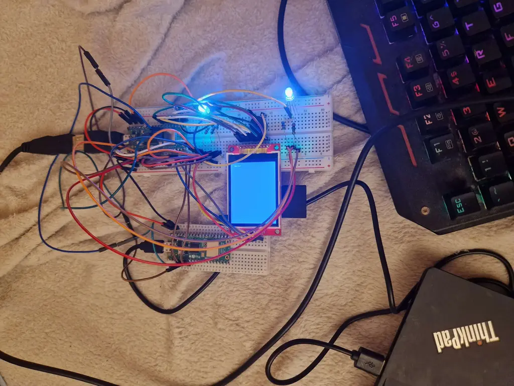
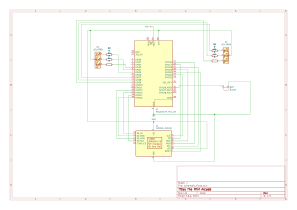

# The Mini Arcade
Pocket-sized arcade action for solo challenges or head-to-head fun.

:::info 

**Author**: Iulian Alexa \
**GitHub Project Link**: https://github.com/UPB-PMRust-Students/proiect-iulianalexa

:::

## Description

This handheld mini-console delivers a diverse collection of engaging numeric mini-games, controlled by dual keypads for both solo brain teasers like Sudoku and competitive two-player challenges. Players can test their calculation speed, memory of number sequences, and reaction time in intense 1v1 battles across multiple rounds, with scores tallied to determine the winner.

## Motivation

I chose this project because it taps into something I enjoy: the simple joy of accessible gaming. The idea of creating a small, portable, and cheap mini-arcade that doesn't need a computer is exciting. It's reminiscent of retro consoles, from a time when fun activities weren't always about intense competition. Focusing on straightforward, engaging numeric mini-games controlled by keypads offers a cool mix of nostalgia and something a bit different, emphasizing quick thinking and friendly rivalry.

I also thought it would be interesting to try and connect a USB keyboard to a microcontroller using Rust (without the TinyUSB C bindings).

## Architecture 

### Hardware Integration

- The Raspberry Pi Pico 2W acts as the central processing unit, running the software.
- The display is driven by the Pico 2W to provide the visual interface for all menus, games, and feedback.
- The SD module integrated in the TFT display module allows for writing and reading leaderboard scores.
- The buzzer, connected to a GPIO pin on the Pico 2W, provides simple audio cues.
- The USB hub allows the Pico 2W to receive input from the two keypads.
- LEDs are used for additional visual feedback.

### Software Flow

## Log

### Week 28 April - 4 May

- ordered hardware components
- soldered headers to the microcontroller
- performed USB tests

### Week 5 - 11 May

- ordered more hardware components
- wrote the HID driver for the cotton\_usb\_host crate
- tested the SD card reader, display, LEDs and buzzer

### Week 12 - 18 May

- ordered the numeric keypads and the USB hub
- created the channel to pass keystrokes from the usb_task to the main task
- started working on minigames
- updated the KiCad schematic (couldn't find common cathode LEDs; updated to common anode)

My plan for the next week is to finish the minigames, and also create a 3D printed enclosure for the device to improve the overall look.

### Week 19 - 25 May

## Hardware

- Raspberry Pi Pico 2W - The microcontroller
- 2.2'' LCD TFT SPI 320x240 ILI9341 display - Display and SD module
- 2x A4Tech NumericPad Fstyler FK13 USB Black - User Input
- LOGILINK Hub USB 2.0 4 ports - Join Keyboards to allow connecting to MCU USB
- Active Buzzer - Audio feedback
- LEDs - Additional visual feedback

Testing the USB input and the display (will update once the keypads arrive):

<iframe width="560" height="315" src="https://www.youtube.com/embed/ZnOTKcUffeg?si=e8z89CIGbP-maL7r" title="YouTube video player" frameborder="0" allow="accelerometer; autoplay; clipboard-write; encrypted-media; gyroscope; picture-in-picture; web-share" referrerpolicy="strict-origin-when-cross-origin" allowfullscreen></iframe>

### Schematics

 

### Bill of Materials

| Device | Usage | Price |
|--------|--------|-------|
| [Raspberry Pi Pico 2W](https://www.raspberrypi.com/documentation/microcontrollers/raspberry-pi-pico.html) | The microcontroller | [40 RON](https://www.optimusdigital.ro/en/raspberry-pi-boards/13327-raspberry-pi-pico-2-w.html) |
| [Raspberry Pi Pico 2W](https://www.raspberrypi.com/documentation/microcontrollers/raspberry-pi-pico.html) | As Debug Probe | [40 RON](https://www.optimusdigital.ro/en/raspberry-pi-boards/13327-raspberry-pi-pico-2-w.html) |
| 2.2'' LCD TFT SPI 320x240 ILI9341 display | Main Game Output and microSD card reading/writing for leaderboard scores | [69 RON](https://electronicgadgets.ro/ecran-display-lcd-tft/200-ecran-22-lcd-tft-spi.html) |
| 2x A4Tech NumericPad Fstyler FK13 USB Black | User Input | [2x 30 RON](https://www.badabum.ro/tastaturi/a4tech/174951-a4tech-numericpad-fstyler-fk13-usb-black/) |
| LOGILINK Hub USB 2.0 4 ports | Connect Keyboards | [30 RON](https://www.badabum.ro/diverse-it/logilink/66020-hub-usb-2-0-4-porturi/) |
| Breadboard (830 contacts) | Connect Components | [10 RON](https://www.optimusdigital.ro/ro/prototipare-breadboard-uri/8-breadboard-830-points.html)
| Female USB-A to Male Micro USB Adapter | USB Hub input | [5 RON](https://www.optimusdigital.ro/ro/raspberry-pi-zero/3867-adaptor-usb-mama-la-micro-usb-tata.html) |
| Jumper Wires | Connecting Components | [5 RON](https://www.optimusdigital.ro/ro/fire-fire-mufate/884-set-fire-tata-tata-40p-10-cm.html) |
| 3xR6 Battery Holder | Portable Power Source | [4 RON](https://www.optimusdigital.ro/ro/suporturi-de-baterii/1090-suport-baterii-3-x-r6.html) |
| 1x Active Buzzer | Audio Feedback | [2 RON](https://www.optimusdigital.ro/ro/audio-buzzere/633-buzzer-activ-de-5-v.html) |
| Resistors | Voltage regulation and signal protection for components | 3 RON |
| LEDs | Visual Feedback | 3 RON |
| **Total** | | 271 RON |

## Software

| Library | Description | Usage |
|---------|-------------|-------|
| [mipidsi](https://github.com/almindor/mipidsi) | Display driver for ILI9341 | Used for the display |
| [embedded-graphics](https://github.com/embedded-graphics/embedded-graphics) | 2D graphics library | Used for drawing to the display |
| [embassy-rp](https://github.com/embassy-rs/embassy) | HAL for RP2350 | |
| [cotton-usb-host](https://github.com/pdh11/cotton/tree/main) | USB Host Stack | Enable the Keyboards |
| [rp235x-pac](https://github.com/rp-rs/rp235x-pac) | PAC for RP2350 | Used by cotton-usb-host |
| [defmt](https://github.com/knurling-rs/defmt) | Deferred formatting | Logging during testing |
| [embedded-sdmmc](https://github.com/rust-embedded-community/embedded-sdmmc-rs) | SD Card | Log scoreboard on the SD Card |
## Links

1. [PM Rust Lab](https://pmrust.pages.upb.ro/docs/acs_cc/category/lab)
2. [Some thoughts on using a USB keyboard with the Raspberry Pi Pico](https://kevinboone.me/pico_usb_kbd_lcd.html)
3. [TinyUSB](https://docs.tinyusb.org/en/latest/reference/getting_started.html)
4. [cotton_usb_host](https://docs.rs/cotton-usb-host/latest/cotton_usb_host/)
5. [RP2350 Datasheet](https://datasheets.raspberrypi.com/rp2350/rp2350-datasheet.pdf)
6. [USB Human Interface Devices](https://wiki.osdev.org/USB_Human_Interface_Devices)
