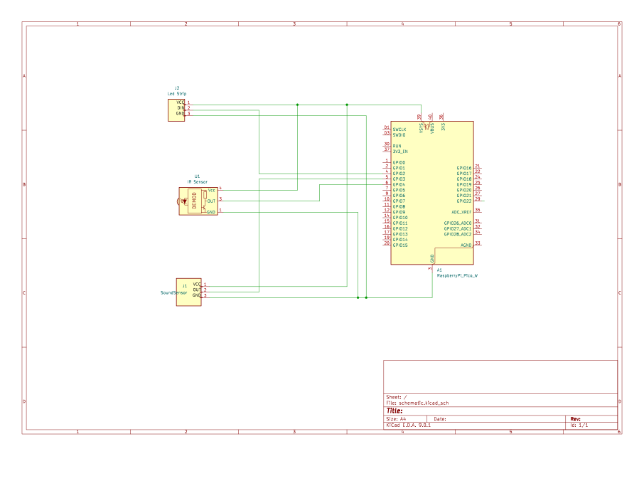

# Sound lights

A lighting system based on an addressable LED strip controlled by sound and IR remote, designed for dynamic ambient effects synchronized with music.

:::info 

**Author**: Izabela-Elena Apostu \
**GitHub Project Link**: https://github.com/UPB-PMRust-Students/proiect-iza03
:::

## Description

An interactive ambient lighting system based on a Raspberry Pi Pico 2W and a WS2812B LED strip. The lights dynamically respond to environmental sound, generating real-time visual effects. The user can switch between colors and modes using an infrared remote, enhancing the ambiance of any space through both automatic and manual control.

## Motivation

The project idea emerged from my passion for ambient lighting and music. I often enjoy working or relaxing with various lighting setups. This inspired me to build a system where an LED strip reacts to environmental sound, creating synchronized visual effects that follow the rhythm of the music. The user can also manually control the color of the lights using an infrared remote.

## Architecture

The system is composed of four core components that interact with each other in real-time:

- **Ambient Sound Sensor**: captures sound from the environment and sends an analog signal.
- **Infrared Receiver**: receives commands from the remote to switch color modes or power on/off.
- **Raspberry Pi Pico W**: central controller; reads input from the sound sensor and IR receiver, processes data, and controls the LED strip.
- **LED Strip (WS2812B)**: displays colors and patterns according to sound intensity and user commands.

The system is powered via a 5V external supply. The IR receiver and sound sensor provide input signals, while the LED strip acts as output.

## Log

### Week 5 – 11 May  
This week I focused on project documentation and researching the necessary components (microphone, LED strip, IR receiver). I also started planning the overall system architecture.

### Week 12 – 18 May  
I assembled the components on the breadboard and connected them to the Raspberry Pi Pico W according to the planned schematic. I performed initial tests to verify the functionality of each module (sound sensor, IR receiver, LED control) and updated the electrical schematic as needed. At the same time, I refined the design approach for integrating all components into the final system.

### Week 19 – 25 May

In this week, I focused on developing the software in the main.rs file to integrate the microphone input, LED strip, and IR remote. I implemented the logic for reading IR codes, interpreting them to trigger specific LED effects, and reacting to audio intensity changes in real-time. I also handled the transition between effects using the IR remote and ensured that signal reading remained reliable. Testing and adjustments were made to improve responsiveness and stability.

## Hardware

1. **Raspberry Pi Pico W**
   - Main microcontroller running the logic of the system. It processes input from the sound sensor and the IR receiver, and controls the LED strip accordingly.

2. **Sound Sensor (MAX4466)**
   - Captures ambient sound and converts it into an analog signal. This signal is used to determine when to flicker the LEDs in sync with music or surrounding noise.

3. **IR Receiver + Remote**
   - Allows the user to interact with the system remotely. Sends control signals to change color or intensity of the LED strip.

4. **WS2812B Addressable LED Strip**
   - RGB LED strip that responds to both ambient sound and user input, creating dynamic lighting effects. Controlled via a single GPIO pin using PWM or digital protocol.

5. **5V 3A Power Supply**
   - Powers the Raspberry Pi Pico W and the LED strip, ensuring stable current for high-intensity lighting.

6. **Breadboard & Jumper Wires**
   - Used for prototyping the circuit without soldering. Allows quick and clean connection between components.

## Schematics

## Bill of Materials

| Device | Usage | Price |
|--------|-------|-------|
| [Raspberry Pi Pico W](https://www.optimusdigital.ro/en/raspberry-pi-boards/13327-raspberry-pi-pico-2-w.html) | The microcontroller | [40 RON x2](https://www.optimusdigital.ro/en/raspberry-pi-boards/13327-raspberry-pi-pico-2-w.html) |
| [MAX4466 Sound Sensor](https://www.emag.ro/microfon-cu-amplificare-cu-max4466-ajustabil-ai1082/pd/DFLMTFMBM/) | Captures environmental sound | [15 RON](https://www.emag.ro/microfon-cu-amplificare-cu-max4466-ajustabil-ai1082/pd/DFLMTFMBM/) |
| [WS2812B LED Strip](https://ardushop.ro/ro/electronica/900-1193-leduri-rgb-la-banda-neopixels-ws2812b-pretul-este-pentru-un-led.html) | RGB lighting effects | [2 RON/LED x20](https://ardushop.ro/ro/electronica/900-1193-leduri-rgb-la-banda-neopixels-ws2812b-pretul-este-pentru-un-led.html) |
| [IR Kit](https://ardushop.ro/ro/comunicatie/2358-kit-ir-telecomanda-receptor-cablu-6427854032461.html) | Remote control for LED modes | [10 RON](https://ardushop.ro/ro/comunicatie/2358-kit-ir-telecomanda-receptor-cablu-6427854032461.html) |
| [5V 3A Power Supply](https://www.emag.ro/sursa-de-alimentare-5v-3a-pa5-3/pd/DJYZ6TMBM/) | Powers Pico W and LEDs | [23 RON](https://www.emag.ro/sursa-de-alimentare-5v-3a-pa5-3/pd/DJYZ6TMBM/) |
| [Breadboard + Wires](https://www.optimusdigital.ro/ro/kituri/2222-kit-breadboard-hq-830-p.html) | Prototyping connections | [22 RON](https://www.optimusdigital.ro/ro/kituri/2222-kit-breadboard-hq-830-p.html) |

## Software

| Library           | Description                                      | Usage                                                                 |
|------------------|--------------------------------------------------|-----------------------------------------------------------------------|
| `embassy-rp`      | Async runtime for Raspberry Pi Pico              | Initializes peripherals and runs async code on the RP2040             |
| `embassy-executor`| Task scheduling for embedded systems             | Enables concurrent async tasks (IR decoding, LED effects)       |
| `smart-leds`      | Driver for WS2812B addressable LEDs              | Controls individual RGB LEDs based on brightness/intensity            |
| `defmt`           | Lightweight logging framework for embedded       | Sends debug messages efficiently during execution                     |
| `defmt-rtt`       | RTT backend for `defmt`                          | Displays IR codes and system messages in real-time via USB            |
| `pio`             | Programmable I/O support                         | Sends precise signals to the LED strip using RP2040 PIO hardware      |
| `embassy-time`    | Asynchronous timing utilities                    | Used for precise delays (`Timer::after`, `Instant`) in LED animations |
| `micromath`       | Math functions for float calculations            | Used for sine wave animations (wave, rainbow)                   |
| `static_cell`     | Safe static memory allocation                    | Stores the global current effect state (`MODE_REF`)                   |
| `embassy-sync`    | Lock-free mutex support                          | Ensures safe shared access to LED state from multiple tasks           |

## Links
1. https://www.youtube.com/watch?v=7YLF-N0596I&ab_channel=NazmusNasir
2. Link demo: https://www.youtube.com/watch?v=eyQGVYR-vT4