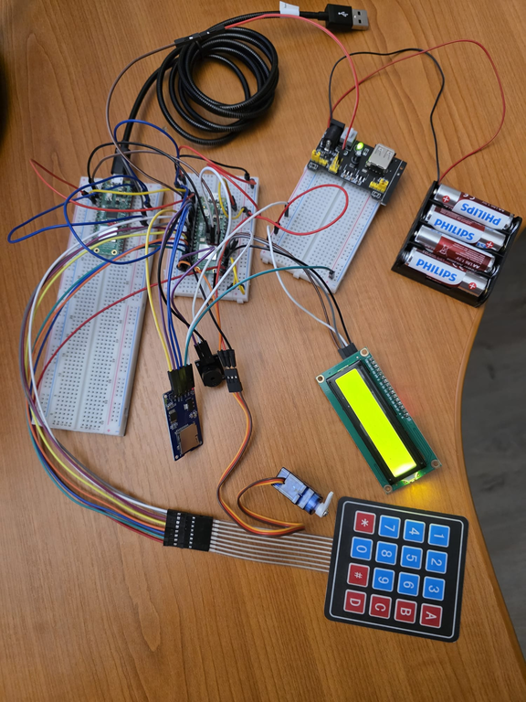
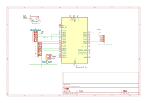

# Battery Safe Box
A battery-powered electronic safe box.

:::info 

**Author**: John-Roberto Nau \
**GitHub Project Link**: https://github.com/UPB-PMRust-Students/proiect-JohnRobertoNau

:::

## Description

This project implements an electronic safe that opens only after entering a valid PIN code. The user inputs the PIN using a 4x4 matrix keypad. Visual feedback is provided on an LCD display, while audio feedback is generated using a passive buzzer. The unlocking mechanism is controlled by a servo motor. The device is battery-powered and includes a MicroSD card module to log access attempts.

## Motivation

I chose this project because I wanted to have a useful device to use in my daily life, knowing that is built by me. I wanted to combine practical embedded Rust programming with hardware interaction. It will be a challenge to work with GPIOs, I2C, PWM, and SPI for developping the this safe box.

## Architecture 

A schematic diagram is provided to illustrate the connections and layout of the components.


## Log

<!-- write your progress here every week -->

### Week 5 - 11 May
Recieved the components, did the research and documentation.

### Week 12 - 18 May
Created the KiCad schematic, assembled the hardware circuit, checked if they work.
Tested pin connections on the Raspberry Pi Pico 2w.
Started working on wiring and power supply for the full system.

### Week 19 - 25 May

## Hardware



- Raspberry Pi Pico 2W: the main microcontroller
- 4x4 Matrix Keypad: used to securely enter the PIN code to unlock the safe
- LCD 1602 with I2C and yellow-green backlight: provides visual feedback
- Passive buzzer: provides audio feedback
- Micro Servo Motor SG90: physically locks or unlocks the safe mechanism
- SPI microSD card reader module: 
- Kit Breadboard HQ830 + jumper wires: used for prototyping and connecting all components
- Female-to-male and male-to-male jumper wires: used to connect components like the keypad, LCD, and sensors to the microcontroller
- Battery holder for 4x R6 (AA) batteries: powers the entire system
- Pin headers (2.54 mm, 40p): used to connect the components with the breadboard

### Schematics

A KiCad schematic is provided:



### Bill of Materials

<!-- Fill out this table with all the hardware components that you might need.

The format is 
```
| [Device](link://to/device) | This is used ... | [price](link://to/store) |

```

-->

| Device | Usage | Price |
|--------|--------|-------|
| [Raspberry Pi Pico 2W](https://www.raspberrypi.com/documentation/microcontrollers/pico-series.html) | The microcontroller | [2 X 35 RON](https://www.optimusdigital.ro/en/raspberry-pi-boards/12394-raspberry-pi-pico-w.html) |
| [Matrix Keypad 4x4](https://cdn.sparkfun.com/assets/f/f/a/5/0/DS-16038.pdf) | Pin input | [6.99 RON](https://www.optimusdigital.ro/ro/senzori-senzori-de-atingere/470-tastatura-matriceala-4x4-cu-conector-pin-de-tip-mama.html?search_query=tastatura+matriceala+4x4&results=2) |
| [LCD 1602 with I2C](https://www.handsontec.com/dataspecs/module/I2C_1602_LCD.pdf) | Display | [14.99 RON](https://www.optimusdigital.ro/ro/optoelectronice-lcd-uri/62-lcd-1602-cu-interfata-i2c-si-backlight-galben-verde.html?search_query=lcd+1602+i2c&results=4) |
| [Passive Buzzer Module](https://www.handsontec.com/dataspecs/module/passive%20buzzer.pdf) | Audio feedback | [2.99 RON](https://www.bitmi.ro/electronica/modul-buzzer-pasiv-ky-006-10678.html) |
| [Micro Servo Motor SG90](https://www.raspberrypi.com/documentation/microcontrollers/pico-series.html) | Lock mechanism | [13.99 RON](https://www.optimusdigital.ro/ro/motoare-servomotoare/26-micro-servomotor-sg90.html?search_query=micro+servo+motor&results=39) |
| [MicroSD SPI Reader Module](http://datalogger.pbworks.com/w/file/fetch/89507207/Datalogger%20-%20SD%20Memory%20Reader%20Datasheet.pdf) | Logging access attempts | [3.99 RON](https://www.bitmi.ro/electronica/modul-citire-card-microsd-compatibil-arduino-10384.html) |
| [Breadboard HQ830 + Wires] | Prototyping and wiring | [22 RON](https://www.optimusdigital.ro/ro/kituri/2222-kit-breadboard-hq-830-p.html?search_query=kit+breadboard&results=35) |
| [Female-to-male jumper wires] | Wiring keypad, LCD, etc. | [7.99 RON](https://www.optimusdigital.ro/ro/toate-produsele/877-set-fire-mama-tata-40p-15-cm.html?search_query=fire+mama+tata&results=35) |
| [Male-to-male jumper wires] | General conections | [4.99 RON](https://www.optimusdigital.ro/ro/fire-fire-mufate/884-set-fire-tata-tata-40p-10-cm.html?search_query=fire+tata+tata&results=73) |
| [Battery Holder (4x R6 AA)](https://www.farnell.com/datasheets/2629287.pdf) | Power supply | [4.86 RON](https://www.optimusdigital.ro/ro/suporturi-de-baterii/12375-suport-baterii-4-x-aa.html?search_query=suport+baterii&results=59) |
| [4 X Red Pin Headers (2.54 mm, 40p)] | Connecting components on breadboard | [4 X 0.99 RON](https://www.optimusdigital.ro/en/pin-headers/464-colored-40p-254-mm-pitch-male-pin-header-red.html) |


## Software

| Library | Description | Usage |
|---------|-------------|-------|
| [embassy-rs](https://github.com/embassy-rs/embassy) | HAL support for Raspberry | Access to GPIO, PWM, I2C, SP |
| [defmt](https://defmt.ferrous-systems.com/) | Lightweight logging framework | For printing debug via probe-rs |
| [probe-rs](https://probe.rs/) | Debugging and flashing | Used for debugging on Raspberry |
| [lcd1602-driver](https://crates.io/crates/lcd1602-driver) | Driver for prints on LCD 1602 via I2C | Printing messages |
| [embedded-hal](https://docs.rs/embedded-hal/) | Hardware abstractisation | SPI, I2C, GPIO, delays |
| [embedded-hal-async](https://docs.rs/embedded-hal-async/) | Async traits for embeded drivers| GPIO async, SPI async |
| [byte-slice-cast](https://docs.rs/byte-slice-cast/) | Conversions| SD / memory |

## Links

<!-- Add a few links that inspired you and that you think you will use for your project -->

1. https://crates.io/
2. https://www.farnell.com/datasheets/2629287.pdf

...
