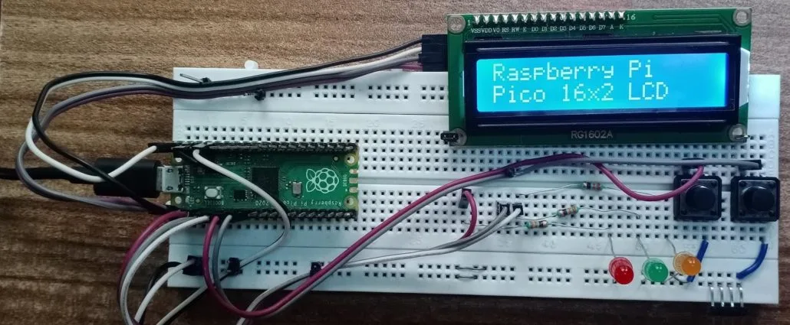

# MyRoboAssistant
Listen. Respond. Connect.

:::info
**Student:** Savchuk Kostiantyn  
**GitHub repository:** [proiect-st-savciucc](https://github.com/UPB-PMRust-Students/proiect-st-savciucc.git)
:::

---

## Description
**MyRoboAssistant** is a mid-sized (≈ 140 cm × 80 cm) mobile robot focused on natural voice interaction and emotional feedback.  
It suggests useful tips, shows animated emotions on a TFT screen and can be extended through a companion mobile app.

---

## Hardware Description

| Block | Module(s) | Role & Highlights |
|-------|-----------|-------------------|
| **Processing (dual-MCU)** | • **Raspberry Pi Pico 2 W** — real-time controller (Rust / embassy-rs) • **ESP32 DevKit v1** — Wi-Fi, BLE, speech-to-text, ChatGPT API, text-to-speech | Safety-critical I/O on Pico; cloud & audio tasks on ESP32 |
| **Power** | • **Li-Po 2 S 7.4 V 4000 mAh** • **XL4015 5 A buck** | Portable supply; 5 V system rail (peak 5 A) |
| **Audio IN** | **MAX9814** electret mic pre-amp (AGC) | Low-noise voice capture |
| **Audio OUT** | **MAX98357A** I²S DAC + mini-speakers | 3 W mono bridge driven by ESP32 |
| **User Feedback** | • **Waveshare 2.8″ TFT SPI (ST7789)** + on-board buzzer | Emojis / menus / beeps |
| **Locomotion** | • 2 × 6 V DC gear-motors + **L298N** driver | Tank-style differential drive |
| **Gestures** | • 2 × SG90 micro-servos (arms) • 1 × MG996R high-torque servo (head) | Expressive arm & head motion |
| **Sensing** | • **IOE-SR05** ultrasonic (UART) | Obstacle / proximity detection |

### Hardware Blocks

#### Raspberry Pi Pico 2 W
**Role:** Central microcontroller, manages I/O and overall device logic  
**Connections:**  
- TFT display (SPI)  
- Ultrasonic sensors (GPIO trigger/echo)  
- I2S microphone (I2S data/clk)  
- Speaker via I2S DAC  
- DC motors + L298N driver (GPIO + PWM)  
- SG90 servo (PWM)  

#### TFT Display (ST7735 480×320)
**Interface:** SPI  
**Connections:**  
- SDA (MOSI) → Pico SPI MOSI pin  
- SCL (SCK) → Pico SPI SCK pin  
- DC, RST, CS → separate GPIOs  
**Role:** Shows emotions, status, and menu  

#### DC Motors + Wheels
**Interface:** Powered via L298N driver  
**Connections:**  
- IN1–IN4 → Pico GPIO for direction  
- EN1–EN2 → Pico PWM for speed  
**Role:** Locomotion  

#### L298N Dual Motor Driver
**Interface:** GPIO + PWM  
**Connections:**  
- VCC, GND → battery/charger  
- IN1–IN4, EN1–EN2 → Pico  
- OUT1–OUT4 → motors  
**Role:** Drives the DC motors  

#### SG90 Micro Servo
**Interface:** PWM  
**Connections:**  
- Control → Pico PWM pin  
- Power → 5 V + GND  
**Role:** Arm gesture  

#### Ultrasonic Sensors (HC-SR04)
**Interface:** GPIO  
**Connections:**  
- Trigger → Pico GPIO  
- Echo → Pico GPIO  
**Role:** Proximity detection  

#### I2S Microphone
**Interface:** I2S  
**Connections:**  
- WS, CK, SD → Pico I2S pins  
**Role:** Voice input  

#### I2S DAC (MAX98357A) + Speaker
**Interface:** I2S  
**Connections:**  
- BCLK, LRCLK, DIN → Pico I2S pins  
- Speaker → output of MAX98357A  
**Role:** High-quality audio output  

---

## Electrical Schematic
The full schematic was drawn in **KiCad EDA v9** and covers every connection between modules, power rails and connectors.

---

## Photos

---

## Motivation
This project blends my passion for robotics with the memory-safety and concurrency guarantees of Rust.  
Pico 2 W handles timing-critical control while ESP32 leverages cloud AI services for advanced conversation.

---

## Architecture

---

## Bill of Materials (BOM)

| # | Component & Link | Qty | Price (RON) |
|---|------------------|-----|-------------|
| 1 | [Raspberry Pi Pico 2 W](https://www.optimusdigital.ro/en/raspberry-pi-boards/13327-raspberry-pi-pico-2-w.html?search_query=Raspberry+Pi+Pico+2W&results=36) | 1 | 40 |
| 2 | [ESP32 DevKit v1](https://www.optimusdigital.ro/en/wifi-boards/3053-placa-de-dezvoltare-esp32-cu-wifi-si-bluetooth.html?search_query=ESP32+DevKit+v1&results=1) | 1 | 70 |
| 3 | [Li-Po 7.4 V 4000 mAh](https://www.emag.ro/baterie-lipo-gens-ace-4000mah-7-4v-1c-kxg0006576/pd/D67HQHMBM) | 1 | 139 |
| 4 | [XL4015 5 A buck converter](https://www.optimusdigital.ro/en/step-down-power-supplies/2410-sursa-dc-dc-coboratoare-xl4015-de-5-a-intrare-de-4-38-v.html?search_query=XL4015&results=4) | 1 | 17 |
| 5 | [MAX9814 mic pre-amp](https://www.emag.ro/amplificator-microfon-max9814-ai1095/pd/DJGRKFMBM) | 1 | 13 |
| 6 | [MAX98357A I²S audio amp](https://www.emag.ro/amplificator-audio-max98357-i2s-compatibil-cu-esp32-si-raspberry-pi-emg238/pd/DVYJWJYBM) | 1 | 21 |
| 7 | Mini 8 Ω speaker pair (Ø 28 mm) | 2 | 20 |
| 8 | [Waveshare 2.8″ TFT SPI](https://www.emag.ro/ecran-lcd-tft-tactil-waveshare-2-8-inch-320x240-compatibil-cu-raspberry-pi-pico-restouch-lcd-2-8waveshare19804/pd/DBJZXQMBM) | 1 | 155 |
| 9 | [L298N dual motor driver](https://www.optimusdigital.ro/en/brushed-motor-drivers/145-l298n-dual-motor-driver.html?search_query=l298n&results=4) | 1 | 10 |
|10 | [Micro DC motor + wheel set](https://www.emag.ro/motor-cu-roata-pentru-aplicatii-arduino-set-2-bucati-3874784221701/pd/DK1PDZYBM) | 1 set | 45 |
|11 | [SG90 micro-servo](https://www.optimusdigital.ro/en/servomotors/2982-micro-pololu-feetech-fs90r-servomotor.html?search_query=servo&results=246) | 2 | 24 |
|12 | [MG996R metal-gear servo](https://www.optimusdigital.ro/en/servomotors/1520-mg996-digital-metal-servomotor-90.html?search_query=servo&results=246) | 1 | 34 |
|13 | [IOE-SR05 ultrasonic UART](https://www.optimusdigital.ro/en/distance-sensors/8152-ioe-sr05-ultrasonic-distance-sensor-with-serial-interface-3-55-v.html?search_query=IOE-SR05&results=1) | 1 | 28 |
|14 | Cables, headers, JST, screws | — | 50 |

*Prices are list prices (May 2025) from OptimusDigital / eMAG.*

---

## Weekly Log

| Week (ISO) | Milestone / Activities |
|------------|------------------------|
| 2025-W18   | **Milestone #1** – project page + initial diagrams |
| 2025-W19   | Chassis design & power tests |
| 2025-W20   | KiCad schematic & PCB outline |
| 2025-W21   | UART / I²S bring-up, TFT driver |

---

## Software Design

| Library / Crate | Purpose / Usage |
|-----------------|-----------------|
| [**embassy**](https://crates.io/crates/embassy) / [**embassy-net**](https://crates.io/crates/embassy-net) | Async runtime on RP2040 & networking (Wi-Fi/BLE) |
| [**embedded-hal**](https://crates.io/crates/embedded-hal) | Standard HAL traits for MCU peripherals |
| [**heapless**](https://crates.io/crates/heapless) | Fixed-capacity Vec / String / queue without heap |
| [**serde**](https://crates.io/crates/serde) / [**serde_json**](https://crates.io/crates/serde_json) | Serialization of config & cloud messages |
| [**embedded-graphics**](https://crates.io/crates/embedded-graphics) | 2-D graphics primitives for the TFT UI |
| [**rust-voice**](https://crates.io/crates/rust-voice) | Keyword spotting & voice command parsing |

### Main Firmware Tasks
- **comm** – Wi-Fi / BLE connection & messaging  
- **emotion_display** – emoji animation on TFT  
- **motion_control** – motor & servo control  
- **speech** – audio capture & keyword spotting  

---

## Links
- [Raspberry Pi Pico 2 W – official docs](https://www.raspberrypi.com/products/raspberry-pi-pico-2-w/)  
