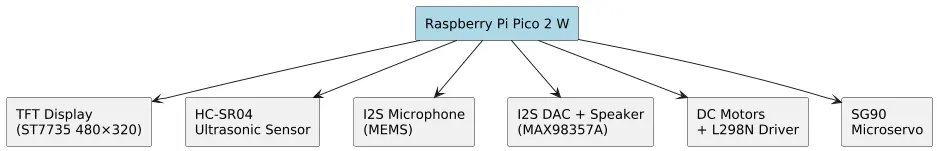
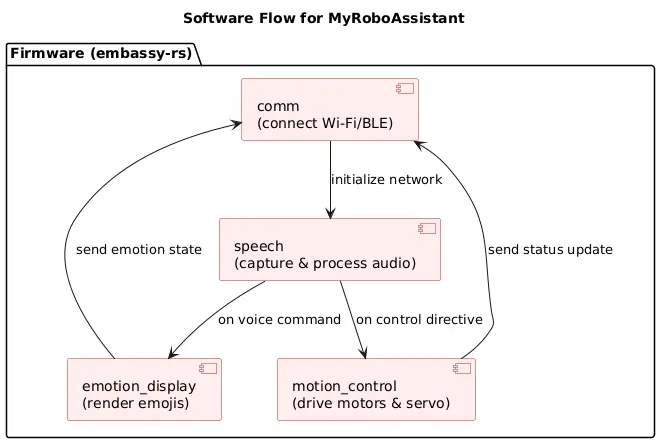

# MyRoboAssistant  
Listen. Respond. Connect.

:::info
**Student:** Savchuk Kostiantyn \ 
**GitHub Repository:** [proiect-st-savciucc](https://github.com/UPB-PMRust-Students/proiect-st-savciucc.git)
:::

---

## Description
**MyRoboAssistant** is a mid-sized (≈ 140 cm × 80 cm) mobile robot focused on natural voice interaction and emotional feedback.  
It suggests useful tips, shows animated emotions on a TFT screen and can be extended through a companion mobile app.

## Motivation
The project blends my passion for robotics with the memory-safety and concurrency guarantees of Rust.  
A Raspberry Pi Pico 2 W handles timing-critical control, while an ESP32 DevKit leverages cloud AI for advanced conversation.

## Architecture

*Components & data paths*  

## Log

Week 5 - 11 May

Week 12 - 18 May

Week 19 - 25 May

---

## Hardware

| Block | Module(s) | Role & Highlights |
|-------|-----------|-------------------|
| **Processing (dual-MCU)** | • **Raspberry Pi Pico 2 W** — real-time controller (Rust / embassy-rs) • **ESP32 DevKit v1** — Wi-Fi, BLE, speech-to-text, ChatGPT API, text-to-speech | Safety-critical I/O on Pico; cloud & audio tasks on ESP32 |
| **Power** | • **Li-Po 2 S 7.4 V 4000 mAh** • **XL4015 5 A buck** | Portable supply; 5 V system rail (peak 5 A) |
| **Audio IN** | **MAX9814** electret mic pre-amp (AGC) | Low-noise voice capture |
| **Audio OUT** | **MAX98357A** I²S DAC + mini-speakers | 3 W mono bridge driven by ESP32 |
| **User Feedback** | • **Waveshare 2.8″ TFT SPI (ST7789)** + on-board buzzer | Emojis / menus / beeps |
| **Locomotion** | • 2 × 6 V DC gear-motors + **L298N** driver | Tank-style differential drive |
| **Gestures** | • 2 × SG90 micro-servos (arms) • 1 × MG996R high-torque servo (head) | Expressive arm & head motion |
| **Sensing** | • **IOE-SR05** ultrasonic (UART) | Obstacle / proximity detection |

### Hardware Blocks

#### Raspberry Pi Pico 2 W
**Role:** Central microcontroller, manages I/O and overall device logic  
**Connections:**  
- TFT display (SPI)  
- Ultrasonic sensors (GPIO trigger/echo)  
- I2S microphone (I2S data/clk)  
- Speaker via I2S DAC  
- DC motors + L298N driver (GPIO + PWM)  
- SG90 servo (PWM)  

#### TFT Display (ST7735 480×320)
**Interface:** SPI  
**Connections:**  
- SDA (MOSI) → Pico SPI MOSI pin  
- SCL (SCK) → Pico SPI SCK pin  
- DC, RST, CS → separate GPIOs  
**Role:** Shows emotions, status, and menu  

#### DC Motors + Wheels
**Interface:** Powered via L298N driver  
**Connections:**  
- IN1–IN4 → Pico GPIO for direction  
- EN1–EN2 → Pico PWM for speed  
**Role:** Locomotion  

#### L298N Dual Motor Driver
**Interface:** GPIO + PWM  
**Connections:**  
- VCC, GND → battery/charger  
- IN1–IN4, EN1–EN2 → Pico  
- OUT1–OUT4 → motors  
**Role:** Drives the DC motors  

#### SG90 Micro Servo
**Interface:** PWM  
**Connections:**  
- Control → Pico PWM pin  
- Power → 5 V + GND  
**Role:** Arm gesture  

#### Ultrasonic Sensors (HC-SR04)
**Interface:** GPIO  
**Connections:**  
- Trigger → Pico GPIO  
- Echo → Pico GPIO  
**Role:** Proximity detection  

#### I2S Microphone
**Interface:** I2S  
**Connections:**  
- WS, CK, SD → Pico I2S pins  
**Role:** Voice input  

#### I2S DAC (MAX98357A) + Speaker
**Interface:** I2S  
**Connections:**  
- BCLK, LRCLK, DIN → Pico I2S pins  
- Speaker → output of MAX98357A  
**Role:** High-quality audio output  

---

### Schematics
The full schematic was drawn in **KiCad v9** and covers every connection between modules, power rails and connectors.

### Photos

### Bill of Materials

| Device *(link to datasheet)*                                                                                                                                               | Usage                                       | Price *(link to store)*                                                                                                                                    |
| -------------------------------------------------------------------------------------------------------------------------------------------------------------------------- | ------------------------------------------- | ---------------------------------------------------------------------------------------------------------------------------------------------------------- |
| [Raspberry Pi Pico 2 W](https://datasheets.raspberrypi.com/picow/pico-2-w-datasheet.pdf)                                                                                   | Central real-time controller (Rust/embassy) | [40 RON](https://www.optimusdigital.ro/en/raspberry-pi-boards/13327-raspberry-pi-pico-2-w.html)                                                            |
| [ESP32 DevKit v1](https://docs.espressif.com/projects/esp-dev-kits/en/latest/esp32/esp-dev-kits-en-master-esp32.pdf)                                                       | Wi-Fi/BLE & cloud-AI tasks                  | [70 RON](https://www.optimusdigital.ro/en/wifi-boards/3053-placa-de-dezvoltare-esp32-cu-wifi-si-bluetooth.html)                                            |
| [Li-Po 7.4 V 4000 mAh](https://li-polymer-battery.com/7-4v-rechargeable-li-polymer-battery-lp426580-2s-4000mah-with-pcm-and-wires/)                                        | Power supply                                | [139 RON](https://www.emag.ro/baterie-lipo-gens-ace-4000mah-7-4v-1c-kxg0006576/pd/D67HQHMBM)                                                               |
| [XL4015 5 A buck converter](https://www.alldatasheet.com/datasheet-pdf/view/763183/ETC2/XL4015.html)                                                                       | 5 V system rail (DC-DC down-conversion)     | [17 RON](https://www.optimusdigital.ro/en/step-down-power-supplies/2410-sursa-dc-dc-coboratoare-xl4015-de-5-a-intrare-de-4-38-v.html)                      |
| [MAX9814 mic pre-amp](https://www.alldatasheet.com/datasheet-pdf/view/217128/MAXIM/MAX9814.html)                                                                           | Electret microphone pre-amplifier           | [13 RON](https://www.emag.ro/amplificator-microfon-max9814-ai1095/pd/DJGRKFMBM)                                                                            |
| [MAX98357A I²S DAC](https://www.alldatasheet.com/datasheet-pdf/view/623796/MAXIM/MAX98357A.html)                                                                           | High-quality audio output                   | [21 RON](https://www.emag.ro/amplificator-audio-max98357-i2s-compatibil-cu-esp32-si-raspberry-pi-emg238/pd/DVYJWJYBM)                                      |
| [Mini 8 Ω speaker pair (Ø 28 mm)](https://www.taoglas.com/datasheets/SPKM.78.8.B.pdf)                                                                                      | Audio playback                              | [20 RON](https://www.taoglas.com/datasheets/SPKM.78.8.B.pdf)                                                                                               |
| [Waveshare 2.8″ TFT SPI](https://www.waveshare.com/2.8inch-capacitive-touch-lcd.htm)                                                                                       | Display UI (emotions & menus)               | [155 RON](https://www.emag.ro/ecran-lcd-tft-tactil-waveshare-2-8-inch-320x240-compatibil-cu-raspberry-pi-pico-restouch-lcd-2-8waveshare19804/pd/DBJZXQMBM) |
| [L298N dual motor driver](https://www.alldatasheet.com/datasheet-pdf/view/22440/STMICROELECTRONICS/L298N.html)                                                             | DC motor driving                            | [10 RON](https://www.optimusdigital.ro/en/brushed-motor-drivers/145-l298n-dual-motor-driver.html)                                                          |
| [DC motor + wheel set (×2)](https://components101.com/motors/toy-dc-motor)                                                                                                 | Tank-style locomotion                       | [45 RON](https://www.emag.ro/motor-cu-roata-pentru-aplicatii-arduino-set-2-bucati-3874784221701/pd/DK1PDZYBM)                                              |
| [SG90 micro-servo](https://www.alldatasheet.com/datasheet-pdf/view/1572383/ETC/SG90.html)                                                                                  | Arm gestures                                | [24 RON](https://www.optimusdigital.ro/en/servomotors/2982-micro-pololu-feetech-fs90r-servomotor.html)                                                     |
| [MG996R metal-gear servo](https://www.alldatasheet.com/datasheet-pdf/view/1131873/ETC2/MG996R.html)                                                                        | Head gestures                               | [34 RON](https://www.optimusdigital.ro/en/servomotors/1520-mg996-digital-metal-servomotor-90.html)                                                         |
| [IOE-SR05 ultrasonic (UART)](https://www.modulemore.com/en/product/1960/เซ็นเซอร์วัดระยะ-อัลตราโซนิคเซ็นเซอร์-ioe-sr05-ultrasonic-sensor-ranging-module-ttl-serial-output) | Obstacle/proximity detection                | [28 RON](https://www.optimusdigital.ro/en/distance-sensors/8152-ioe-sr05-ultrasonic-distance-sensor-with-serial-interface-3-55-v.html)                     |
| Consumables (buttons, potentiometers, wires, etc.) *(misc.)*                                                                                                               | Miscellaneous assembly & wiring             | [50 RON](https://docs.google.com/spreadsheets/d/1MyRoboAssistantBOM#gid=0&range=E15)                                                                       |

*Prices are list prices (May 2025) from OptimusDigital / eMAG.*

---

## Software

| Library / Crate                                                                                           | Description                    | Usage                                      |
| --------------------------------------------------------------------------------------------------------- | ------------------------------ | ------------------------------------------ |
| [**embassy**](https://crates.io/crates/embassy) / [**embassy-net**](https://crates.io/crates/embassy-net) | Async runtime & networking     | Core framework for async tasks & Wi-Fi/BLE |
| [**embedded-hal**](https://crates.io/crates/embedded-hal)                                                 | Hardware Abstraction Layer     | Standardized traits for MCU peripherals    |
| [**heapless**](https://crates.io/crates/heapless)                                                         | Fixed-capacity data structures | Queues, Vec, String without heap usage     |
| [**serde**](https://crates.io/crates/serde) / [**serde\_json**](https://crates.io/crates/serde_json)      | Serialization                  | Config data & message encoding/decoding    |
| [**embedded-graphics**](https://crates.io/crates/embedded-graphics)                                       | 2D graphics library            | Rendering UI primitives on the TFT         |
| [**rust-voice**](https://crates.io/crates/rust-voice)                                                     | Speech recognition             | Keyword spotting & voice command parsing   |

### Main Firmware Tasks
- **comm** – Wi-Fi / BLE connection & messaging  
- **emotion_display** – emoji animation on TFT  
- **motion_control** – motor & servo control  
- **speech** – audio capture & keyword spotting  

---

## Links
1. [Raspberry Pi Pico 2 W – official docs](https://www.raspberrypi.com/products/raspberry-pi-pico-2-w/)
