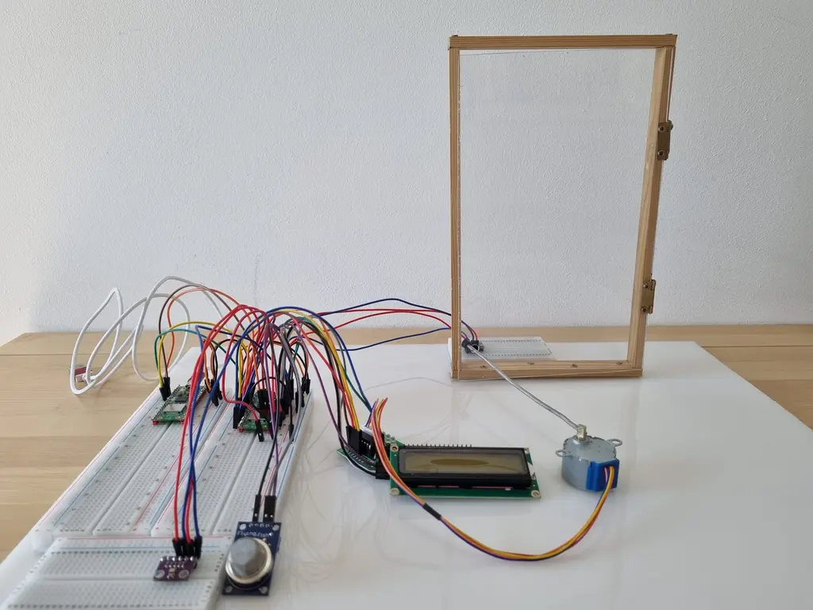
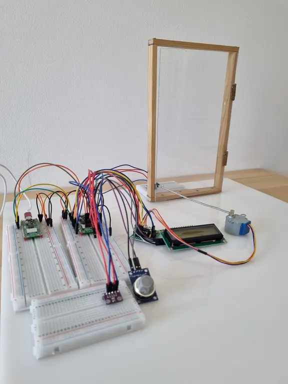
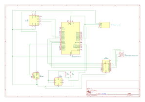

# Weather Window
A smart window that monitors indoor air quality and external weather conditions, automatically deciding whether to open the window or not.

:::info 

**Author**: Tudor Lavinia \
**GitHub Project Link**: https://github.com/UPB-PMRust-Students/proiect-LaviniaTudor003

:::

## Description

Weather Window is an automatic smart window that constantly monitors indoor temperature, humidity, and air quality.
It also gathers external weather data — such as temperature, humidity, and approximate rain probability (based on humidity and pressure) —  transmitting data to the main display unit.
The system automatically determines whether opening the window is necessary to improve indoor conditions.
A display that presents real-time information about the surrounding environment, both indoor and outdoor, and provides personalized recommendations for users, such as clothing suggestions ("It's cold — dress warmly") or alerts ("It might rain — take an umbrella").

## Motivation

"Weather Window" was first imagined during a high school project, inspired by the idea of creating a living environment that adjusts itself for better comfort and health.
Today, with the opportunity to work with real technologies, I am determined to turn that early vision into reality.
This project is not just a technical challenge, but also a personal dream to contribute to smarter, healthier, and more sustainable homes.

## Architecture 

<<<<<<< HEAD
 \
=======

>>>>>>> 4120a8d (Diagrama este in svg acum)
The system is based on a Raspberry Pi Pico 2W, connected to environmental sensors (BME280, BMP280, MQ-2 Gas Sensor) and LCD display via I2C + a stepper motor driver (ULN2003) via GPIO. The Pico collects indoor and outdoor data, displays it, and controls the window motor automatically based on the conditions.

## Log

<!-- write your progress here every week -->

### Week 21 - 27 April

- Selected the main components for the project.
- Discussed the project architecture.
- Started component research (sensors, motor, controller).

### Week 28 April - 4 May

- Ordered the required components.
- Started writing the project documentation.
- Created the full electronic schematic in KiCad.

### Week 5 - 11 May
- Started the hardware development phase.
- Used two Raspberry Pi Pico 2W boards for debugging.

### Week 12 - 18 May
- Tested the stepper motor functionality.
- Tested the BME280 and BMP280 sensors for environmental data.
- Began writing code to interface with the stepper motor and both sensors.
- Updated the KiCad schematic with all necessary components.
- Built the window prototype for the system.

### Week 19 - 25 May
- Finalized the complete software implementation for the project.
- Implemented the automatic closing system for the window.
- Confirmed that the system responds correctly to environmental changes in real-time.
- Built and mounted the custom link between the stepper motor and the window for physical closing.

## Hardware

- **Raspberry Pi Pico 2W** – Main controller responsible for data processing and motor control.
- **BME280 Sensor** – Measures temperature, humidity, and atmospheric pressure.
- **BMP280 Sensor** – Measures temperature, and atmospheric pressure.
- **MQ-2 Gas Sensor** – Measures indoor air quality, including CO₂ level.
- **Stepper Motor (28BYJ-48)** – Controls the opening and closing of the window.
- **ULN2003 Driver Board** – Drives the stepper motor based on control signals.
- **LCD 1602** – Shows real-time indoor and outdoor conditions and recommendations.
- **Breadboard and Jumper Wires** – Used for prototyping and connecting components.





### Schematics




### Bill of Materials

<!-- Fill out this table with all the hardware components that you might need.

The format is 
```
| [Device](link://to/device) | This is used ... | [price](link://to/store) |

```

-->


| Device | Usage | Price |
|:------|:------|:------|
| [Raspberry Pi Pico 2W](https://www.optimusdigital.ro/en/raspberry-pi-boards/13327-raspberry-pi-pico-2-w.html?search_query=Raspberry+Pi+Pico+2W&results=36) | Main controller of the system | 40 RON |
| [BME280 Sensor](https://www.optimusdigital.ro/en/pressure-sensors/5649-bme280-barometric-pressure-sensor-module.html?search_query=%09BME280+Barometric+Pressure+Sensor+Module&results=5) | Measures temperature, humidity, and pressure | 74 RON |
| [MQ-2 Gas Sensor Module](https://www.optimusdigital.ro/ro/senzori-de-gaze/107-modul-senzor-gas-mq-2.html?search_query=MQ-2+Gas&results=283) | Detects smoke, LPG, methane, and other gases | 11 RON |
| [BMP280 Sensor](https://www.optimusdigital.ro/en/pressure-sensors/1666-modul-senzor-de-presiune-barometric-bmp280.html?search_query=BMP280+Barometric+Pressure+Sensor+Module&results=3) | Secondary sensor for debugging | 9 RON |
| [Stepper Motor 28BYJ-48](https://sigmanortec.ro/Motor-pas-cu-pas-5V-28BYJ48-p126284049) | Drives the simulated window | 10 RON |
| [ULN2003 Driver Board](https://sigmanortec.ro/Driver-motor-pas-cu-pas-ULN2003-p126284051) | Stepper motor controller | 5 RON |
| [1602 LCD with I2C Interface](https://www.optimusdigital.ro/en/lcds/62-1602-lcd-with-i2c-interface-and-yellow-green-backlight.html?srsltid=AfmBOoollIdsBUWAVIdmxZomtUaHFilrztmMElat_9IseBscTyeunsa1) | Displays system info | 15 RON  |
| [Breadboard 830 pts](https://www.optimusdigital.ro/en/kits/2222-breadboard-kit-hq-830-p.html?search_query=Breadboard+Kit+HQ+830+p&results=12) | Prototyping platform | 22 RON |
| [Jumper Wires Kit](https://www.optimusdigital.ro/en/wires-with-connectors/12-breadboard-jumper-wire-set.html?search_query=%09Breadboard+Jumper+Wires+Set&results=22) | Wiring connections | 8 RON |
| [Breadboard HQ (400 Points)](https://www.optimusdigital.ro/ro/prototipare-breadboard-uri/44-breadboard-400-points.html?search_query=Breadboard+HQ+%28400+Points%29&results=1) | Prototyping platform | 10 RON |


## Software

| Library | Description | Usage |
|---------|-------------|-------|
| [cortex-m-rt](https://crates.io/crates/cortex-m-rt) | Runtime support for Cortex-M devices | Defines entry point (`entry`) |
| [embassy-time](https://crates.io/crates/embassy-time) | Time and delay handling | Used for timers and delays |
| [embassy-rp](https://crates.io/crates/embassy-rp) | Raspberry Pi Pico peripherals (PWM, I2C, ADC, GPIO) | Used for controlling peripherals |
| [embedded-hal-async](https://crates.io/crates/embedded-hal-async) | Asynchronous traits for embedded devices | Enables async I2C communication |
| [hd44780-driver](https://crates.io/crates/hd44780-driver) | Driver for HD44780 LCDs over I2C | Used to display messages and alerts |


## Links

<!-- Add a few links that inspired you and that you think you will use for your project -->

1. [Monitor air quality with a Raspberry Pi](https://www.raspberrypi.com/news/monitor-air-quality-with-a-raspberry-pi/) – A guide from the Raspberry Pi Foundation on how to monitor air quality using a sensor and Python.
2. [Air quality monitoring with Raspberry Pi](https://github.com/StijnGoossens/rpi-airquality) – A GitHub project using a Raspberry Pi for air quality monitoring with BME280 and CCS811 sensors.
3. [Build a Raspberry Pi SUPER Weather Station](https://www.instructables.com/Build-a-Raspberry-Pi-SUPER-Weather-Station/) – Step-by-step instructions for building an advanced weather station with a Raspberry Pi.
